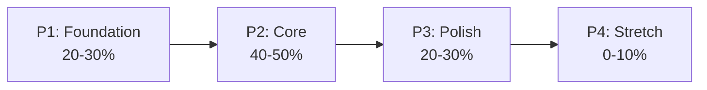
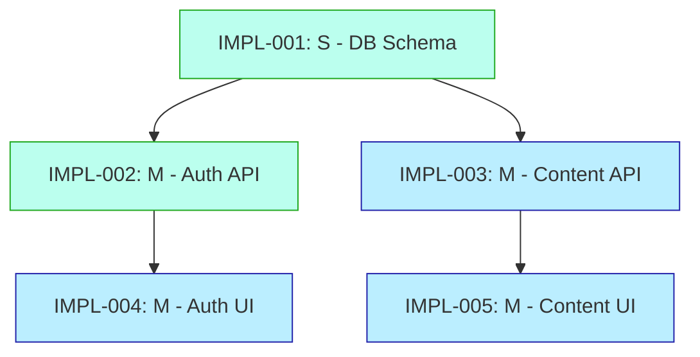

# Workflow: Generate Implementation Plan

Read the work inventory + SD sequencing hints (Evolution Sequence, Phase Hints, per-task metadata) from System Design, **honor or override** them with documented rationale, and produce a phase-grouped, sized, dependency-ordered implementation plan.

> ⚠️ **Phasing ownership (Option C — Middle Ground):**
> - **SD provides HINTS** — `07-future-evolution.md` → Evolution Sequence (hard architectural constraints with ADR rationale), `08-product-breakdown.md` → Phase Hints (soft P1/P2/P3/P4 suggestions) + per-task metadata (risk, must_precede, unlocks).
> - **You (Impl Planner) make the FINAL DECISION** — honor or override SD hints with documented rationale in the Phasing Rationale section.
> - **Evolution Sequence is a HARD constraint** — do not violate without `/backtrack sd` escalation.
> - **Phase Hints are SOFT suggestions** — divergence is allowed with documented architectural/MoSCoW/risk reason.

**Sprint:** {{input}}

---

## Phase 0: Onboarding (Read These Files NOW)

Read the following files immediately before doing anything else:

1. `CLAUDE.md` — project rules, tech stack, architecture constraints
2. `.agents/skills/andm-impl-planner/SKILL.md` — **your persona definition** (activate the full planning process defined there)
3. `docs/state/overview.md` — current module status
4. Check `docs/state/impl-plan.md` — previous implementation plan (if exists, continue from there)
5. Check `.claude/rules/workflow.md` — task sizing, commit conventions, handoff protocol

Once read, you are ready to proceed.

---

## Phase 1: Load Context (MANDATORY — All reads in parallel)

Execute these reads simultaneously:

1. **SD hints (primary input)** — Read `docs/design-docs/07-future-evolution.md` (Evolution Sequence) + `docs/design-docs/08-product-breakdown.md` (Work inventory + Phase Hints + Per-Task Metadata) directly. **TD-08 handoff doc has been dropped (SD-as-Master)** — Impl Planner consumes SD-07/08 directly without TD intermediary.
2. **TD Detailed Specs** — Read `docs/technical-design/02-backend-design.md` (module/interface details), `03-frontend-design.md` (component tree), `04-database-design.md` (schema + migration order). Authoritative API schemas live in `docs/api-specs/*.yaml` (SD owns). Coverage targets live in `docs/qa/01-test-execution-plan.md` (QA authoritative).
3. **Product Breakdown (work inventory + SD hints)** — Read `docs/design-docs/08-product-breakdown.md` for:
   - **Work inventory** — epics, stories, task sizes, MoSCoW classification
   - **"Phase Hints (Suggested)" section** (if present) — SD's suggested P1/P2/P3/P4 grouping with architectural rationale
   - **"Per-Task Metadata" table** (if present) — risk, must_precede, unlocks, arch_rationale
   - ⚠️ If it contains **schedule-based content** (Sprint numbers, calendar dates, team capacity) → ignore that content and flag to user that SD has schedule leakage (recommend `/sd-review`)
4. **Future Evolution + Evolution Sequence** — Read `docs/design-docs/07-future-evolution.md` for:
   - Scaling triggers and migration paths
   - **"Evolution Sequence" section** (if present) — hard architectural ordering constraints (E1/E2/.../EN) with ADR citations. **You must honor these.**
   - If the project has a migration component (e.g., strangler, dual-write, cutover), phases often mirror the Evolution Sequence directly.
5. **Architecture** — Read `docs/design-docs/02-high-level-architecture.md` for service boundaries and component mapping (informs phase boundaries — tasks in the same bounded context usually share a phase).
6. **Requirements + MoSCoW** — Read `docs/ba/02-functional-requirements.md` + `docs/ba/03-non-functional-requirements.md` for authoritative FR/NFR + MoSCoW priorities; `docs/design-docs/02-high-level-architecture.md § Requirements Traceability` (top section; v1.2: was SD-01) shows which SD section satisfies each BA FR. MoSCoW drives phase assignment: Must → P1/P2, Should → P3, Could → P4, Won't → excluded.
7. **ADRs** — Read all files in `docs/adr/` for architecture constraints that affect implementation order (these back up Evolution Sequence).
8. **API Contracts** — Read all files in `docs/api-specs/` for high-level contracts.
9. **Service Rules** — Read `.claude/rules/api.md`, `.claude/rules/web.md`, `.claude/rules/worker.md` to understand service-specific patterns.
10. **Previous Plan** — If `docs/state/impl-plan.md` exists, read it to understand existing phases + what's already completed per phase.

### 1.1 Extract SD Hints Into Scratch Table (MANDATORY)

Before Phase 2, extract Evolution Sequence and Phase Hints into a working scratch table. You will reference this in Phase 2.5 and in the final Phasing Rationale.

**Scratch: Evolution Sequence (from 07-future-evolution.md):**

```
| # | Evolution Step | Must Precede | ADR / Rationale |
|---|----------------|--------------|-----------------|
| E1 | [step name] | [next steps] | [ADR-xxx or reason] |
| E2 | ... | ... | ... |
```

**Scratch: Phase Hints + Per-Task Metadata + My Rule Result + Classification (from 08-product-breakdown.md):**

```
| Task     | SD Hint Phase | Risk | Must Precede       | Unlocks           | Arch Rationale        | My Rule Result | Classification                        |
|----------|---------------|------|--------------------|-------------------|------------------------|----------------|---------------------------------------|
| IMPL-001 | P1            | low  | IMPL-002, IMPL-003 | DB-dependent work | foundational schema    | P1             | ✅ Align                              |
| IMPL-002 | P1            | high | IMPL-010           | Evolution E1      | ADR-005                | P1             | ✅ Align                              |
| IMPL-005 | P2            | med  | —                  | —                 | —                      | P1             | ⚠️ Diverge (TD-04 found DB migration) |
| IMPL-025 | —             | —    | —                  | —                 | —                      | P3             | ◻️ No hint                            |
```

> **CRITICAL:** Fill the last two columns (`My Rule Result`, `Classification`) **as you walk each task in Phase 2.5.2**, not before. This scratch IS your audit trail source — the "SD Hint Alignment" section of Phasing Rationale in Phase 4 is **generated directly** from these rows, grouped by classification icon (✅/⚠️/🔴/◻️). Do not type the audit trail by hand; group the scratch.

If 07 has no Evolution Sequence section → record "No Evolution Sequence provided — proceed with independent phasing rules".
If 08 has no Phase Hints section → record "No Phase Hints provided — proceed with independent phasing rules".
**Missing sections are NOT errors. Schedule leakage (sprints/dates/capacity) IS an error — flag it.**

**No-Hints Fast Path:** If BOTH 07 and 08 lack hint sections:
1. Mark scratch table as empty: *"No SD hints — running independent rules only"*
2. Proceed directly to Phase 2 (Decompose & Size)
3. In Phase 2.5, skip Step A (no hints to consume) and Step C (no hints to compare). Run Step B (independent rules) only.
4. In Phase 4 Phasing Rationale, state: *"No SD hints provided; all tasks assigned by independent Dependency→MoSCoW→Risk→Value→Service-coupling rules. Classification: all ◻️ No hint."*
5. This is a legitimate fast path — do NOT escalate or raise warnings.

---

## Phase 2: Decompose & Size Tasks

### 2.1 Extract Tasks from Product Breakdown

For each epic/story in `08-product-breakdown.md`:

1. **Identify concrete implementation tasks** — break stories into developer-assignable work items
2. **Assign scope tag** — each task declares one of four tags (see §Vertical Slicing Strategy in SKILL.md for the decision tree):
   - `[api]` / `[web]` / `[worker]` — **single-layer** (scope contained to one service; default for DB migrations, internal refactors, service-specific endpoints)
   - `[slice]` — **thin vertical cross-layer** (DB → API → UI ภายใน 1 agent session; preferred default สำหรับ user-visible feature ใหม่ที่ขนาด ≤ M)
   - **L/XL cross-layer tasks** → decompose เป็น per-slice sub-tasks by default (IMPL-010a/010b/010c); per-layer decomposition (`[api]`+`[web]`) อนุญาตเฉพาะเมื่อ API spec locked + DB migrated + layers integration-independent
3. **Size each task** using the matrix from SKILL.md:
   - **XS** — config change, env variable, single file (< 30 min)
   - **S** — single function/endpoint, simple CRUD (30 min - 1 hr)
   - **M** — feature within 1 module (1 - 3 hr)
   - **L** — feature across 2 modules (3 - 8 hr)
   - **XL** — cross-service feature (1 - 2 days)

### 2.2 Identify Dependencies

For each task, determine:
- **Hard dependencies** — task B cannot start until task A is complete (e.g., API endpoint must exist before Web can consume it)
- **Soft dependencies** — task B benefits from task A but can use a mock (e.g., Web can use mock API while Backend builds real endpoint)

### 2.3 Write Acceptance Criteria (Dual-Track Required)

For each task, write testable acceptance criteria split into two groups:

**Structural ACs (S-AC)** — verifiable inside the test runner / build process (unit, integration, type-check, build artifact emission)
- ❌ "ทำให้ทำงานได้" — too vague
- ✅ "Pure function returns expected shape for input matrix N=5" — testable in-process

**Empirical ACs (E-AC)** — verifiable only by exercising the deployed/running system; **each must name an `[evidence kind]`** from the stack-agnostic taxonomy in `andm-impl-planner/SKILL.md § Acceptance Criteria — Dual-Track Required`:
- ✅ "From outside-cluster network, probe `<route>` → expected status + envelope shape `[probe]`"
- ✅ "Trigger publish action → inspect target queue's offset advances + DLQ remains empty `[queue-inspect]`"
- ✅ "Bootstrap deployable from zero state → smoke chain green within budget `[boot-cold]`"

**Mandatory E-AC trigger:** any task touching public/internal network surface, gateway/proxy/middleware, deploy contract, persistence schema, user-visible surface, async work, or security control MUST carry ≥1 E-AC. Pure-helper / private-DTO / test-utility tasks may be S-AC-only.

**Forbidden closure notes** (planner must NOT accept these in AC text):
- ❌ "structurally complete — E2E deferred to operator-runtime"
- ❌ "live verification deferred to operator phase"
- ❌ "deferred per <other-task> precedent"

If empirical evidence genuinely depends on an external trigger (vendor account, hardware availability) → **split** the task: S-AC subtask closes now; E-AC subtask is registered in **Deferred-AC Registry** (see Phase 2.5.5 below) with named owner + expiry date + risk-if-missed.

> **Tool selection is NOT decided here.** Concrete commands (probe tool, GUI capture tool, queue-inspection tool) live in `.claude/rules/testing.md`, materialized by `/project-init` from `.claude/stack.json`. Planner writes **what evidence proves the AC**, not **which tool produces it** — keeps plan stack-agnostic.

---

## Phase 2.5: ⭐ Implementation Phase Decomposition (Core Value-Add)

> **This is why this workflow exists.** SD provides hints — you produce the final phase plan. If you skip this step or silently copy SD hints without comparison, you have failed.

### 2.5.1 Choose the Phase Shape

Default template (see `.agents/skills/andm-impl-planner/SKILL.md` for full taxonomy):

| Phase | Purpose | Exit (Phase Gate) | % of Work |
|-------|---------|-------------------|-----------|
| **P1: Foundation** | Infra, auth, DB schema, CI/CD, shared plumbing | Dev env runs e2e, smoke test passes | 20-30% |
| **P2: Core** | MVP slice — primary user value | Primary flow works e2e, critical tests pass | 40-50% |
| **P3: Polish** | Remaining Must-Haves, Should-Haves, NFRs, observability | All Must/Should done, NFR targets met | 20-30% |
| **P4: Stretch** *(optional)* | Could-Haves, experiments | Could-Haves shipped or explicitly deferred | 0-10% |

**Deviate from the default when the project demands it.** Examples:
- API-only backend → *P1: Contracts → P2: Core Endpoints → P3: Hardening*
- Data migration → *P1: Shadow Write → P2: Dual Read → P3: Cutover → P4: Decommission*
- Brownfield refactor → *P1: Test Net → P2: Extract → P3: Replace → P4: Delete*

**Preference rule:** If SD provided Phase Hints with a consistent shape → use that same shape unless you have a strong reason to change it. This keeps alignment with the architect's mental model.

Document your choice in a **Phasing Rationale** paragraph — one paragraph, under 6 sentences, explaining why these phases for THIS project. Reference MoSCoW, risk, user-value drivers, **and whether you inherited or deviated from SD's suggested shape**.

### 2.5.2 Consume SD Hints (Option C Protocol)

**Step A — Reference the scratch table from Phase 1.1** (Evolution Sequence + Phase Hints + Per-Task Metadata).

**Step B — For each task, consult SD's hint (if any)**, then run your own rules independently (don't auto-copy):

1. **Dependency rule** — task goes no earlier than the latest phase of its hard dependencies
2. **MoSCoW rule** — Must → P1 or P2, Should → P3, Could → P4, Won't → excluded from plan entirely
3. **Risk rule** — high-risk tasks (new tech, perf-critical, external integration) go in the earliest phase their dependencies allow — fail fast
4. **Value rule** — within a phase, the task(s) that unlock user-visible value come first
5. **Service-coupling rule** — tasks touching the same module/file land in the same phase when possible (minimize merge conflicts)

**Step C — Compare your independent result against SD hint:**

| Case | Action |
|------|--------|
| ✅ **Align** — your rules produce the same phase as SD hint | Record as aligned. Use that phase. Note in alignment table. |
| ⚠️ **Diverge** — your rules produce a different phase | Record divergence. Use your rules' answer. Document architectural/MoSCoW/risk reason in Phasing Rationale. |
| 🔴 **Violation** — your rules produce a phase that contradicts Evolution Sequence | STOP. Evolution Sequence is a hard constraint. Options: (1) move your task to match E order, (2) escalate via `/backtrack sd` if SD's E is wrong |
| ◻️ **No hint** — SD provided no hint for this task | Use your rules' answer directly. Note "no SD hint" in table. |

**Every task MUST have a `**Phase**:` field + a note on whether it aligned/diverged/had no hint.** No phase-less tasks, no silent copies.

**Step D — Completeness Gate (Blocking Check):**

Before writing `impl-plan.md`, verify:

1. Count rows in scratch table = total task count
2. Every row MUST have a non-empty `My Rule Result` column
3. Every row MUST have a non-empty `Classification` column (one of ✅ Align / ⚠️ Diverge / 🔴 Violation / ◻️ No hint)
4. Every row where `SD Hint Phase ≠ My Rule Result` MUST have a documented reason in the Classification column (e.g., "⚠️ Diverge (TD-04 found DB migration)")
5. Every row classified 🔴 Violation MUST trigger STOP + `/backtrack sd` escalation

**If any row fails checks 1-5 → HALT. Do not write `impl-plan.md`.** This is a blocking check. Go back to Step B and complete the scratch table.

### 2.5.2a Silent Copy Detector (Advisory)

After Step D passes, compute:

```
H = total tasks with non-empty "SD Hint Phase" column
A = tasks classified ✅ Align
D = tasks classified ⚠️ Diverge
V = tasks classified 🔴 Violation
N = tasks classified ◻️ No hint
```

**Trigger condition:** `H > 5 AND D == 0 AND V == 0 AND A == H`

(100% alignment, zero divergence, non-trivial project size)

**If triggered**, the workflow MUST prompt the operator (advisory, not blocking):

```
⚠️ Silent Copy Detector

You reported 100% alignment with SD hints across H tasks with no divergence.

Did you actually run the Dependency/MoSCoW/Risk/Value/Service-coupling rules
on each task independently, or did you copy SD hint phases without comparison?

Confirm:
  (a) Yes, I ran rules independently and genuinely agreed with every SD hint — proceed.
  (b) No, I copied without comparison — go back to Phase 2.5.2 Step B and re-run rules.
```

**Rationale:** 100% alignment on a non-trivial work inventory (H > 5) is statistically unlikely. Forcing an explicit confirmation is the cheapest way to prevent silent copies.

**Threshold note:** Small projects (H ≤ 5) skip the detector — small projects legitimately can be 100% aligned without suspicion.

**This is advisory, not blocking** — operator's confirmation (a) proceeds immediately. Only (b) sends back to Step B.

### 2.5.3 Validate Phase Assignments (Red Flag Check)

Walk every dependency edge and verify **no forward references** — a task in P1 must NOT depend on a task in P2 or later. If you find one:

- **Stop and re-examine phases** — usually the phases are wrong, not the dependency
- **Option A:** move the P1 task later (to match its dependency's phase)
- **Option B:** extract a *foundation stub* into P1 (the interface/contract without implementation) and put the real work in the later phase
- **Option C:** rethink phase boundaries — maybe two phases should merge or split

Never allow a forward reference to exist in the final plan.

**Also validate against Evolution Sequence:**

- Walk each Evolution step (E1 → E2 → ... → EN) and verify your phase assignments honor the ordering
- If E2 depends on E1 and your plan puts an E2-related task in an earlier phase than an E1-related task → violation → STOP and re-plan

### 2.5.4 Write Phase Gates (BLOCKING — phase advance requires every row `[x]`)

For each phase, write an explicit exit criterion. **Phase Gates are blocking** — `/impl-task` HALTs when an engineer attempts to start a task whose phase > current open phase (i.e. a later-phase task while earlier phase still has `[ ]` rows). Override is logged in `docs/state/impl-plan.md § Phase Gate Override Log` with rationale.

```markdown
### P{N} — {Phase Name} Gate
- [ ] Structural Acceptance: [testable statement — verifiable in test runner / build process]
- [ ] Empirical Demo: [one E2E scenario rehearsed on the running deploy artifact — link to evidence artifact path required]
- [ ] **Tier 1.5 Exploratory Walk**: 30-min non-scripted operator walk completed — every collection/view, every locale, every role/auth state, every theme (if applicable). Findings filed as IMPL-FIX-* tickets and resolved. Artifact: `docs/state/_session-handoff/<date>-phase<N>-exploratory-walk.md` (≤14 days old)
- [ ] Live-stack health: deploy artifact bootstraps clean from cold state per project's deploy contract; smoke probe chain green; referenced asset chain reachable end-to-end
- [ ] Code review: no CRITICAL/HIGH open (including Dimension #11 Empirical AC Closure + Dimension #12 Functional CRUD walk + Dimension #13 Configuration Completeness findings)
- [ ] NFR check: [specific numbers if applicable]
- [ ] Deferred-AC drain: `docs/state/deferred-ac-registry.md` for this phase = empty (no expired entries blocking phase exit)
- [ ] **Rollback plan**: 1-paragraph documenting revert path if downstream phase blocks this phase's outputs (what reverts / data preservation / revert order / named operator)
- [ ] Docs: handoff files current, ADRs written for in-phase decisions
```

> **Why Tier 1.5 row is mandatory:** real-project audit (Shark CMS, 2026-04) ran 5 scripted Phase Gates without exploratory walks — missed 9 functional defects (importMap drift, hardcoded i18n, broken locale switchers, phantom collections). 30-min non-scripted walk catches defects that scripted Tier 1 + scripted Tier 2 structurally cannot. ดู CLAUDE.md § Glossary § Exploratory Walk (Tier 1.5).

**Why blocking, not advisory:** real-project audit (Shark CMS, 2026-04) accumulated 53 closed tasks across two phases before first cold-bootstrap audit ran — produced 11 IMPL-FIX-* recovery tasks. Blocking gates fail-fast: engineer + user must rehearse the deploy artifact before more tasks pile on.

**Stack-agnostic note:** "deploy artifact" + "deploy contract" intentionally vague. Concrete commands (compose up / k8s apply / serverless deploy / native binary launch / PM2 / cargo run / CDN deploy / etc.) live in `.claude/stack.json` + `.claude/rules/workflow.md`, materialized by `/project-init`. Planner does not pick the tool here.

No hand-waving. If you can't write a testable gate, the phase isn't well-defined — go back and re-scope.

### 2.5.5 Initialize Deferred-AC Registry

Create `docs/state/deferred-ac-registry.md` with this template (or update if exists). The registry tracks E-ACs that genuinely cannot be exercised at task-closure time (vendor account pending, hardware unavailable, upstream dep blocked). It is the **only** sanctioned destination for "I cannot run this empirical step today" — `[x]` with `<!-- deferred to operator-runtime -->` is forbidden (per `andm-impl-engineer/SKILL.md § Forbidden Closure Patterns`).

```markdown
# Deferred-AC Registry

> Single source of truth for E-ACs that cannot be exercised at task-closure time.
> ห้าม mark task `[x]` ใน `impl-plan.md` ด้วย closure note "deferred" — เปิด entry ที่นี่แทน
> Read by `/impl-task` (HALTs on expired entries), `/impl-review` (cross-checks closure-rule violations), `/deliver` (blocks shipping if non-empty).

## Active

| Phase | Task | E-AC text | Evidence-kind | Deferred reason | Owner | Opened | Expires | Risk if missed |
|---|---|---|---|---|---|---|---|---|
| | | | | | | | | |

## Resolved

| Phase | Task | E-AC text | Resolved on | Evidence artifact path |
|---|---|---|---|---|
| | | | | |

## Rules

1. **Every defer requires an entry here** — engineer cannot mark task `[x]` without entry; reviewer raises Dimension #11 CRITICAL otherwise
2. **Expiry ≤ 14 days from `Opened`** (absolute date, not relative). Phase boundaries do not extend expiry
3. **On expiry**: `/impl-task` next invocation HALTs and surfaces the expired entry. Options: (a) resolve now (run the empirical step + move row to Resolved), (b) renew once with rationale (max 2 renewals total per row), (c) escalate via `/backtrack`
4. **Phase Gate drain**: phase cannot exit while any registry row's `Phase` matches the closing phase
5. **`/deliver` block**: `/deliver` cannot ship the project while Active table has any row
```

This registry is alive across the project — `/impl-plan` initializes it; engineers + reviewers + `/impl-task` + `/deliver` read/write it.

### 2.5.6 Initialize Operator Action Registry

Create `docs/state/operator-action-registry.md` (or update if exists). Tracks operator actions ที่ engineer ต้องการให้คนทำให้นอก agent sandbox — set env var, get API key from vendor portal, accept ToS, run privileged migration manually, flip feature flag in admin UI, provision DB user. **Distinct from Deferred-AC Registry**: deferred-AC is "wait for external dependency (vendor/hardware) ≤14 days"; operator-action is "operator do this NOW (session-scoped) so engineer can resume current task".

```markdown
# Operator Action Registry

> Single source of truth for User Input Required (UIR) actions that engineers cannot perform from inside agent sandbox.
> Read by `/impl-task` (HALTs on Pending entries before nominating new task), `/next` (Check 5.7 surfaces pending operator actions), `/impl-plan-review` (Dim #4 verifies AC env-var/secret references have UIR linkage).

## Pending (operator must action before linked tasks resume)

| ID | Task | Action verb + object | Why agent cannot do it | How operator does it (link/command) | Opened | Resume task on completion |
|----|------|----------------------|------------------------|-------------------------------------|--------|---------------------------|
| OPS-001 | IMPL-XXX | set ENV_DB_PASSWORD in .env.local | secret rotation outside repo | from vault https://... or ask Ops | YYYY-MM-DD | IMPL-XXX |

## Done (operator confirmed; engineer verified)

| ID | Task | Action | Confirmed on | Verified-by evidence (artifact) |
|----|------|--------|--------------|--------------------------------|
| OPS-000 | IMPL-001 | set DATABASE_URL | 2026-04-22 | `docs/state/_session-handoff/IMPL-001-evidence-20260422.md § config-audit` |

## Rules

1. **Every UIR halt creates a Pending row** — engineer must register the action; ห้าม halt + ล้มเลิก task เงียบๆ
2. **Operator confirms in chat or by editing this file** — moving row from Pending → Done
3. **Engineer verifies action took effect** — typically via `[config-audit]` evidence kind (env var resolved at runtime, not hardcoded test value); without verification, action is not Done
4. **Linked task cannot close `[x]`** until corresponding row Done — `/impl-task` Phase 3.3 Gate B blocks
5. **Pending rows surface in `/next` Check 5.7** — operator sees backlog of expected actions before nominating new task
6. **Plan reviewer checks** (Dim #4): if AC text references env var / secret / config flag and task has no UIR row + no `[config-audit]` evidence kind → HIGH finding (planner pre-authoring config-blind closure)
```

This registry is alive across the project — `/impl-plan` initializes it; engineers + reviewers + `/impl-task` + `/next` read/write it.

---

## Phase 3: Generate Phase + Dependency Graph

Create TWO Mermaid diagrams:

### 3.1 Phase Dependency Graph (High-Level)



### 3.2 Task Dependency Graph (Colored by Phase)



Verify visually: no arrow points from a later phase back to an earlier phase.

---

## Phase 4: Output

### 4.1 Create the Plan File

Use Write to create or update `docs/state/impl-plan.md` using the phase-first format from SKILL.md.

> **Reader-First Layout (post-Shark CMS 2026-04 revision):** plan ต้องอ่านง่ายสำหรับคน (Tech Lead / Product / BA / stakeholder skim) ก่อน drop เข้า table-heavy detail. Top section = narrative สำหรับ human reader; tables เป็น detail สำหรับ engineer + agent. ห้ามแลกกัน.

```markdown
# Implementation Plan — Sprint XX

> 📋 **At-a-Glance** (อัปเดตทุกครั้งที่ปิด task / เกิด finding ใหม่)
>
> **ตอนนี้:** Phase <P_n> — <name> · <X/Y> tasks ปิด · Phase Gate <Z/8> rows ติ๊ก
> **ความเสี่ยงเปิด:** <ชื่อ risk #1> · <#2> · <#3> (ดู § Open Risks)
> **Action ถัดไป:** `/impl-task IMPL-XXX` (ตัวเดียว) หรือ `/impl-task parallel` (มี <N> ready candidates)
> **Deferred-AC Active:** <N> rows · earliest expiry: <date>
> **Last updated:** YYYY-MM-DD · last action: <commit hash + 1-line summary>

## Phase Status Snapshot

| Phase | Tier 1 (Tasks) | Tier 1.5 (Walk) | Tier 2 (Gate) | Notes |
|-------|---------------|-----------------|---------------|-------|
| P1 Foundation | ✅ 12/12 [x] | ✅ 2026-04-26 | ✅ closed 2026-04-27 | — |
| P2 Core | 🔄 8/15 [x] | ⏸ pending | 🔴 0/8 rows | working: IMPL-018 |
| P3 Polish | ⏸ blocked on P2 | — | — | — |
| P4 Stretch | ⏸ optional | — | — | — |

## Open Risks

> 1-2 บรรทัดต่อ risk — concrete + actionable

- **<Risk #1 title>** — <impact + earliest mitigation>
- **<Risk #2 title>** — <...>
- **<Risk #3 title>** — <...>

## Next Best Action

> เลือก path เดียว — โน้ตเหตุผล

- ☐ Continue Track A (impl-task) — recommended task: IMPL-XXX (size <X>, scope <tag>)
- ☐ Switch to Track B (QA Plan) — QA deliverables outstanding
- ☐ Run Tier 1.5 Exploratory Walk — Phase <N> Tier 1 done, walk pending (see § Phase <N> Phase Gate)
- ☐ Plan QA loop — `/impl-plan-review all` (plan never reviewed yet OR last review > 30 tasks ago)
- ☐ Other: <free-form>

---

| Field | Value |
|-------|-------|
| **Sprint** | XX |
| **Date** | YYYY-MM-DD |
| **Source** | `docs/design-docs/08-product-breakdown.md` (work inventory + Phase Hints + Per-Task Metadata) + `docs/design-docs/07-future-evolution.md` (Evolution Sequence) + `docs/technical-design/02-*.md`, `03-*.md`, `04-*.md` (detail specs) + `docs/api-specs/*.yaml` (authoritative contracts) + `docs/qa/01-test-execution-plan.md` (coverage targets) |
| **Total Tasks** | N |
| **Phases** | P1 (Foundation), P2 (Core), P3 (Polish)[, P4 (Stretch)] |

## Phasing Rationale

### Phase Shape Choice
> One paragraph explaining why these phases for THIS project. Reference MoSCoW, risk, dependency, user-value, and whether you inherited SD's suggested shape.

### SD Hint Alignment (Option C Audit Trail — MANDATORY)

**Evolution Sequence (from `07-future-evolution.md`):**
- [ ] E1 → [honored / deferred / violated + justification]
- [ ] E2 → [honored / deferred / violated + justification]
- [ ] ... all E steps accounted for ...

**Phase Hints (from `08-product-breakdown.md`):**
- ✅ **Aligned:** [list task IDs where your rules matched SD hint]
- ⚠️ **Diverged:** [for each, list task ID + SD hint phase → your phase + reason]
- ◻️ **No SD hint:** [list task IDs that had no SD hint; assigned by your rules alone]

**Divergence Summary:** N out of M task hints overridden (N%). Justifications above.

## Task Summary (by Phase × Size)

| Phase | XS | S | M | L | XL | Total |
|-------|----|---|---|---|----|-------|
| P1: Foundation | N | N | N | N | N | N |
| P2: Core | N | N | N | N | N | N |
| P3: Polish | N | N | N | N | N | N |
| P4: Stretch | N | N | N | N | N | N |
| **Total** | N | N | N | N | N | **N** |

## Phase Dependency Graph

[Mermaid — 3.1]

## Task Dependency Graph (colored by phase)

[Mermaid — 3.2]

---

## P1 — Foundation

### Phase Gate
- [ ] Structural Acceptance: [testable]
- [ ] Empirical Demo: [E2E scenario + evidence artifact path]
- [ ] **Tier 1.5 Exploratory Walk**: artifact at `docs/state/_session-handoff/<date>-phase1-exploratory-walk.md` (≤14d)
- [ ] Live-stack health: cold-bootstrap green
- [ ] Code review: no CRITICAL/HIGH open
- [ ] NFR check: [specific numbers]
- [ ] Deferred-AC drain: empty for P1
- [ ] Rollback plan: [1-paragraph revert path]
- [ ] Docs: handoff current, ADRs written
...

### Tasks

#### IMPL-001: [S] [api] — Title
- **Phase**: P1 — Foundation
- **Epic/Story**: [reference]
- **Service scope**: `[api]` — `services/api/`
- **Description**: [Thai description]
- **Input**: [files to read]
- **Acceptance Criteria**:
  - [ ] [criterion 1]
  - [ ] [criterion 2]
- **Dependencies**: none
- **Rules**: `.claude/rules/api.md`

#### IMPL-002: [M] [api] — Title
- **Phase**: P1 — Foundation
...

---

## P2 — Core

### Phase Gate
[...]

### Tasks

#### IMPL-010: [M] [slice] — User registration happy-path (example)
- **Phase**: P2 — Core
- **Service scope**: `[slice]` — spans `services/api/` + `services/web/`
- **Description**: [Thai — thin vertical slice: form → POST /register → DB insert → redirect]
- **Input**: `docs/api-specs/auth.yaml`, `docs/technical-design/04-database-design.md`
- **Acceptance Criteria**:
  - [ ] form submit ส่ง payload ตาม auth.yaml schema
  - [ ] API returns 201 + JWT
  - [ ] redirect to /dashboard on success
- **Dependencies**: IMPL-001 (DB schema), IMPL-002 (auth middleware)
- **Rules**: `.claude/rules/api.md`, `.claude/rules/web.md`

[...]

---

## P3 — Polish

### Phase Gate
[...]

### Tasks
[...]

---

## P4 — Stretch *(optional — only if capacity)*

### Phase Gate
[...]

### Tasks
[...]
```

### 4.2 HALT — Wait for User Approval

Present a summary in Thai:
- **Phase shape chosen** (P1-P4 names) + one-line phasing rationale
- **SD hint alignment** — "Honored X of Y SD hints, diverged on N with reasons"
- **Evolution Sequence status** — "All E steps honored ✅" or "E3 deferred because..."
- **Tasks per phase** — Phase × Size matrix
- **First phase's tasks** (P1) — so user can verify the Foundation slice
- **Phase gates** — ensure each is testable
- **Cross-phase dependency check** — report "no forward references found ✅" or flag issues
- **Risks / concerns** — missing TD specs, ambiguous stories, unknowns parked in later phases
- **Estimated total effort** per phase

**Wait for user approval before finalizing.**

Typical user responses:
- `approve` → save plan
- `merge P2 and P3` → re-plan with 3 phases instead of 4
- `P4 is too ambitious, drop it` → remove P4, move anything critical to P3
- `start with a smaller P1` → re-scope Foundation to only the absolute minimum
- `why did you diverge from SD on IMPL-005?` → explain the architectural/MoSCoW reason from Phasing Rationale

### 4.3 Report to User

After approval, present:
- Path to the plan file
- **Current phase**: P1 — Foundation
- **Recommended first task** from P1 (usually the task with zero dependencies, lowest risk to start)
- Command to run: `/impl-task IMPL-001`
- Reminder: "When P1 phase gate is met, run `/impl-review all` before starting P2"
