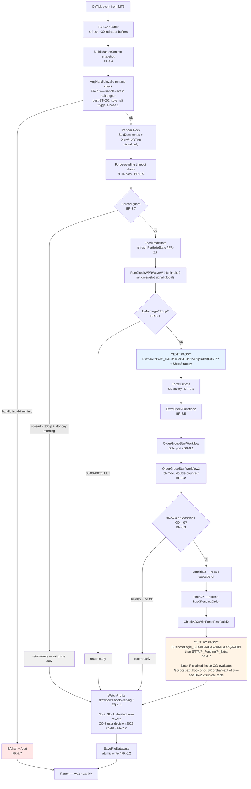
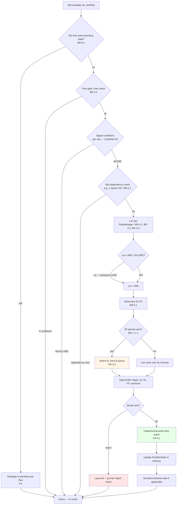
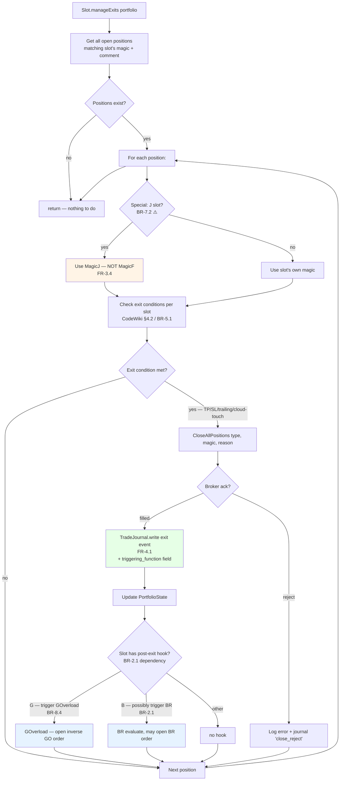
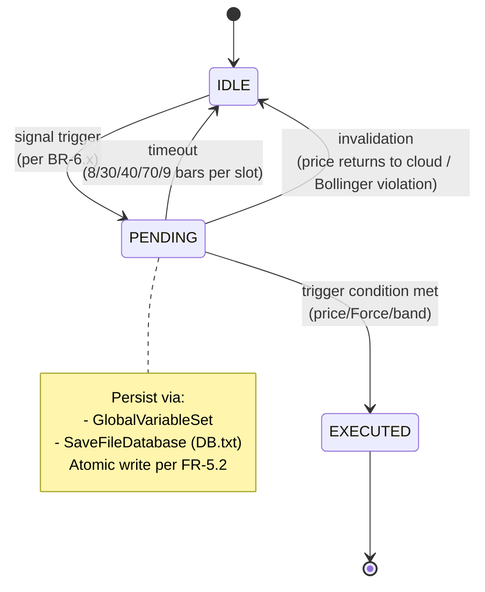
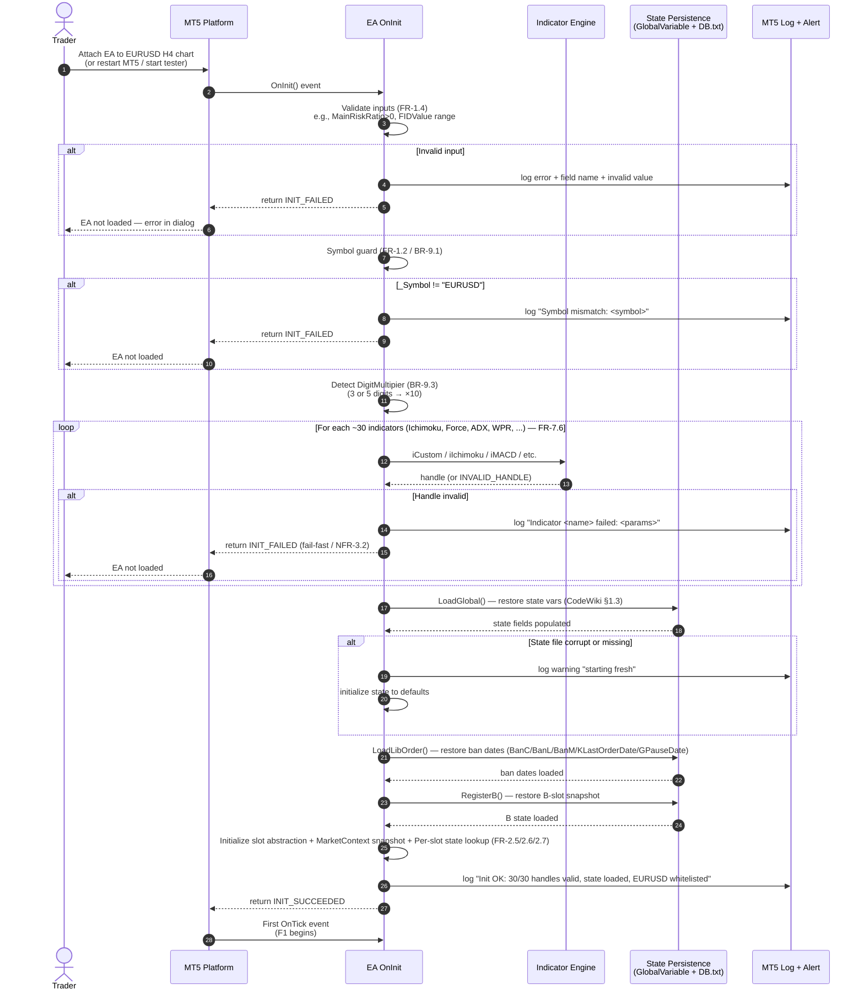
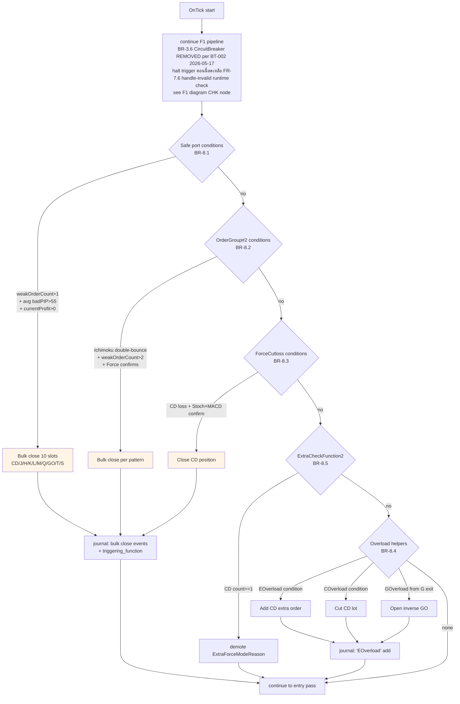
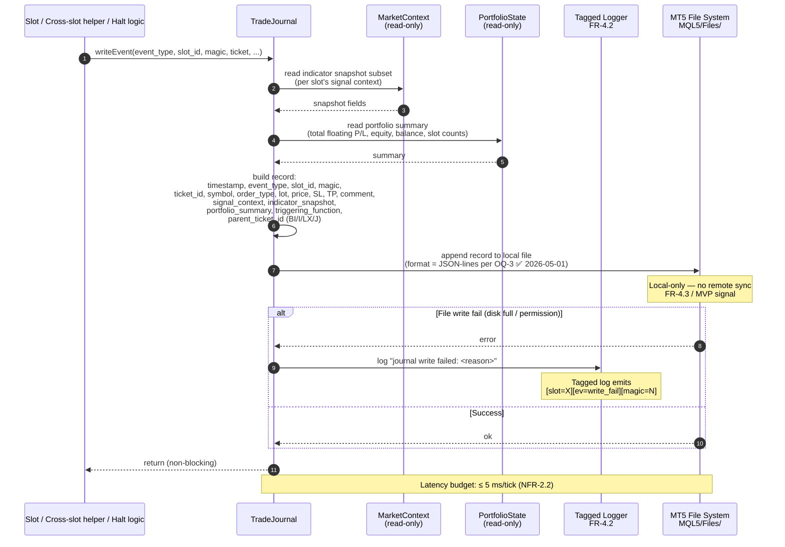

# 05 — User Flows: PhoenicisNex

> **Phase:** Phase 1A (BA Requirements Discovery) — Doc 5/5
> **Author:** BA agent (`/ba` workflow, v1.2)
> **Last updated:** 2026-05-17 (BT-002 BA cascade — TL;DR F6 description update (CircuitBreaker removed legacy-parity); F1 mermaid CircuitBreakerOrder node + ping-pong alt branch replaced with AnyHandleInvalid runtime check (sole halt trigger Phase 1) + F1.4 narrative update + F1.6 error path table CircuitBreaker row strikethrough + handle-invalid runtime row added + F1.7 FR/BR trace updates; F6 § heading rename + F6.1 trigger BR-3.6 strikethrough + F6.3 mermaid CB check decision + HALT outcome + JNL1 + WAIT nodes removed + post-BT-002 footnote + dangling HALT style cleanup + F6.6 error row CircuitBreaker false-positive strikethrough + F6.7 FR/BR/NFR traces updates. Initial publish: 2026-05-01)
> **Reads:** `01-project-brief.md` (actors), `02-functional-requirements.md` (FR-X.Y), `04-business-rules.md` (BR-X.Y)
> **Audience:** Architect (Phase 1B), Tech Lead (Phase 1D), QA (Phase 3T)

## TL;DR

เอกสารนี้แสดง **end-to-end journey** ของ EA ผ่าน **7 flows หลัก**: (F1) OnTick pipeline ต่อ tick, (F2) Slot entry lifecycle, (F3) Slot exit lifecycle, (F4) Pending state machine, (F5) Boot/OnInit, (F6) Cross-slot safety (~~+ CircuitBreaker~~ — **CircuitBreaker BR-3.6 detector REMOVED per BT-002 2026-05-17 legacy-parity** — F6 retains BR-8.x cross-slot helpers only), (F7) Trade journal write-on-event. แต่ละ flow มี **happy path + alternative + error** + Mermaid diagram + Thai narrative ที่ trace กลับไป FR/BR. Architect ใช้ flow เหล่านี้ตัดสินใจ component boundaries; QA ใช้ตรวจ trade journal pattern หลัง regression run. **All BA-domain open questions ✅ resolved 2026-05-01** — flow ทั้ง 7 lock พร้อมเข้า Phase 1B SD.

---

## 1. How to read this document

ทุก flow มี structure เดียวกัน:

```
**F-N — Flow name**
- **Trigger:** [event ที่ทำให้ flow start]
- **Actors involved:** Trader / MT5 Platform / Slot / RiskManager / TradeJournal
- **Mermaid diagram:** [flowchart หรือ sequenceDiagram]
- **Happy path:** ลำดับเหตุการณ์ปกติ
- **Alternative path(s):** branching ที่ valid (เช่น pending mode vs market mode)
- **Error path(s):** failure handling
- **FR/BR trace:** ลิงก์กลับไป requirements
```

**Mermaid types ใช้:**
- `flowchart` — สำหรับ decision pipeline + state transitions
- `sequenceDiagram` — สำหรับ multi-actor interactions (เช่น Trader ↔ MT5 ↔ EA)

---

## 2. F1 — OnTick Pipeline (per-tick execution)

นี่คือ flow หลักที่ run ทุก tick ของ EA — ทุก slot evaluation, exit, entry, housekeeping ผ่าน pipeline นี้. เป็น behavioral signature ของ EA — เปลี่ยน order = behavioral drift.

### F1.1 — Trigger
- MT5 Platform fire `OnTick` event เมื่อมี new tick จาก broker

### F1.2 — Actors
Trader (passive — ไม่ trigger ตอน live), MT5 Platform (event source), Slot orchestrator, 21 active slots (Slot U deleted per OQ-8), TradeJournal, MarketContext, PortfolioState

### F1.3 — Diagram



### F1.4 — Happy path

ทุก tick เริ่มที่ MT5 ส่ง event → EA refresh indicator buffers + build `MarketContext` → ตรวจ `AnyHandleInvalid()` runtime (post-BT-002 2026-05-17: sole halt trigger Phase 1; ถ้า invalid = halt; CircuitBreaker BR-3.6 ping-pong check ถูกลบ legacy-parity) → spread guard + IsMorningWakeup time gate → `ReadTradeData` refresh `PortfolioState` → **exit pass** (manageExits ของทุก slot ตามลำดับ) → cross-slot cleanup (`ForceCutloss`, `OrderGroupStartWorkflow*`) → IsNewYearSeason2 gate → **entry pass** (evaluate ของทุก slot ตามลำดับ BR-2.2) → housekeeping (`WatchProfits`, `SaveFileDatabase`) → return.

**Critical invariant:** exit pass ก่อน entry pass เสมอ (FR-2.3, BR-2.2).

### F1.5 — Alternative paths

| Branch | Trigger | Outcome |
|--------|---------|---------|
| Spread guard active | `SYMBOL_SPREAD > 10pip` + Monday morning | Skip entry pass; ทำ housekeeping ปกติ |
| IsMorningWakeup | 00:00–00:05 EET | Skip exit + entry pass; ทำ housekeeping |
| Holiday block | Dec 21–Jan 3 + CD==0 | Skip entry pass; ทำ exit pass + housekeeping |

### F1.6 — Error paths

| Error | Detection | Handling |
|-------|-----------|----------|
| ~~CircuitBreaker ping-pong~~ | ~~Same position re-opens within 3000ms~~ → **REMOVED per BT-002 2026-05-17 legacy-parity** (per `backtrack-log.md § BT-002`; cap-3 iter chain ADR-013 → ADR-014 falsified 3 false-positive classes) | ~~EA halt + Alert~~ → **N/A** — accepted residual risk per `docs/design-docs/05-security.md § 2.5 DoS row` + § 9 Red Team Hand-off audit row |
| Indicator handle invalid (runtime) | `AnyHandleInvalid()` returns true during OnTick (FR-7.6 runtime guard) | EA halt + Alert (FR-7.7); journal entry `event_type=halt halt_reason=handle_invalid_runtime`. Note: OnInit fail-fast (FR-7.6) catches startup case; runtime path handles mid-session indicator drop. Post-BT-002 2026-05-17: sole halt trigger Phase 1 |
| State write fail | `SaveFileDatabase` cannot write (disk full / permission) | Log error; tagged warning ผ่าน FR-4.2; ยัง continue ใน RAM |

### F1.7 — FR/BR trace

- **FRs:** FR-2.3 (exit-before-entry), FR-2.6 (MarketContext), FR-2.7 (PortfolioState), FR-4.4 (WatchProfits), FR-5.2 (atomic write), FR-6.1 (IsMorningWakeup), FR-6.2 (Monday spread), FR-6.3 (holiday), ~~FR-6.6 (CircuitBreaker)~~ — DEMOTED Won't per BT-002 2026-05-17, FR-6.7 (Force-pending timeout), FR-7.1 (Safe port), FR-7.2 (OrderGroup#2), FR-7.3 (ForceCutloss), FR-7.4 (ExtraCheckFunction2), FR-7.5 (Overload helpers), FR-7.6 (handle-invalid runtime — post-BT-002 sole halt trigger Phase 1), FR-7.7 (Halt + Alert — handle-invalid trigger only post-BT-002)
- **BRs:** BR-2.2 (slot order invariant), BR-3.1/2/3/5/~~6~~/7 (time/spread gates; ~~BR-3.6~~ REMOVED per BT-002 2026-05-17), BR-8.1/2/3/4/5 (cross-slot)

---

## 3. F2 — Slot Entry Lifecycle

ทุก slot ใน entry pass ของ F1 ผ่าน lifecycle เดียวกัน — ตั้งแต่ signal evaluation ถึง journal write.

### F2.1 — Trigger
Slot orchestrator เรียก `slot.evaluate(ctx, portfolio)` ใน entry pass ของ OnTick (F1)

### F2.2 — Actors
Slot, MarketContext (read), PortfolioState (read), RiskManager (lot calc), MT5 CTrade (broker submission), TradeJournal (write)

### F2.3 — Diagram



### F2.4 — Happy path

Slot orchestrator เรียก `evaluate()` → slot เช็ค pending state ก่อน (ถ้ามี = delegate F4) → ถ้าไม่มี pending → ตรวจ time gate + ban cooldown (BR-3.4) → ตรวจ signal conditions ตาม CodeWiki §3 (slot-specific AND chain) → ตรวจ dependency (เช่น J ต้องการ C/D active) → คำนวณ lot ผ่าน RiskManager (BR-4.1) + clamp (BR-4.2/4.3) → กำหนด SL/TP (BR-5.1) → **ถ้าเป็น BI** → inherit SL จาก B parent (BR-7.1 ⚠️) → ส่ง `OpenOrder` ผ่าน MT5 CTrade → ถ้า broker ack = success → write trade journal entry event (FR-4.1) → update PortfolioState in memory → set ban date ถ้าเป็น slot ที่ใช้ cooldown (BR-3.4).

### F2.5 — Alternative paths

| Branch | Trigger | Outcome |
|--------|---------|---------|
| Slot has pending state | `slot.pendingState() != IDLE` (เช่น CPendingComment != "") | Delegate to F4 (pending state machine); skip normal evaluate |
| BI SL inheritance | Slot is BI + parent B has active position | Use BR-7.1 logic (locked: same SL distance, OQ-3.3 ✅ 2026-05-01) |
| Lot below min volume | `calculatedLot < SYMBOL_VOLUME_MIN` | Clamp to MIN (BR-4.3); proceed |
| Lot above max cap | `calculatedLot > LimitMaxLotSizeRatio × SYMBOL_VOLUME_MAX` | Clamp + log warning (BR-4.2) |

### F2.6 — Error paths

| Error | Detection | Handling |
|-------|-----------|----------|
| Broker reject (e.g., insufficient margin) | `CTrade.OrderSend` returns false | Log error message + magic + lot; journal entry `event_type=reject`; ไม่ update PortfolioState |
| Slot dependency missing | (e.g., J fires but C/D not active) | Skip — return without order (signal condition check จะ filter ก่อนถึงตรงนี้ใน normal path) |
| Indicator value undefined | `MarketContext` field null/NaN | Should not happen ถ้า OnInit handle validate ผ่าน (FR-7.6); ถ้าเกิด — log error + skip slot for this tick |

### F2.7 — FR/BR trace
- **FRs:** FR-2.1, FR-2.5, FR-2.6, FR-2.7, FR-3.1, FR-3.2, FR-3.3 (BI fix), FR-3.6, FR-4.1, FR-4.2, FR-6.4 (ban dates)
- **BRs:** BR-3.4 (ban), BR-4.1/2/3 (lot), BR-5.1 (SL/TP), BR-6.x (pending), BR-7.1 ⚠️ (BI SL), BR-2.1 (dependency)

---

## 4. F3 — Slot Exit Lifecycle

Exit pass ของ OnTick เรียก slot's `manageExits()` — flow นี้ต่อจาก F1 step K.

### F3.1 — Trigger
Slot orchestrator เรียก `slot.manageExits(portfolio)` ใน exit pass ของ OnTick

### F3.2 — Actors
Slot, PortfolioState (read), MT5 CTrade (close submission), TradeJournal

### F3.3 — Diagram



### F3.4 — Happy path

Orchestrator เรียก `manageExits()` → slot ดึง open positions ที่ match magic + comment → loop ทุก position → ตรวจ exit condition (per CodeWiki §4.2) → **ถ้า slot J → ใช้ MagicJ ไม่ใช่ MagicF (FR-3.4 / BR-7.2 ⚠️ G4 fix)** → ถ้า exit condition = true → `CloseAllPositions` ผ่าน MT5 CTrade → ถ้า broker ack ปิดสำเร็จ → write trade journal exit event (FR-4.1) + ใส่ `triggering_function` (e.g., `"ExtraTakeProfit_J"`) → update PortfolioState → ถ้า slot มี post-exit hook (G→GO trigger, B→BR/BI evaluate per BR-2.1) → call hook → next position.

### F3.5 — Alternative paths

| Branch | Trigger | Outcome |
|--------|---------|---------|
| Slot J magic correction | Slot is J | Iterate `MagicJ`, ห้าม touch MagicF (BR-7.2 ⚠️) |
| Trailing/BE active | Slot ∈ {G, GO, M, S} + max profit + cloud touch | Trail stop (BR-5.2) แทนปิดเลย |
| Bulk close from cross-slot | Triggered by Safe port (F6) | Close ทำผ่าน OrderGroupStartWorkflow แทน slot's manageExits |

### F3.6 — Error paths

| Error | Detection | Handling |
|-------|-----------|----------|
| Broker close reject | `CTrade.PositionClose` returns false | Log error + journal `close_reject` event; ลอง next position; alert ถ้าซ้ำกัน |
| Slippage between submit + fill | Comparing submitted SL vs filled SL > tolerance | Log warning ผ่าน FR-4.2; ไม่ block flow |

### F3.7 — FR/BR trace
- **FRs:** FR-2.1, FR-3.2, FR-3.4 (J magic fix), FR-3.5 (trailing), FR-4.1
- **BRs:** BR-5.1, BR-5.2, BR-7.2 ⚠️ (J magic), BR-2.1 (post-exit hooks G→GO, B→BR/BI), BR-8.4 (Overload helpers)

---

## 5. F4 — Pending State Machine

EA รัน multiple parallel pending state machines (CodeWiki §2.5) — ทุก slot ที่มี pending state ใช้ flow shape นี้ (รายละเอียด state ดู BR-6.x).

### F4.1 — Trigger
Slot.evaluate() เห็นว่า slot มี active pending state (e.g., `CPendingComment != ""`)

### F4.2 — Actors
Slot, MarketContext (read price + indicator), state-persistence layer (GlobalVariable + DB.txt)

### F4.3 — Diagram (generic shape — apply to C-Pending, R-Pending, P-Pending, M-Pending, T-Pending, Q-Pending, Force-Pending)



### F4.4 — Happy path

Initial state = IDLE → BusinessLogic_X เห็น signal trigger condition → slot transition → PENDING พร้อม snapshot fields (เช่น `CPendingComment="C,..."`, `MPendingAtPrice`, `PPendingCommand="ts,dir,diffSL,bandRatio"`) → state persist ผ่าน GlobalVariable + DB.txt → ทุก tick ถัดไป slot evaluate ดู PENDING field + ตรวจ trigger condition (price reaches level / Force trigger / band ratio break) → ถ้า trigger met → transition → EXECUTED → BusinessLogic_X open market order (กลับเข้า F2 step `OpenOrder`) → state cleared back to IDLE.

### F4.5 — Alternative paths (per state machine)

| Machine | Timeout | Invalidation | Special trigger |
|---------|---------|--------------|-----------------|
| **C-Pending** (BR-6.1) | 8 H4 bars | none | price reaches trigger |
| **C-Pending-ADX** (BR-6.2) | 30 H4 bars | none | comment ลงท้าย `,A` |
| **R-Pending** (BR-6.3) | 40 H4 bars | price returns to cloud | price > `_pendingPrice` |
| **P-Pending** (BR-6.4) | 70 H4 bars | Bollinger violation | sub-modes PX (Force/diffSL≥200) / PH (default) / E,N variants |
| **M-Pending** (BR-6.5) | (no hard timeout in CodeWiki — see OQ-A1) | M signal flip overwrites snapshot | price moves > thresholds → +25% lot bonus |
| **T-Pending** (BR-6.6) | (no hard timeout — see OQ-A2) | none | `BusinessLogic_PendingT` confirmation tick |
| **Q-Pending** (BR-6.7) | (no hard timeout — see OQ-A3) | per slot | code-specific resolution per QPendingCode (0/1/2/3) |
| **Force-Pending** (BR-6.8) | 9 H4 bars (cleared OnTick `:249`) | none | ForcePendingActionOrder fires |

### F4.6 — Error paths

| Error | Detection | Handling |
|-------|-----------|----------|
| State file corrupt | OnInit `LoadGlobal` fails to parse | Log error; ถ้า atomic write (FR-5.2) ทำงาน = fall back to last good state; ถ้าไม่มี state file = start IDLE |
| Pending state stuck (M/T/Q with no hard timeout) | Architecture-domain force-clear safety policy (OQ-A1/A2/A3 in `04 § BR-6.5/6/7`) — Architect resolve | If safety force-clear chosen → alert (FR-7.7) + journal "pending stuck"; if not → Architect document risk in design doc |

### F4.7 — FR/BR trace
- **FRs:** FR-5.1 (persist), FR-5.2 (atomic write), FR-6.7 (force-pending 9-bar)
- **BRs:** BR-6.1 ถึง BR-6.9

---

## 6. F5 — Boot/OnInit Lifecycle

EA load เกิด 3 cases: (1) user attach EA กับ chart, (2) MT5 restart, (3) Strategy Tester start. Flow นี้ต้อง robust ทุกกรณี.

### F5.1 — Trigger
MT5 Platform fire `OnInit` event

### F5.2 — Actors
Trader (passive), MT5 Platform, Indicator engine (~30 handles), state persistence, EA logger

### F5.3 — Diagram



### F5.4 — Happy path

Trader attach EA → MT5 fire OnInit → EA validate inputs (FR-1.4) → EA verify symbol = EURUSD (FR-1.2) → detect digit multiplier → loop สร้าง ~30 indicator handles + validate (FR-7.6 / NFR-3.2 fail-fast) → load state from GlobalVariable + DB.txt (FR-5.1) → load ban dates → load B-slot snapshot → initialize slot abstraction + MarketContext snapshot + Per-slot state lookup → log "Init OK" → return INIT_SUCCEEDED → MT5 เริ่ม fire OnTick.

### F5.5 — Alternative paths

| Branch | Trigger | Outcome |
|--------|---------|---------|
| Strategy Tester boot | EA load จาก tester (not live) | Same flow แต่ network calls (`MyGlobalVariableSet` etc.) ถูก skip ใน tester mode (CodeWiki §5.4) |
| Fresh state (no DB.txt) | First-ever boot | Start with default state values; log "starting fresh" |
| MT5 restart with active state | Reload หลัง MT5 stop | Restore state ตรงกับ pre-restart (FR-5.1, NFR-3.3 100% equivalence) |

### F5.6 — Error paths

| Error | Detection | Handling |
|-------|-----------|----------|
| Invalid input value | `OnInit` validation step | Log + return `INIT_FAILED` (FR-1.4) |
| Wrong symbol | `_Symbol != "EURUSD"` | Log + return `INIT_FAILED` (FR-1.2, NFR-5.3) |
| Indicator handle invalid | `iCustom` returns `INVALID_HANDLE` | Log + return `INIT_FAILED` (FR-7.6, NFR-3.2 fail-fast 100%) |
| State file corrupt | `LoadGlobal` parse error | Log warning; start fresh (NFR-3.1 atomic write should prevent this) |

### F5.7 — FR/BR trace
- **FRs:** FR-1.2 (symbol whitelist), FR-1.4 (input validation), FR-5.1 (state persist), FR-7.6 (handle validation)
- **BRs:** BR-9.1, BR-9.3, BR-9.4
- **NFRs:** NFR-3.1, NFR-3.2, NFR-3.3, NFR-5.3

---

## 7. F6 — Cross-slot Safety (post-BT-002 2026-05-17: CircuitBreaker removed)

Flow นี้รวบ safety mechanisms ที่ run ขนานกับ slot logic — ทำงานใน F1 pipeline แต่มี side effect ที่อาจ override slot decisions. **Post-BT-002 2026-05-17:** CircuitBreaker BR-3.6 ping-pong detector ถูกลบ legacy-parity — F6 retains BR-8.x cross-slot helpers (SafePort / OrderGroup#2 / ForceCutloss / Overload helpers / ExtraCheckFunction2) เท่านั้น.

### F6.1 — Trigger
ไม่มี trigger เดียว — ทุก rule ใน ~~BR-3.6~~ (REMOVED per BT-002 2026-05-17), BR-8.x ตรวจทุก tick ใน F1

### F6.2 — Actors
EA system, Slot orchestrator, 21 active slots (Slot U deleted per OQ-8), MT5 CTrade, TradeJournal, MT5 Alert (popup + sound)

### F6.3 — Diagram



> **Note (post-BT-002 2026-05-17):** Former `CircuitBreaker check (BR-3.6 / FR-6.6)` decision node + `HALT` outcome + `journal halted` + `WAIT` post-halt nodes ถูกลบจาก F6 diagram per BT-002 Option 1 (legacy-parity). Halt-trigger flow ตอนนี้แยกไป F1 (handle-invalid runtime check at `MarketContext build` boundary — ดู F1 § F1.3 CHK node). ดู `backtrack-log.md § BT-002` + `03 § NFR-1 Empirical Citation BT-002 footnote` สำหรับ cap-3 iter chain audit trail.

### F6.4 — Happy path (ทั้งหมด rule = ไม่ trigger)

ทุก rule ตรวจแต่ไม่มีอะไรเข้าเงื่อนไข → flow ทะลุไปถึง entry pass ใน F1.

### F6.5 — Alternative paths

| Path | Trigger | Outcome |
|------|---------|---------|
| Safe port bulk close | `weakOrderCount > 1` + `avg badPIP > 55` + `currentProfit > 0` | Close 10 slots พร้อมกัน (BR-8.1) — ผลกระทบ: skip slot's own exit logic |
| Ichimoku double-bounce | `weakOrderCount > 2` + Force confirm | Bulk close pattern (BR-8.2) |
| ForceCutloss CD | CD loss + Stoch M10 + MACD D1 confirm | Close CD only (BR-8.3) |
| EOverload add | Peak-reversion + ≥33 pip last gap | Add extra CD order with reduced lot (BR-8.4 EOverload) |
| COverload cut | MACD same-sign losses ≥7 bars + weak ADXW | Cut CD lot (BR-8.4 COverload) |
| GOverload hedge | G order closes (called from `ExtraTakeProfit_G`) | Open inverse GO (BR-8.4 GOverload) |
| ExtraCheckFunction2 | `portfolio[MagicCD].count == 1` | Demote `ExtraForceModeReason` (BR-8.5) — ไม่มี order action |

### F6.6 — Error paths

| Error | Detection | Handling |
|-------|-----------|----------|
| ~~CircuitBreaker false-positive~~ | ~~Two trades same direction within 3000ms but legitimate (rare)~~ → **REMOVED per BT-002 2026-05-17** — cap-3 iter chain ADR-013 → ADR-014 falsified 3 false-positive halt classes (Jan-14 broker-driven SL + Jan-27 SafePort mass-close + Jan-06 Slot_BI pyramid); operator selected Option 1 legacy-parity (`backtrack-log.md § BT-002`) | ~~EA halt — operator (Trader) ต้อง investigate + manual restart EA~~ → **N/A** — accepted residual risk per `docs/design-docs/05-security.md § 2.5 DoS row` + § 9 Red Team Hand-off audit row |
| Bulk close partial fail | Some positions ปิดสำเร็จ + บางตัว reject | Log + journal each result; continue (PortfolioState refresh next tick) |

### F6.7 — FR/BR trace
- **FRs:** ~~FR-6.6~~ (DEMOTED Won't per BT-002 2026-05-17), FR-7.1, FR-7.2, FR-7.3, FR-7.4, FR-7.5, FR-7.6 (handle-invalid runtime — post-BT-002 sole halt trigger Phase 1), FR-7.7 (handle-invalid trigger only post-BT-002)
- **BRs:** ~~BR-3.6 (CircuitBreaker)~~ — **REMOVED per BT-002 2026-05-17 legacy-parity**, BR-8.1, BR-8.2, BR-8.3, BR-8.4, BR-8.5
- **NFRs:** NFR-5.1 (EA halt with notification — handle-invalid trigger only post-BT-002)

---

## 8. F7 — Trade Journal Write-on-Event

ทุก trade event ใน F2/F3/F6 trigger flow นี้ — เป็น G2 (Observability) ของ project + foundation ของ user retrospective.

### F7.1 — Trigger
- Order entry success (F2 step `OpenOrder` ack)
- Order exit success (F3 step `CloseAllPositions` ack)
- Order modification (SL/TP adjustment, trailing — F3 alternative)
- Bulk close (F6 step `BULK`/`BULK2`/`FCLOSE`)
- Order reject (F2 step ERR / F3 step ERR — สำหรับ debug)
- EA halt (F6 step `HALT`)

### F7.2 — Actors
Slot, Cross-slot helpers, TradeJournal (write), MarketContext (read for snapshot), MT5 file system (`MQL5/Files/`)

### F7.3 — Diagram



### F7.4 — Happy path

Caller (slot's evaluate / manageExits, หรือ cross-slot helper) เรียก `journal.writeEvent(...)` พร้อม core fields → Journal อ่าน indicator snapshot subset จาก MarketContext (เฉพาะ field ที่ relevant กับ slot นี้) → อ่าน portfolio summary → build complete record → append เข้า local file ใน `MQL5/Files/` (FR-4.3 / MVP signal — **ไม่มี cloud sync**) → return non-blocking. Latency budget ≤ 5 ms/tick (NFR-2.2).

### F7.5 — Record schema (✅ format = JSON-lines per OQ-3 resolved 2026-05-01; TD locks final field set in Phase 1D)

```
{
  "timestamp": "2024-03-15T14:23:45.123Z",
  "event_type": "entry|exit|modify|reject|halt",
  "slot_id": "C|D|F|J|H|K|G|G2|GO|M|L|LX|Q|R|I|P|T|S|B|BR|BI",
  "magic": 200..220,
  "ticket_id": 123456789,
  "symbol": "EURUSD",
  "order_type": "buy|sell",
  "lot": 0.05,
  "price": 1.0875,
  "sl": 1.0850,
  "tp": 1.0920,
  "comment": "C,...",
  "signal_context": "WPRWaveSignal=Yes,CheckIchiBarForC=true,ForcePeak3=ascending",
  "indicator_snapshot": {
    "ichi_h4_cloudHigh": 1.0890,
    "ichi_h4_cloudLow": 1.0860,
    "force_h4_0": 12.3,
    "force_h4_1": 9.8,
    "adx_h4": 28.5,
    ...
  },
  "portfolio_summary": {
    "total_lots": 0.32,
    "total_floating_pl": 1234.56,
    "equity": 51234.56,
    "balance": 50000.00,
    "slot_counts": {"C": 1, "G": 2, "B": 1, ...}
  },
  "triggering_function": "BusinessLogic_C|ExtraTakeProfit_J|OrderGroupStartWorkflow|...",
  "parent_ticket_id": null  // for pyramid (BI, I, LX, J): refer to parent ticket
}
```

### F7.6 — Alternative paths

| Branch | Trigger | Outcome |
|--------|---------|---------|
| BI/I/LX/J pyramid order | event_type=entry, slot_id ∈ {BI, I, LX, J} | Populate `parent_ticket_id` field |
| Bulk close | triggering_function ∈ {OrderGroupStartWorkflow, OrderGroupStartWorkflow2, ForceCutloss} | Multiple records ใน same tick (one per closed position) |
| EA halt | event_type=halt | Single record + Alert (FR-7.7) |

### F7.7 — Error paths

| Error | Detection | Handling |
|-------|-----------|----------|
| File write fail (disk full) | `FileWrite` returns error | Log via tagged logger (FR-4.2); ไม่ block trade flow; alert ผ่าน MT5 Alert ถ้าซ้ำเกิน N ครั้ง |
| File permission denied | `FileOpen` returns INVALID_HANDLE | Log; switch to fallback (e.g., MT5 Experts log via `Print()`); alert |
| Schema version mismatch | (future — ถ้า upgrade) | Per-record schema version field (TD decide) |

### F7.8 — FR/BR trace
- **FRs:** FR-4.1, FR-4.2, FR-4.3, FR-4.4 (interacts with WatchProfits)
- **NFRs:** NFR-2.2 (≤5 ms latency), NFR-3.4 (no silent failures)

---

## 9. Flow Coverage Matrix

ตารางนี้ verify ว่าทุก FR/BR critical path มี flow ครอบคลุม.

| FR/BR | Flow(s) | Diagram type |
|-------|---------|--------------|
| FR-1.2 (Symbol whitelist) | F5 | sequenceDiagram |
| FR-1.4 (Input validation) | F5 | sequenceDiagram |
| FR-2.1 (Preserve all slots) | F2 + F3 | flowchart |
| FR-2.3 (Exit-before-entry) | F1 | flowchart |
| FR-2.5/2.6/2.7 (Slot abstraction, MarketContext snapshot, Per-slot state lookup) | F1, F2, F5, F7 | flowchart + sequence |
| FR-3.3 (BI SL fix ⚠️) | F2 | flowchart |
| FR-3.4 (J magic fix ⚠️) | F3 | flowchart |
| FR-4.1 (Trade journal) | F7 | sequenceDiagram |
| FR-4.3 (Local-only storage) | F7 | sequenceDiagram |
| FR-5.1/5.2 (State persist + atomic) | F4, F5 | stateDiagram + sequence |
| FR-6.x (Time gates) | F1 | flowchart |
| FR-7.1/7.2/7.3/7.4/7.5 (Cross-slot) | F6 | flowchart |
| FR-7.6 (Indicator handle validation) | F5 | sequenceDiagram |
| FR-7.7 (Halt + Alert) | F1, F6 | flowchart |
| BR-2.2 (Slot order invariant) | F1 | flowchart |
| BR-6.x (Pending state machines) | F4 | stateDiagram |
| BR-7.1/7.2 (Bug fixes ⚠️) | F2, F3 | flowchart |
| BR-8.x (Cross-slot rules) | F6 | flowchart |
| BR-9.x (Invariants) | F5 (boot enforcement) | sequenceDiagram |

ทุก critical FR/BR cover ครบ — ไม่มี orphan requirement.

---

## 10. Resolved Questions — All 5 OQs ✅

✅ **ไม่มี flow-domain open question** — ทุก open question ของ Phase 1 ถูก resolve ใน BA review 2026-05-01:

| Open Q | Domain | Doc | Status (resolved 2026-05-01) |
|--------|--------|-----|------------------------------|
| **OQ-3** Trade journal storage format | FR | `02 § 12 → OQ-3` | ✅ JSON-lines (BA default) |
| **OQ-3.3** BI SL inheritance semantic | Rule | `04 § 7.1 → OQ-3.3` | ✅ same SL distance (BA default) |
| **OQ-6** Equity-floor switch | NFR (safety) | `03 § 10 → OQ-6` | ✅ monitor-only Phase 1 (BA default) |
| **OQ-7** Per-slot trade-count tolerance | NFR (regression) | `03 § 10 → OQ-7` | ✅ ±15% / >30% (BA default) |
| **OQ-8** Slot U disposition | FR (scope) | `02 § 12 → OQ-8` | ✅ **DELETE** (user override of BA default) |

---

> **End of 05 — User Flows** — 7 flows, 7 Mermaid diagrams (4 flowchart + 2 sequence + 1 state), full FR/BR coverage matrix, no flow-domain open questions
