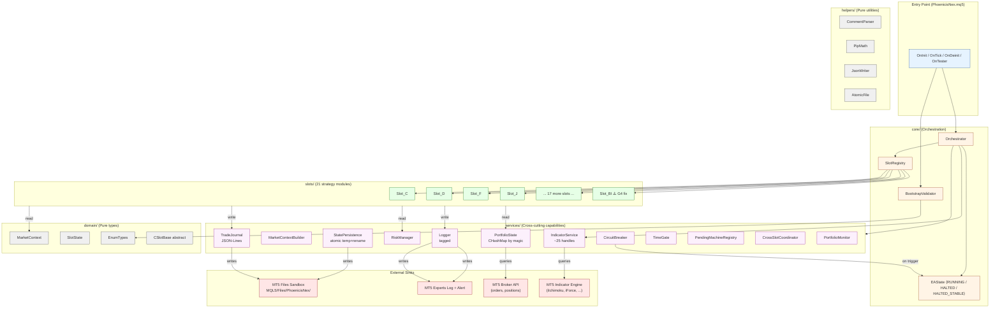

# 02 — High-Level Architecture: PhoenicisNex

> **Phase:** Phase 1B (System Design) — Doc 1/6 (v1.2: gaps 01/06 — merged into this doc)
> **Author:** Architect agent (`/sd` workflow)
> **Last updated:** 2026-05-02
> **Reads:** `docs/ba/01-05` (BA package — authoritative for FR/NFR/BR), `docs/foundation-input-sources/*` (CodeWiki, baseline, ideation, improvement-targets)
> **Audience:** Tech Lead (Phase 1D TD), Implementation Engineer (Phase 3I), QA (Phase 3T), reviewer

## TL;DR

PhoenicisNex ออกแบบเป็น **modular monolith intra-process** ใน MT5 sandbox — รัน 21 slots + cross-slot helpers + persistence + journal ภายใน 1 EA process เดียว เพราะ MVP signal lock no-installer/no-server/no-DLL (NFR-7.2, C-12) + FR-2.3 บังคับ exit-before-entry pass ของ orchestrator เดียว → multi-process หรือ DLL-extracted architecture ทำไม่ได้. **Architectural pillars 5 ข้อ:** behavioral parity (≤ 25% Net Profit drift), single-process embedded EA, auditability (per-event JSON-Lines journal), crash-safe persistence (atomic temp+rename), maintainability (1 file/slot, ≤ 5,000 LOC ต่อไฟล์, ≥ 80 native `input` parameters). **Trade-off:** "architecture rigor" มาจาก discipline ของ `#include` boundaries + 1 file/slot — ไม่มี runtime enforcement; mitigated โดย code-review checklist ของ TD + grep guard. **Schedule-free:** เอกสารนี้ไม่ระบุ sprint/dates/capacity — Impl Planner จะแปลง 08-product-breakdown.md เป็น phase plan.

---

## 1. Requirements Traceability (BA → SD)

> **⚠️ Authoritative source for FR/NFR/BR:** `docs/ba/02-functional-requirements.md`, `docs/ba/03-non-functional-requirements.md`, `docs/ba/04-business-rules.md`. SD ห้าม restate BA prose — section นี้คือ **mapping** จาก BA-ID → SD section/component/ADR เท่านั้น. ถ้า requirement ใดเปลี่ยน → ใช้ `/amend ba` หรือ `/backtrack ba` เป็น authoritative; SD update ตาม

### 1.1 FR Traceability Matrix

ตารางนี้ map ทุก functional requirement (41 user stories จาก `02 § 10`) → SD section/component/ADR ที่ implement

| BA FR-ID | Title (1-line) | SD section / component | Related ADR |
|----------|----------------|------------------------|-------------|
| FR-1.1 | ≥ 80 inputs in MT5 dialog | `inputs/Inputs_*.mqh` files (12) | ADR-012 |
| FR-1.2 | Symbol whitelist guard | `core/BootstrapValidator` | — |
| FR-1.3 | Strategy Tester optimization | `inputs/Inputs_*.mqh` use `input` (not `static input`) | — |
| FR-1.4 | Input validation OnInit | `core/BootstrapValidator::ValidateInputs()` | — |
| FR-2.1 | Preserve 21 slots 1:1 | `slots/Slot_<X>.mqh` × 21 | ADR-002 |
| FR-2.2 | Slot U deleted | (no `Slot_U.mqh`) | — |
| FR-2.3 | Exit-before-entry pass | `core/Orchestrator::OnTickPipeline()` (F1 sequence) | — |
| FR-2.4 | Cross-slot dependency graph | `CSlotBase::DependsOn(int &out[])` + `core/SlotRegistry::ValidateTopo()` | ADR-002 |
| FR-2.5 | Slot abstraction (uniform contract) | `domain/CSlotBase.mqh` | ADR-002 |
| FR-2.6 | Indicator snapshot per tick | `services/MarketContextBuilder` + `domain/MarketContext` | ADR-003, ADR-004 |
| FR-2.7 | Per-slot state lookup by magic | `services/PortfolioState` (CHashMap) | ADR-005 |
| FR-3.1 | Position sizing per-slot 1:1 | `services/RiskManager::ComputeLot()` + per-slot formula | — |
| FR-3.2 | SL/TP rules per-slot | encapsulated in each `Slot_<X>.mqh` (BR-5.1 spec) | — |
| FR-3.3 | BI SL fix (G4 ⚠️) | `slots/Slot_BI::ComputeSL()` (uses ADR-009 arithmetic) | ADR-009 |
| FR-3.4 | ExtraTakeProfit_J magic fix (G4) | `slots/Slot_J::ManageExits()` iterates `MagicJ`=206 | — |
| FR-3.5 | Trailing/BE preservation | per-slot `ManageExits()` (G/GO/M/S) | — |
| FR-3.6 | LimitMaxLotSizeRatio cap | `services/RiskManager::ClampLot()` | — |
| FR-4.1 | Per-event journal entry | `services/TradeJournal::WriteEvent()` | ADR-006 |
| FR-4.2 | Tagged structured logger | `services/Logger` | ADR-011 |
| FR-4.3 | Local-only journal storage | `services/TradeJournal` writes to `MQL5/Files/PhoenicisNex/journal/` only | ADR-006 |
| FR-4.4 | Worst DD bookkeeping | `services/PortfolioMonitor` (replaces WatchProfits) | — |
| FR-5.1 | Pending state machines persist | `services/PendingMachineRegistry` + `services/StatePersistence` | ADR-007, ADR-008 |
| FR-5.2 | Atomic state write | `helpers/AtomicFile` + `services/StatePersistence::Save()` | ADR-007 |
| FR-5.3 | OnDeinit final flush | `core/Orchestrator::OnDeinit()` calls `StatePersistence.Save()` + `TradeJournal.Flush()` | — |
| FR-6.1 | IsMorningWakeup block | `services/TimeGate::IsMorningWakeup()` (00:00–00:05 server) | — |
| FR-6.2 | Monday spread guard | `services/TimeGate::IsMondaySpreadHigh()` | — |
| FR-6.3 | New Year holiday block | `services/TimeGate::IsNewYearSeason2()` | — |
| FR-6.4 | Per-slot ban dates | `domain/SlotState::ban_date` + `services/TimeGate::IsBanned()` | ADR-005 |
| FR-6.5 | DST handling EET | `services/TimeGate::ServerTime()` uses `TimeCurrent()` (broker server time) — DST shifts inherit from MT5 | — |
| FR-6.6 | CircuitBreaker ping-pong | `services/CircuitBreaker::CheckPingPong()` | ADR-010 |
| FR-6.7 | Force-pending 9-bar timeout | `services/PendingMachineRegistry::TickForcePending()` | ADR-008 |
| FR-7.1 | Safe port (OrderGroup#1) | `services/CrossSlotCoordinator::RunSafePort()` | — |
| FR-7.2 | Ichimoku bounce (OrderGroup#2) | `services/CrossSlotCoordinator::RunOrderGroup2()` | — |
| FR-7.3 | ForceCutloss CD safety | `services/CrossSlotCoordinator::RunForceCutloss()` | — |
| FR-7.4 | ExtraCheckFunction2 | `services/CrossSlotCoordinator::ExtraCheckFunction2()` | — |
| FR-7.5 | EOverload/COverload/GOverload | `services/CrossSlotCoordinator` overload methods | — |
| FR-7.6 | Indicator handle validation | `services/IndicatorService::CreateHandles()` (returns false on any INVALID_HANDLE → orchestrator → INIT_FAILED) | ADR-003 |
| FR-7.7 | CircuitBreaker controlled halt | `services/CircuitBreaker::Halt()` + `core/EAState` machine | ADR-010 |
| FR-8.1 | 300-bar scan cache | `services/IndicatorService::CachedScan()` | ADR-003 |
| FR-8.2 | DD loop optimization | `services/PortfolioMonitor::IncrementalDD()` | — |
| FR-8.3 | Safe-port opt-out flag | `services/CrossSlotCoordinator` reads `InpSafePortOptOut_<slot>` | — |

### 1.2 NFR Traceability

| BA NFR-ID | Target | SD section / mechanism |
|-----------|--------|------------------------|
| NFR-1.1 ถึง NFR-1.8 | Behavioral parity (regression contract) | architecture preserves slot/RiskManager/cross-slot logic 1:1 + bucket B drift via ADR-009 |
| NFR-2.1 | Tick latency overhead ≤ 10% | `03 § 2 — Tick Latency Budget` performance analysis |
| NFR-2.2 | Journal write ≤ 5 ms/tick | ADR-006 sync-write + degrade-warn-but-continue |
| NFR-2.3 | Strategy Tester ≤ 1.5× original | FR-8.1 cache + slot abstraction overhead within budget |
| NFR-3.1 | Atomic write 100% across kill-100 | ADR-007 atomic temp+rename |
| NFR-3.2 | Indicator handle fail-fast 100% | ADR-003 + `BootstrapValidator` |
| NFR-3.3 | State restore 100% field equiv. | `StatePersistence::Load()` covers full schema (api-specs/state-persistence-schema.yaml) |
| NFR-3.4 | 0 silent failures | ADR-011 Logger.Error() + Alert |
| NFR-4.1 | ≤ 5,000 LOC/file | ADR-012 module split |
| NFR-4.2 | 1:1 slot:file | ADR-012 layered tree |
| NFR-4.3 | ≥ 80 inputs | ADR-012 `inputs/Inputs_*.mqh` (estimated count: 110-130) |
| NFR-4.4 | Glossary ≥ 20 entries | this doc § Glossary (≥ 25 entries) |
| NFR-5.1 | 0 silent shutdowns | ADR-010 + ADR-011 |
| NFR-5.2 | Equity-floor monitor only | `services/PortfolioMonitor` logs worst DD; no enforcement (OQ-6 deferred Phase 2) |
| NFR-5.3 | Symbol whitelist 100% | FR-1.2 mapping |
| NFR-6.1 | All inputs tunable, reattach ≤ 30s | `input` declarations natively support; OnInit ≤ 5s typical |
| NFR-6.2 | 100% numeric inputs in optimizer | `input` (not `sinput`) for tunable; `sinput` for static-only (symbol whitelist) |
| NFR-6.3 | Slot-grouped inputs | ADR-012 — `Inputs_Slot_<X>.mqh` + `group="Slot X"` annotation |
| NFR-7.1 | MT5 Build ≥ 3815 | C-1 |
| NFR-7.2 | 0 external DLLs | ADR-001 strict |
| NFR-7.3 | DST switch 100% correct | FR-6.5 mapping; `TimeCurrent()` inherits MT5 broker DST |
| NFR-8.1 | Label ≤ 40ch, tooltip ≤ 80ch | input-author discipline (TD enforce) |
| NFR-8.2 | 0 external config files | ADR-006 journal + ADR-007 state are EA-managed (not user-edit) |

### 1.3 BR Traceability

| BA BR-ID | Rule | SD location |
|----------|------|-------------|
| BR-1.1 | Magic Number Pool (16 magic, 21 slots, shared G/G2 + B/BI + C/D + L/LX) | `domain/EnumTypes::MagicByEnum()` constants |
| BR-1.2 | Magic-via-comment disambiguation | `helpers/CommentParser` + per-slot `BuildComment()` |
| BR-2.1 | Dependency Edge Table | `CSlotBase::DependsOn()` per-slot return value |
| BR-2.2 | Topo-sort invariant | `core/SlotRegistry::RegisterAll()` literal order + `ValidateTopo()` |
| BR-3.1 ถึง BR-3.7 | Trade filter & time gates | `services/TimeGate` + orchestrator pipeline (F1) |
| BR-4.1 ถึง BR-4.3 | Position sizing + cap + floor | `services/RiskManager` (per-slot multipliers preserved) |
| BR-5.1, BR-5.2 | SL/TP method per slot, trailing | per-slot `ManageExits()` impl |
| BR-6.1 ถึง BR-6.9 | Pending state machines | `services/PendingMachineRegistry` + per-machine class |
| BR-7.1 | BI SL inheritance ⚠️ | ADR-009 |
| BR-7.2 | ExtraTakeProfit_J magic ⚠️ | `Slot_J::ManageExits()` |
| BR-8.1 ถึง BR-8.5 | Cross-slot bulk cleanup | `services/CrossSlotCoordinator` |
| BR-9.1 ถึง BR-9.5 | System invariants | `core/BootstrapValidator` (boot-time enforce) + orchestrator pipeline |

### 1.4 Open Question Resolutions

| OQ-ID | Domain | BA decision | SD response |
|-------|--------|-------------|-------------|
| OQ-3 | FR | JSON-Lines | ADR-006 lock format + rotation policy |
| OQ-3.3 | Rule | same SL distance | ADR-009 lock pip arithmetic + edge-case fallbacks |
| OQ-6 | NFR (safety) | monitor-only Phase 1 | `PortfolioMonitor` log-only; equity-floor enforcement = Phase 2 trigger |
| OQ-7 | NFR (regression) | ±15% / >30% drift / ±2 absolute fallback | QA validation rule (no SD code change required) |
| OQ-8 | FR (scope) | DELETE Slot U | (no `Slot_U.mqh`; magic 220 unused) |
| **OQ-A1** | Architecture | (raised ใน BA) | ADR-008 — M-Pending hard force-clear 150 H4 bars |
| **OQ-A2** | Architecture | (raised ใน BA) | ADR-008 — T-Pending hard force-clear 80 H4 bars |
| **OQ-A3** | Architecture | (raised ใน BA) | ADR-008 — Q-Pending hard force-clear 100 H4 bars |

**Summary stats:**
- 41 BA FRs → 41 SD mappings (100%)
- 30 BA NFRs → all addressed via architecture decisions or QA-runtime targets
- 9 BR categories → mapped to 13 services + 21 slots
- 8 OQs → all closed (5 by BA, 3 by SD via ADR-008)

---

## 2. Architectural Pillars (5 things ห้ามพัง)

ก่อน design ต่อให้รู้ว่าอะไรเป็น **non-negotiable invariants** ของระบบ:

1. **Behavioral parity (G3)** — 5-yr backtest 2021-2025 EURUSD H4 บน FBS-Real ต้องไม่ deviate Net Profit > 25% (Bucket A) จาก baseline $24.27M; PF ≥ 8.76; Max Equity DD% ≤ 16.39%. ทุก architecture decision ที่กระทบ slot logic ต้อง defendable ผ่านมุมนี้
2. **Single-process embedded EA (NFR-7.2 + C-12)** — 0 external DLLs, 0 server-side, 0 installer, 0 cloud. ทุก capability (journal, state, log, alert) ต้อง implement ภายใน MT5 sandbox + native MQL5 + standard library เท่านั้น
3. **Auditability (G2)** — ทุก order entry/exit/modify/halt → JSON-Lines journal record พร้อม signal context + indicator snapshot ที่ user เปิดใน VS Code/Notepad++ และ filter ผ่าน jq ได้
4. **Crash-safe persistence (G4 + NFR-3.1)** — `state.json` ต้องไม่ corrupt 100% หลัง random kill 100 รอบ; pending state machines + ban dates + WatchProfits restore 100% field equivalence หลัง reload
5. **Maintainability (G1)** — 1 file/slot, ≤ 5,000 LOC/file, ≥ 80 native `input` parameters, ทุก architecture pattern (Saga, CQRS เป็นต้น = ไม่มีในนี้) define ใน Glossary; AI agent + human reviewer เปิด `Slot_<X>.mqh` ไฟล์เดียวเข้าใจ slot ครบ

---

## 3. Architecture Style Decision

### 3.1 Decision

ระบบนี้ออกแบบเป็น **modular monolith intra-process** ใน MT5 sandbox (1 EA process) — broken into layered modules ตาม `core/`, `slots/`, `services/`, `domain/`, `helpers/` (ดู ADR-012 file layout)

**Why:** เป็น **only viable option** เมื่อ NFR-7.2 (0 DLLs) + C-12 (no installer/server) + FR-2.3 (single-orchestrator exit-before-entry pass) ผูกพร้อมกัน. รายละเอียด trade-off เปรียบเทียบ vs multi-process / DLL-extracted alternatives อยู่ใน **ADR-001**

### 3.2 Trade-off Summary

| Aspect | Modular monolith (chosen) | Multi-process EA | DLL-extracted core |
|--------|----------------------------|-------------------|---------------------|
| MVP signal compatibility | ✅ no installer, no server | ❌ multi-EA = workflow complex | ❌ DLL = installer + signing |
| FR-2.3 single orchestrator | ✅ trivially | ❌ cross-process state sync | ✅ but adds IPC layer |
| Maintainability (G1) | ✅ via discipline (ADR-012) | ⚠️ split brain across EAs | ✅ if boundary clean |
| Latency (NFR-2.1) | ✅ in-process, no IPC | ⚠️ IPC overhead | ⚠️ JNI-like overhead |
| **Verdict** | **chosen** | rejected | rejected |

> **Revisit-when:** ดู ADR-001 § Revisit-when (cloud journal added Phase 2 → may relax NFR-7.2; multi-symbol → multi-instance MT5 ไม่ใช่ multi-process scaling)

---

## 4. Component Inventory

ระบบประกอบด้วย **5 layers** + **3 sink categories** (file system, MT5 platform, indicator engine). ภาพรวมในตารางด้านล่าง; rationale ของแต่ละ component อยู่ใน ADR ที่ link ไว้

### 4.1 Layer summary

**Key insights ของ diagram:**
- **Entry point** เรียก `core/` orchestrator ที่ wire ทุก service ตอน `OnInit` (composition root pattern)
- **Slots** อ่าน `MarketContext` (immutable per tick, ADR-004) และ `PortfolioState` (CHashMap, ADR-005) — เขียนได้เฉพาะผ่าน `TradeJournal` + `Logger` + `StatePersistence` services
- **Services → external sinks** เป็น 1:1 mapping: `StatePersistence`/`TradeJournal` → file system, `Logger` → MT5 Experts log + Alert, `IndicatorService` → MT5 indicator engine
- **`core/EAState`** ตัด entry pass ออกตอน HALTED (ADR-010) — slot evaluate ไม่ทำงาน, แต่ ManageExits + housekeeping ยังทำ

### 4.2 Component Catalog

| # | Component | Layer | Responsibility | ADR |
|---|-----------|-------|---------------|-----|
| 1 | `PhoenicisNex.mq5` | entry | OnInit/OnTick/OnDeinit/OnTester thin wrapper; instantiate orchestrator | ADR-012 |
| 2 | `Orchestrator` | core | Composition root + OnTick pipeline (F1 sequence) | — |
| 3 | `BootstrapValidator` | core | Symbol whitelist + input validation + DigitMultipier auto-detect (FR-1.2/1.4, BR-9.1/9.3) | — |
| 4 | `SlotRegistry` | core | Register 21 `CSlotBase*`; validate topo-sort vs BR-2.2; magic-range invariant (BR-9.4) | ADR-002 |
| 5 | `EAState` | core | RUNNING / HALTED / HALTED_STABLE state machine | ADR-010 |
| 6 | `Slot_<X>.mqh` × 21 | slots | Per-slot evaluate + ManageExits + DependsOn + PendingState | ADR-002 |
| 7 | `IndicatorService` | services | Handle owner, refresh, cache, fail-fast validation (FR-2.6, FR-7.6, FR-8.1, NFR-3.2) | ADR-003 |
| 8 | `MarketContextBuilder` | services | Build immutable per-tick snapshot | ADR-004 |
| 9 | `PortfolioState` | services | CHashMap<magic, SlotState*>; refresh once per tick | ADR-005 |
| 10 | `RiskManager` | services | Per-slot lot multipliers + LimitMaxLotSizeRatio cap + min volume floor (BR-4.1/4.2/4.3) | — |
| 11 | `TradeJournal` | services | JSON-Lines append-only; live + tester namespace; monthly rotation | ADR-006 |
| 12 | `StatePersistence` | services | Atomic temp+rename of `state.json`; load on OnInit | ADR-007 |
| 13 | `Logger` | services | Tagged structured logger; severity routing; Alert throttle | ADR-011 |
| 14 | `CircuitBreaker` | services | Ping-pong detection (BR-3.6); halt trigger | ADR-010 |
| 15 | `TimeGate` | services | IsMorningWakeup + IsMondaySpreadHigh + IsNewYearSeason2 + per-slot ban (BR-3.x) | — |
| 16 | `PendingMachineRegistry` | services | 7 pending state machines + force-clear policy (BR-6.x) | ADR-008 |
| 17 | `CrossSlotCoordinator` | services | Safe-port + OrderGroup#2 + ForceCutloss + ExtraCheckFunction2 + Overload helpers (BR-8.x) | — |
| 18 | `PortfolioMonitor` | services | WatchProfits replacement; worst DD bookkeeping (FR-4.4) | — |
| 19 | `MarketContext` | domain | struct schema; immutable | ADR-004 |
| 20 | `SlotState` | domain | struct: count/lots/profit/last_open_date/pending/tickets[] | ADR-005 |
| 21 | `EnumTypes` | domain | EEAState, EPendingState, ESlotId, ESeverity | — |
| 22 | `CSlotBase` | domain | Abstract slot interface (Magic, SlotId, Evaluate, ManageExits, DependsOn, PendingState) | ADR-002 |
| 23 | `CommentParser` | helpers | Shared-magic comment prefix parser (BR-1.2) | — |
| 24 | `PipMath` | helpers | DigitMultipier-aware pip arithmetic (BR-9.3, ADR-009) | — |
| 25 | `JsonWriter` | helpers | JSON-Lines serialization (no DLL) | ADR-006 |
| 26 | `AtomicFile` | helpers | FileMove-based atomic write wrapper | ADR-007 |

---

## 5. Communication Matrix (Intra-Process)

ทุก component ใน MT5 process เดียว — communication = direct method calls บน injected dependencies. ไม่มี HTTP, ไม่มี queue, ไม่มี IPC. แต่ contracts ระหว่าง modules ยังต้องชัดเจนเพื่อ enforce layered direction (ADR-012)

### 5.1 Inter-component call patterns

| Caller → Callee | Pattern | Why this direction (and not reverse) |
|-----------------|---------|--------------------------------------|
| `Orchestrator → Slot.Evaluate(ctx, port)` | virtual call, const ctx, mutable port | Orchestrator คือ composition root; slot ไม่รู้จัก orchestrator |
| `Slot → IndicatorService` (via constructor-injected ptr) | service interface | Slot ขอ data, service เป็น owner |
| `Slot → PortfolioState.GetByMagic(magic)` | service interface, returns const ptr | Slot อ่าน state ของตัวเอง; mutation = ผ่าน OpenOrder/CloseOrder บน MT5 broker, PortfolioState refresh จาก broker |
| `Slot → TradeJournal.WriteEvent(...)` | service interface, async-safe | Per FR-4.1; journal sequence = ตาม call order |
| `Slot → Logger.Info(...)` | service interface | Per FR-4.2; tagged automatically |
| `Slot → RiskManager.ComputeLot(slot_ctx)` | service interface | Per BR-4.1 |
| `IndicatorService → MT5 native API` (`iIchimoku`, `CopyBuffer`, ...) | platform call | only place that invokes indicator native API |
| `PortfolioState → MT5 native API` (`PositionsTotal`, `PositionGetTicket`) | platform call | only place that scans broker positions |
| `StatePersistence → AtomicFile → FileMove` | helper + platform call | only place that touches state.json |
| `TradeJournal → JsonWriter → FileWrite` | helper + platform call | only place that touches journal/*.jsonl |
| `Logger → Print + Alert` | platform call | only place that emits MT5 native UI/log |
| `CircuitBreaker → EAState.Halt(reason)` | service-to-service | one-way; EAState doesn't know CircuitBreaker |
| `Orchestrator → SlotRegistry.AllSlots()` | service interface | iteration order = topo-sort lock (BR-2.2) |

### 5.2 Communication pattern decisions

**ห้าม:**
- Slot-to-slot direct call (`Slot_J → Slot_C.GetState()`) — ต้องผ่าน `PortfolioState.GetByMagic(MagicCD)`
- Service-to-slot call (`IndicatorService → SlotRegistry`) — wrong direction, breaks layering
- Bypass `Logger` ไป `Print()` ตรง — discipline rule, reviewer enforce

**เก็บ as-is (preserve EA เดิม invariant):**
- Synchronous tick processing — single-thread per `OnTick` (BR-9.2)
- Cross-slot state via shared-memory (PortfolioState) — ไม่ใช่ event bus หรือ message queue
- Order submission via MT5 `CTrade` (broker round-trip) — ไม่มี local order book
- Indicator query via MT5 handle + `CopyBuffer` — ไม่มี own indicator computation

---

## 6. Data Layer Design

PhoenicisNex ไม่มี database — ทุก persistence อยู่ใน **MT5 sandbox file system** (`MQL5/Files/`) + **MT5 GlobalVariable** (preserve baseline). Schema lock ใน `docs/api-specs/`

### 6.1 Persistence inventory

| What | Where | Format | Rotation | Size estimate | ADR |
|------|-------|--------|----------|---------------|-----|
| Pending state machines + ban dates + WatchProfits + cross-slot signal globals | `MQL5/Files/PhoenicisNex/state/state.json` | JSON (single object); atomic temp+rename | none — overwrite each tick | ~5 KB | ADR-007 |
| Trade journal — entry/exit/modify/reject/halt events | `MQL5/Files/PhoenicisNex/journal/{live\|tester}/journal-YYYYMM.jsonl` (live) or `run-<ISO>.jsonl` (tester) | JSON-Lines; append-only | Live: monthly; Tester: per-run | Live ~25 KB/month; Tester ~1 MB/run | ADR-006 |
| MT5 Experts log (tagged messages) | MT5-managed (Experts tab) | text | MT5 native rotation (~1 MB) | ~2-3 MB/year | ADR-011 |
| Worst DD persistent counters | MT5 GlobalVariable (preserve baseline `WatchProfits`) | double key=value | none — survives restart natively | ~50 keys | — |
| Indicator handle cache | in-memory (IndicatorService) | runtime arrays | invalidate on bar close (FR-8.1) | ~200 KB peak | ADR-003 |

### 6.1.1 Sync rule — state.json ↔ MT5 GlobalVariable (per ADR-007 § Consequences)

> **Why this matters:** `WatchProfits` worst DD + equity high-water-mark ถูกเก็บ **2 ที่** — `state.json` (canonical, full schema) + `MT5 GlobalVariable` (preserve baseline, MT5 native UI inspector). Conflict resolution rule + sync direction surface ที่นี่ (เดิม buried ใน ADR-007 only)

| Aspect | Rule |
|--------|------|
| **Canonical source** | `state.json` (atomic per ADR-007; full schema; survives MT5 GlobalVariable corruption / namespace conflict) |
| **GlobalVariable role** | **Mirror** ของ subset (= `worst_drawdown_pct`, `worst_drawdown_at`, `equity_high_water_mark`, `current_dd_pct`); enable MT5 native UI inspection (Tools → GlobalVariables) — user เปิดดูค่าได้โดยไม่ต้อง parse state.json |
| **Sync direction** | `state.json → GlobalVariable` (one-way push หลังทุก successful `StatePersistence.Save()`); ห้าม GV → state.json (GV mutation จาก external = treated as accidental + ignored) |
| **Conflict resolution on Load** | **state.json wins**. ถ้า state.json valid + GV ขัดแย้ง → load จาก state.json + overwrite GV (ครั้งแรกของ next Save) |
| **Recovery: state.json corrupt + GV intact** | StatePersistence.Load() defaults (per `04 § 5.3`) + **read GV ของ subset fields** เป็น last-resort hint → re-bootstrap state.json ใหม่ + log warn `state_corrupt_recovered_via_gv`. Pending machines + ban dates **ไม่** recover from GV (GV เก็บไม่ได้); จึง start fresh |
| **Crash window** | Save state.json (atomic) → success → push GV → MT5 crash before GV update = state.json + GV diverge → next Load reads state.json (canonical) + overwrites GV. **No data loss; consistency restored at next save** |

### 6.2 Cache strategy (FR-8.1)

300-bar scan helpers (`IChiThisWaveStartBars`, `CheckGapFromIchi`, `CheckForceWaveMaxValue`) cache ผ่าน `IndicatorService::CachedScan(key, fn)`:
- Cache key = scan name + relevant param hash
- Invalidate ตอน `IndicatorService::Refresh()` detect new H4 bar (compare current bar index vs last bar index)
- Memory bound: ~10 cached scan results × ~8 KB each = ~80 KB
- Cache miss penalty: ~1-2 ms (300 bar iterate); cache hit: ~10 µs

### 6.3 Schema versioning

ทุก persisted file มี `schema_version: 1` field — Phase 2 ปรับ schema ผ่าน:
- **Add field:** `schema_version` คงเดิม (backward compat — old loader ignores unknown fields)
- **Remove/rename field:** bump `schema_version`; `StatePersistence::Load()` + `TradeJournal::Read()` (Phase 2) มี migration logic per version

---

## 7. Infrastructure Layer

### 7.1 Runtime environment

| Aspect | Value |
|--------|-------|
| **Host OS** | Windows (per C-1) |
| **Process model** | 1 MT5 client process; PhoenicisNex EA = thread within MT5 |
| **MT5 build** | ≥ 3815 (NFR-7.1); current FBS-Real Build = 5833 |
| **Account** | FBS-Real Markets Inc. Standard, leverage 1:500 (per C-5, C-7) |
| **Broker server** | EET (GMT+2 winter / GMT+3 summer DST, last Sunday Mar/Oct switch — C-10) |
| **Symbol** | EURUSD only (C-3); whitelist enforced OnInit (FR-1.2) |
| **Timeframe** | H4 (chart period flexible — indicators ผูก H4 ผ่าน internal handle, ไม่กระทบ chart attach) |

### 7.2 Deployment model

EA ไม่มี deployment automation. User workflow (ตาม MVP signal 2026-05-01):
1. Compile `PhoenicisNex.mq5` ใน MetaEditor → output `PhoenicisNex.ex5`
2. Copy `.mq5` source + `.ex5` binary + 5 libs (preserve EA เดิม `LibCommon1.1`, `LibIndicator1.1`, `LibSubDem1.6`, `LibDatabase1.1`, `LibMonitor1.1` — TD จะ assess ว่ายัง use ของ lib ไหน) → `MQL5/Experts/PhoenicisNex/`
3. Restart MT5 → drag EA onto EURUSD H4 chart → input dialog → set parameters → run
4. Trade journal + state file สร้างเองที่ `MQL5/Files/PhoenicisNex/` ตอน first OnInit

### 7.3 Monitoring + observability

User เป็น solo operator — observability surface:
- **MT5 Experts log tab** (Logger destination, FR-4.2): tagged messages
- **MT5 Alert popup** (NFR-5.1): halt events, journal write fail (throttled), force-clear events (anti-spam ≤ 1 per slot per session)
- **Trade journal** (ADR-006): JSON-Lines for retrospective; user opens in VS Code/Notepad++; jq/Python script ภายหลัง
- **MT5 Strategy Tester report** (NFR-1.x baseline check): regression run output
- **`state.json`** (debug): user opens เพื่อตรวจ pending state ตอน live (read-only — write through EA only)

ไม่มี: Grafana, Prometheus, Datadog, Telegram, email, webhook (per Won't permanent `01 § 6.2`)

---

## 8. Glossary

> **Why Glossary:** SD docs ถูกอ่านโดย Tech Lead, QA, junior dev. Pattern + acronym + project-specific component ที่ปรากฏใน 02-08 ต้อง define ที่นี่หรือ first-use. BA glossary (`docs/ba/01 § 8`) ครอบคลุม domain term (slot, magic, OnTick, ฯลฯ) — section นี้ครอบคลุมเฉพาะ **architecture/SD-specific** terms

| Term | Meaning |
|------|---------|
| **Modular monolith** | Architecture style ที่รัน 1 process เดียวแต่แบ่งเป็น layered modules ผ่าน file/folder structure + `#include` discipline (no IPC). ตรงกันข้ามกับ microservices (multi-process) หรือ flat monolith (1 file). PhoenicisNex ใช้แนวนี้เพราะ NFR-7.2 + C-12 (ดู ADR-001) |
| **Composition root** | Pattern ที่ wire ทุก dependency (services, slots) ในที่เดียว — ที่นี่คือ `Orchestrator` ใน OnInit. ทุก service ที่ slot ใช้ pass ผ่าน constructor injection (ไม่ใช้ global singleton). Reason: testability + ADR-002 discipline |
| **Constructor injection** | DI pattern: dependency pass ผ่าน constructor parameter ตอน object creation. ตรงกันข้ามกับ service locator (global lookup). Slot รับ `IndicatorService*`, `RiskManager*`, `TradeJournal*`, `Logger*`, `StatePersistence*` ผ่าน constructor |
| **Topo-sort** | Topological sort ของ slot dependency graph (BR-2.1). `SlotRegistry` validate ว่า slot ที่ depend on อื่น ๆ มา **after** dependent — ป้องกัน entry pass อ่าน stale state ของ peer |
| **CHashMap** | MQL5 standard library generic hash map (`<Generic\HashMap.mqh>`) — O(1) average lookup. ใช้ใน `PortfolioState` (ADR-005) |
| **CSlotBase** | Abstract base class ของ 21 slot — define behavior contract ผ่าน virtual method (Magic/SlotId/Evaluate/ManageExits/DependsOn/PendingState). MQL5 ไม่มี `=0` pure virtual — ใช้ override discipline (ADR-002) |
| **MarketContext** | Immutable per-tick snapshot ของ indicator + derived signals; pass ผ่าน `const` reference ลง slot (ADR-004) |
| **PortfolioState** | `CHashMap<int magic, SlotState*>` ที่ refresh 1 ครั้งต่อ tick; replaces EA เดิม global swarm (ADR-005) |
| **SlotState** | struct fields per-slot: buy_count, sell_count, total_lots, total_profit, last_open_date, pending_state, pending_payload, ticket_ids[] |
| **EAState** | enum {RUNNING, HALTED, HALTED_STABLE} — orchestrator state machine; HALTED skips entry pass แต่ continue exit pass (ADR-010) |
| **Atomic temp+rename** | Crash-safe write pattern: write to `*.tmp` → flush → `FileMove(tmp, target, FILE_REWRITE)` → NTFS atomic guarantee (ADR-007) |
| **JSON-Lines (JSONL)** | Format = 1 JSON object per line, no enclosing array; append-only friendly + line-by-line parseable (https://jsonlines.org/). ใช้ใน trade journal (ADR-006) |
| **Schema version** | Field `schema_version` ใน persisted file — bump เมื่อ breaking change ของ schema. Backward-compat policy: old loader ignore unknown field |
| **Force-clear** | Safety policy ของ pending state machine M/T/Q — clear pending หลัง N H4 bars elapsed (ADR-008 — resolves OQ-A1/A2/A3) |
| **Bucket A drift** | Behavioral deviation จาก code rewrite ที่ไม่ตั้งใจ (ต้อง ≤ 25% Net Profit per NFR-1.1) |
| **Bucket B drift** | Behavioral deviation จาก intentional bug fix (BI SL + ExtraTakeProfit_J magic per NFR-1.8) — separate budget, document แยก |
| **OQ-A1/A2/A3** | Architecture-domain Open Questions raised by BA at `01 § 10.1` — M/T/Q-Pending force-clear safety policies; resolved by ADR-008 |
| **DigitMultipier** | Integer 10 ถ้า broker 5-digit pricing (FBS Standard); 1 ถ้า 4-digit. Auto-detect ใน OnInit (BR-9.3); ทุก pip arithmetic คูณด้วยค่านี้ |
| **NTFS atomic rename** | Windows file system guarantee: `MoveFileEx` ของ same volume = single transaction; file system observable state อยู่ใน old หรือ new เท่านั้น (no partial rename) |
| **Pip vs Point** | Point = smallest price unit (5-digit broker = 0.00001); Pip = 10× point (= 0.0001). PhoenicisNex pip arithmetic = `price_diff / (_Point × DigitMultipier)` |
| **Halted state semantic** | EA สถานะ HALTED = exit pass run + entry pass skip; HALTED_STABLE = portfolio empty + waiting (ADR-010) |
| **Tagged logger** | Logger pattern ที่ enforce `[slot=X][ev=...][magic=N]` prefix on every log message → grep-able (FR-4.2, ADR-011) |
| **Anti-spam throttle** | Logger + Alert pattern ที่ suppress repeated ERROR ของ same `(slot, event)` tuple ภายใน N ticks (ADR-011) |
| **STRIDE** | Threat modeling framework: Spoofing/Tampering/Repudiation/Information Disclosure/Denial of Service/Elevation of privilege. ใช้ใน `05-security.md` |
| **HALT vs HALT_STABLE** | HALT = ตัด entry pass; HALT_STABLE = HALT + portfolio.count == 0 (ADR-010) |

---

## 9. ADR Digest

> **เนื้อหาเต็ม:** `docs/adr/NNN-*.md`. ตารางนี้ summary หาเร็ว — ทุก decision ที่ enumerate alternatives + อ้างใน traceability matrix ของ § 1 ลิงก์ที่นี่

| # | Title | Status | Chosen | Trade-off (1-line) | Revisit-when | Link |
|---|-------|--------|--------|---------------------|--------------|------|
| ADR-001 | Modular monolith inside MT5 process | Accepted | Single-process layered modules | "Architecture rigor" via discipline ไม่ใช่ runtime enforce | Phase 2 cloud journal / DLL allowed | [001](../adr/001-modular-monolith-in-mt5-process.md) |
| ADR-002 | Slot abstraction via OO inheritance | Accepted | `CSlotBase` + 21 derived classes | Virtual call ~50ns × 21 slots — within latency budget | Slot count > 30 (Phase 2) | [002](../adr/002-slot-abstraction-via-oo-inheritance.md) |
| ADR-003 | Centralized IndicatorService | Accepted | Single service owns all handles + cache | Single point of fail-fast vs distributed ownership | Multi-timeframe slot (Phase 2) | [003](../adr/003-centralized-indicator-service.md) |
| ADR-004 | MarketContext immutable per-tick | Accepted | struct value semantic, const ref pass | Copy ~720 bytes × 21 slots = 15 KB/tick OK | Snapshot > 5 KB | [004](../adr/004-marketcontext-immutable-snapshot.md) |
| ADR-005 | PortfolioState via CHashMap | Accepted | CHashMap keyed by magic | Shared-magic disambig ผ่าน comment prefix (BR-1.2) | Phase 2 resolve shared-magic | [005](../adr/005-portfoliostate-via-chashmap.md) |
| ADR-006 | Trade journal = JSON-Lines | Accepted | JSON-Lines + monthly rotation + tester namespace | Sync write ~1-3 ms/event; bulk-close burst exceeds 5ms — degrade-warn-but-continue. **Sustained fail (≥ 10 consecutive) → halt EA via ADR-010** | Async queue if p95 > 10ms | [006](../adr/006-trade-journal-jsonlines.md) |
| ADR-007 | State persistence atomic temp+rename | Accepted | Single state.json + FileMove rename (primary path conditional บน A2 spike); Option B double-buffered swap = designed-but-not-primary fallback (ready-to-activate ถ้า A2 fail) | ⚠️ A2: assume MT5 sandbox FileMove = NTFS atomic; verify in TD spike (IMPL-046) | If atomic test fails → activate Option B (designed in ADR-007) | [007](../adr/007-state-persistence-atomic-temp-rename.md) |
| ADR-008 | M/T/Q-Pending force-clear policy | Accepted | M=150 / T=80 / Q=100 H4 bars + journal event | Safety net vs preserve-strict; configurable per input | QA shows force_clear_count > 0 in baseline | [008](../adr/008-pending-state-safety-force-clear.md) |
| ADR-009 | BI SL inheritance pip arithmetic | Accepted | Earliest B parent SL distance + Bollinger fallback | Bucket B drift expected: PF stable, Max DD% ลด, Net Profit ขึ้น/ลง | Bucket B drift > 25% Net Profit (re-decide) | [009](../adr/009-bi-sl-inheritance-pip-arithmetic.md) |
| ADR-010 | Halted state exit-only semantic | Accepted | RUNNING / HALTED / HALTED_STABLE; entry pass skip | Long-running halt + away user = naked window (Phase 2 escalation) | Phase 2 promote OQ-6 | [010](../adr/010-halted-state-exit-only.md) |
| ADR-011 | Tagged structured logger | Accepted | `CLogger` class + injected; severity routing + Alert throttle | Tag overhead ~10 µs/log; ERROR throttle อาจ suppress consecutive errors | Log overhead > 5% tick latency | [011](../adr/011-tagged-structured-logger.md) |
| ADR-012 | File layout & module split discipline | Accepted | Layered tree: core/slots/services/domain/helpers + 1 file/slot | Discipline burden — `#include` direction enforce ผ่าน reviewer | Slot file > 5,000 LOC | [012](../adr/012-file-layout-module-split-discipline.md) |

> **End of 02 — High-Level Architecture** — Traceability matrix (41 FR + 30 NFR + 9 BR + 8 OQ), 26 components across 5 layers, 12 ADRs covering all major architectural decisions
