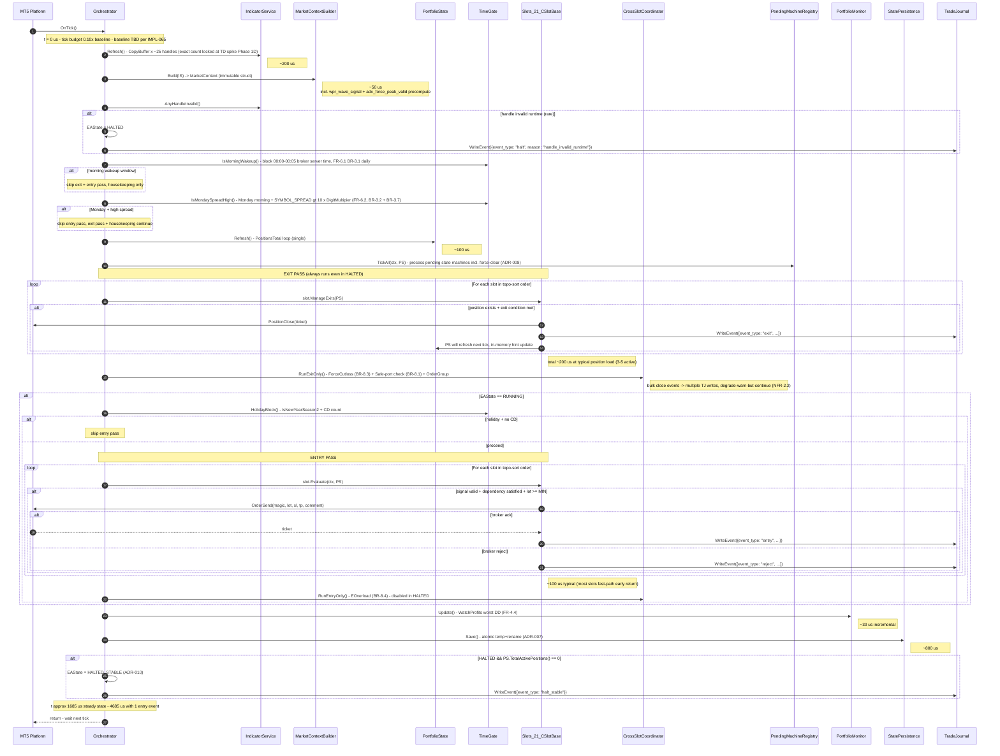
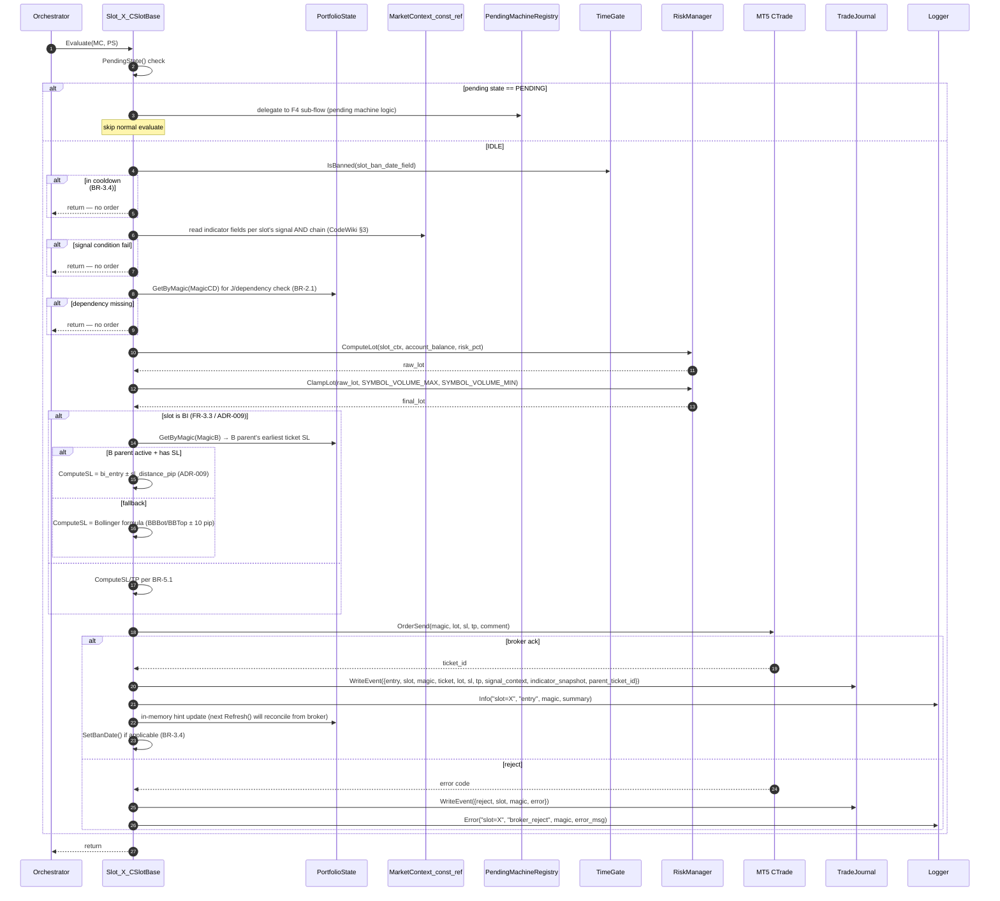
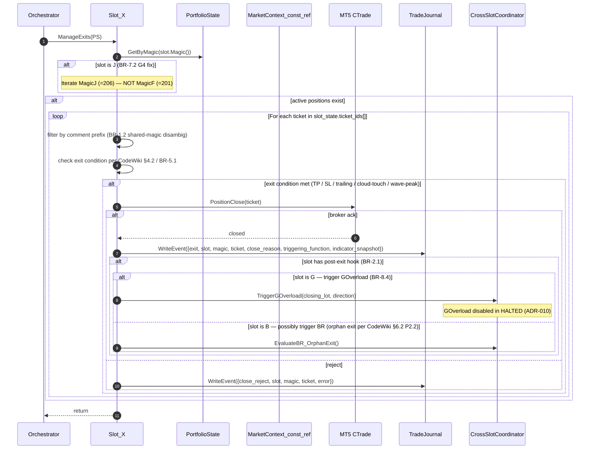
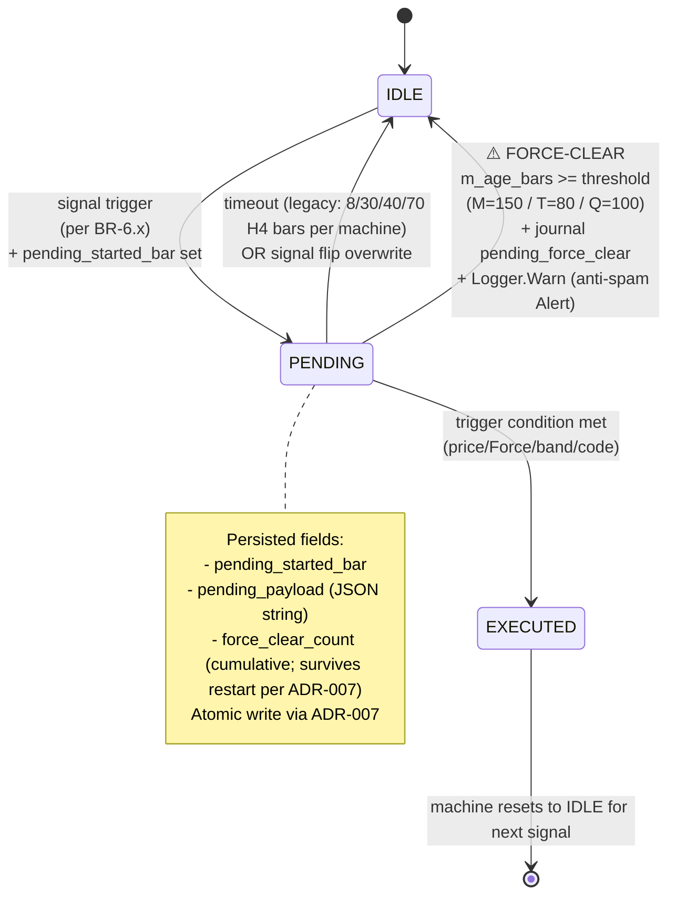
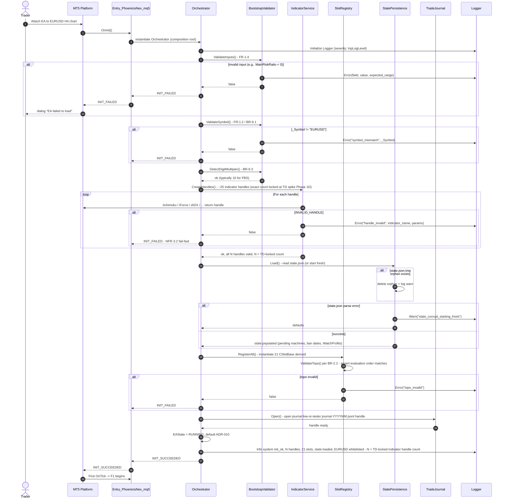
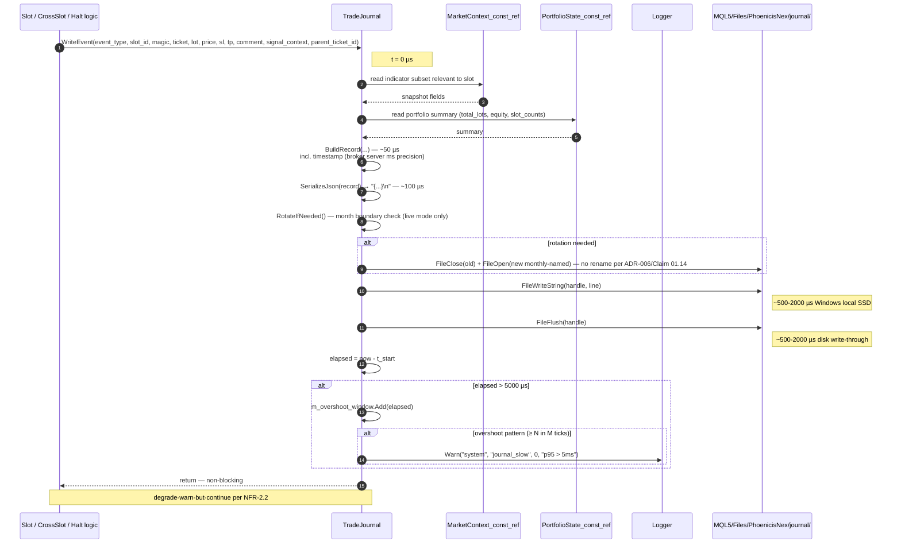

# 04 — Data Flow & Major Sequences

> **Phase:** Phase 1B (System Design) — Doc 3/6
> **Author:** Architect agent (`/sd` workflow)
> **Last updated:** 2026-05-17 (BT-002 cascade — BR-3.6 CircuitBreaker ping-pong detector removed legacy-parity; § 1.1 mermaid CB participant + ping-pong alt-branch removed, § 9.1 cross-slot enable matrix row removed. Initial publish: 2026-05-02)
> **Reads:** `02-high-level-architecture.md`, `03-deep-dive.md`, `docs/ba/05-user-flows.md` (BA F1-F7 baseline flows), `docs/adr/*`
> **Audience:** Tech Lead (Phase 1D TD), Implementation Engineer (Phase 3I), QA (Phase 3T)

## TL;DR

เอกสารนี้ map **major flows** ของ PhoenicisNex → SD-level sequence diagrams + **timing budgets ต่อ step** + consistency boundaries + idempotency rules. BA `05-user-flows.md` ระบุ end-to-end behavior (F1 OnTick / F2 Slot Entry / F3 Slot Exit / F4 Pending / F5 Boot / F6 Cross-slot Safety / F7 Trade Journal); SD doc นี้ **เพิ่ม timing/consistency dimensions** ที่ Tech Lead ต้องอ่านก่อน implement. **Key invariants** — MarketContext immutable per tick (no slot can corrupt it), PortfolioState refreshed exactly 1× per tick before exit pass (BR-2.2 ordering), trade journal write is sync best-effort with degrade-warn-but-continue (NFR-2.2 overshoot path). All consistency boundaries listed ใน § 6.

---

## 1. F1 — OnTick Pipeline (Detailed Timing)

ระบุ pipeline หลัก พร้อม per-step budget ตาม `03 § 2.3` table. State HALTED skips entry pass แต่ exit + housekeeping ยังทำ (ADR-010)

### 1.1 Sequence

> **Note (post-BT-002 2026-05-17):** Former `CircuitBreaker::CheckPingPong()` call ที่เคยอยู่ระหว่าง `MarketContextBuilder.Build()` และ `AnyHandleInvalid()` check ถูกลบเป็น legacy-parity. ดู `ADR-010 § Revision history` + `02 § 4.2` Component Catalog removal footer + `backtrack-log.md § BT-002` สำหรับ cap-3 iter chain rationale.

### 1.2 Key insights

- **Pipeline order locks BR-2.2:** exit pass before entry pass; slot evaluate order = SlotRegistry literal order
- **HALTED short-circuit:** entry pass + EOverload skip in HALTED; exit pass + ForceCutloss + Safe-port + ExtraCheckFunction2 + WatchProfits ยังทำ — open positions managed to closure
- **Idempotency surface:** see § 5; key concern = re-process tick data after MT5 restart mid-OnTick (rare; handled by state.json reload + broker as source of truth)
- **Estimated rewrite total ~1.7 ms steady state; ~4.7 ms with 1 event** — overhead delta vs baseline ~1,005 µs (ดู `03 § 2.3` Table B); NFR-2.1 acceptance ผูกกับ measured baseline จาก IMPL-065 — ถ้า baseline ≤ 7 ms → ต้อง mitigate (dirty-bit throttle + log tuning); ถ้า ≥ 10 ms → borderline pass

---

## 2. F2 — Slot Entry Lifecycle

Slot.Evaluate() ลำดับ ตามที่ BA F2.3 ระบุ + SD pin BI special-case (ADR-009) timing

### 2.1 Sequence

### 2.2 Idempotency considerations

- `OrderSend` is broker-side; if MT5 crashes between send + ack → broker may have placed order ที่ EA ไม่รู้. Recovery: next `PortfolioState.Refresh()` reads `PositionsTotal()` from broker → sees the order; journal will log it as "discovered" event (event_type added to schema for this case)
- BI parent ticket lookup uses `earliest_open` selection — deterministic across restarts (broker-side ticket order persistent)

### 2.3 Timing budget (per slot, average)
- Pending check + signal evaluate fast-path (most common): ~5-10 µs
- Full path with order send: ~500-1500 µs (broker latency dominates)
- 21 slots × 10 µs (no-op) = 210 µs total entry pass — within budget

---

## 3. F3 — Slot Exit Lifecycle

### 3.1 Sequence

### 3.2 Trailing semantics (BR-5.2)

Slot ∈ {G, GO, M, S} ใช้ "max profit reached + cloud touch" pattern:
- Track `max_profit_pip` per ticket in `SlotState.ticket_max_profit[]` (extension to SlotState struct)
- Each ManageExits pass: update max_profit; if `current_profit_pip ≥ trailing_threshold` AND price touches cloud edge → close
- Persist `ticket_max_profit[]` ใน state.json (FR-5.1) — survives restart

### 3.3 Idempotency considerations

- `PositionClose` ack delivers; if MT5 crashes between close + ack → next refresh reads `PositionsTotal()` → ticket gone → `ticket_id` removed from SlotState; journal `exit_inferred` event added Phase 1 if mismatch detected
- Bulk close from Safe-port (CrossSlotCoordinator) — see F6

---

## 4. F4 — Pending State Machine (with Force-Clear)

ADR-008 lock force-clear thresholds; flow ขยาย BA F4 เพื่อ include force-clear path

### 4.1 State diagram

### 4.2 Per-machine summary

| Machine | Legacy timeout (bars) | Legacy invalidation | Force-clear (ADR-008) | Storage path |
|---------|----------------------|---------------------|------------------------|--------------|
| C-Pending (BR-6.1) | 8 H4 | none | (no force-clear; legacy timeout enough) | state.json § c_pending |
| C-Pending-ADX (BR-6.2) | 30 H4 | none | (no force-clear) | state.json § c_pending_adx |
| R-Pending (BR-6.3) | 40 H4 | price returns to cloud | (no force-clear) | state.json § r_pending |
| P-Pending (BR-6.4) | 70 H4 | Bollinger violation | (no force-clear; legacy bounded) | state.json § p_pending |
| **M-Pending (BR-6.5)** | **none** legacy | M signal flip | **150 H4 bars** | state.json § m_pending |
| **T-Pending (BR-6.6)** | **none** legacy | confirmation tick | **80 H4 bars** | state.json § t_pending |
| **Q-Pending (BR-6.7)** | **none** legacy | per QPendingCode | **100 H4 bars** | state.json § q_pending |
| Force-Pending (BR-6.8) | 9 H4 | none | (legacy only) | state.json § force_pending |

### 4.3 Consistency boundary

- Pending state mutation = atomic via state.json write (end of OnTick)
- Read = once per tick during `PendingMachineRegistry.TickAll()` invoked from F1 step 6
- ⚠️ Window: between tick boundaries, pending state in RAM is canonical; state.json reflects last-tick value. Crash mid-tick = revert to last-tick state (acceptable per FR-5.2)

### 4.4 P-Pending sub-mode detail (BR-6.4 + CodeWiki §2.5/§3.14)

P-Pending = ที่สุดของ pending complexity ในระบบ — ใช้ multi-stage state machine ที่แตกตาม **decision branch ของ entry calculation** (ไม่ใช่ post-entry timing เหมือน Q-Pending sub-codes). Schema enum `sub_mode: [PX, PH, E, N, null]` map กับ CodeWiki §3.14 ดังนี้:

| `sub_mode` | Trigger / meaning | Schema fields populated | TP ratio | Notes |
|------------|-------------------|--------------------------|----------|-------|
| **`PX`** | Force trigger fast-path: `Force[1]>0.1` AND (recent bar trigger ≤ 8 bars OR `_diffSL ≥ 200` OR `_diffSL ≥ 250` + band gating) | `diff_sl` (entry SL distance pip) | 7 | "X" = Force-driven express path; usually closes faster |
| **`PH`** | Hull/Bollinger default path: `_diffSL < 200` (no Force express) | `diff_sl`, `band_ratio` (Bollinger band ratio) | 15 | "H" = Hull MA + Bollinger structure; standard duration |
| **`E`** | Pyramid extension entry (P_Extra; CodeWiki §3.14 line 640 — comment `"PI,..."`) | `diff_sl` (extension SL) | per-extension formula | "E" = Extra/Extension; second-order Fibonacci pyramid lot calc |
| **`N`** | None / no sub-mode locked yet (transient; pending entered but mode-decision branch ยังไม่ resolve) | none — both null | — | "N" = None; should resolve to PX/PH/E ภายใน ≤ 1 bar; ถ้า stuck = state machine bug → A7 risk |
| `null` | IDLE state (no pending active) | — | — | only valid when `state == IDLE` |

**Field meaning:**
- **`diff_sl`** (number) — SL distance in pip ที่ snapshot ตอน enter pending; ใช้ branch decision (`< 200` → PH; `≥ 200` → PX) + ใช้ตอน execute pending → set actual SL
- **`band_ratio`** (number) — `CalculateBollingerRatio(bid, BBTop, BBBot)` ผลลัพธ์ใน [0..100]; ใช้ band-gating rule (PX requires > 75 ตอน `_diffSL ≥ 250`); PH ใช้ตอน calc TP threshold

**Exit-pending invalidation (BR-6.4):**
- Bollinger violation (price zone breach) → IDLE
- 70 H4 bar legacy timeout (BR-6.4) → IDLE — **no force-clear ใน ADR-008** (legacy timeout sufficient); ถ้า future บ่งชี้ stuck pattern → revisit
- Sub-mode transition: ใน 1 pending lifecycle, sub_mode อาจ flip (เช่น `N` → `PH`) ตาม branch decision; แต่หลัง lock sub-mode แล้ว ห้าม flip (lock-once semantic)

**Acknowledged risk:** A7 (`03 § 7`) — `E`/`N` semantic naming + transition rules ยังต้อง confirm กับ CodeWiki §2.5 ตอน TD Phase 1D (IMPL-034 = XL slot impl). ถ้า discover ว่า schema enum ไม่ครบ → extend `state-persistence-schema.yaml § PendingMachineState_PVariant`

---

## 5. F5 — Boot/OnInit Lifecycle

ขยาย BA F5 เพื่อ include EAState init + IndicatorService validation timing

### 5.1 Sequence

### 5.2 Tester mode branch

If `MQLInfoInteger(MQL_TESTER) == true`:
- Skip MT5 GlobalVariable network calls (CodeWiki §5.4 — preserve baseline)
- Tester journal namespace: `journal/tester/run-<ISO>.jsonl` (ADR-006)
- Skip Alert (popup ใน tester ไม่มีผล); Logger still emits via Print

### 5.3 Recovery scenarios

| Scenario | OnInit behavior |
|----------|------------------|
| Fresh boot (no state.json) | StatePersistence.Load() returns defaults; first tick begins normal |
| Reboot after clean shutdown | Load state.json; pending machines + ban dates + WatchProfits restored fully |
| Crash recovery (state.json.tmp orphan) | Delete orphan; load state.json (= pre-crash state per ADR-007 atomic guarantee) |
| Crash recovery (state.json corrupted — defense-in-depth fail) | Log error + warn `state_corrupt_recovered_via_gv`; start fresh ของ pending machines + ban dates; **last-resort: read MT5 GlobalVariable subset** (`worst_drawdown_*`, `equity_high_water_mark`) เพื่อ recover WatchProfits (per `02 § 6.1.1` Sync rule); user inspects journal for context |

---

## 6. Consistency Boundaries

ตารางรวบ invariants ของ data consistency ที่ Tech Lead ต้อง enforce:

| Invariant | Scope | Enforcement |
|-----------|-------|-------------|
| `MarketContext` immutable per tick | All slots same tick | `const MarketContext &ctx` ใน slot Evaluate/ManageExits signature; struct value semantic (copy on pass) |
| `PortfolioState` refreshed exactly 1× per tick before exit pass | Pipeline ordering | F1 step `H` (PortfolioState.Refresh) calls `PositionsTotal()` once; subsequent slot reads use cached SlotState |
| Slot evaluation order = literal SlotRegistry order = topo-sort | Per-tick across slots | `SlotRegistry::ValidateTopo()` boot-time assertion; reviewer enforces literal order match BR-2.2 |
| Trade journal record sequence = call order ใน same tick | Single-tick burst | Single-thread MQL5 + sync write — guaranteed by design |
| `state.json` aligned with broker truth | EA reload | Reconcile at OnInit Load: compare loaded `SlotState.ticket_ids` vs `PositionsTotal` actual; remove tickets ที่ broker ไม่มี (closed during downtime) — log warn for each |
| Comment prefix discipline (BR-1.2) | Shared-magic slots (G/G2, B/BI, C/D, L/LX) | `helpers/CommentParser` central module; per-slot `BuildComment()` enforces prefix |
| Pending state transition atomic to file | Cross-tick crash window | End-of-tick `StatePersistence.Save()` is atomic (ADR-007); intra-tick changes in RAM only |
| `state.json` canonical, `MT5 GlobalVariable` mirror | Dual-source-of-truth (WatchProfits subset) | Sync direction = state.json → GV (one-way push หลัง Save); state.json wins on Load (per `02 § 6.1.1` Sync rule); recovery from corrupt state.json + intact GV → defaults + GV last-resort hint for `worst_drawdown_*` fields only |

---

## 7. Idempotency Rules

| Operation | Idempotency strategy |
|-----------|----------------------|
| `OrderSend` retry after timeout | NOT idempotent at broker — EA does not retry on send fail; logs reject + moves on. If MT5 crash between send+ack → broker may have placed order; recovery reads `PositionsTotal` next tick |
| `PositionClose` retry after timeout | NOT idempotent at broker — same as above; recovery via PositionsTotal scan |
| State persistence write (per-tick) | Idempotent — atomic temp+rename overwrites prior; no log of state mutations needed (state.json IS the canonical truth) |
| Trade journal append | NOT idempotent (append-only); strictly forward-only; if same tick re-runs (impossible in single-thread MQL5) → duplicate event |
| Pending machine transition | Idempotent within tick (re-evaluation gives same result); cross-tick = guarded by `pending_started_bar` field (force-clear deterministic) |
| EAState transition | Latest-write-wins; HALT triggers OR-merge (any source can halt); HALTED_STABLE detection only when count == 0 |
| Indicator handle creation in OnInit | Idempotent — if handle exists from prior `OnInit` call (e.g., parameter change), reuse; release on OnDeinit |

---

## 8. Trade Journal Write Sequence (FR-4.1 + ADR-006)

**Burst handling (Safe-port closes 10 positions in 1 tick):**
- 10 sequential `WriteEvent` calls; each ~1-3 ms = 10-30 ms total
- Exceeds 5 ms NFR-2.2 budget per tick → degrade-warn-but-continue triggered
- Logger emits warn; tick continues; no record dropped, no order operation blocked (per ADR-006 RPO contract: 0 events lost on slow disk; only sustained-failure scenario drops events)

**Sustained failure escalation (per ADR-006 § Failure handling RPO contract):**
- Per-event write fail (disk full / permission / handle invalid) → drop event + increment `journal_metrics.write_failures` ใน state.json
- ถ้า `consecutive_write_failures ≥ 10` → `EAState.Halt("journal_write_fail_sustained")` (ADR-010) → entry pass disabled, exit pass continue (managed-to-closure preserves G4)
- Monitoring signal ใน `05 § 7.2`: `journal_metrics.write_failures > 0/day sustained` → user investigate disk health / AV exclusion

---

## 9. Cross-slot Safety Flow (F6)

ขยาย BA F6 เพื่อ pin HALTED behavior. ADR-010 § "Cross-slot logic in halted state" คือ authoritative; ตารางนี้ mirror ADR ตรงๆ

### 9.1 RUNNING / HALTED enable matrix

| Helper (BR ref) | RUNNING | HALTED | Reason |
|-----------------|---------|--------|--------|
| ~~CircuitBreaker check~~ | n/a | n/a | **Removed per BT-002 2026-05-17** — BR-3.6 ping-pong detector deleted (legacy-parity; cap-3 iter chain ADR-013 → ADR-014 falsified 3 false-positive classes; `PhoenicisN2.10_stable` achieves $24.27 M / 5-yr baseline without a detector). Halt trigger now reduces to `IndicatorService::AnyHandleInvalid()` runtime guard (always evaluated, both RUNNING + HALTED) + Phase 2 candidates per ADR-010 Revisit-when. |
| ForceCutloss CD (BR-8.3) | ✅ | ✅ | exit-side action; ตรง halted semantic |
| ExtraCheckFunction2 (BR-8.5) | ✅ | ✅ | demote signal — no order |
| Safe-port (BR-8.1) bulk close 10 slots | ✅ | ✅ | bulk close = exit-side action; per-slot ManageExits ไม่ replace portfolio-wide cleanup; align AC-7.7.3 + G4 |
| OrderGroup#2 (BR-8.2) bulk close | ✅ | ✅ | close action only |
| COverload (BR-8.4) — cuts CD | ✅ | ✅ | exit-side cut |
| EOverload (BR-8.4) — adds CD order | ✅ | ❌ | open new order = ขัด halted semantic |
| GOverload (BR-8.4) — opens GO inverse | ✅ post-exit hook | ❌ | open new order = ขัด halted semantic |
| Pending machines transition PENDING → EXECUTED | ✅ | ❌ frozen | EXECUTED = open new order |

---

## 10. Flow Coverage vs BA F1-F7

| BA flow | SD coverage | Additional dimension added in SD |
|---------|-------------|-----------------------------------|
| F1 OnTick pipeline | § 1 | per-step timing budget (200 µs / 50 µs / 800 µs / etc.); HALTED state machine integration |
| F2 Slot entry | § 2 | BI ADR-009 SL pip arithmetic timing; idempotency for OrderSend retry semantics |
| F3 Slot exit | § 3 | trailing state persistence (ticket_max_profit[]); J slot magic-fix call site |
| F4 Pending state | § 4 | force-clear path (ADR-008); per-machine threshold table; force_clear_count metric |
| F5 OnInit boot | § 5 | tester mode branch; reconcile state.json vs broker truth on Load |
| F6 Cross-slot safety | § 9 | per-step RUNNING/HALTED enable matrix; ADR-010 alignment |
| F7 Trade journal | § 8 | timing breakdown (50/100/500-2000/500-2000 µs); rotation handling; degrade-warn-but-continue trigger |

> **End of 04 — Data Flow** — 5 detailed flows + consistency boundaries (7) + idempotency rules (7) + cross-flow timing budgets aligned with NFR-2.1/2.2
