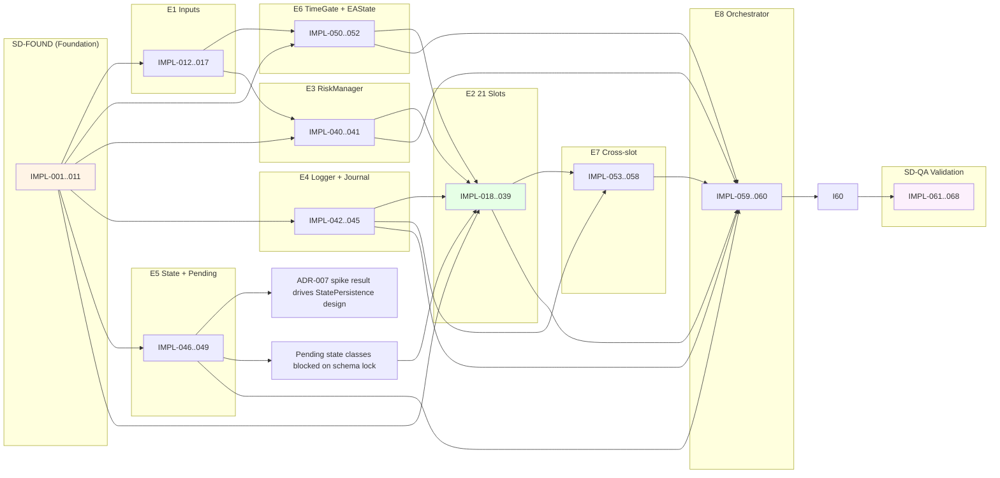

# 08 — Product Breakdown (Work Inventory)

> **Phase:** Phase 1B (System Design) — Doc 6/6
> **Author:** Architect agent (`/sd` workflow)
> **Last updated:** 2026-05-12 (BT-001 cascade — IMPL-062/063 task description § 1.10 + Phase Hint P4 rationale § 3 + per-task metadata § 4 re-framed to rewrite-G4-ON single-pass per BT-001 re-baseline 2026-05-12)
> **Reads:** `02-high-level-architecture.md`, `docs/adr/*`, all BA docs
> **Audience:** Impl Planner (next phase consumer), Tech Lead (Phase 1D TD), QA (Phase 3T)

## TL;DR

เอกสารนี้แตก SD ออกเป็น **work inventory** ที่ Impl Planner หยิบไป assign phase + sprint. **8 epics** (mapped 1:1 ของ BA epics E1-E8 + 1 SD-only epic for cross-cutting hardening), **~60 implementation tasks** (IMPL-001 ถึง IMPL-060), per-task metadata = risk + must_precede + unlocks + arch_rationale + ADR ref. **Phase Hints (Suggested) — FULL variant** — included เพราะ task count > 15 + มี risk=high (TD spikes, ADR-007 atomic verify, BI bug fix) + มี architectural ordering (foundation services ก่อน slots; slots ก่อน cross-slot coordinator; QA regression ปิดท้าย). **Evolution Sequence (E1+E2 ใน `07 § 6`) = hard ordering** ที่ Phase Hints ต้อง honor — annotated ใน P1+P2+P3 sections ด้วย `reflects Evolution Ex`. **No schedule leakage** — ไม่มี sprint/date/team capacity ในเอกสารนี้; Impl Planner own final phasing per `01-project-brief.md § Phase Contract`.

---

## 1. Work Inventory (Epics → Stories → Tasks)

ทุก task มี **size** ตาม T-shirt scale (XS = ≤ 0.5 day, S = 0.5-1d, M = 1-3d, L = 3-7d, XL = > 7d) — Impl Planner uses size สำหรับ effort estimation, ไม่ใช่ schedule

### 1.1 Epic SD-FOUND — Foundation services (cross-cutting capabilities) — **NEW vs BA**

| Task | Size | Unlocks | Arch rationale | ADR |
|------|------|---------|---------------|-----|
| IMPL-001 — Set up `MQL5/Experts/PhoenicisNex/` folder structure per ADR-012 layered tree | XS | all subsequent IMPL | foundation; reviewer enforce `#include` direction | ADR-012 |
| IMPL-002 — Define `domain/EnumTypes.mqh` (EEAState, EPendingState, ESlotId, ESeverity) | XS | services + slots | shared types across layers | — |
| IMPL-003 — Define `domain/MarketContext.mqh` struct + `docs/api-specs/marketcontext-snapshot-schema.yaml` lock | S | IMPL-005 + slot evaluate | immutable snapshot interface | ADR-004 |
| IMPL-004 — Define `domain/SlotState.mqh` struct + ticket_max_profit field for trailing | S | IMPL-007 + slot ManageExits | per-slot state lookup interface | ADR-005 |
| IMPL-005 — Implement `services/IndicatorService` (handle creation, validation, refresh, cache) | M | MarketContextBuilder, BootstrapValidator | central handle owner; FR-7.6 fail-fast | ADR-003 |
| IMPL-006 — Implement `services/MarketContextBuilder::Build()` (populate struct + derived signals) | M | slot Evaluate | per-tick immutable build | ADR-004 |
| IMPL-007 — Implement `services/PortfolioState` (CHashMap + Refresh) | M | slots, RiskManager | O(1) per-slot state lookup | ADR-005 |
| IMPL-008 — Implement `helpers/CommentParser` (shared-magic disambiguation) | S | shared-magic slots (G/G2, B/BI, C/D, L/LX) | BR-1.2 enforcement central | — |
| IMPL-009 — Implement `helpers/PipMath` (DigitMultipier-aware arithmetic) | XS | RiskManager, BI SL (ADR-009) | BR-9.3 invariant | — |
| IMPL-010 — Implement `helpers/AtomicFile` (FileMove-based atomic write wrapper) | S | StatePersistence | NFR-3.1 enabler | ADR-007 |
| IMPL-011 — Implement `helpers/JsonWriter` (pure-MQL5 JSON-Lines + JSON object serializer) | M | TradeJournal, StatePersistence | no DLL; ADR-006 + ADR-007 | ADR-006 |

### 1.2 Epic E1 — Configuration & Tuning (BA E1)

| Task | Size | Unlocks | Arch rationale | ADR |
|------|------|---------|---------------|-----|
| IMPL-012 — Author `inputs/Inputs_General.mqh` (cross-slot inputs: FIDValue, MainRiskRatio, LimitMaxLotSizeRatio, ...) | M | RiskManager, slots | FR-1.1 input dialog | ADR-012 |
| IMPL-013 — Author `inputs/Inputs_Slot_<X>.mqh` × 21 (per-slot tunable parameters w/ `group="Slot X"` annotation) | L | per-slot logic | FR-1.1, NFR-4.3, NFR-6.3 | ADR-012 |
| IMPL-014 — Author `inputs/Inputs_TimeGates.mqh` + `Inputs_Pending.mqh` + `Inputs_Logging.mqh` | S | TimeGate, PendingMachineRegistry, Logger | NFR-6.3 grouped inputs | ADR-012 |
| IMPL-015 — Implement `core/BootstrapValidator::ValidateInputs()` (range checks per FR-1.4) | S | OnInit pipeline | FR-1.4 fail-fast | — |
| IMPL-016 — Implement `core/BootstrapValidator::ValidateSymbol()` (FR-1.2 EURUSD whitelist + input list expansion) | XS | OnInit pipeline | FR-1.2, BR-9.1 | — |
| IMPL-017 — Verify Strategy Tester optimization compatibility (input enumerable; FR-1.3 spike) | S | QA regression | NFR-6.2; UI test | — |

### 1.3 Epic E2 — Slot Strategy Engine (BA E2)

| Task | Size | Unlocks | Arch rationale | ADR |
|------|------|---------|---------------|-----|
| IMPL-018 — Implement `domain/CSlotBase.mqh` abstract interface + `core/SlotRegistry::ValidateTopo()` per BR-2.2 + **2-layer override enforcement** (boot-time sentinel check + runtime base-method `ExpertRemove`; ดู ADR-002 § "Pure-virtual override enforcement") | M | all slots | FR-2.4, FR-2.5 contract; pure-virtual safety net | ADR-002 |
| IMPL-019 — Implement `slots/Slot_C.mqh` (translate from CodeWiki §3 + §4 — line-by-line) | M | dependent slots (D, F, J chain), J, S | preserve baseline; FR-2.1 | ADR-002 |
| IMPL-020 — Implement `slots/Slot_D.mqh` (4-line wrapper of force-pending workflow of C; CD shared magic) | XS | F, J, depends on C | preserve baseline; BR-2.1 D wraps C | ADR-002 |
| IMPL-021 — Implement `slots/Slot_F.mqh` (chained from CD; per-slot file via BR-2.2 sub-call) | S | depends on C/D | preserve baseline; BR-2.1 F chain | ADR-002 |
| IMPL-022 — Implement `slots/Slot_J.mqh` (follower trade after CD; ⚠️ ManageExits iterates MagicJ per BR-7.2 G4 fix) | M | post-exit hooks | FR-3.4 G4 fix; preserve baseline | ADR-002 |
| IMPL-023 — Implement `slots/Slot_H.mqh` | M | — | preserve baseline; FR-2.1 | ADR-002 |
| IMPL-024 — Implement `slots/Slot_K.mqh` | M | S (post-close), depends on K state | preserve baseline | ADR-002 |
| IMPL-025 — Implement `slots/Slot_G.mqh` (entry; ExtraTakeProfit_G triggers GOverload BR-8.4) | M | GO post-exit hook, G2, I | preserve baseline; G→GO dependency | ADR-002 |
| IMPL-026 — Implement `slots/Slot_G2.mqh` (lighter G in wave; shared MagicG with G) | M | comment-disambig from G | BR-1.2; preserve baseline | ADR-002 |
| IMPL-027 — Implement `slots/Slot_GO.mqh` (post-exit hook from G; not in main topo) | S | — | BR-2.2 sub-call | ADR-002 |
| IMPL-028 — Implement `slots/Slot_I.mqh` (G-parasite Fibonacci) | S | depends on G | preserve baseline; G-dep | ADR-002 |
| IMPL-029 — Implement `slots/Slot_M.mqh` + M-Pending state machine integration | M | post-close S, depends on M state | M-Pending force-clear (ADR-008) | ADR-002, ADR-008 |
| IMPL-030 — Implement `slots/Slot_L.mqh` | M | LX pyramid, S post-close | preserve baseline | ADR-002 |
| IMPL-031 — Implement `slots/Slot_LX.mqh` (pyramid on profitable L; shared MagicL) | S | depends on L | comment-disambig from L | ADR-002 |
| IMPL-032 — Implement `slots/Slot_Q.mqh` + Q-Pending state machine integration | M | — | Q-Pending force-clear (ADR-008) | ADR-002, ADR-008 |
| IMPL-033 — Implement `slots/Slot_R.mqh` + R-Pending state machine integration | M | — | preserve baseline; R-Pending legacy timeout | ADR-002 |
| IMPL-034 — Implement `slots/Slot_P.mqh` + P-Pending state machine — sub-modes PX/PH/E/N per `04 § 4.4` (E = P_Extra extension entry, comment `"PI,..."`) | L | — | preserve baseline; P-Pending legacy timeout (no force-clear); ⚠️ A7 risk — verify E/N semantic with CodeWiki §2.5 | ADR-002 |
| IMPL-035 — Implement `slots/Slot_T.mqh` + T-Pending state machine integration | M | — | T-Pending force-clear (ADR-008) | ADR-002, ADR-008 |
| IMPL-036 — Implement `slots/Slot_S.mqh` (post-close after L/K) | M | depends on L, K | preserve baseline; S → L/K | ADR-002 |
| IMPL-037 — Implement `slots/Slot_B.mqh` | L | BR (orphan exit), BI (pyramid) | preserve baseline; B parent of BR/BI | ADR-002 |
| IMPL-038 — Implement `slots/Slot_BR.mqh` (orphan exit-only from `ExtraTakeProfit_B`; not in main topo) | S | — | BR-2.2 sub-call | ADR-002 |
| IMPL-039 — **Implement `slots/Slot_BI.mqh` (pyramid child of B; ⚠️ G4 SL fix per ADR-009 pip arithmetic)** | L | — | **G4 critical**; ADR-009 deterministic SL inheritance | ADR-002, ADR-009 |

### 1.4 Epic E3 — Order & Risk Management + Bug Fixes (BA E3)

| Task | Size | Unlocks | Arch rationale | ADR |
|------|------|---------|---------------|-----|
| IMPL-040 — Implement `services/RiskManager::ComputeLot()` per-slot multipliers BR-4.1 (preserve §4.1 1:1) | L | slots Evaluate (lot calc) | preserve baseline | — |
| IMPL-041 — Implement `services/RiskManager::ClampLot()` (BR-4.2 cap + BR-4.3 floor) | XS | RiskManager | FR-3.6 cap + min volume | — |

### 1.5 Epic E4 — Trade Journal & Observability (BA E4)

| Task | Size | Unlocks | Arch rationale | ADR |
|------|------|---------|---------------|-----|
| IMPL-042 — Implement `services/Logger` (tagged severity + Alert throttle) | M | all components emit logs | FR-4.2, NFR-5.1, NFR-3.4 | ADR-011 |
| IMPL-043 — Implement `services/TradeJournal::WriteEvent()` (JSON-Lines append + monthly rotation + tester namespace) | L | slots, cross-slot, halt | FR-4.1, FR-4.3, NFR-2.2 | ADR-006 |
| IMPL-044 — Lock `docs/api-specs/trade-journal-schema.yaml` (per-record schema) | S | TradeJournal, future readers | schema discipline | ADR-006 |
| IMPL-045 — Implement `services/PortfolioMonitor::Update()` (WatchProfits replacement; FR-8.2 incremental DD) | S | end-of-tick housekeeping | FR-4.4, NFR-5.2 monitor-only | — |

### 1.6 Epic E5 — State Persistence (BA E5)

| Task | Size | Unlocks | Arch rationale | ADR |
|------|------|---------|---------------|-----|
| IMPL-046 — **TD spike: verify MT5 sandbox `FileMove` atomic guarantee (assumption A2 of ADR-007)** | M | StatePersistence design lock | risk=high; if fail → Option B double-buffered swap | ADR-007 |
| IMPL-047 — Implement `services/StatePersistence::Save()` + `::Load()` per ADR-007 | L | end-of-tick + OnInit | NFR-3.1 atomic; NFR-3.3 100% restore | ADR-007 |
| IMPL-048 — Lock `docs/api-specs/state-persistence-schema.yaml` (state.json schema v1) | S | StatePersistence, future migrations | schema discipline | ADR-007 |
| IMPL-049 — Implement `services/PendingMachineRegistry::TickAll()` + per-machine class (C/C-ADX/R/P/M/T/Q/Force-Pending) + ADR-008 force-clear | XL | slots with pending state | BR-6.x preserve + OQ-A1/A2/A3 resolve | ADR-008 |

### 1.7 Epic E6 — Time Filters & Safety Gates (BA E6)

| Task | Size | Unlocks | Arch rationale | ADR |
|------|------|---------|---------------|-----|
| IMPL-050 — Implement `services/TimeGate` (IsMorningWakeup + IsMondaySpreadHigh + IsNewYearSeason2 + IsBanned per BR-3.x) | M | OnTick pipeline | preserve baseline; BR-3.1 ถึง BR-3.5 | — |
| ~~IMPL-051~~ — **CANCELLED-BT-002 2026-05-17** (~~Implement `services/CircuitBreaker::CheckPingPong()`~~) — legacy-parity: detector removed; cap-3 iter chain ADR-013 → ADR-014 falsified 3 false-positive classes; `PhoenicisN2.10_stable` achieves $24.27 M / 5-yr baseline without one. Chained `/backtrack ba` will demote/remove BR-3.6 + FR-6.6 at BA layer. | — | n/a | n/a |
| IMPL-052 — Implement `core/EAState` machine (RUNNING / HALTED / HALTED_STABLE) per ADR-010 — Phase 1 trigger sources reduce to `IndicatorService::AnyHandleInvalid()` runtime check only (BT-002 amends ADR-010 § Trigger sources) | S | OnTick pipeline branching | FR-7.7, NFR-5.1 | ADR-010 (amended BT-002) |

### 1.8 Epic E7 — Cross-slot Coordination & Cleanup (BA E7)

| Task | Size | Unlocks | Arch rationale | ADR |
|------|------|---------|---------------|-----|
| IMPL-053 — Implement `services/CrossSlotCoordinator::RunSafePort()` (BR-8.1 OrderGroupStartWorkflow) | M | exit-side cleanup | FR-7.1 | — |
| IMPL-054 — Implement `services/CrossSlotCoordinator::RunOrderGroup2()` (BR-8.2 Ichimoku double-bounce) | M | exit-side cleanup | FR-7.2 | — |
| IMPL-055 — Implement `services/CrossSlotCoordinator::RunForceCutloss()` (BR-8.3 CD safety) | S | CD slot exit | FR-7.3 | — |
| IMPL-056 — Implement `services/CrossSlotCoordinator::ExtraCheckFunction2()` (BR-8.5) | XS | CD demote | FR-7.4 | — |
| IMPL-057 — Implement `services/CrossSlotCoordinator` overload helpers (EOverload, COverload, GOverload per BR-8.4) | M | C exit, G post-exit | FR-7.5; HALTED disable for entry-side helpers | ADR-010 |
| IMPL-058 — Wire `services/CrossSlotCoordinator` HALTED-aware enable matrix (per `04 § 9` table) | S | EAState integration | ADR-010 alignment | ADR-010 |

### 1.9 Epic E8 — Performance & Caching + Entry Wiring (BA E8 + SD wiring)

| Task | Size | Unlocks | Arch rationale | ADR |
|------|------|---------|---------------|-----|
| IMPL-059 — Implement `core/Orchestrator` (composition root + OnTick pipeline F1 sequence) | L | top-level integration | wires all services + slots; FR-2.3 exit-before-entry | ADR-010, ADR-012 |
| IMPL-060 — Implement entry point `PhoenicisNex.mq5` (OnInit → Orchestrator.Init; OnTick → .OnTick; OnDeinit → .Deinit; OnTester) | S | binary build | thin wrapper per ADR-012 | ADR-012 |

### 1.10 Epic SD-QA — Verification + Validation (extends BA expectations for QA Phase 3T)

| Task | Size | Unlocks | Arch rationale | ADR |
|------|------|---------|---------------|-----|
| IMPL-061 — Build per-slot baseline parser (extract `(slot, count, net_pnl, win_rate)` from `ReportTester-25045474.html`) | M | NFR-1.6 per-slot regression check | NFR-1.6 ✅ OQ-7 + AC-2.1.2 | — |
| IMPL-062 — Run regression: rewrite **default build (G4 fixes ON, single-pass)** vs baseline → Bucket A drift gate (NFR-1.1 ≤ 25%, G4 fix contribution included per BT-001 re-baseline 2026-05-12). ห้ามใช้ `#define DISABLE_G4_FIXES` build for Bucket A primary acceptance (semantic ไม่รองรับ pre-G4 measurement post-BT-001). Post-BT-002 (2026-05-17, BR-3.6 detector removed) the rewrite-G4-ON run no longer halts at the false-positive sim 2021-01-14 CircuitBreaker class — drift signal is now legacy-parity comparison without the pre-BT-002 halt artifact (IMPL-FIX-012 iter-3 Run #5 = empirical confirmation BR-3.6 was the iter-3 blocker; cap-3 chain ADR-013 → ADR-014 superseded by BT-002). | M | acceptance signal | NFR-1.1 ถึง NFR-1.7 primary acceptance + BA `03 § NFR-1 Empirical Citation` | — |
| IMPL-063 — Measure Bucket B **informational delta** `rewrite-G4-ON − rewrite-G4-OFF` (sign + magnitude ของ G4 fix contribution — ADR-009 BI SL + BR-7.2 J magic). Post-BT-002 (2026-05-17, BR-3.6 detector removed) the `DISABLE_G4_FIXES` build runs to natural-end of measurement window — no early-halt artifact constrains the delta sample; full-window G4 contribution measurable if forensic toggle retained at `slots/Slot_J.mqh:180` + `slots/Slot_BI.mqh:212`. **No acceptance gate** — informational only per NFR-1.8 (Should priority, BT-001 re-classification 2026-05-12). | M | G4 fix observability | NFR-1.8 informational delta | ADR-009 |
| IMPL-064 — Atomic write kill-100 stress test (NFR-3.1 verification) | S | reliability sign-off | NFR-3.1 + ADR-007 assumption A2 | ADR-007 |
| IMPL-065 — Tick latency measurement protocol (NFR-2.1: ≥ 5,000 ticks; avg + p95 + p99) | M | perf sign-off | NFR-2.1 | — |
| IMPL-066 — Journal write latency measurement (NFR-2.2: ≥ 200 events; avg + p95) | S | perf sign-off | NFR-2.2 + ADR-006 degrade-warn | ADR-006 |
| IMPL-067 — DST regression run (10 transitions Mar 2021 → Oct 2025; AC-6.5.2/6.5.3) | M | DST sign-off | NFR-7.3 + FR-6.5 | — |
| IMPL-068 — Force-clear validation per A6 (`03 § 7`) — measure `pending_age_bars` distribution per machine + `force_clear_count` ≈ 0 expected; tune `InpForceClearX_Bars` if max bars > 70% threshold | S | ADR-008 validation + threshold tuning loop | ADR-008 + OQ-A1/A2/A3; expanded scope per A6 risk | ADR-008 |

---

## 2. Dependency Map (key edges only)

**Key insights:**
- **SD-FOUND blocks everything** — domain types + helpers + indicator service + portfolio state ต้อง stable ก่อน slot/cross-slot impl
- **IMPL-046 (atomic write spike) is risk gate** — ถ้า fail → ADR-007 Option B; cascades to IMPL-047 + IMPL-049 design
- **Slots (E2) blocked on Logger + RiskManager + PortfolioState + MarketContext + PendingMachineRegistry** — all foundation services must exist
- **Cross-slot (E7) blocked on slots** — needs slots' magic + behaviors
- **Orchestrator (E8) is integration root** — wires everything
- **QA (SD-QA) validates all** — runs after E8 complete

---

## 3. Phase Hints (Suggested — Impl Planner May Override)

> Architectural suggestions based on dependencies, risk, and system integrity. Impl Planner owns final phase assignment; เวลา diverge จะ document เหตุผล. **Evolution Sequence (2 entries E1+E2 ใน `07 § 6`) เป็น hard constraint** — Phase Hints ที่ contradict E1/E2 = invalid (override only via `/backtrack sd`)

### Suggested P1 — Foundation + High-Risk Spike

- **IMPL-046** (atomic write spike) — **reflects Evolution E1** — risk=high; ADR-007 design depends on result; fail-early signal
- **IMPL-001 ถึง IMPL-011** (folder + domain + helpers + IndicatorService + MarketContextBuilder + PortfolioState) — reason: foundation; all subsequent depends
- **IMPL-012, IMPL-014** (general inputs + time gates + logging inputs) — reason: needed by services + slots tunable params
- **IMPL-015, IMPL-016** (BootstrapValidator inputs + symbol whitelist) — reason: OnInit prerequisite (FR-1.2, FR-1.4)
- **IMPL-042** (Logger) — reason: all subsequent IMPL emit logs; foundation observability

### Suggested P2 — Core Services + EAState + Pending Machines

- **IMPL-040, IMPL-041** (RiskManager) — reason: blocks all slot Evaluate
- **IMPL-043, IMPL-044** (TradeJournal + schema lock) — reason: blocks slot entry/exit events; schema discipline
- **IMPL-045** (PortfolioMonitor / WatchProfits) — reason: end-of-tick housekeeping
- **IMPL-047, IMPL-048** (StatePersistence + state.json schema) — **reflects Evolution E1a/E1b** — blocks slots needing pending state; design lock conditional บน E1 spike outcome
- **IMPL-049** (PendingMachineRegistry + 7 machines + ADR-008 force-clear) — **reflects Evolution E1c** — blocks slots with pending state (M, T, Q, R, P, C); persisted state schema ผูกกับ E1a
- **IMPL-050, IMPL-052** (TimeGate + EAState; ~~IMPL-051 CircuitBreaker cancelled per BT-002 2026-05-17~~) — reason: OnTick pipeline guards

### Suggested P3 — 21 Slots (largest body of work)

- **IMPL-018** (CSlotBase abstract + SlotRegistry topo validate + 2-layer override enforcement) — **reflects Evolution E2** — defines contract + sentinel mechanism for IMPL-019..039; compile prerequisite per MQL5 inheritance
- **IMPL-019..021** (Slot_C → Slot_D → Slot_F) — reason: BR-2.1 chain dependency; CD foundation
- **IMPL-022** (Slot_J ⚠️ G4 fix) — reason: depends on CD; G4 priority
- **IMPL-023, IMPL-024** (Slot_H, Slot_K) — reason: K → S dependency
- **IMPL-025..028** (Slot_G + G2 + GO + I) — reason: G → GO post-exit hook; G shared magic G2; I parasite of G
- **IMPL-029..036** (Slot_M, L, LX, Q, R, P, T, S — independent or pyramid sub-deps) — reason: each per-slot file; can parallelize by reviewer
- **IMPL-037..039** (Slot_B → Slot_BR → Slot_BI ⚠️ G4 fix) — reason: B → BR/BI dependency; BI = G4 critical (ADR-009)

### Suggested P4 — Cross-slot + Orchestrator + Verification

- **IMPL-053..057** (CrossSlotCoordinator: SafePort, OrderGroup2, ForceCutloss, ExtraCheckFunction2, Overload helpers) — reason: depends on slots; cross-slot semantic
- **IMPL-058** (HALTED-aware enable matrix wiring) — reason: ADR-010 alignment
- **IMPL-059, IMPL-060** (Orchestrator + entry point .mq5) — reason: integration root
- **IMPL-013** (per-slot inputs files × 21) — reason: can be drafted in parallel with slot impl P3 — Impl Planner decides whether to bundle with slot or do batch
- **IMPL-017** (Strategy Tester optimization compatibility verify) — reason: post-input lock
- **IMPL-061..068** (QA validation suite) — reason: regression after E2-E8 complete; **single-pass measurement บน rewrite default build (G4 fixes ON)** per NFR-1.1 Bucket A (BT-001 re-baseline 2026-05-12); IMPL-063 informational delta `rewrite-G4-ON − rewrite-G4-OFF` (NFR-1.8 no-gate). Post-BT-002 (2026-05-17, BR-3.6 detector removed) the `DISABLE_G4_FIXES` build runs to natural-end of 5-yr window — no early-halt artifact constrains the delta sample.

---

## 4. Per-Task Metadata Table

| Task | Risk | Must-Precede | Unlocks | Arch Rationale | ADR |
|------|------|--------------|---------|----------------|-----|
| IMPL-001 | low | IMPL-002..068 | folder structure | foundation | ADR-012 |
| IMPL-002 | low | IMPL-003,004,005,007,018,049,052 | shared types | shared types domain | — |
| IMPL-003 | low | IMPL-006,019..039 | MarketContext schema | immutable snapshot interface | ADR-004 |
| IMPL-004 | low | IMPL-007,019..039,049 | SlotState schema | per-slot lookup interface | ADR-005 |
| IMPL-005 | medium | IMPL-006,015,019..039 | indicator handles + cache + fail-fast | central handle owner | ADR-003 |
| IMPL-006 | low | IMPL-019..039 | per-tick snapshot build | builder pattern | ADR-004 |
| IMPL-007 | medium | IMPL-019..039,053..057 | O(1) per-slot state lookup | CHashMap perf | ADR-005 |
| IMPL-008 | low | IMPL-019..039 (shared-magic slots) | comment disambig | BR-1.2 central | — |
| IMPL-009 | low | IMPL-039 (BI), IMPL-040 (RiskManager) | DigitMultipier-aware arithmetic | BR-9.3 | — |
| IMPL-010 | medium | IMPL-047 | atomic write helper | depends on IMPL-046 spike result | ADR-007 |
| IMPL-011 | medium | IMPL-043,047 | JSON serialization (no DLL) | NFR-7.2 compliance | ADR-006 |
| IMPL-012..014 | low | IMPL-040,050,019..039,042 | input dialog + ≥80 inputs | NFR-4.3, NFR-6.3 | ADR-012 |
| IMPL-015 | low | OnInit pipeline | input validation | FR-1.4 fail-fast | — |
| IMPL-016 | low | OnInit pipeline | symbol whitelist | FR-1.2, BR-9.1 | — |
| IMPL-017 | low | NFR-6.2 sign-off | optimization compat verify | NFR-6.2 | — |
| IMPL-018 | medium | IMPL-019..039 | CSlotBase contract + topo validate | FR-2.4, FR-2.5; BR-2.2 enforcement | ADR-002 |
| IMPL-019..021 | medium | IMPL-022,036,053..057 | C/D/F chain | BR-2.1 chain; CD foundation | ADR-002 |
| **IMPL-022** | **high** | IMPL-053..057 | J magic-fix verified | **G4 fix** (BR-7.2); preserves J exit logic | ADR-002 |
| IMPL-023..036 | medium | IMPL-053..057 | per-slot trade behavior | preserve baseline 1:1 | ADR-002, ADR-008 (where pending) |
| IMPL-037 | medium | IMPL-038,039 | B parent of BR/BI | preserve baseline | ADR-002 |
| IMPL-038 | low | — | BR orphan exit | BR-2.2 sub-call | ADR-002 |
| **IMPL-039** | **high** | IMPL-061..063 (regression) | **BI G4 SL fix** | **G4 critical**; ADR-009 deterministic SL inheritance | ADR-002, ADR-009 |
| IMPL-040 | medium | IMPL-019..039 | per-slot lot calc | preserve baseline; G3 driver | — |
| IMPL-041 | low | IMPL-040 | cap + floor | FR-3.6 | — |
| IMPL-042 | medium | IMPL-019..068 (all log emitters) | tagged log foundation | FR-4.2; foundation for FR-4.1 journal | ADR-011 |
| IMPL-043 | medium | IMPL-019..039,053..057 | per-event journal write | FR-4.1; G2 primary | ADR-006 |
| IMPL-044 | low | IMPL-043 | schema discipline | versioning + future migrations | ADR-006 |
| IMPL-045 | low | IMPL-059 (orchestrator) | end-of-tick worst DD | FR-4.4, NFR-5.2 monitor-only | — |
| **IMPL-046** | **high** | IMPL-047,049 | atomic write feasibility | NFR-3.1; risk gate of ADR-007 | ADR-007 |
| IMPL-047 | medium | OnInit + end-of-tick pipeline | persisted state restore + save | NFR-3.1, NFR-3.3 | ADR-007 |
| IMPL-048 | low | IMPL-047 | state schema lock | versioning + future migration | ADR-007 |
| IMPL-049 | medium | IMPL-029,032,033,034,035 | pending state machines + force-clear | BR-6.x preserve + OQ-A1/A2/A3 resolve | ADR-008 |
| IMPL-050 | low | IMPL-019..039 (ban check), IMPL-059 | time gates + ban cooldown | BR-3.x preserve | — |
| ~~IMPL-051~~ | n/a | n/a | **CANCELLED-BT-002 2026-05-17** (former `services/CircuitBreaker::CheckPingPong()` — legacy-parity, detector removed; cap-3 iter chain ADR-013 → ADR-014 falsified) | n/a | n/a |
| IMPL-052 | medium | IMPL-058,059 | RUNNING/HALTED/HALTED_STABLE machine — Phase 1 trigger reduces to `IndicatorService::AnyHandleInvalid()` runtime (BT-002 2026-05-17 amends ADR-010 § Trigger sources) | FR-7.7; ADR-010 (amended BT-002) semantic | ADR-010 (amended BT-002) |
| IMPL-053..057 | medium | IMPL-058,059 | cross-slot bulk close + overload | FR-7.1 ถึง FR-7.5 preserve | — |
| IMPL-058 | low | IMPL-059 | HALTED-aware enable matrix | ADR-010 alignment | ADR-010 |
| IMPL-059 | medium | IMPL-060 | F1 pipeline integration | composition root | ADR-012 |
| IMPL-060 | low | binary deliverable | EA entry point | ADR-012 thin wrapper | ADR-012 |
| IMPL-061 | medium | IMPL-062,063 | per-slot baseline data | NFR-1.6, AC-2.1.2 | — |
| **IMPL-062** | **high** | acceptance | Bucket A regression sign-off (rewrite-G4-ON build, single-pass per BT-001) | NFR-1.1 primary acceptance contract (G4 fix contribution included) + BA `03 § NFR-1 Empirical Citation` | — |
| **IMPL-063** | **medium** | acceptance | Bucket B informational delta sign-off | NFR-1.8 informational only (no gate, no re-decide trigger; sign + magnitude ของ G4 fix contribution ถ้า partial G4-OFF window measurable post-BT-001 re-baseline 2026-05-12) | ADR-009 |
| IMPL-064 | medium | acceptance | NFR-3.1 verification | atomic write 100/100 kill test | ADR-007 |
| IMPL-065 | medium | acceptance | NFR-2.1 verification | tick latency budget validate | — |
| IMPL-066 | low | acceptance | NFR-2.2 verification | journal latency verify | ADR-006 |
| IMPL-067 | medium | acceptance | NFR-7.3 verification | DST 10-transition pass | — |
| IMPL-068 | low | acceptance | ADR-008 validation per A6 | measure `pending_age_bars` distribution + `force_clear_count` ≈ 0 expected; tune thresholds if max bars > 70% (per A6 in `03 § 7`) | ADR-008 |

---

## 5. Phase Hint Summary

| Suggested phase | Tasks | Total size | Risk profile |
|----------------|-------|------------|--------------|
| **P1 — Foundation + High-Risk Spike** | IMPL-046, 001-011, 012, 014, 015, 016, 042 | XS-M each, ~16 tasks | 1 high (IMPL-046), foundation low-med |
| **P2 — Core Services + EAState + Pending** | IMPL-040, 041, 043, 044, 045, 047, 048, 049, 050, 051, 052 | XS-XL, ~11 tasks | medium overall, IMPL-049 XL |
| **P3 — 21 Slots** | IMPL-018, 019-039 (22 tasks) | XS-L per slot, total ~22 tasks | 2 high (IMPL-022 J fix, IMPL-039 BI fix); rest medium |
| **P4 — Cross-slot + Orchestrator + Verification** | IMPL-013, 017, 053-068 (16 tasks) | S-L each, ~16 tasks | 2 high (IMPL-062, 063 regression); rest medium |

**Total task count: ~68 implementation tasks**

> **Reminder for Impl Planner:**
> - These are **suggested** phases — Impl Planner may override per actual capacity, sprint length, parallelization opportunities
> - If override → document reasoning per `01-project-brief.md § Phase Contract`
> - Force-clear validation (IMPL-068) is QA — should run after IMPL-049 lands; signal fast if ADR-008 thresholds wrong
> - High-risk tasks (IMPL-022, IMPL-039, IMPL-046, IMPL-062, IMPL-063) deserve own slot in P1/P3/P4 — don't co-schedule with low-risk parallel work

> **End of 08 — Product Breakdown** — 68 implementation tasks across 9 epics + Phase Hints (Suggested) FULL variant + Per-Task Metadata table; no schedule leakage (no sprint/date/capacity)
