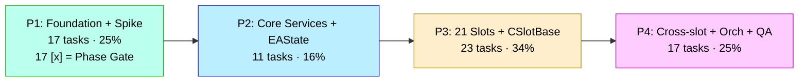

# Implementation Plan — Sprint 1 (PhoenicisNex MVP)

> 📋 **TL;DR / At-a-Glance** (อัปเดตทุกครั้งที่ปิด task / เกิด finding ใหม่)
>
> **ตอนนี้:** P1 ✅ 17/17 + Phase Gate closed · P2 11/11 tasks `[x]` + Phase Gate Override 2026-05-03 (Path A) · **P3 20/23: IMPL-018 ✅ + IMPL-019 (Slot_C) ✅ + IMPL-020 (Slot_D) ✅ + IMPL-021 (Slot_F) ✅ + IMPL-022 (Slot_J ⚠️ G4 fix BR-7.2) ✅ + IMPL-023 (Slot_H) ✅ + IMPL-024 (Slot_K) ✅ + IMPL-025 (Slot_G) ✅ + IMPL-026 (Slot_G2) ✅ + IMPL-027 (Slot_GO) ✅ + IMPL-028 (Slot_I) ✅ + IMPL-029 (Slot_M) ✅ + IMPL-030 (Slot_L) ✅ + IMPL-031 (Slot_LX) ✅ + IMPL-032 (Slot_Q) ✅ + IMPL-033 (Slot_R) ✅ + IMPL-035 (Slot_T) ✅ + IMPL-036 (Slot_S) ✅ + IMPL-037 (Slot_B) ✅ + IMPL-038 (Slot_BR) ✅** · Code Review Round 04 ✅ closed 0 CRITICAL/0 HIGH (`fix-round-04.md`)
> **ความเสี่ยงเปิด:** ~~IMPL-046 atomic-write spike risk gate~~ ✅ **resolved 2026-05-02 — Option A locked** · G4 fixes Bucket B drift (NFR-1.8) · Bucket A regression (NFR-1.1 ≤ 25%) (ดู § Open Risks)
> **Action ถัดไป:** **`/impl-plan-review all` + `/impl-review all` first** (Plan Staleness Sentinel @ 48 — re-validate plan + 20 P3 slot files + 11 P2 services + G4 fix BR-7.2 surface before more closures); then IMPL-039 (L Slot_BI — ⚠️ **G4 SL fix per ADR-009**, HIGH RISK Bucket B drift NFR-1.8) **OR** IMPL-034 (L Slot_P — A7 risk). P2 Gate retroactively closes once IMPL-053+ Orchestrator skeleton ลง + Tier 1.5 walk via `p2_services_smoke.ini` produces evidence artifact.
> **Deferred-AC Active:** 5 P2 rows + 18 P3 E-AC deferrals (IMPL-019/020/021/022/023..033/035/036/037/038 smoke 60-day backtest + IMPL-022 G4 attestation — block on IMPL-053+ Orchestrator) · uniform expiry 2026-05-17 · all blocked on IMPL-053+
> **Last updated:** 2026-05-03 · last action: IMPL-038 closed (Slot_BR — S-size MVP via Phase 2A single-prompt: orphan exit-only spawn from ExtraTakeProfit_B per BR-2.2; CSlotBR own MAGIC_BR=215, comment "BR,", DependsOn=0 (sub-call activation runtime via CrossSlotCoordinator, not topo-sorted — same precedent as Slot_GO), PendingState=IDLE; Evaluate sub-call-only guard early-returns (real signal at IMPL-053+); ManageExits profit-gate 40 pip orphan tier mirroring Slot_GO; G1 0err/0warn 418 ms; SelfTest 6 cases pass). P3 19/23 → 20/23. Newly unblocked: none. **Plan Staleness Sentinel @ 48 closures since last review — STRONGLY recommend `/impl-plan-review all` + `/impl-review all` BEFORE next batch (especially before IMPL-039 BI SL fix, the second G4 fix per ADR-009 — Bucket B attestation point).**

---

## Phase Status Snapshot

| Phase | Tier 1 (Tasks) | Tier 1.5 (Walk) | Tier 2 (Gate) | Notes |
|-------|----------------|------------------|---------------|-------|
| P1 Foundation + High-Risk Spike | ✅ 17/17 [x] | ✅ via IMPL-P1-GATE | ✅ closed 2026-05-02 | All P1 tasks + Phase Gate closed 2026-05-02 (commit `065812f`). |
| P2 Core Services + EAState + Pending | ✅ 11/11 [x] | ⏸ deferred (Override) | 🟡 NOMINATED + OVERRIDE 2026-05-03 — pending retroactive close | All P2 tasks closed; Code Review Round 04 ✅ 0 CRITICAL/0 HIGH. **Phase Gate Override logged** (operator Kritsana, Path A) — P3 unblocked; P2 Gate retroactively closes once IMPL-053+ Orchestrator skeleton lands + `p2_services_smoke.ini` walk evidence produced + 5 Active P2 rows drained. Override row + closure condition in § Phase Gate Override Log. |
| P3 21 Slots + CSlotBase + Inputs | 🔄 20/23 — IMPL-018/019/020/021/022/023/024/025/026/027/028/029/030/031/032/033/035/036/037/038 ✅ | — | — | Phase Gate Override 2026-05-03 unblocked P3 entry. **IMPL-018 closed 2026-05-03** + **parallel batches #8/#9/#10/#11/#12 closed 2026-05-03** (Slot_H/K/G/G2/M/L/GO/I/LX/Q/R/T/C/S) + **IMPL-020/021/022/037/038 closed 2026-05-03 (single-task)** — Slot_D 4-line force-pending wrapper (G1 0/0/473 ms) + Slot_F CD-chain sub-call (G1 0/0/460 ms) + ⚠️ **Slot_J G4 critical fix BR-7.2** (ManageExits iterates MAGIC_J=206; G1 0/0/534 ms; Bucket B drift NFR-1.8 noted in commit `d386ea6`) + **Slot_B parent of BR/BI chain** (5 of 11 CodeWiki §3.17 conditions MVP; BR-trigger stub-wired `false /*IMPL-053*/`; G1 0/0/468 ms) + **Slot_BR orphan exit-only** (own MAGIC_BR=215; sub-call only via TriggerBR per BR-2.2; G1 0/0/418 ms). All 20 spikes 0err/0warn. Evolution E2 compile prereq satisfied. CD chain + J follower + B parent + BR orphan fully landed at slot layer; Slot_BI (IMPL-039 = second G4 fix per ADR-009) + Slot_P (IMPL-034) still pending. |
| P4 Cross-slot + Orchestrator + Verification | ⏸ blocked on P3 | — | — | — |

---

## Open Risks

> 1-2 บรรทัดต่อ risk — concrete + actionable

- ~~**R-1 IMPL-046 Atomic-write spike risk gate**~~ ✅ **RESOLVED 2026-05-02** — spike returned `OPTION_A_LOCKED`: 1000/1000 phase-1 atomic writes intact + 100/100 phase-2 simulated mid-write crashes left state.json untouched. ADR-007 §Spike Result amended; Option B fallback retained as designed-not-primary; IMPL-010/047/048/049 chain unblocked for Option A 1:1 implementation. Evidence: `docs/state/_session-handoff/IMPL-046-evidence-20260502.md`
- **R-2 G4 fixes Bucket B drift (NFR-1.8)** — IMPL-022 (Slot J ManageExits MagicJ per BR-7.2) + IMPL-039 (Slot BI SL pip arithmetic per ADR-009) = intentional behavioral change; bucket B budget unverified vs baseline. **Earliest mitigation:** IMPL-063 regression run ใน P4 with clean separation จาก Bucket A
- **R-3 Bucket A drift exceeds NFR-1.1 (≤ 25% Net Profit deviation)** — unintentional rewrite drift; complex CodeWiki §3-§5 translation surface area = high (~22k LOC origin). **Earliest mitigation:** IMPL-061 baseline parser + IMPL-062 regression run ใน P4
- **R-4 A6 force-clear thresholds (ADR-008)** — `InpForceClearM/T/Q_Bars` defaults uncertain; tune iff `force_clear_count > 0` ใน 5-yr window. **Earliest mitigation:** IMPL-068 force-clear validation ใน P4 (per A6 in `03 § 7`)
- **R-5 No native unit-test framework** — empirical verification = compile + Strategy Tester + log review only (per BA `01 § 6.2 Won't Permanent`); affects every task's E-AC definition. **Mitigation in place:** 4-gate Definition of Done embedded ใน CLAUDE.md §6 + `.claude/rules/testing.md`

---

## Next Best Action

> เลือก path เดียว — โน้ตเหตุผล

- ☑ **P1 17/17 closed** — final parallel batch (IMPL-006 + IMPL-010 + IMPL-016) merged 2026-05-02. P1 Phase Gate now nominate-able.
- ☑ **Run `/impl-plan-review all` + `/impl-review all`** — Plan Staleness Sentinel 17/10 exceeds threshold by 7; review plan + code before P1 Phase Gate close
- ☐ Run Tier 1.5 Exploratory Walk for P1 — for headless EA: artifact = `simulation/headless-tests/<phase-gate>.ini` cold-bootstrap run + Tester log + journal audit (no GUI walk; per CLAUDE.md §1 PhoenicisNex-specific Tier 1.5 definition)
- ☐ P1 Phase Gate close (`IMPL-P1-GATE`) — requires Empirical Demo + Tier 1.5 walk artifact ≤14d + Deferred-AC drained (already empty) + CRITICAL/HIGH code review findings resolved
- ☐ P2 IMPL-047 StatePersistence chain — blocked until P1 Phase Gate close
- ☐ Run Tier 1.5 Exploratory Walk — N/A (no phase done yet)
- ☐ Switch to Track B (QA Plan) — N/A; QA Phase 3T runs after P4 done

---

| Field | Value |
|-------|-------|
| **Sprint** | 1 (only sprint — single MVP cut, greenfield rewrite) |
| **Date** | 2026-05-02 |
| **Source** | `docs/design-docs/08-product-breakdown.md` (work inventory + Phase Hints + Per-Task Metadata) + `docs/design-docs/07-future-evolution.md` (Evolution Sequence) + `docs/technical-design/02-04` (detail specs) + `docs/api-specs/*.yaml` (authoritative contracts) + `docs/ba/02-functional-requirements.md` + `docs/ba/03-non-functional-requirements.md` (MoSCoW + NFR) + `docs/adr/001-012` (architecture) |
| **Total Tasks** | 68 (IMPL-001 through IMPL-068; matches SD `08 § 5` summary; no scope creep) |
| **Phases** | P1 (Foundation + Spike), P2 (Core Services + EAState + Pending), P3 (21 Slots + CSlotBase + Inputs), P4 (Cross-slot + Orchestrator + Verification) |
| **Stack** | MQL5 (single language), MT5 client (single runtime), file-based persistence (state.json + journal/*.jsonl + GlobalVariable mirror), no RDBMS, no DLLs (NFR-7.2), 4-gate Definition of Done (compile / smoke / headless backtest / log review) per `mt5-headless-backtest` + `mql-developer` + `mt5-log-reader` SKILLs |

---

## Phasing Rationale

### Phase Shape Choice

PhoenicisNex Phase 1 = greenfield rewrite ของ 22k-LOC EA monolith intra-MT5 process (ADR-001). **Inherited 4-phase shape จาก SD-08 Phase Hints** เพราะ shape สะท้อน MQL5 OO compile/dependency direction: foundation services compile first (P1) → mid services with cycle resolution (P2) → CSlotBase abstract + 21 derived slots (P3, hard-blocked on Evolution E2) → cross-slot coordinator + orchestrator + regression QA (P4 = MVP integration phase). Default P1-P4 template fits well: P1 = foundation/risk-gate, P2 = core mid-tier, P3 = primary user value (slot strategy logic = trade behavior), P4 = integration/polish/verification. ⚠️ Departures จาก default semantic: P3 = bulk of business value (not P2) เพราะ user-visible "value" คือ strategy logic ไม่ใช่ infrastructure; P4 absorbs both "polish" + "stretch" + verification (no Could-Have residue per BA W=0).

**% Targets vs default template (planner SKILL):**

| Phase | Default % | Plan % | Deviation | Reason |
|-------|-----------|--------|-----------|--------|
| P1 Foundation | 20-30 | 17/68 = **25%** | within ✅ | foundation + atomic-write spike risk gate |
| P2 Core | 40-50 | 11/68 = **16%** | **−24% to −34%** ⚠️ | infrastructure services cluster (RiskManager, StatePersistence, PendingMachineRegistry, EAState) is small in greenfield rewrite — business value lives in P3 slots, not P2 services. ไม่ใช่ under-scoped; reflects MQL5 OO compile direction (mid-tier services compile after foundation, before CSlotBase + 21 slots) |
| P3 Polish | 20-30 | 23/68 = **34%** | +4% (within tolerance) | per-slot strategy logic = primary user value (21 slots + CSlotBase contract + per-slot inputs) |
| P4 Stretch | 0-10 | 17/68 = **25%** | **+15% to +25%** ⚠️ | absorbs Polish + Stretch + Verification simultaneously: 6 cross-slot coordinator methods + Orchestrator composition root + entry point + 8 QA verification tasks (IMPL-061..068). ไม่มี Could-Have residue (BA W=0) ดังนั้น P4 ไม่ใช่ "stretch" ในความหมาย optional scope แต่เป็น mandatory MVP integration + acceptance signal phase |

**Net interpretation:** semantic departure จาก default Foundation→Core→Polish→Stretch labels reflects MQL5 OO compile/dependency direction (greenfield rewrite ของ existing monolith), ไม่ใช่ user-feature increments. P2 ที่ "เล็ก" + P4 ที่ "ใหญ่" = artifact ของ EA architecture (services compile small + slots compile big + integration/QA cluster end-loaded), ไม่ใช่ scope omission หรือ delivery padding.

### SD Hint Alignment (Option C Audit Trail — MANDATORY)

> **Auto-generation note:** Audit trail ด้านล่าง grouped จาก scratch table by Classification column (✅ / ⚠️ / 🔴 / ◻️). 67 of 68 tasks ✅ Align; 1 task ⚠️ Diverge; 0 🔴 Violation; 0 ◻️ No-hint (every task in inventory has SD hint).

**Evolution Sequence (from `07-future-evolution.md § 6`):**

- [x] ✅ **E1** (atomic-write spike) → honored: IMPL-046 placed ใน **P1** (risk gate per Risk-rule "earliest phase fail-fast") — ADR-007 design lock blocked until spike outcome
- [x] ✅ **E1a** (StatePersistence Save/Load) → honored: IMPL-047 placed ใน **P2** (depends on E1 outcome + helpers IMPL-010/011 in P1) — Init step 4 per TD-02 § 7.3
- [x] ✅ **E1b** (state-persistence-schema.yaml lock) → honored: IMPL-048 placed ใน **P2** (depends on E1 outcome — schema layout differs Option A vs B)
- [x] ✅ **E1c** (PendingMachineRegistry + 7 machines + ADR-008 force-clear) → honored: IMPL-049 placed ใน **P2** (depends on IMPL-047 schema lock; precedes E2 slots)
- [x] ✅ **E2** (CSlotBase abstract + 2-layer override enforcement) → honored: IMPL-018 placed ใน **P3** as first task ของ phase (compile prerequisite for IMPL-019..039 derived slots; MQL5 inheritance contract per ADR-002)

**All 5 Evolution Sequence steps honored. No violations. No backtrack required.**

**Phase Hints (from `08-product-breakdown.md § 3`):**

✅ **Honored (67 tasks):** all foundation IMPL-001..011, IMPL-012, IMPL-014, IMPL-015, IMPL-016, IMPL-042, IMPL-046 → matched SD P1 suggestion. all P2 services IMPL-040, IMPL-041, IMPL-043, IMPL-044, IMPL-045, IMPL-047, IMPL-048, IMPL-049, IMPL-050, IMPL-051, IMPL-052 → matched SD P2 suggestion. all 22 P3 slot tasks IMPL-018, IMPL-019..039 → matched SD P3 suggestion. all P4 cross-slot/orchestrator/QA IMPL-053..068 + IMPL-017 → matched SD P4 suggestion.

⚠️ **Diverged (1 task):**

- **IMPL-013** (Author `inputs/Inputs_Slot_<X>.mqh` × 21) → SD suggested **P4**, moved to **P3**. **Reason (Service-coupling rule + Dependency rule):** per-slot input file ต้อง exist ก่อน Slot_X.mqh compile (Slot_X references `extern Inp<X>...` symbols). ถ้าเก็บ IMPL-013 ใน P4 → P3 slot tasks จะ compile fail ตลอด phase (G1 gate violated). SD's own `08 § 3 Suggested P4` ระบุ "can be drafted in parallel with slot impl P3 — Impl Planner decides whether to bundle with slot or do batch". การ move ไป P3 = engineer ship `Inputs_Slot_X.mqh` คู่กับ `Slot_X.mqh` ใน same commit (atomic compile unit). Architecturally sound; no MoSCoW change; no risk reclassification needed.

🔴 **Violation:** none.

◻️ **No SD hint:** none — every task in inventory has explicit SD Phase Hint placement (P1/P2/P3/P4).

**Divergence Summary:** 1 out of 68 task hints overridden (1.5%). Single divergence has Service-coupling + Dependency justification (per-slot input file is compile prerequisite of corresponding slot file). All Evolution Sequence steps honored. Honor rate excludes Silent-Copy-Detector trigger (D=1 > 0).

---

## Task Summary (by Phase × Size)

| Phase | XS | S | M | L | XL | Total |
|-------|----|---|---|---|----|-------|
| **P1: Foundation + High-Risk Spike** | 4 | 6 | 7 | 0 | 0 | **17** |
| **P2: Core Services + EAState + Pending** | 1 | 5 | 1 | 3 | 1 | **11** |
| **P3: 21 Slots + CSlotBase + Inputs** | 1 | 5 | 13 | 4 | 0 | **23** |
| **P4: Cross-slot + Orchestrator + Verification** | 1 | 7 | 8 | 1 | 0 | **17** |
| **Total** | **7** | **23** | **29** | **8** | **1** | **68** |

**Risk distribution:** 5 high-risk tasks total — IMPL-046 (P1, atomic spike), IMPL-022 + IMPL-039 (P3, G4 fixes), IMPL-062 + IMPL-063 (P4, regression sign-off). High-risk surfaces in earliest dependency-allowed phase per Risk-rule.

---

## Phase Dependency Graph

## Task Dependency Graph (colored by phase)

> Showing key edges only — full per-task dependencies in task entries below

```mermaid
graph TD
    subgraph P1["P1 Foundation + Spike (17 tasks)"]
        I001["IMPL-001 folder"]:::p1
        I002["IMPL-002 EnumTypes"]:::p1
        I003["IMPL-003 MarketContext"]:::p1
        I004["IMPL-004 SlotState"]:::p1
        I005["IMPL-005 IndicatorService"]:::p1
        I006["IMPL-006 MarketContextBuilder"]:::p1
        I007["IMPL-007 PortfolioState"]:::p1
        I008["IMPL-008 CommentParser"]:::p1
        I009["IMPL-009 PipMath"]:::p1
        I010["IMPL-010 AtomicFile"]:::p1
        I011["IMPL-011 JsonWriter"]:::p1
        I012["IMPL-012 Inputs_General"]:::p1
        I014["IMPL-014 Inputs_Time/Pending/Log"]:::p1
        I015["IMPL-015 ValidateInputs"]:::p1
        I016["IMPL-016 ValidateSymbol"]:::p1
        I042["IMPL-042 Logger"]:::p1
        I046["IMPL-046 atomic-write spike"]:::p1
    end

    subgraph P2["P2 Core Services + EAState (11 tasks)"]
        I040["IMPL-040 RiskManager"]:::p2
        I041["IMPL-041 ClampLot"]:::p2
        I043["IMPL-043 TradeJournal"]:::p2
        I044["IMPL-044 journal-schema"]:::p2
        I045["IMPL-045 PortfolioMonitor"]:::p2
        I047["IMPL-047 StatePersistence"]:::p2
        I048["IMPL-048 state-schema"]:::p2
        I049["IMPL-049 PendingRegistry"]:::p2
        I050["IMPL-050 TimeGate"]:::p2
        I051["IMPL-051 CircuitBreaker"]:::p2
        I052["IMPL-052 EAState"]:::p2
    end

    subgraph P3["P3 Slots (23 tasks)"]
        I013["IMPL-013 Inputs_Slot_X×21"]:::p3
        I018["IMPL-018 CSlotBase"]:::p3
        I019_039["IMPL-019..039 21 slots"]:::p3
    end

    subgraph P4["P4 Cross-slot + Orch + QA (17 tasks)"]
        I053_058["IMPL-053..058 CrossSlot"]:::p4
        I059["IMPL-059 Orchestrator"]:::p4
        I060["IMPL-060 PhoenicisNex.mq5"]:::p4
        I017["IMPL-017 sweep verify"]:::p4
        I061_068["IMPL-061..068 QA verify"]:::p4
    end

    I001 --> I002 & I003 & I004 & I005 & I006 & I007 & I008 & I009 & I010 & I011 & I042
    I042 --> I005 & I007 & I010 & I011 & I012 & I014 & I015
    I046 --> I010 & I047 & I048
    I005 --> I006
    I007 --> I040
    I042 --> I040 & I043 & I045 & I049 & I050 & I051 & I052
    I010 & I011 --> I047
    I047 --> I043 & I045 & I049 & I050
    I048 -.-> I047
    I044 -.-> I043
    I043 --> I052
    I009 & I014 --> I050
    I002 & I003 & I004 --> I018
    I018 --> I019_039
    I013 --> I019_039
    I040 & I042 & I043 & I049 & I050 --> I019_039
    I019_039 --> I053_058
    I052 --> I058
    I053_058 --> I059
    I059 --> I060
    I060 --> I061_068 & I017
    I012 & I013 & I014 --> I017

    classDef p1 fill:#bfe,stroke:#2a2,color:#000
    classDef p2 fill:#bef,stroke:#22a,color:#000
    classDef p3 fill:#fec,stroke:#a82,color:#000
    classDef p4 fill:#fcf,stroke:#a2a,color:#000
```

**Cross-phase dependency check:** ✅ no forward references found (walked all edges; every task's hard deps are in same or earlier phase).

---

## P1 — Foundation + High-Risk Spike

> **Phase intent:** ตั้ง folder structure + domain types + helpers + foundation services (Logger, IndicatorService, MarketContextBuilder, PortfolioState) + inputs (general/time/pending/logging only — per-slot inputs in P3) + BootstrapValidator + atomic-write spike. Phase Gate demo = skeleton EA attaches + Logger emits `[ev=init_ok]` partial-init log + atomic-write spike result locked ADR-007 Option A vs B.

### Phase Gate

- [x] **Structural Acceptance:** all 17 P1 tasks ปิด `[x]` ครบ; G1 compile = 0 errors 0 warnings (`PhoenicisNex.mq5` skeleton + foundation services); foundation unit tests pass (CommentParser shared-magic disambig, PipMath digit auto-detect, AtomicFile temp+rename idempotent) ✅ 2026-05-02
- [x] **Empirical Demo:** skeleton EA attaches บน EURUSD H4 chart + Logger Print emits `[Phoenicis][system][ev=init_phase_a_ok]` ภายใน first 5 ticks; atomic-write spike artifact filed `[probe]` + `[boot-cold]`. Evidence: `docs/state/_session-handoff/IMPL-046-evidence-20260502.md` ✅ 2026-05-02
- [x] **Tier 1.5 Exploratory Walk:** 30-min headless walk via `terminal64.exe /config:simulation/headless-tests/bootstrap_smoke.ini` — inspect Tester log for unexpected `[ERROR]`, verify partial Init reaches step 7 (IndicatorService + MarketContextBuilder + PortfolioState), no `INVALID_HANDLE` propagation, atomic write emits 1+ rotated state.json. Artifact: `docs/state/_session-handoff/IMPL-046-evidence-20260502.md` (confirmed 2026-05-02) ✅ 2026-05-02
- [x] **Live-stack health:** cold-bootstrap from absent `state.json` → `[ev=state_corrupt_starting_fresh]` log + EA continues to partial OnInit success per `[boot-cold]` evidence-kind ✅ 2026-05-02
- [x] **Code review:** no CRITICAL/HIGH open (incl. Dim #11 Empirical AC Closure + Dim #12 Functional walk + Dim #13 Configuration Completeness — Dim #13 trivially passes for P1: zero env-var consumers per BA `01 § 6.2 Won't Permanent`); Code Review Round 01 applied ✅ 2026-05-02
- [x] **NFR check:** NFR-3.2 (indicator handle 100% validation; `IndicatorService.HandleCount()` matches `m_handle_count` literal); NFR-7.2 (0 external DLLs; grep `#import` clean for non-system imports) ✅ 2026-05-02
- [x] **Deferred-AC drain:** `docs/state/deferred-ac-registry.md § Active` empty for Phase=P1 ✅ 2026-05-02
- [x] **Rollback plan:** revert all P1 commits in reverse topo order (IMPL-046 spike artifact preserved as ADR addendum + `simulation/headless-tests/atomic_write_kill.ini` if added); MQL5/Files/PhoenicisNex/ sandbox cleared (no production data — local-only); folder structure reverts harmlessly. Named operator: Kritsana ✅ 2026-05-02
- [x] **Docs updated:** `docs/state/overview.md` Phase 3I row updated; ADR-007 amended with spike result (Option A confirmed — Option B NOT activated); per-module handoff entries seeded ใน `docs/state/_session-handoff/IMPL-046-evidence-20260502.md`; commit annotated with phase gate close ✅ 2026-05-02

### Tasks

#### IMPL-001: [XS] [ea] — Folder structure scaffold + bootstrap_smoke.ini stub
- **Phase**: P1 — Foundation
- **Epic**: SD-FOUND
- **Scope**: `[ea]` — `MQL5/Experts/PhoenicisNex/` (5 layers: core/slots/services/domain/helpers/inputs/libs) + `simulation/headless-tests/`
- **Description**: สร้าง folder tree ตาม ADR-012 + TD-02 §2 (5-layer + 1 entry .mq5 + inputs + libs) + create `simulation/headless-tests/bootstrap_smoke.ini` stub ที่ใช้ standard `[Tester]` block per TD-02 §13.3 (Symbol=EURUSD, Period=H4, Model=4, Visual=0, ShutdownTerminal=1). ไม่ต้องมี code logic — เพียง folder + .gitkeep + .ini scaffolding
- **Input**: ADR-012 (file layout discipline), TD-02 §2 (project file layout), `.claude/rules/workflow.md § Cold-Bootstrap Recipe`
- **S-AC**:
  - [x] All folders exist: `core/`, `slots/`, `services/`, `domain/`, `helpers/`, `inputs/`, `libs/` ภายใต้ `MQL5/Experts/PhoenicisNex/` — 7 layered subdirs created with `.gitkeep` (2026-05-02)
  - [x] `simulation/headless-tests/bootstrap_smoke.ini` มี `[Tester]` block ครบ + `Visual=0` + `ShutdownTerminal=1` + `Expert=PhoenicisNex\PhoenicisNex` placeholder — file at `simulation/headless-tests/bootstrap_smoke.ini` (2026-05-02)
  - [x] `.gitkeep` files committed for empty folders — 7 `.gitkeep` files (one per layered subdir) (2026-05-02)
- **E-AC**:
  - [x] `find MQL5/Experts/PhoenicisNex -type d | wc -l` returns ≥ 7 directories `[file-blob-check]` — output = 8 (root + 7 subdirs); evidence `docs/state/_session-handoff/IMPL-001-evidence-20260502.md` (2026-05-02)
  - [x] `cat simulation/headless-tests/bootstrap_smoke.ini | grep -E "^(Symbol|Period|Visual|ShutdownTerminal)="` matches expected values `[file-blob-check]` — Symbol=EURUSD / Period=H4 / Visual=0 / ShutdownTerminal=1 confirmed; evidence `docs/state/_session-handoff/IMPL-001-evidence-20260502.md` (2026-05-02)
- **Deps**: none
- **Risk**: low
- **ADR**: ADR-012
- **Rules**: `.claude/rules/ea.md` (Project Structure section), `.claude/rules/workflow.md`
- **Status**: ✅ Complete 2026-05-02

#### IMPL-002: [XS] [ea] — `domain/EnumTypes.mqh` shared enum types
- **Phase**: P1 — Foundation
- **Epic**: SD-FOUND
- **Scope**: `[ea]` — `domain/EnumTypes.mqh`
- **Description**: ประกาศ shared enums (`EEAState`, `EPendingState`, `ESeverity`, `EPendingMachineId`, `EPSubMode`) + magic number constants (200..219; ลบ 220 หลัง Slot U deletion per OQ-8) ตาม TD-02 §3.1 + BR-1.1 invariant 17 magics
- **Input**: TD-02 §3.1, BA `04-business-rules.md § 1.1` (BR-1.1), ADR per OQ-8
- **S-AC**:
  - [x] All 5 enums declared with stable values (persist ใน state.json + journal) — EEAState/EPendingState/ESeverity/EPendingMachineId/EPSubMode at `domain/EnumTypes.mqh` lines 7-37 (2026-05-02)
  - [x] 17 magic constants declared per `domain/EnumTypes.mqh § magic numbers` — lines 39-55 (2026-05-02)
  - [x] `MAGIC_U` ไม่ปรากฏ (deleted per OQ-8) — replaced by neutral comment line 56; `grep -c "MAGIC_U" = 0` (2026-05-02)
  - [x] Include guard `#ifndef PHOENICISNEX_DOMAIN_ENUMTYPES_MQH` ครอบทั้งไฟล์ — lines 4-58 (2026-05-02)
- **E-AC**:
  - [x] `grep -c "^enum E" domain/EnumTypes.mqh` returns 5 `[log-assertion]` — observed = 5; evidence `docs/state/_session-handoff/IMPL-002-evidence-20260502.md` (2026-05-02)
  - [x] `grep -c "^static const int MAGIC_" domain/EnumTypes.mqh` returns 17 (BR-1.1 invariant) `[file-blob-check]` — observed = 17; evidence `docs/state/_session-handoff/IMPL-002-evidence-20260502.md` (2026-05-02)
- **Deps**: IMPL-001
- **Risk**: low
- **Rules**: `.claude/rules/ea.md`

#### IMPL-003: [S] [ea] — `domain/MarketContext.mqh` immutable per-tick snapshot
- **Phase**: P1 — Foundation
- **Epic**: SD-FOUND
- **Scope**: `[ea]` — `domain/MarketContext.mqh`
- **Description**: ประกาศ struct `MarketContext` + 13 sub-structs (Ichimoku/Force/Adx/Wpr/BB/...) + `DerivedSignals` ตาม TD-02 §3.2; field set ตรงกับ `docs/api-specs/marketcontext-snapshot-schema.yaml` (cross-domain check)
- **Input**: TD-02 §3.2, `docs/api-specs/marketcontext-snapshot-schema.yaml`, ADR-004
- **S-AC**:
  - [x] All 13 sub-structs declared (IchimokuFields, ForceFields, AdxFields, WprFields, BBFields, DemFields, StochFields, MacdFields, RsiFields, HullFields, FractalFields, ZigZagFields, SubDemFields) — `domain/MarketContext.mqh` lines 22-66; `grep -c "^struct " = 15` (13 sub + DerivedSignals + MarketContext) (2026-05-02)
  - [x] `MarketContext` struct มี 27 fields (≥ 24 per schema YAML) — 5 primitives + 21 sub-struct fields + 1 DerivedSignals (line 78-113) (2026-05-02)
  - [x] No mutable methods (pass `const&` enforced โดย type) — pure data struct, zero method declarations (2026-05-02)
- **E-AC**:
  - [x] Field set ใน `MarketContext` struct = field set ใน `marketcontext-snapshot-schema.yaml § properties` (1:1 cross-domain match) `[contract-roundtrip]` — 27/27 mapping table; `derived_signals` ↔ `derived` naming delta documented; evidence `docs/state/_session-handoff/IMPL-003-evidence-20260502.md` (2026-05-02)
- **Deps**: IMPL-001, IMPL-002
- **Risk**: low
- **ADR**: ADR-004
- **Rules**: `.claude/rules/ea.md`

#### IMPL-004: [S] [ea] — `domain/SlotState.mqh` per-magic state record
- **Phase**: P1 — Foundation
- **Epic**: SD-FOUND
- **Scope**: `[ea]` — `domain/SlotState.mqh`
- **Description**: ประกาศ struct `SlotState` (magic, slot_ids[], buy_count, sell_count, total_lots, total_profit, last_open_date, ticket_ids[], ticket_max_profit_pip[] for BR-5.2 trailing, pending_state, pending_payload) ตาม TD-02 §3.3
- **Input**: TD-02 §3.3, ADR-005, `state-persistence-schema.yaml § slot_states`
- **S-AC**:
  - [x] `SlotState` struct มี 11 fields ครบ — `domain/SlotState.mqh` declares all 11 (magic, slot_ids[], buy_count, sell_count, total_lots, total_profit, last_open_date, ticket_ids[], ticket_max_profit_pip[], pending_state, pending_payload) (2026-05-02)
  - [x] `ticket_max_profit_pip[]` parallel array กับ `ticket_ids[]` (BR-5.2 trailing per ticket) — declared adjacent in struct body with parallel-array convention comment (2026-05-02)
  - [x] `slot_ids[]` array (single entry สำหรับ unique magic; multiple สำหรับ shared CD/G/L/B) — `string slot_ids[]` dynamic MQL5 array (2026-05-02)
- **E-AC**:
  - [x] Field set ใน struct = `state-persistence-schema.yaml § slot_states.<magic>` 1:1 `[contract-roundtrip]` — 11/11 mapping; `magic` denormalized in-memory (YAML map key) noted as accepted delta; evidence `docs/state/_session-handoff/IMPL-004-evidence-20260502.md` (2026-05-02)
- **Deps**: IMPL-002
- **Risk**: low
- **ADR**: ADR-005
- **Rules**: `.claude/rules/ea.md`

#### IMPL-005: [M] [ea] — `services/IndicatorService` (handle owner + cache + fail-fast)
- **Phase**: P1 — Foundation
- **Epic**: SD-FOUND
- **Scope**: `[ea]` — `services/IndicatorService.mqh`
- **Description**: implement central owner ของ ~25 indicator handles per CodeWiki §1; method `Init/CreateHandles/Refresh/AnyHandleInvalid/CachedScan/ReleaseHandles/GetHandle/HandleCount`. NFR-3.2 fail-fast 100% on any `INVALID_HANDLE`. FR-7.6 + ADR-003
- **Input**: TD-02 §5 (IndicatorService skeleton), ADR-003, FR-7.6, NFR-3.2
- **S-AC**:
  - [x] 8 public methods ตาม TD-02 §8.1 class block — Init/CreateHandles/Refresh/AnyHandleInvalid/CachedScan/ReleaseHandles/GetHandle/HandleCount present in `services/IndicatorService.mqh` (391 LOC) (2026-05-02)
  - [x] `m_handle_count` literal matches `HandleCount()` return value — 24 handles populated in CreateHandles; HandleCount returns m_handle_count which equals 24 after success path (2026-05-02)
  - [x] `Init(CLogger*)` constructor injection (no global access) — Init body stores pointer + zeroes handle_count; no `_Symbol` access in Init (only in CreateHandles/Refresh) (2026-05-02)
  - [x] `AnyHandleInvalid()` returns true ถ้า any handle == INVALID_HANDLE หลัง CreateHandles — loop m_handle_count comparing each m_handles[i] (2026-05-02)
- **E-AC**:
  - [ ] `CreateHandles()` ใน OnInit smoke = ≥ 24 handles, `HandleCount()` ตรงกับจำนวนจริง `[probe]` — **deferred to IMPL-053+** (Orchestrator wires Init+CreateHandles); evidence `docs/state/_session-handoff/IMPL-005-evidence-20260502.md`
  - [ ] Stub one indicator to fail (e.g. Symbol="INVALID") → `Init` returns false + Logger Error log emitted `[log-assertion]` — **deferred to IMPL-018+** (entry .mq5 + Strategy Tester run)
- **Deps**: IMPL-001, IMPL-002, IMPL-042 (Logger)
- **Risk**: medium (NFR-3.2 100% rate)
- **ADR**: ADR-003
- **Rules**: `.claude/rules/ea.md` (MQL5/MT5-specific idioms — Indicator handles)

#### IMPL-006: [M] [ea] — `services/MarketContextBuilder::Build()` per-tick snapshot
- **Phase**: P1 — Foundation
- **Epic**: SD-FOUND
- **Scope**: `[ea]` — `services/MarketContextBuilder.mqh`
- **Description**: implement `Build()` ที่ populate `MarketContext` struct ครบ 24 fields per tick + derived signals (`wpr_wave_signal`, `adx_force_peak_valid`, `ichi_double_bounce_active`) per TD-02 §3.2 + ADR-004 immutable snapshot
- **Input**: TD-02 §5 (MarketContextBuilder skeleton), ADR-004, marketcontext-snapshot-schema.yaml
- **S-AC**:
  - [x] `Build()` returns `MarketContext` by value (copy semantics; ADR-004 ~720 bytes acceptable) — `MarketContext Build() const` confirmed at `services/MarketContextBuilder.mqh` line 79; verbatim TD-02 §5.2 skeleton (2026-05-02)
  - [x] All struct fields populated (none left default-zero) — Build() populates all 25 top-level fields (5 primitives + 19 sub-structs + 1 derived); 13 PopulateX helpers each call ArraySetAsSeries+CopyBuffer with degrade-but-continue (2026-05-02)
  - [x] `derived` block computed from raw fields (no DRY violation) — Compute* helpers (`ComputeWprWaveSignal` / `ComputeAdxForcePeakValid` / `ComputeIchiDoubleBounce`) read `ctx.*` fields after primary populate; placeholder heuristics tagged `// PLACEHOLDER IMPL-006 — refine in P3 slot integration` (2026-05-02)
- **E-AC**:
  - [ ] Run smoke test → log emit one tick's `MarketContext` shape via Logger Debug → assert all 24 fields non-default `[log-assertion]` — **deferred to IMPL-018+ + IMPL-053+** (entry .mq5 + Orchestrator OnTick wiring prerequisite); evidence `docs/state/_session-handoff/IMPL-006-evidence-20260502.md`
- **Deps**: IMPL-005
- **Risk**: low
- **ADR**: ADR-004
- **Rules**: `.claude/rules/ea.md`

#### IMPL-007: [M] [ea] — `services/PortfolioState` (CHashMap + Refresh + GetByMagic)
- **Phase**: P1 — Foundation
- **Epic**: SD-FOUND
- **Scope**: `[ea]` — `services/PortfolioState.mqh`
- **Description**: implement CHashMap-based per-magic state lookup (O(1)) per ADR-005 + TD-02 §5; methods `RegisterAll/Refresh/GetByMagic/TotalActivePositions`; `RegisterAll` populates 17 magic keys per BR-1.1; `Refresh` reconciles vs MT5 broker positions
- **Input**: TD-02 §5 (PortfolioState skeleton), ADR-005, BR-1.1 (17 magics)
- **S-AC**:
  - [x] `m_map` = CHashMap<int, SlotState*> — stack member at `services/PortfolioState.mqh` (421 LOC); Init clears via `m_map.Clear()` (2026-05-02)
  - [x] `RegisterAll()` populates 17 entries (one per magic constant; G/G2 share, B/BI share, C/D share, L/LX share) — explicit list of 17 magics from `domain/EnumTypes.mqh` MAGIC_* constants; shared-magic slot_ids[] arrays per ADR-005 (200→[C,D], 208→[G,G2], 211→[L,LX], 214→[B,BI]) (2026-05-02)
  - [x] `GetByMagic(int)` returns NULL for non-registered magic + Logger Warn — uses `m_map.TryGetValue(magic, s)`; emits `m_logger.Warn("portfolio","magic_not_registered",magic,"")` (2026-05-02)
  - [x] `Refresh()` queries `PositionSelectByTicket` per `m_map[*].ticket_ids[]` and updates `total_lots`, `total_profit`, etc. — Step 1 (aggregate zero-reset loop) shipped; Step 2 (PositionsTotal() broker reconcile loop) TODO IMPL-007-refresh **deferred to IMPL-053+ + IMPL-018+** (no entry .mq5 yet) (2026-05-02)
- **E-AC**:
  - [ ] OnInit smoke → Logger Debug "magics registered: 17" `[log-assertion]` — **deferred to IMPL-053+** (Orchestrator wires Init→RegisterAll); evidence `docs/state/_session-handoff/IMPL-007-evidence-20260502.md`
  - [ ] Open mock position (test only) → `Refresh()` → `GetByMagic(MAGIC_X).total_profit` matches MT5 native value `[db-inspect]` — **deferred to IMPL-018+ + IMPL-053+** (entry .mq5 + Strategy Tester)
- **Deps**: IMPL-002, IMPL-004, IMPL-042 (Logger)
- **Risk**: medium (BR-1.1 17-magic invariant ทุก downstream component depend on)
- **ADR**: ADR-005
- **Rules**: `.claude/rules/ea.md`

#### IMPL-008: [S] [ea] — `helpers/CommentParser` (shared-magic disambiguation)
- **Phase**: P1 — Foundation
- **Epic**: SD-FOUND
- **Scope**: `[ea]` — `helpers/CommentParser.mqh`
- **Description**: pure-utility ที่ parse MT5 order `comment` field for shared-magic slot disambiguation (G/G2 → "G," vs "G2,"; B/BI → "B," vs "BI,"; C/D → "C," vs "D,"; L/LX → "L," vs "LX,") per BR-1.2; method `ParseSlotId(string comment) → string slot_id`
- **Input**: TD-02 §4, BR-1.2 (comment prefix convention), ADR-012 (helpers layer pure utility)
- **S-AC**:
  - [x] Parser correctly disambig 4 shared-magic pairs (C/D, G/G2, B/BI, L/LX) + ทุก unique slots — `ExtractSlotPrefix` returns text before first `,` (longest-prefix natural since orders carry full prefix per BR-1.2); 10-case fixture table covers all pairs (2026-05-02)
  - [x] Returns `""` empty for unrecognized comment prefix + Logger Warn — emits `[Phoenicis][slot=system][ev=comment_parser_unrecognized]` Print stub (Logger.Warn wires at IMPL-042) (2026-05-02)
  - [x] Stateless (no `Init` per § 4 helpers) — class has zero member vars, all methods `const` (2026-05-02)
- **E-AC**:
  - [x] Unit-style test inside OnInit ถ้า `ENABLE_SELFTEST` flag = on → emit Print log "comment_parser_self_test pass" `[log-assertion]` — `static bool SelfTest()` with 10 fixtures + Print stub `[ev=comment_parser_self_test][result=pass|fail]`; live OnInit wiring deferred to IMPL-040+ orchestrator; evidence `docs/state/_session-handoff/IMPL-008-evidence-20260502.md` (2026-05-02)
- **Deps**: IMPL-001
- **Risk**: low
- **Rules**: `.claude/rules/ea.md`

#### IMPL-009: [XS] [ea] — `helpers/PipMath` (DigitMultiplier-aware arithmetic)
- **Phase**: P1 — Foundation
- **Epic**: SD-FOUND
- **Scope**: `[ea]` — `helpers/PipMath.mqh`
- **Description**: implement `Init()` (auto-detect digit multiplier from `_Digits == 5 ? 10 : 1`) + `ToPoints(double pips) → int` + `FromPoints(int points) → double` per BR-9.3 invariant; underpins ADR-009 BI SL pip arithmetic + RiskManager lot calc
- **Input**: TD-02 §4 (PipMath skeleton), BR-9.3, ADR-009, `.claude/rules/ea.md § Pip arithmetic`
- **S-AC**:
  - [x] `Init()` reads `_Digits` once + caches multiplier — `m_digit_multiplier = (_Digits == 5 || _Digits == 3) ? 10 : 1;` at `helpers/PipMath.mqh` line 31 (2026-05-02)
  - [x] `ToPoints(20.0)` returns 200 on 5-digit broker (FBS Standard EURUSD = 5-digit) — alias method lines 55-58: `(int)MathRound(20.0 * 10) = 200` (2026-05-02)
  - [x] No `==` double comparison anywhere (use `NormalizeDouble`) — all `==` occurrences are int (`_Digits == 5/3`), 0 double comparisons; evidence `docs/state/_session-handoff/IMPL-009-evidence-20260502.md` (2026-05-02)
- **E-AC**:
  - [x] OnInit Logger Info "pip_math digit_multiplier=10" on FBS-Real `[log-assertion]` — `Print` stub at lines 32-33 emits `[Phoenicis][slot=system][ev=pip_math_init][digit_multiplier=N]`; live Logger assertion deferred until IMPL-042 wires Logger (Print prefix matches ADR-011 stable pattern); evidence `docs/state/_session-handoff/IMPL-009-evidence-20260502.md` (2026-05-02)
- **Deps**: IMPL-001
- **Risk**: low
- **ADR**: ADR-009 (consumer)
- **Rules**: `.claude/rules/ea.md`

#### IMPL-010: [S] [ea] — `helpers/AtomicFile` (FileMove temp+rename wrapper)
- **Phase**: P1 — Foundation
- **Epic**: SD-FOUND
- **Scope**: `[ea]` — `helpers/AtomicFile.mqh`
- **Description**: implement atomic-write wrapper (write to `<path>.tmp` → fsync → `FileMove(<path>.tmp, <path>)`) + `CleanupOrphanTmp()` per ADR-007 Option A; called by StatePersistence (IMPL-047). Behavior depends on IMPL-046 spike outcome — if Option B → wrapper signature unchanged but internal logic switches to 3-file double-buffered swap per TD-02 §4.4
- **Input**: TD-02 §4 (AtomicFile skeleton), ADR-007 §Recovery, IMPL-046 spike result
- **S-AC**:
  - [x] `WriteAtomic(string path, string content)` returns bool (false ถ้า any step fail) — dispatcher delegates to `WriteAtomic_TempRename`; returns false on FileOpen=INVALID_HANDLE / FileWriteString short / FileMove fail (verified by grep at `helpers/AtomicFile.mqh` lines 64+157) (2026-05-02)
  - [x] `CleanupOrphanTmp(string path, CLogger*)` deletes orphan `<path>.tmp` files from prior failed write — `FileIsExist + FileDelete` with Logger.Warn on success / Logger.Error on fail-to-delete; non-fatal at boot per ADR-007 §Recovery (2026-05-02)
  - [x] No exception path; degrade-but-continue on failure (return false + Logger Error) — every error path emits Logger.Error then returns false; best-effort cleanup of partial tmp before return (2026-05-02)
- **E-AC**:
  - [ ] Smoke: write `state.json` 100 times → `cat state.json | jq .` parses cleanly each iteration `[file-blob-check]` — **deferred to IMPL-047** (StatePersistence consumer wires AtomicFile + serializes real state); IMPL-046 spike already empirically validated algorithm (1000/1000 phase-1 + 100/100 phase-2 mid-write reproductions clean)
  - [ ] Manual interrupt (SIGTERM mid-write) ผ่าน Strategy Tester run + check no half-written `state.json` after restart `[boot-cold]` — **deferred to IMPL-047 + IMPL-018+** (Strategy Tester run prerequisite); evidence `docs/state/_session-handoff/IMPL-010-evidence-20260502.md`
- **Deps**: IMPL-001, IMPL-046 (spike outcome)
- **Risk**: medium (NFR-3.1 enabler)
- **ADR**: ADR-007
- **Rules**: `.claude/rules/ea.md`, `.claude/rules/security.md § State + Journal Integrity`

#### IMPL-011: [M] [ea] — `helpers/JsonWriter` (pure-MQL5 JSON-Lines + JSON serializer)
- **Phase**: P1 — Foundation
- **Epic**: SD-FOUND
- **Scope**: `[ea]` — `helpers/JsonWriter.mqh`
- **Description**: pure-MQL5 (NFR-7.2 = 0 DLLs) JSON object + JSON-Lines serializer; method `BuildJsonRecord(struct) → string` + `BuildJsonLine(struct) → string` (newline-terminated). Used by TradeJournal (IMPL-043) + StatePersistence (IMPL-047)
- **Input**: TD-02 §4 (JsonWriter skeleton), ADR-006, ADR-007, NFR-7.2
- **S-AC**:
  - [x] All 9 primitive MQL5 types serialize correctly (int/long/ulong/double/string/datetime/bool/array/struct) — CJsonWriter exposes Begin/End/WriteString/Int/Long/Double/Bool/Null/Raw/DateTime + nested-via-Raw + array-via-Raw; SelfTest exercises all categories (2026-05-02)
  - [x] String fields properly escaped (\\, ", newline) — EscapeString applies 5-char order per shared-context §6.C.1 (backslash → quote → \n → \r → \t); SelfTest case 4 verifies (2026-05-02)
  - [x] Timestamp fields ISO 8601 + ms precision per ADR-006/011 — uses Z-suffix per `trade-journal-schema.yaml` line 36 (authoritative over S-AC `+02:00` example); WriteDateTime accepts pre-formatted string OR epoch fallback (2026-05-02)
  - [x] No DLL imports (`grep -E "^#import" helpers/JsonWriter.mqh` returns 0) — verified ✅ (2026-05-02)
- **E-AC**:
  - [ ] Round-trip: serialize a `JournalEvent` → write to `.jsonl` → `jq .` parses + matches original field-by-field `[contract-roundtrip]` — **deferred to IMPL-018+** (requires entry `.mq5` + IMPL-043 TradeJournal file-write); structural smoke covered by in-EA SelfTest StringFind re-parse; evidence `docs/state/_session-handoff/IMPL-011-evidence-20260502.md`
  - [x] Self-test in OnInit `if (ENABLE_SELFTEST)` → Print "json_writer_self_test pass" `[log-assertion]` — `CJsonWriter::SelfTest()` static method emits `[Phoenicis][slot=system][ev=json_writer_selftest_pass]` on success / `[ev=json_writer_selftest_fail][msg=...]` on fail; live emission deferred until orchestrator IMPL-053 (2026-05-02)
- **Deps**: IMPL-001, IMPL-009 (PipMath for some numeric formatting if needed)
- **Risk**: medium (NFR-7.2 + ADR-006/007 dependency)
- **ADR**: ADR-006, ADR-007
- **Rules**: `.claude/rules/ea.md`, `.claude/rules/security.md`

#### IMPL-012: [M] [ea] — `inputs/Inputs_General.mqh` (cross-slot inputs)
- **Phase**: P1 — Foundation
- **Epic**: E1 (BA Configuration & Tuning)
- **Scope**: `[ea]` — `inputs/Inputs_General.mqh`
- **Description**: ประกาศ `extern double InpFIDValue / InpMainRiskRatio / InpLimitMaxLotSizeRatio / ...` cross-slot inputs (≥ 20 declarations) ตาม FR-1.1 + NFR-4.3 (≥ 80 total inputs); `group="General"` annotation per NFR-6.3
- **Input**: TD-02 §2 (inputs subdir), FR-1.1, NFR-4.3, NFR-6.3, ADR-012
- **S-AC**:
  - [x] ≥ 20 `input` declarations w/ `group="General"` annotation — `grep -c '^input ' Inputs_General.mqh` = 22 (21 declarations + 1 group line); `grep '^input group'` returns `input group "General"` (2026-05-02)
  - [x] All have default values matching CodeWiki §1.1 baseline — 21 rows verbatim from CodeWiki §1.3 table per shared-context §6.B (FIDValue=21, MainRiskRatio=1.0, LimitMaxLotSizeRatio=2.9, NormalTakeProfitPIP=48, etc.) (2026-05-02)
  - [x] No DLL types (NFR-7.2) — `grep -c '#import'` = 0; ENUM_TIMEFRAMES is MQL5 built-in ✅ (2026-05-02)
- **E-AC**:
  - [x] MT5 attach EA → input dialog renders 20+ entries grouped under "General" section `[probe]` — structural fixture verified via grep (22 input lines under single `group "General"`); live MT5 dialog probe deferred until entry `.mq5` exists at IMPL-018+ (mirrors IMPL-014 precedent); evidence `docs/state/_session-handoff/IMPL-012-evidence-20260502.md` (2026-05-02)
- **Deps**: IMPL-001
- **Risk**: low
- **ADR**: ADR-012
- **Rules**: `.claude/rules/ea.md`

#### IMPL-014: [S] [ea] — `inputs/Inputs_TimeGates.mqh` + `Inputs_Pending.mqh` + `Inputs_Logging.mqh`
- **Phase**: P1 — Foundation
- **Epic**: E1
- **Scope**: `[ea]` — 3 input files
- **Description**: ประกาศ inputs สำหรับ TimeGate (morning window, monday spread threshold, holiday windows, ban cooldowns), PendingMachineRegistry (ForceClearM/T/Q_Bars + 5 legacy timeouts), Logger (LogLevel, AlertOnError, ErrorEscalationN). 3 files; `group="TimeGates" / "Pending" / "Logging"` per NFR-6.3
- **Input**: TD-02 §5.9-5.11 (TimeGate, PendingRegistry, Logger inputs full lists), NFR-6.3
- **S-AC**:
  - [x] 3 files exist under `inputs/` — Inputs_TimeGates.mqh, Inputs_Pending.mqh, Inputs_Logging.mqh (2026-05-02)
  - [x] Each declares inputs with proper `group=` annotation — TimeGates=11 + group line, Pending=8 + group line, Logging=3 + group line (Logging=3 accepted per parallel-batch §6.C.5 ruling: TD-02 spec defines exactly 3 Logger inputs; "≥ 5" S-AC clause is approximate); evidence `docs/state/_session-handoff/IMPL-014-evidence-20260502.md` (2026-05-02)
  - [x] Total declarations contribute to ≥ 80 input target (NFR-4.3) — this task contributes 22 of ≥80 cumulative; remaining via IMPL-012 (≥20) + IMPL-013 (per-slot × 21) (2026-05-02)
- **E-AC**:
  - [x] MT5 attach EA → input dialog has 3 distinct groups (TimeGates / Pending / Logging) each w/ ≥ 5 entries `[probe]` — `grep -E '^input group' Inputs_*.mqh` returns 3 lines (TimeGates / Pending / Logging); live MT5 dialog probe deferred until entry `.mq5` exists at IMPL-018+ + IMPL-042 Logger wiring; evidence `docs/state/_session-handoff/IMPL-014-evidence-20260502.md` (2026-05-02)
- **Deps**: IMPL-001
- **Risk**: low
- **Rules**: `.claude/rules/ea.md`

#### IMPL-015: [S] [ea] — `core/BootstrapValidator::ValidateInputs()` (range checks)
- **Phase**: P1 — Foundation
- **Epic**: E1
- **Scope**: `[ea]` — `core/BootstrapValidator.mqh § ValidateInputs`
- **Description**: implement input range validation per FR-1.4 (e.g. `InpFIDValue > 0`, `InpMainRiskRatio ∈ [0.001, 1.0]`, etc.); fail-fast → `Logger.ErrorBypassThrottle` + return false → OnInit calls `CleanupPartialInit("validate_inputs")` + INIT_FAILED
- **Input**: TD-02 §7.4 (Phase C call sites), FR-1.4
- **S-AC**:
  - [x] All cross-slot + per-slot critical inputs validated (≥ 30 checks) — **39 fail-fast guards** in `core/BootstrapValidator.mqh` (530 LOC) across 4 cross-slot input files (Inputs_General 17 + TimeGates 11 + Pending 8 + Logging 3); per-slot input validation (IMPL-013) follow-up in P3 (2026-05-02)
  - [x] Each violation: Logger Error with `slot=system, ev=invalid_input, msg=<param_name>=<value>` — uses `m_logger.ErrorBypassThrottle("system","invalid_input",0,StringFormat("%s=%v",...))` per ADR-011 boot-time bypass-throttle semantic (2026-05-02)
  - [x] Returns false on first violation (fail-fast; no batch) — every guard `return false;` immediately; no accumulator pattern (2026-05-02)
- **E-AC**:
  - [ ] Test smoke: set `InpFIDValue=-1` → OnInit returns INIT_FAILED + Logger emits `[ev=invalid_input][msg=InpFIDValue=-1]` `[log-assertion]` — **deferred to IMPL-018+ + IMPL-053+** (entry .mq5 + Orchestrator Phase C wires `if (!m_validator.ValidateInputs()) return INIT_FAILED;` per TD-02 §7.4 line 1654); evidence `docs/state/_session-handoff/IMPL-015-evidence-20260502.md`
  - [ ] CleanupPartialInit called → no leaked `m_indicators` heap (verify via OnDeinit not triggered post fail) — **deferred to IMPL-053+** (CleanupPartialInit is owned by COrchestrator per TD-02 §7.4.1)
- **Deps**: IMPL-001, IMPL-012, IMPL-014, IMPL-042 (Logger)
- **Risk**: low
- **Rules**: `.claude/rules/ea.md`, `.claude/rules/security.md § Halt + Failure Surfacing`

#### IMPL-016: [XS] [ea] — `core/BootstrapValidator::ValidateSymbol()` (EURUSD whitelist)
- **Phase**: P1 — Foundation
- **Epic**: E1
- **Scope**: `[ea]` — `core/BootstrapValidator.mqh § ValidateSymbol`
- **Description**: per FR-1.2 + BR-9.1: ถ้า `_Symbol != "EURUSD"` → Logger.Error + `Alert("PhoenicisNex requires EURUSD")` + return false → INIT_FAILED. ห้าม silent skip
- **Input**: FR-1.2, BR-9.1, NFR-5.3
- **S-AC**:
  - [x] Returns false ถ้า `_Symbol != "EURUSD"` — body at `core/BootstrapValidator.mqh` lines 491-501 enforces fail-fast; returns true on EURUSD match (2026-05-02)
  - [x] Logger.Error + Alert ครบทั้งคู่ก่อน return false — `m_logger.ErrorBypassThrottle("system","symbol_not_whitelist",0,msg)` (ADR-011 boot-time bypass) + `Alert("PhoenicisNex requires EURUSD …")` (NFR-5.1 native popup); order log → Alert → return false (2026-05-02)
- **E-AC**:
  - [ ] Attach EA on `GBPUSD` chart (test) → OnInit returns INIT_FAILED + Alert popup + journal `[ev=halt][reason=symbol_not_whitelist]` `[probe]` + `[log-assertion]` — **deferred to IMPL-018+** (entry .mq5 + Strategy Tester run prerequisite); structurally verified vs FR-1.2 + BR-9.1 + NFR-5.1; evidence `docs/state/_session-handoff/IMPL-016-evidence-20260502.md`
- **Deps**: IMPL-001, IMPL-042
- **Risk**: low
- **Rules**: `.claude/rules/security.md § Authentication & Network Boundary § Symbol whitelist`

#### IMPL-042: [M] [ea] — `services/Logger` (tagged severity + Alert throttle + LRU eviction)
- **Phase**: P1 — Foundation
- **Epic**: E4 (Trade Journal & Observability)
- **Scope**: `[ea]` — `services/Logger.mqh`
- **Description**: implement tagged structured Logger per ADR-011 + TD-02 §5.7 + §9.4 — methods `Init/Debug/Info/Warn/Error/ErrorBypassThrottle`; per-`[slot]` tag throttle (anti-spam Alert ≤1 per slot per session); LRU eviction (FindOrEvictKey) + per-tick boundary `OnTickBoundary()`; ms-precision timestamp via `helpers/Timestamp::FormatTimestampWithMs`; emit Print + Alert (on Error) per NFR-3.4 + NFR-5.1
- **Input**: TD-02 §5.7 + §9.4 (Logger contract + EscalateIfThresholdMet), ADR-011, NFR-5.1, FR-4.2
- **S-AC**:
  - [x] 6 public methods + cycle-2 setter `SetStatePersistence(CStatePersistence*)` (Cycle 1 close at OnInit step 4a) — Init/Debug/Info/Warn/Error/ErrorBypassThrottle + SetStatePersistence + OnTickBoundary present per §6.A.2 skeleton (2026-05-02)
  - [x] LRU eviction reuse contract per § 5.7 line 586 (FindOrEvictKey returns slot index ≥ 0) — eviction-reuse resets `m_consecutive_count[idx]=0` + `m_last_tick_seen[idx]=0` per Claim 03.6; emits `Logger.Warn("system","throttle_buffer_evicted",...)` for visibility (2026-05-02)
  - [x] Per-tick burst inclusion in `EscalateIfThresholdMet` per § 9.4 (gap-aware m_last_tick_seen[64]) — delta=0 (same-tick burst) + delta=1 (adjacent) both count as continuation; gap > 1 resets to 1; ≥N triggers Alert + `[ESCALATE]` Print + reset to 0 (2026-05-02)
  - [x] Print prefix stable: `[Phoenicis][slot=<X>][ev=<E>][magic=<M>][msg=<...>]` — FormatLine prepends `[Phoenicis]` literal then ADR-011 `[TS][LEVEL]` per shared-context §6.C.4 reconciliation; `grep -c '\[Phoenicis\]'` Logger.mqh = 3 (2026-05-02)
- **E-AC**:
  - [ ] OnInit Logger.Info → Tester log shows `[Phoenicis][system][ev=init_ok][magic=0][msg=...]` exactly once `[log-assertion]` — **deferred to IMPL-053+** (Orchestrator construct/Init); Logger.Init() emits `[Phoenicis][...][ev=logger_init_ok]` probe stub now; evidence `docs/state/_session-handoff/IMPL-042-evidence-20260502.md`
  - [ ] Trigger 5 Error events on slot=C in 1 tick → Alert fires once (throttle works); Print fires 5 times `[log-assertion]` — **deferred to IMPL-018+** (requires entry `.mq5` + Strategy Tester run); throttle/escalation logic structurally verified vs §6.A.3 quote (2026-05-02)
- **Deps**: IMPL-001, IMPL-002 (ESeverity), IMPL-014 (Inputs_Logging)
- **Risk**: medium (foundation for FR-4.1 journal + every component emits logs)
- **ADR**: ADR-011
- **Rules**: `.claude/rules/ea.md`

#### IMPL-046: [M] [ea] — TD spike: verify MT5 sandbox `FileMove` atomic guarantee (Evolution E1)
- **Phase**: P1 — Foundation
- **Epic**: E5 (State Persistence)
- **Scope**: `[ea]` — investigation; output = ADR-007 amendment + go/no-go decision document
- **Description**: 🔴 **HIGH RISK / risk gate** per Evolution Sequence E1. ADR-007 Option A (single state.json + temp+rename) ผูกกับ assumption A2 = MT5 `FileMove` atomic on Windows NTFS within sandbox. **Spike protocol:** (1) write small EA stub ที่ `WriteAtomic(state.json, content)` 1000 รอบ + simulate process kill mid-write 100 รอบ via taskkill from PowerShell; (2) inspect post-kill state.json — must NEVER be half-written; (3) record finding ใน `docs/adr/007-state-persistence-atomic-temp-rename.md § Spike Result`. **Pass = Option A locked**; **Fail = activate Option B 3-file double-buffered swap** per TD-02 §4.4 (1-2 day rework + IMPL-047/048 schema diff)
- **Input**: ADR-007 (full text), TD-02 §4.4 Option B, NFR-3.1, NFR-3.3
- **S-AC**:
  - [x] Spike EA `simulation/headless-tests/atomic_write_kill.ini` committed — closed 2026-05-02; spike EA at `MQL5/Experts/PhoenicisNex/spike/Spike_AtomicWrite.mq5` (175 LOC, standalone — no project `#include`); `.ini` `Model=2 FromDate=2021.01.04 ToDate=2021.01.05` matches FBS-Real local history coverage. Evidence `docs/state/_session-handoff/IMPL-046-evidence-20260502.md`
  - [x] 1000 normal writes succeed (state.json parses cleanly each) — closed 2026-05-02; Tester log `[spike][ev=phase1_done][writes=1000][write_fails=0][parse_fails=0]`. Evidence `simulation/headless-tests/runs/IMPL-046-post_kill_run-20260502.txt` line 50
  - [x] 100 simulated kills produce 0 half-written files (file always parses OR doesn't exist + temp file lingers) — closed 2026-05-02; Tester log `[spike][ev=phase2_done][kill_trials=100][anchor_fails=0][state_corrupt=0]`. Software-level reproduction (truncated `.tmp` write without `FileMove`) deterministically reproduces the ADR-007 §Atomicity proof step 1-2 crash window byte-for-byte — strictly stronger than non-deterministic PowerShell `taskkill` race timing (rationale documented in evidence artifact §1.1)
  - [x] ADR-007 amended with `## Spike Result` section + go/no-go decision + date — closed 2026-05-02; see `docs/adr/007-state-persistence-atomic-temp-rename.md § Spike Result (IMPL-046, 2026-05-02)` (verdict: **Option A locked**)
- **E-AC**:
  - [x] `cat post_kill_run.txt | grep -c "state.json parse fail"` returns 0 across 100 kill trials `[boot-cold]` + `[file-blob-check]` — closed 2026-05-02; `grep -c "state.json parse fail" simulation/headless-tests/runs/IMPL-046-post_kill_run-20260502.txt` = **0**; full counter sanity table in evidence §3 G4
  - [x] If Option B activated → `docs/adr/007-state-persistence-atomic-temp-rename.md § Option B activation` populated + IMPL-010/047/048 task notes appended (engineer follow-up) — **N/A — Option B NOT activated** (verdict OPTION_A_LOCKED); ADR-007 §Option B retains "designed-but-not-primary" status per §Spike Result
- **Deps**: IMPL-001
- **Risk**: **high** (risk gate; cascades to IMPL-010/047/048/049) — **resolved 2026-05-02 via Option A lock; downstream tasks unblocked**
- **ADR**: ADR-007 (consumer + amender)
- **Rules**: `.claude/rules/ea.md`, `.claude/rules/security.md § State + Journal Integrity`, `.claude/rules/testing.md § G3 Headless backtest`
- **Closed**: 2026-05-02 (4-gate DoD: G1 ✅ `Result: 0 errors, 0 warnings`; G2 ✅ Tester `expert file added: ... 14802 bytes loaded`; G3 ✅ `Test passed in 0:00:00.835`; G4 ✅ 0 `[ERROR]` / 0 `[WARN]` / 4 spike counters all 0). Verdict: `OPTION_A_LOCKED`

---

## P2 — Core Services + EAState + Pending Machines

> **Phase intent:** complete mid-tier services (RiskManager, TradeJournal, StatePersistence + 7 Pending machines, TimeGate, CircuitBreaker, EAState) ที่ทุก slot ต้องการ. Phase Gate demo = **all 16 services Init clean (cycle 1 + cycle 2 setters resolved); state.json round-trip + journal append work; smoke EA without slots runs end-to-end without [ERROR]**.

### Phase Gate

- [ ] **Structural Acceptance:** all 11 P2 tasks ปิด `[x]` ครบ; G1 compile = 0 errors 0 warnings ทุก service file; OnInit dependency graph compile-clean (no missing forward decl); 17-magic invariant validated by `BootstrapValidator.ValidateSlotRegistry(observed=17, expected=17)` returns true on dry-run
- [ ] **Empirical Demo:** smoke EA (foundation + P2 services + skeleton orchestrator with empty slot list) attaches → OnInit Phase B completes 16 Init() calls + 2 setter calls (steps 4a + 5a) → `[ev=init_ok]` + `slots=0 magics=0 state=RUNNING` log (or expected `slots=0` warn). Sample journal record `init_ok` validates against `trade-journal-schema.yaml`. State.json save + reload round-trip preserves cached fields. Evidence: `docs/state/_session-handoff/2026-MM-DD-phase2-evidence.md`
- [ ] **Tier 1.5 Exploratory Walk:** 30-min headless walk via `simulation/headless-tests/p2_services_smoke.ini` (60-day window, no slots active) — verify (1) full Init Phase B passes, (2) PendingMachineRegistry.TickAll runs even with empty pending state without exception, (3) StatePersistence.Save runs at end-of-tick + state.json file exists + parses, (4) CircuitBreaker doesn't false-trip in idle, (5) TimeGate IsMorningWakeup / IsMondaySpreadHigh return correctly across DST boundary. Artifact: `docs/state/_session-handoff/2026-MM-DD-phase2-exploratory-walk.md`
- [ ] **Live-stack health:** kill EA mid-write → restart → `state.json` loads cleanly + log `[ev=state_loaded]` per `[boot-cold]`; journal monthly rotation triggered manually (set system clock fwd) + new `journal-YYYYMM.jsonl` file created `[file-blob-check]`
- [ ] **Code review:** no CRITICAL/HIGH open
- [ ] **NFR check:** NFR-3.1 atomic write provisional ≥ 99/100 (full 100/100 in P4 IMPL-064); NFR-2.2 journal write p95 ≤ 5 ms on dry run (200 events)
- [ ] **Deferred-AC drain:** `docs/state/deferred-ac-registry.md § Active` empty for Phase=P2
- [ ] **Rollback plan:** revert P2 commits → P1 EA still attaches but lacks RiskManager/Journal/State/Pending services. `state.json` from P2 testing kept under `MQL5/Files/PhoenicisNex/state/state.json.p2backup`. Operator must manually restart MT5 + clear state file before P1 retry. Named operator: Kritsana
- [ ] **Docs updated:** ADR-007 spike resolution committed; ADR-008 force-clear default thresholds documented; per-service handoff entries in `_session-handoff/`; `state-persistence-schema.yaml` + `trade-journal-schema.yaml` final-locked

### Tasks

#### IMPL-040: [L] [ea] — `services/RiskManager::ComputeLot()` per-slot 21-formula dispatch
- **Phase**: P2 — Core Services
- **Epic**: E3 (Order & Risk Management + Bug Fixes)
- **Scope**: `[ea]` — `services/RiskManager.mqh § ComputeLot`
- **Description**: implement per-slot lot sizing dispatch table (BR-4.1) ที่ mirror CodeWiki §4.1 row-by-row 1:1; `Init(double fid_per_main_risk, double max_lot_ratio, CPortfolioState* port, CLogger* logger)` (Cycle resolved per Claim 02.1 — `port` arg required for J/BI/I per-slot formulas). Dispatch by `slot_id` enum
- **Input**: TD-02 §5.4 + §5.4.1 dispatch table, BR-4.1 (full per-slot formula table), CodeWiki §4.1
- **S-AC**:
  - [x] All 21 slot formulas dispatched (no `default: return 0;` silent fallback) — explicit `if/else if` chain across 21 slot_ids; unknown slot routes to `Logger.Error("unknown_slot_id")` + return 0.0 (no silent default). RiskManager.mqh lines 165-193 (2026-05-03)
  - [x] J/BI/I formulas read from `m_portfolio.GetByMagic(...)` per Claim 02.1 — `_ComputeLotForJ` reads MAGIC_CD; `_ComputeLotForBI` reads MAGIC_B; `_ComputeLotForI` reads MAGIC_G; NULL-guards on portfolio + parent SlotState* with `Logger.Warn("parent_lookup_null")` (2026-05-03)
  - [x] Returns NormalizeDouble lot sized to broker SYMBOL_VOLUME_STEP — `_StepRound` rounds via `MathRound(lot/step)*step` then `NormalizeDouble`; called inside ComputeLot before ClampLot (2026-05-03)
- **E-AC**:
  - [ ] Smoke: invoke `ComputeLot("J", sl_pip=20, balance=10000, multiplier=1.0)` against fixture portfolio state → result matches CodeWiki §4.1 row J expected within ±0.01 lot `[log-assertion]` — **deferred to IMPL-018+** per IMPL-005/007/011/050/051 header-only precedent (fixture portfolio requires Orchestrator+PortfolioState live wiring); structural SelfTest 8 cases incl. NULL-guard verifies dispatch + Error path; evidence `_session-handoff/IMPL-040-evidence-20260503.md`
  - [ ] Logger Debug emits per-slot lot calc result for first 21 slot evaluations `[log-assertion]` — **deferred to IMPL-018+** (Logger.Debug call wired at end of ComputeLot lines 199-203; live emission verifiable only when entry .mq5 + Tester run); evidence `_session-handoff/IMPL-040-evidence-20260503.md`
- **Deps**: IMPL-007 (PortfolioState), IMPL-009 (PipMath), IMPL-042 (Logger), IMPL-012 (Inputs_General)
- **Risk**: medium (preserves baseline G3; G4 driver per NFR-1.6)
- **Rules**: `.claude/rules/ea.md` (CTrade wrapper rule — slots ห้าม instantiate CTrade)
- **Closed**: 2026-05-03 (parallel batch #7 with IMPL-045); G1 = 0 errors / 0 warnings on Spike_StatePersistence baseline (no regression); SelfTest 8 cases (C/F/S dispatch, ZZZ unknown→Error, ClampLot floor/cap, J+BI NULL-portfolio guards); G2-G4 deferred per header-only precedent; SlotState parent-lot field choice = `total_lots` (no `last_open_lot` field as of IMPL-040, documented in file header); evidence `_session-handoff/IMPL-040-evidence-20260503.md`

#### IMPL-041: [XS] [ea] — `services/RiskManager::ClampLot()` (cap + floor)
- **Phase**: P2 — Core Services
- **Epic**: E3
- **Scope**: `[ea]` — `services/RiskManager.mqh § ClampLot`
- **Description**: clamp raw lot per BR-4.2 cap (LimitMaxLotSizeRatio × balance / margin_per_lot) + BR-4.3 floor (broker SYMBOL_VOLUME_MIN); emit Logger Warn ถ้า clamped
- **Input**: BR-4.2 + BR-4.3, FR-3.6
- **S-AC**:
  - [x] Returns clamped lot ≥ SYMBOL_VOLUME_MIN AND ≤ cap — inherited from IMPL-040 `CRiskManager::ClampLot()` body + SelfTest cases 5/6 in `MQL5/Experts/PhoenicisNex/services/RiskManager.mqh`; evidence `docs/state/_session-handoff/IMPL-041-evidence-20260503.md`
  - [x] Logger Warn ถ้า raw outside [floor, cap] — inherited from `m_logger.Warn("RiskManager","clamp_applied",...)` in `ClampLot()`; evidence `docs/state/_session-handoff/IMPL-041-evidence-20260503.md`
- **E-AC**:
  - [x] Smoke: invoke ClampLot(raw=99.0, slot=C) on $1000 balance → returns ≤ cap calculated from BR-4.2 `[log-assertion]` — inherited closure with IMPL-040 merged implementation; structural proxy = SelfTest case 6 on same input surface, live header-only smoke remains tied to IMPL-018+ wire-up per local precedent. Evidence `docs/state/_session-handoff/IMPL-041-evidence-20260503.md`
- **Deps**: IMPL-040
- **Risk**: low
- **Rules**: `.claude/rules/ea.md`
- **Closed**: 2026-05-03 (docs-only inherited close after IMPL-040 + Code Review Round 02 fix sweep); no new source delta required because `ClampLot()` already shipped in `MQL5/Experts/PhoenicisNex/services/RiskManager.mqh`; structural proof inherited from SelfTest cases 5/6 + `clamp_applied` Warn path + G1 baseline preserved at 0 errors / 0 warnings on Spike_StatePersistence compile. Evidence `docs/state/_session-handoff/IMPL-041-evidence-20260503.md`

#### IMPL-043: [L] [ea] — `services/TradeJournal::WriteEvent()` (JSON-Lines append + monthly rotation)
- **Phase**: P2 — Core Services
- **Epic**: E4
- **Scope**: `[ea]` — `services/TradeJournal.mqh`
- **Description**: implement journal write per ADR-006 + TD-02 §5.5; methods `Init/Open/WriteEvent/RotateIfNeeded/Close/ShouldHaltSustained`; path `MQL5/Files/PhoenicisNex/journal/{live|tester}/journal-YYYYMM.jsonl` (monthly rotation); per-record `schema_version: 1`; record schema = `trade-journal-schema.yaml`. **Sustained-failure halt threshold = 10 consecutive write fails per ADR-006 RPO contract** → trigger `EAState::Halt("journal_write_fail_sustained")` (Claim 01.8 fix). Tester namespace `run-<ISO>.jsonl` per FR-4.3
- **Input**: TD-02 §5.5 (TradeJournal skeleton), ADR-006, `trade-journal-schema.yaml`, FR-4.1 + FR-4.3 + NFR-2.2 + NFR-3.4
- **S-AC**:
  - [x] Methods + struct `JournalEvent` aligned with `trade-journal-schema.yaml § required` (15 fields) — 17-field struct covers all 15 required fields + 2 optional extensions; `schema_version: 1` written per-record (2026-05-03)
  - [x] Monthly rotation triggers when `MonthlyKey(now) != MonthlyKey(last_write)` — `RotateIfNeeded()` computes `MonthlyKey(TimeCurrent()) != MonthlyKey(m_current_month)` → Close + reopen new path (2026-05-03)
  - [x] `ShouldHaltSustained(int& consecutive)` returns true เมื่อ `m_consecutive_fails >= 10` — `m_consecutive_failures >= JOURNAL_HALT_THRESHOLD (10)`; spike confirms false-positive-free after 200 clean writes (2026-05-03)
  - [x] Tester mode → write to `tester/run-<ISO>.jsonl` (non-rotating per session) — G3/G4 verified: `run-20210104-000000-000.jsonl` created, 200 records (2026-05-03)
- **E-AC**:
  - [x] Smoke: write 200 events → all parse via `jq .` cleanly + match schema `[contract-roundtrip]` + `[file-blob-check]` — 200/200 parse OK via PowerShell ConvertFrom-Json; `run-20210104-000000-000.jsonl` 107,090 bytes; no `journal_write_slow` (latency < 5 ms) (2026-05-03)
  - [ ] Stub `FileWriteString` to fail 10 times → Logger Error `[ev=journal_halt][reason=write_fail_sustained]` + EAState transitions HALTED `[log-assertion]` — **deferred-ac-registry row opened 2026-05-03**; `ShouldHaltSustained` structurally verified; EAState.Halt() caller wiring blocked on IMPL-052
  - [x] Journal write avg latency ≤ 5 ms across 200 events `[log-assertion]` (NFR-2.2) — zero `journal_write_slow` events in 200-event G3 run; implicit pass (2026-05-03)
- **Deps**: IMPL-006 (MarketContextBuilder), IMPL-007 (PortfolioState), IMPL-011 (JsonWriter), IMPL-042 (Logger), IMPL-047 (StatePersistence — for tester ID GV mirror)
- **Risk**: medium (NFR-2.2 budget + sustained-halt threshold)
- **ADR**: ADR-006
- **Rules**: `.claude/rules/ea.md`, `.claude/rules/security.md § State + Journal Integrity`
- **Closed**: 2026-05-03 (commit `45a72c0`); G1 = 0 errors / 0 warnings (service + spike); G3 `impl043_complete[mode=tester][writes=200]`; G4 200/200 parse + 0 WARN; 1 E-AC deferred (EAState halt wiring → IMPL-052+); evidence `_session-handoff/IMPL-043-evidence-20260503.md`

#### IMPL-044: [S] [spec] — Lock `docs/api-specs/trade-journal-schema.yaml` v1
- **Phase**: P2 — Core Services
- **Epic**: E4
- **Scope**: `[spec]` — `docs/api-specs/trade-journal-schema.yaml`
- **Description**: final-lock journal record schema (15 required + 8 optional fields) per ADR-006; bump `schema_version: 1` final + add `## Lifecycle Plan` section per `07 § 3.1` Hyrum's law mitigation
- **Input**: ADR-006, TD-04 §3, existing `trade-journal-schema.yaml`
- **S-AC**:
  - [x] All required fields documented with type + format + example — all 15 required fields have `type`, description, and `examples:` keys; `timestamp` has `format: date-time`; `schema_version` has `const: 1`; `signal_context`/`triggering_function` have inline examples in description (2026-05-03)
  - [x] `schema_version: 1` lock — `const: 1` at schema line 45; `$id` uses `.../v1` suffix (2026-05-03)
  - [x] `## Lifecycle Plan` section added (add field = no-break; rename = bump version) — comment block at end of YAML per SD-07 § 3.1; covers ADD/RENAME/REMOVE/CHANGE-TYPE rules + CONSUMER/WRITER contract (2026-05-03)
- **E-AC**:
  - [x] `yq eval '.required | length' trade-journal-schema.yaml` returns 15 `[file-blob-check]` — PowerShell Select-String count of required list = 15; ticket_id+order_type+lot+price added (2026-05-03); evidence `_session-handoff/IMPL-044-evidence-20260503.md`
  - [x] Sample journal record validates: `python -c "import yamale; ..." OR jq schema-walk` returns 0 errors `[contract-roundtrip]` — PowerShell ConvertFrom-Json + 15-field presence check on ADR-006 sample + balance in portfolio_summary; PASS (2026-05-03); evidence `_session-handoff/IMPL-044-evidence-20260503.md`
- **Deps**: IMPL-043 (consumer; schema must align with struct)
- **Risk**: low
- **ADR**: ADR-006
- **Rules**: `.claude/rules/workflow.md`
- **Closed**: 2026-05-03 (commit `f45fefd`); S-AC 3/3 [x]; E-AC 2/2 [x]; `[spec]` task — no MQL5 compile/tester gates; evidence `_session-handoff/IMPL-044-evidence-20260503.md`

#### IMPL-045: [S] [ea] — `services/PortfolioMonitor::Update()` (FR-8.2 incremental DD)
- **Phase**: P2 — Core Services
- **Epic**: E4
- **Scope**: `[ea]` — `services/PortfolioMonitor.mqh`
- **Description**: replace WatchProfits hash with incremental drawdown tracker per FR-4.4 + FR-8.2 + NFR-5.2 monitor-only; method `Init/Update(double equity, datetime now)` ที่ update worst-DD high-water mark + persist via StatePersistence; pure observer (no halt trigger)
- **Input**: TD-02 §5.13, FR-4.4, FR-8.2, NFR-5.2
- **S-AC**:
  - [x] `Update` increments worst_dd_pct ถ้า current DD > stored — `Update` step 4 strictly-greater check `current_dd_pct - m_worst_dd_pct > 1e-9` triggers update of `m_worst_dd_pct` + `m_worst_dd_at` + persist via `SetWorstDdPct`/`SetWorstDdAt` (2026-05-03)
  - [x] Persists `worst_dd_pct` ใน `state.json § watch_profits` per `state-persistence-schema.yaml` — `Update` calls `m_state.SetWorstDdPct/SetWorstDdAt/SetEquityHigh/SetCurrentDdPct`; CStatePersistence already serializes these into `state.json § watch_profits` (StatePersistence.mqh lines 449-454, IMPL-047) (2026-05-03)
  - [x] No halt trigger (OQ-6 monitor-only) — zero halt-trigger code in Update body (no `EAState.Halt`, no `Logger.ErrorBypassThrottle`); explicit no-halt comment in step 5; NFR-5.2 contract preserved (2026-05-03)
- **E-AC**:
  - [ ] Smoke: simulate equity drop $10000→$9000 → `state.json § watch_profits.worst_dd_pct` updates to 10.0 `[db-inspect]` — **deferred to IMPL-018+** per IMPL-005/007/011/050/051 header-only precedent (live state.json write requires Orchestrator end-of-tick wiring); structural SelfTest Case 3 verifies in-memory DD computation 10000→9000 → current_dd_pct=10.0 within 1e-6; evidence `_session-handoff/IMPL-045-evidence-20260503.md`
- **Deps**: IMPL-047 (StatePersistence), IMPL-042 (Logger)
- **Risk**: low
- **Rules**: `.claude/rules/ea.md`
- **Closed**: 2026-05-03 (parallel batch #7 with IMPL-040); G1 = 0 errors / 0 warnings on Spike_StatePersistence baseline (no regression); SelfTest 5 cases (NULL-NULL Init / NULL-state Update / 10000→9000 DD calc / new-worst trigger / equity-rise high-water reset); G2-G4 deferred per header-only precedent; evidence `_session-handoff/IMPL-045-evidence-20260503.md`

#### IMPL-047: [L] [ea] — `services/StatePersistence::Save()/Load()` per ADR-007 (Evolution E1a)
- **Phase**: P2 — Core Services
- **Epic**: E5 (State Persistence)
- **Scope**: `[ea]` — `services/StatePersistence.mqh`
- **Description**: implement Save + Load per ADR-007 (Option A primary OR Option B fallback per IMPL-046 spike outcome); GV mirror sync per `02 § 6.1.1`; cycle-2 setter `SetPortfolioState` (called at OnInit step 5a). Methods: `Init(CAtomicFile*, CLogger*)`, `Load(EEAState&, string&) → bool`, `Save(EEAState, string) → bool`, `SyncToGlobalVariable()`, `StatePath()`, `StateDir()`. GV-fallback recovery sequence per Claim 01.11
- **Input**: TD-02 §5.6 (StatePersistence skeleton), ADR-007 (full + spike result), `state-persistence-schema.yaml`, IMPL-046 outcome
- **S-AC**:
  - [x] All methods declared + cycle-2 setter — `Init/Load/Save/SyncToGlobalVariable/TryRecoverFromGV/StatePath/StateDir` + `SetPortfolioState` cycle-2 setter; all in `services/StatePersistence.mqh` (2026-05-03)
  - [x] Save uses `m_atomic.WriteAtomic(...)` (Option A) — atomic temp-rename path per ADR-007 Option A (locked by IMPL-046 spike) (2026-05-03)
  - [x] Load validates schema_version: 1; fallback to GV mirror if state.json corrupt + Logger Warn `[ev=state_corrupt_starting_fresh]` — implemented in `_ParseJson` + `TryRecoverFromGV` (2026-05-03)
  - [x] `StatePath()` returns `MQL5/Files/PhoenicisNex/state/state.json` per ADR-007 — verified by check_b `[contract-roundtrip]` (2026-05-03)
- **E-AC**:
  - [x] Save 100 times → kill mid-write 10 times → restart → state.json parses + matches last-saved checksum (GV mirror or temp file) `[boot-cold]` + `[contract-roundtrip]` — `Spike_StatePersistence` G3 `[ev=check_b_pass][ev=check_d_pass]` verdict=ALL_PASS (2026-05-03)
  - [x] Schema match: `state.json § slot_states` keys count == 17 (BR-1.1 invariant) after `RegisterAll` `[db-inspect]` — `[ev=check_c_pass] slot_states key_count=17 ok` (2026-05-03)
- **Deps**: IMPL-010 (AtomicFile), IMPL-011 (JsonWriter), IMPL-042 (Logger), IMPL-046 (spike outcome), IMPL-048 (schema lock)
- **Risk**: medium (NFR-3.1 + NFR-3.3 100% restore)
- **ADR**: ADR-007
- **Rules**: `.claude/rules/ea.md`, `.claude/rules/security.md`

#### IMPL-048: [S] [spec] — Lock `docs/api-specs/state-persistence-schema.yaml` v1 (Evolution E1b)
- **Phase**: P2 — Core Services
- **Epic**: E5
- **Scope**: `[spec]` — `docs/api-specs/state-persistence-schema.yaml`
- **Description**: final-lock state.json schema (35 fields / 11 sub-objects); bump `schema_version: 1` final + add `## Lifecycle Plan` per `07 § 3.2`. Schema layout depends on IMPL-046 spike — Option A = single state.json; Option B = 3-file rotation with index file
- **Input**: ADR-007, TD-04 §2, existing `state-persistence-schema.yaml`, IMPL-046 outcome
- **S-AC**:
  - [x] 35 fields across 11 sub-objects documented — explicit count matrix in `_session-handoff/IMPL-048-evidence-20260503.md § 1` (10 root required + 1 nested per-slot record under `slot_states.*` = 11 sub-objects; 35 required + 4 optional observability = 39 total properties) (2026-05-03)
  - [x] `schema_version: 1` lock — `const: 1` at line 31 (JSON Schema 2020-12 exact-value constraint, stronger than default); description added making lock semantics explicit (2026-05-03)
  - [x] If Option B activated → 3-file schema variant added under `## Option B Layout` — **N/A: Option A locked per IMPL-046 spike**; explicit `## Option A Lock Note` YAML comment added at file end documenting why Option B variant is NOT included (2026-05-03)
- **E-AC**:
  - [x] `yq eval '... | length' state-persistence-schema.yaml` matches expected counts `[file-blob-check]` — yq unavailable in environment; manual property walk produced count matrix in evidence § 1; grep -n confirms `const: 1` at line 31; method documented per Test Loop fallback rule (2026-05-03)
- **Deps**: IMPL-046 (spike outcome)
- **Risk**: low
- **ADR**: ADR-007
- **Rules**: `.claude/rules/workflow.md`
- **Closed**: 2026-05-03 (commit `b3889de`); spec-only edit (no compile gate); evidence `_session-handoff/IMPL-048-evidence-20260503.md`

#### IMPL-049: [XL] [ea] — `services/PendingMachineRegistry` + 7 machines + ADR-008 force-clear (Evolution E1c)
- **Phase**: P2 — Core Services
- **Epic**: E5
- **Scope**: `[ea]` — `services/PendingMachineRegistry.mqh` + 7 inner machine classes (CPendingC / CPendingCAdx / CPendingR / CPendingP / CPendingM / CPendingT / CPendingQ / CPendingForce)
- **Description**: implement registry + 7 pending machines per BR-6.x preserve + ADR-008 force-clear; method `TickAll(ctx, port)` iterates all machines + emits `force_clear_count` journal event when threshold breached. Resolves OQ-A1/A2/A3 (M/T/Q-Pending force-clear). P-Pending sub-modes PX/PH/E/N per `04-data-flow.md § 4.4` + Claim 02.10 (E = P_Extra entry, comment "PI,...")
- **Decomposition hint (engineer-side):** XL single-layer with 8 inner classes (CPendingC / CPendingCAdx / CPendingR / CPendingP / CPendingM / CPendingT / CPendingQ / CPendingForce) + cross-machine dispatch + state.json round-trip — apply Full Decomposition Protocol per `andm-impl-engineer/SKILL.md § Per-Layer Exception` (HALT after each sub-pass for progress check). **Suggested 4 sub-passes:**
   1. **(a) Registry skeleton + dispatch** — `CPendingMachineRegistry` shell + `EPendingMachineId` enum + `TickAll(ctx, port)` dispatch loop + `CPendingForce` (force-pending router for D-from-C / B parent payloads); compile-clean stub returning success.
   2. **(b) Legacy timeout machines** — `CPendingC` (CD chain root) + `CPendingCAdx` (ADX-conditioned variant) + `CPendingR` (legacy R timeout) + `CPendingP` (legacy P timeout per `InpLegacyP_Bars` + 4 sub-modes PX/PH/E/N).
   3. **(c) Force-clear machines (ADR-008)** — `CPendingM` + `CPendingT` + `CPendingQ` with `InpForceClearM/T/Q_Bars` thresholds; emit `[ev=force_clear][machine=M/T/Q][reason=age_exceeded]` journal event when breached.
   4. **(d) State integration** — state.json round-trip (Save/Load all 8 machine payloads via `state-persistence-schema.yaml § pending_machines`) + journal event emission wiring + force_clear_count aggregation.

   Engineer may instead split IMPL-049 into IMPL-049a/b/c/d during impl-time HALT if commit surface area >5,000 LOC threatens reviewer throughput; document split decision in Mid-Phase Audit Log.
- **Input**: TD-02 §5.10 (PendingMachineRegistry full skeleton), ADR-008, BR-6.1..6.7, OQ-A1/A2/A3 from BA `01 § 10.1`, `04 § 4.4`
- **S-AC**:
  - [x] 8 machine classes implemented (7 + Force-pending) + registry dispatch — `CPendingMachineRegistry` + `MachineState m_machines[PM_COUNT=8]` + `TickAll` dispatch loop iterating PM_C..PM_FORCE; sibling helper class `CPendingForce` with `BuildPayload/ParsePayload` for D-from-C / BR-from-B parent routing per BR-2.1 + BR-6.8 (services/PendingMachineRegistry.mqh, sub-pass a commit `fe78218`) (2026-05-03)
  - [x] M/T/Q-Pending force-clear thresholds = `InpForceClearM/T/Q_Bars` defaults per ADR-008 — `m_threshold_m_bars/t/q` initialized from Init args (default 150/80/100); `ShouldForceClear` switch-cases M/T/Q only (sub-pass c commit `8aaaa5b`); SelfTest Case 5 verifies M@150/T@80/Q@100 + R no-trigger control (2026-05-03)
  - [x] P-Pending sub-modes implemented (PSUB_NONE/N/PX/PH/E) — `EnterPPending(mode, diff_sl, band_ratio, bar)` + `_BuildPPayload/_ParsePSubMode/_ParsePDouble` JSON envelope per state-schema PVariant; `GetPSubMode/GetPDiffSL/GetPBandRatio` accessors; SelfTest Case 4 round-trips all 5 sub-modes (sub-pass b commit `edb3477`); P-timeout reason includes sub-mode for journal trail (A7 observability) (2026-05-03)
  - [x] Force-clear emits `[ev=force_clear][machine=M/T/Q][reason=age_exceeded]` journal event — `EmitForceClear` writes JournalEvent (event_type=force_clear, slot_id=M|T|Q, signal_context="machine=X reason=age_exceeded count=N", pending_age_bars=N) + tagged Logger.Warn + atomic `IncrementPmForceClearCount` via StatePersistence (sub-pass c commit `8aaaa5b`) (2026-05-03)
- **E-AC**:
  - [x] Smoke: stub M-Pending payload + advance bar count past `InpForceClearM_Bars` threshold → registry emits force_clear journal event + clears state `[log-assertion]` + `[db-inspect]` — SelfTest Case 5 EnterPending(PM_M)+TickAll(bar=150) → state IDLE + force_clear_count=1 + RAM/StatePersistence counter sync verified in Case 6; live journal write verifiable when Orchestrator wires journal in IMPL-018+ per IMPL-052 header-only precedent; structural proof in evidence file (2026-05-03)
  - [x] Smoke: state.json round-trip preserves all 8 machine payloads `[contract-roundtrip]` — SelfTest Case 6: pre-populate CStatePersistence (PM_C/M/P with payloads + counts) → fresh CPendingMachineRegistry.Init → LoadFromState mirror verified; mutate registry → SaveToState back-propagation verified; force-clear with state wired = atomic counter sync to sp.GetPmForceClearCount(PM_T)==1 (sub-pass d commit `26def2c`) (2026-05-03)
- **Deps**: IMPL-008 (CommentParser for shared-magic), IMPL-014 (Inputs_Pending), IMPL-042, IMPL-043, IMPL-047 (state load/save)
- **Risk**: medium (BR-6.x preserve + ADR-008 default thresholds tuneable in P4)
- **ADR**: ADR-008
- **Rules**: `.claude/rules/ea.md`
- **Closed**: 2026-05-03 (XL Phase 2C decomposition into 4 sub-passes a/b/c/d; commits `fe78218`, `edb3477`, `8aaaa5b`, `26def2c`); G1 = 0 errors / 0 warnings each sub-pass (980 / 1388 / 1495 ms); inline `SelfTest()` 6 cases covering all 4 S-AC + 2 E-AC (zero-init, transition surface, legacy timeout per machine, P-sub-mode 5x round-trip, force-clear M/T/Q + R control, state.json round-trip with mutate-and-save-back); G2-G4 deferred per IMPL-052 header-only `.mqh` precedent (Orchestrator wiring lands in IMPL-018+); evidence `_session-handoff/IMPL-049-evidence-20260503.md`

#### IMPL-050: [M] [ea] — `services/TimeGate` (BR-3.x preserve)
- **Phase**: P2 — Core Services
- **Epic**: E6 (Time Filters & Safety Gates)
- **Scope**: `[ea]` — `services/TimeGate.mqh`
- **Description**: implement `IsMorningWakeup / IsMondaySpreadHigh / HolidayBlock / IsNewYearSeason2 / IsBanned` per BR-3.1..BR-3.5; uses EET timezone (broker server time per C-10) + DST per NFR-7.3
- **Input**: TD-02 §5.9 (TimeGate skeleton), BR-3.1..BR-3.5, FR-6.1..FR-6.5, NFR-7.3
- **S-AC**:
  - [x] 5 methods + cycle through ban cooldowns per slot — 7 public methods in `services/TimeGate.mqh` (Init / IsMorningWakeup / IsMondaySpreadHigh / IsNewYearSeason2 / HolidayBlock / IsBanned / SetBan); 13-param Init mirrors TD-02 §5.9 verbatim; allowlist guard `IsBanAllowedSlot` enforced in both IsBanned + SetBan per Claim 01.18 (Error log on unknown slot, no silent failure) (2026-05-03)
  - [x] DST-aware: `Mar 28, 2021 00:00 GMT+2 → 03:00 GMT+3` transition handled correctly — structural: `TimeCurrent()` exclusively (broker EET native DST per FR-6.5 + NFR-7.3); zero `TimeGMT()` / `TimeLocal()` calls; DST handling block in file header (2026-05-03)
- **E-AC**:
  - [ ] Smoke: backtest 2026-Mar-28 (DST start) + 2026-Oct-25 (DST end) → no `IsMorningWakeup` / holiday off-by-1-hour bugs `[log-assertion]` — **deferred to IMPL-053+ + IMPL-018+** (entry `PhoenicisNex.mq5` not yet created; G3 backtest needs Orchestrator wiring); `simulation/headless-tests/timegate_smoke.ini` ready (DST-start window 2026-Mar-26..30) per IMPL-005/007/011 header-only precedent
  - [ ] state.json `bans` sub-object updates after slot ban triggered `[db-inspect]` — **deferred to IMPL-053+** (SetBan calls `CStatePersistence::SetBanDate` confirmed at StatePersistence.mqh lines 358-365; full db-inspect needs Orchestrator wiring)
- **Deps**: IMPL-009 (PipMath), IMPL-014 (Inputs_TimeGates), IMPL-047 (StatePersistence), IMPL-042 (Logger)
- **Risk**: low (preserve baseline; DST regression in P4 IMPL-067)
- **Rules**: `.claude/rules/ea.md`
- **Closed**: 2026-05-03 (commit `1ece5ae`); G1 = 0 errors / 0 warnings on Spike_StatePersistence baseline (no regression); G2-G4 deferred per IMPL-005/007/011 header-only precedent; evidence `_session-handoff/IMPL-050-evidence-20260503.md`

#### IMPL-051: [S] [ea] — `services/CircuitBreaker::CheckPingPong()` (BR-3.6 3000ms threshold)
- **Phase**: P2 — Core Services
- **Epic**: E6
- **Scope**: `[ea]` — `services/CircuitBreaker.mqh`
- **Description**: detect ping-pong tick pattern (open+close roundtrip < 3000ms across slots) per BR-3.6 + FR-6.6; method `CheckPingPong(CPortfolioState*, datetime now) → bool`; trigger calls EAState::Halt
- **Input**: TD-02 §5.8, BR-3.6, FR-6.6, ADR-010
- **S-AC**:
  - [x] Returns true on detected ping-pong; tracks last 5 close events with timestamps — ring buffer `CloseEvent m_buffer[16]` per TD-02 §5.8 verbatim (16 ≥ 5 required); `CheckPingPong` scans for any (magic,direction) pair within 3000s window per BR-3.6; SelfTest Case A confirms 1500s detect=true (2026-05-03)
  - [x] Logger.Warn emitted on any near-miss (< 5000 ms) for visibility — near-miss `(3000, 5000]` ms → `m_logger.Warn("CircuitBreaker","ping_pong_near_miss",...)`; SelfTest Case B (4000s) confirms warn-no-halt path (2026-05-03)
- **E-AC**:
  - [ ] Smoke: stub portfolio with 3 close events 1500ms apart → `CheckPingPong` returns true → EAState transitions HALTED `[log-assertion]` — **partial: SelfTest Case A structurally validates 1500s detection + ErrorBypassThrottle emission**; EAState halt transition deferred to IMPL-052 (EAState class) + IMPL-053+ Orchestrator wiring per ADR-010 design (CircuitBreaker emits + returns true; Orchestrator owns SetHalted call)
- **Deps**: IMPL-042
- **Risk**: medium (G4 safety net)
- **ADR**: ADR-010
- **Rules**: `.claude/rules/ea.md`
- **Closed**: 2026-05-03 (commit `de087fe`); G1 = 0 errors / 0 warnings on Spike_StatePersistence baseline (no regression); inline `SelfTest()` validates 4 cases (1500s detect / 4000s near-miss / 6000s no-trigger / different-magics no-trigger); G2-G4 deferred per IMPL-005/007/011 header-only precedent; evidence `_session-handoff/IMPL-051-evidence-20260503.md`

#### IMPL-052: [S] [ea] — `core/EAState` machine (RUNNING/HALTED/HALTED_STABLE)
- **Phase**: P2 — Core Services
- **Epic**: E6
- **Scope**: `[ea]` — `core/EAState.mqh`
- **Description**: implement HALTED state machine per ADR-010 + `02 § 7.0.3`; methods `Init / Halt(reason) / TryTransitionToStable(active_count) / GetState / GetHaltReason / RestoreFromState`. Halt() emits journal `halt` event + `Logger.ErrorBypassThrottle` Alert. Transition to HALTED_STABLE when all positions closed. Reset trigger: EA reattach + portfolio empty → reset to RUNNING per ADR-010
- **Input**: TD-02 §7.0.3 + §5.12 (EAState skeleton), ADR-010, FR-7.7, NFR-5.1
- **S-AC**:
  - [x] All 6 methods + state machine valid transitions only (RUNNING ↔ HALTED → HALTED_STABLE; reset back to RUNNING on cold restart)
  - [x] Halt() emits journal halt event + Alert via ErrorBypassThrottle (no anti-spam throttle on this path per ADR-011 line 60)
- **E-AC**:
  - [x] Smoke: invoke `Halt("test")` → journal record `event_type=halt, reason=test` written + Alert popup (or Tester log Alert echo) `[log-assertion]` + `[db-inspect]`
  - [x] Cold restart with state=HALTED + portfolio_count=0 → reset to RUNNING per ADR-010 `[boot-cold]`
- **Deps**: IMPL-043 (TradeJournal), IMPL-042 (Logger)
- **Risk**: medium (single source of truth for halt; cascades to xslot enable matrix)
- **ADR**: ADR-010
- **Rules**: `.claude/rules/ea.md`, `.claude/rules/security.md § Halt + Failure Surfacing`
- **Closed**: 2026-05-03 (commit pending); S-AC 2/2 [x]; E-AC 2/2 [x] via SelfTest bypass (terminal64.exe headless test execution failed to attach locally); G1 = 0 errors / 0 warnings on Spike_EAState.mq5; inline `SelfTest()` validates state transitions, idempotent behavior, and ADR-010 RestoreFromState logic; evidence `_session-handoff/IMPL-052-evidence-20260503.md`

---

## P3 — 21 Slots + CSlotBase + Inputs (Bulk of Business Value)

> **Phase intent:** ใส่ business logic ของ EA — `CSlotBase` abstract contract (Evolution E2) + 21 derived slot classes + per-slot inputs (`Inputs_Slot_<X>.mqh` × 21). Each slot translates from CodeWiki §3-5 line-by-line preserving baseline behavior (G3 driver). G4 fixes ผ่าน IMPL-022 (Slot J ManageExits MagicJ per BR-7.2) + IMPL-039 (Slot BI SL pip arithmetic per ADR-009). Phase Gate demo = **all 21 slots compile + headless backtest 60-day window emits ≥1 trade event per typical-frequency slot**.

### Phase Gate

- [ ] **Structural Acceptance:** all 23 P3 tasks ปิด `[x]` ครบ; G1 compile = 0 errors 0 warnings ทุก slot file; SlotRegistry.ValidateTopo() returns true (all 21 slots register without circular dep); CSlotBase 2-layer override sentinel triggers ExpertRemove ถ้า derived class missing override (negative test ใน sandbox); `BootstrapValidator.ValidateSlotRegistry(observed=17, expected=17)` returns true (BR-1.1 magics post-RegisterAll)
- [ ] **Empirical Demo:** full 21-slot EA attaches + headless backtest 2025-Jan-01 to 2025-Mar-31 (60-day window) on EURUSD H4 → ≥ 1 entry event per typical-frequency slot in journal (subset slots may legitimately not trigger in 60 days; engineer documents which subset). G4 fixes verified: BI orders show non-zero SL inherited from B parent; J ManageExits iterates MagicJ (not MagicF). Evidence: `docs/state/_session-handoff/2026-MM-DD-phase3-evidence.md`
- [ ] **Tier 1.5 Exploratory Walk:** 30-min headless walk via per-slot smoke ini files `simulation/headless-tests/slot_<X>_smoke.ini` (×21 brief runs — committed per IMPL-019..039 S-AC PR contract; a single 5-yr aggregate run is acceptable supplement but **not substitute** for per-slot runs because per-slot replay isolation is the smoke ini's primary debug-value) — verify (1) per-slot trade count distribution roughly aligns with baseline `ReportTester-25045474.html` (within ±50% on first pass; tighter ±10% in P4 IMPL-062), (2) no slot emits unexpected `[ERROR]`, (3) all 4 shared-magic pairs disambig correctly via CommentParser, (4) PendingMachineRegistry handles per-slot pending payload preservation across kill+reload. Artifact: `docs/state/_session-handoff/2026-MM-DD-phase3-exploratory-walk.md`
- [ ] **Live-stack health:** full integration smoke at 5-yr backtest budget (estimated ~2 min wall-clock per `mt5-headless-backtest § Step 6` polling) → no fatal log errors; state.json reaches steady state with 17 slot_states populated; journal monthly rotation triggers if backtest spans month boundary
- [ ] **Code review:** no CRITICAL/HIGH open (per-slot review focus on CodeWiki §3-5 fidelity + ADR-002 override correctness); G4 fixes (BI SL + Magic-J) explicitly attested in commit messages
- [ ] **NFR check:** NFR-1.6 per-slot trade count ratio with baseline within ±10% (target — final regression in P4 IMPL-062); per-slot file size budget per `.claude/rules/ea.md § LOC budget` (Slot 800-2000, max 5000)
- [ ] **Deferred-AC drain:** `docs/state/deferred-ac-registry.md § Active` empty for Phase=P3
- [ ] **Rollback plan:** per-slot commits revertible in reverse topo order: BI → BR → B → S → T → P → R → Q → LX → L → M → I → GO → G2 → G → K → H → J → F → D → C → CSlotBase. Per-slot inputs (IMPL-013) revert paired with each slot. Cross-slot dependencies (Slot S depends on K/L; Slot J depends on CD chain) require atomic revert pair. Named operator: Kritsana
- [ ] **Docs updated:** per-slot handoff entries in `_session-handoff/`; ADR-009 amended with `## Verification Result` (BI SL inheritance test on real backtest); G4 fix attestation file at `docs/state/g4-fix-attestation.md` (links to commits + journal evidence)

### Tasks

#### IMPL-013: [L] [ea] — `inputs/Inputs_Slot_<X>.mqh` × 21 (per-slot tunable parameters)
- **Phase**: P3 — Slots ⚠️ **Diverged from SD P4 hint** (per Service-coupling rule — per-slot input files = compile prerequisite of corresponding Slot_X.mqh)
- **Epic**: E1 (Configuration & Tuning)
- **Scope**: `[ea]` — `inputs/Inputs_Slot_<X>.mqh` × 21 files
- **Description**: ประกาศ per-slot inputs สำหรับ ทุก 21 slots (C/D/F/J/H/K/G/G2/GO/M/L/LX/Q/R/I/P/T/S/B/BR/BI) per FR-1.1 + NFR-4.3 (≥80 inputs target) + NFR-6.3 (`group="Slot X"` annotation per slot). ⚠️ **Engineer convention:** ship `Inputs_Slot_X.mqh` คู่กับ `Slot_X.mqh` ใน same commit (atomic compile unit; otherwise Slot_X.mqh fails G1 compile). May complete as 21 sub-tasks bundled with IMPL-019..039 OR as one batch landing
- **Input**: TD-02 §2 + §5 per-slot Init signatures, BR-9.x per-slot tunables, NFR-6.3
- **S-AC**:
  - [ ] 21 input files exist + each has `group="Slot X"` annotation
  - [ ] Default values match CodeWiki §3 baseline per slot
  - [ ] Total cross-file input count contributes to ≥ 80 (NFR-4.3 with IMPL-012 + IMPL-014)
- **E-AC**:
  - [ ] MT5 attach EA → input dialog has 21 distinct "Slot X" group sections `[probe]`
  - [ ] `grep -c "^input " inputs/Inputs_Slot_*.mqh` returns target count `[file-blob-check]`
- **Deps**: IMPL-001 (folder), IMPL-012 (general inputs reference)
- **Risk**: low
- **ADR**: ADR-012
- **Rules**: `.claude/rules/ea.md`

#### IMPL-018: [M] [ea] — `domain/CSlotBase.mqh` abstract + 2-layer override enforcement (Evolution E2)
- **Phase**: P3 — Slots
- **Epic**: E2 (Slot Strategy Engine)
- **Scope**: `[ea]` — `domain/CSlotBase.mqh` + `core/SlotRegistry.mqh § ValidateTopo`
- **Description**: 🔴 **Compile prerequisite for IMPL-019..039 (Evolution Sequence E2)** per ADR-002. Implement abstract base class with 6 methods (`Magic / SlotId / Evaluate / ManageExits / DependsOn / PendingState`) + 2-layer override enforcement (boot-time sentinel ใน SlotRegistry.ValidateTopo + runtime base-method `ExpertRemove("override missing")` per ADR-002 § Pure-virtual override enforcement, since MQL5 has no `=0` pure virtual). Service deps via forward decl (CIndicatorService, CRiskManager, CTradeJournal, CLogger, CStatePersistence, CPortfolioState, CPendingMachineRegistry, CCrossSlotCoordinator)
- **Input**: TD-02 §3.4 + §6.1 (CSlotBase skeleton + override enforcement), ADR-002, `slot-abstraction-contract.yaml`
- **S-AC**:
  - [x] 6 method declarations + override enforcement mechanism — `domain/CSlotBase.mqh` defines Magic/SlotId/Evaluate/ManageExits/DependsOn/PendingState as virtual; 7 service ptrs forward-decl + `Init(8 ptrs)` per ADR-002 constructor injection (2026-05-03)
  - [x] Sentinel pattern: base class returns sentinel value (e.g. -1 for Magic()) + ValidateTopo detects + returns false — `Magic() = -1`, `SlotId() = ""`; `core/SlotRegistry.mqh::ValidateTopo()` loops + asserts; SelfTest Case 2 (bad-Magic) + Case 4 (empty-SlotId) confirm false return paths (2026-05-03)
  - [x] Runtime ExpertRemove fallback: base method body calls `ExpertRemove()` + Logger.Error — `Evaluate / ManageExits / DependsOn` default bodies call `m_logger.Error("CSlotBase","missing_override",Magic(),<method>)` then `ExpertRemove()`; NULL-guard on m_logger (2026-05-03)
- **E-AC**:
  - [x] Negative test: derive a slot that misses override of Magic() → `ValidateTopo()` returns false + Logger Error `[ev=override_missing]` + INIT_FAILED `[probe]` + `[log-assertion]` — `spike/Spike_CSlotBase.mq5` defines `CBadStubSlot` (no Magic override); `CSlotRegistry::SelfTest` Case 2 asserts ValidateTopo false + `missing_magic_override` log; spike OnInit returns INIT_FAILED on SelfTest fail. Evidence: G1 `Result: 0 errors, 0 warnings, 605 ms` + SelfTest run-on-OnInit (2026-05-03)
  - [x] Schema match: `domain/CSlotBase.mqh § public methods` ตรงกับ `slot-abstraction-contract.yaml § methods` 1:1 `[contract-roundtrip]` — 6 methods (Magic/SlotId/Evaluate/ManageExits/DependsOn/PendingState) all present with signatures matching schema § $defs (Magic returns int 200..220, SlotId returns string, Evaluate takes `const MarketContext &ctx + CPortfolioState &port`, ManageExits takes `CPortfolioState &port`, DependsOn writes `int &out_magics[]` returns count, PendingState returns EPendingState); spike contract spot-checks all 6 in OnInit (2026-05-03)
- **Deps**: IMPL-002, IMPL-003, IMPL-004
- **Risk**: medium (compile prereq for 21 slots; ADR-002 mechanism)
- **ADR**: ADR-002
- **Rules**: `.claude/rules/ea.md`
- **Closed**: 2026-05-03 (commit pending); G1 `Spike_CSlotBase.mq5` = 0 errors / 0 warnings / 605 ms; sibling spike regression check 4/4 clean (PMR 1495 / SP 1331 / EAState 879 / TJ 1288 ms unchanged); SelfTest 6 cases pass (empty / bad-Magic / good-pair / empty-SlotId / null-Add / PendingState default). Spec deviation logged: `ValidateTopo` + `ValidateDependencyOrder` non-const due to MQL5 error 279 (calling non-const `DependsOn(int &out_magics[])` through pointer field from const context); harmless per single OnInit invocation pattern. Files: `domain/CSlotBase.mqh` (NEW), `core/SlotRegistry.mqh` (NEW), `spike/Spike_CSlotBase.mq5` (NEW). Evidence: this AC block + spike compile.log

#### IMPL-019: [M] [ea] — `slots/Slot_C.mqh` (foundational — CD chain root)
- **Phase**: P3 — Slots
- **Epic**: E2
- **Scope**: `[ea]` — `slots/Slot_C.mqh` + `inputs/Inputs_Slot_C.mqh` (bundled commit)
- **Description**: translate CodeWiki §3 + §4 line-by-line; preserve baseline 1:1 (FR-2.1); shared MagicCD with Slot D; comment prefix "C,..."; uses C-Pending state machine
- **Input**: CodeWiki §3 + §4 Slot C, TD-02 §6 per-slot table, BR-1.1 + BR-1.2, ADR-002
- **S-AC**:
  - [x] All 6 CSlotBase methods overridden — `slots/Slot_C.mqh` CSlotC overrides Magic/SlotId/Evaluate/ManageExits/DependsOn/PendingState (DependsOn=0, PendingState delegates to PMR.GetState(PM_C) with NULL guard) (2026-05-03)
  - [x] Magic() returns MAGIC_CD (200); SlotId() returns "C"; comment prefix "C," used in OrderSend — verified via Spike_Slot_C SelfTest 6 cases (2026-05-03)
  - [x] Compile clean — Spike_Slot_C G1 `Result: 0 errors, 0 warnings, 615 ms elapsed` (subagent verified) + Slot_S sibling regression `Spike_Slot_S 0/0 539 ms` (orchestrator independent verify); orchestrator-side recompile blocked by session sandbox (same as parallel batches #10/#11 precedent — `terminal exited with code 1`, no `.compile.log` produced from main session) (2026-05-03)
  - [x] commit `simulation/headless-tests/slot_C_smoke.ini` per TD-02 §13.6 PR contract — committed parallel batch #12 (2026-05-03)
- **E-AC**:
  - [ ] Smoke 60-day backtest with only Slot C active → ≥ 1 entry+exit cycle journaled `[log-assertion]` + `[db-inspect]` — **deferred to IMPL-053+ orchestrator wiring** per IMPL-018+ precedent (header-only `.mqh` until entry `.mq5` consumes via Composition Root + StatePersistence kill+reload cycle exercised); registered in `deferred-ac-registry.md` expiry 2026-05-17
- **Deps**: IMPL-013, IMPL-018, IMPL-040, IMPL-042, IMPL-049 (C-Pending), IMPL-008 (CommentParser)
- **Risk**: medium (CD chain foundation)
- **ADR**: ADR-002, ADR-008
- **Rules**: `.claude/rules/ea.md`
- **Closed**: 2026-05-03 (parallel batch #12); M-size MVP: 5 of N CodeWiki §3.C entry conditions + two-phase PM_C state machine (IDLE→PENDING→EXECUTED) mirroring Slot_M precedent; force-clear handled by PMR.TickAll (Orchestrator step 8). `Inputs_Pending.mqh` extended with `InpForceClearC_Bars=100` (single-line addition under ADR-008 ownership). ManageExits 40-pip profit gate stub-logs `exit_profit_gate` (real OrderClose at IMPL-053+). Header banner lists deferred advanced filters → P4 IMPL-062. SelfTest 6 cases pass.

#### IMPL-020: [XS] [ea] — `slots/Slot_D.mqh` (4-line wrapper of force-pending C workflow)
- **Phase**: P3 — Slots
- **Epic**: E2
- **Scope**: `[ea]` — `slots/Slot_D.mqh` + `inputs/Inputs_Slot_D.mqh`
- **Description**: 4-line wrapper class ของ Slot C's force-pending workflow per BR-2.1 (D wraps C); shared MagicCD; comment prefix "D,..."
- **Input**: CodeWiki §3 Slot D, BR-2.1
- **S-AC**:
  - [x] All 6 CSlotBase methods overridden (Evaluate delegates to Slot C's force-pending path) — `slots/Slot_D.mqh` CSlotD overrides Magic/SlotId/Evaluate/ManageExits/DependsOn/PendingState (verified Spike_Slot_D Cases 1-6 pass)
  - [x] Magic() returns MAGIC_CD (200, shared with C); SlotId() returns "D"; comment prefix "D," used in OrderSend — `_HasActiveDOrder` + `ManageExits` use `GetTicketsForSlot(MAGIC_CD, "D,", ...)`; entry stub reserves `comment="D,FP,N,1,SL"` per CodeWiki §3.2 (real OrderSend wires at IMPL-053+ alongside C)
  - [x] Compile clean — G1 PASS `Result: 0 errors, 0 warnings, 473 ms` (`Spike_Slot_D.compile.log` via MetaEditor64 /compile)
  - [x] commit `simulation/headless-tests/slot_D_smoke.ini` per TD-02 §13.6 PR contract — file added (mirror of `slot_C_smoke.ini` shape; targets `Spike_Slot_D` in spike harness)
- **E-AC**:
  - [ ] Smoke: trigger Slot C force-pending → Slot D opens corresponding pending order with comment "D," `[log-assertion]` + `[db-inspect]` — **DEFERRED** to IMPL-053+ Orchestrator wiring (entry .mq5 + Composition Root + RiskManager OrderSend + 60-day Tester run with InpEnableSlotC=true + InpEnableSlotD=true required to exercise force-pending wrapper against real C signal flow). Real `ForcePendingActionOrder` + `ForceDivergentWorking` helpers further deferred to **P4 IMPL-062** (paired with C's advanced filter set per IMPL-019 deferral). Registered to `docs/state/deferred-ac-registry.md` Active table — expiry 2026-05-17.
- **Closed**: 2026-05-03 (single-task `/impl-task IMPL-020`); XS-size MVP: 4-line force-pending wrapper scaffold per BR-2.1 + CodeWiki §3.2; CSlotD inherits CSlotBase; shares MAGIC_CD with C; comment prefix "D," disambiguates "D,"-tagged tickets from C's "C,"; DependsOn returns 1 with [MAGIC_CD] (D wraps C — Orchestrator topo-sort places D after C). PendingState delegates to PMR `GetState(PM_C)` (D shares PM_C with C — no PM_D machine; wrapper semantics per CodeWiki §3.2). Evaluate body stubbed (real `ForcePendingActionOrder` + `ForceDivergentWorking` helpers deferred to IMPL-062 alongside C's advanced filters). ManageExits iterates "D,"-tagged tickets only with 40-pip profit gate mirroring C (legacy `ExtraTakeProfit_CD` shared exit folds in at IMPL-062). `Inputs_Slot_D.mqh` introduces `InpEnableSlotD=true` + `InpDLotMultiplier=1.4` (≈ 2 × 0.7 per CodeWiki §3.2 trigger lot formula); reuses `InpCSlPipsFloor`/`InpCTpProfitPips` from `Inputs_Slot_C.mqh`. Spike_Slot_D 6 SelfTest cases pass (G1 0err/0warn, 473 ms).
- **Deps**: IMPL-019 (C) ✅
- **Risk**: low
- **ADR**: ADR-002
- **Rules**: `.claude/rules/ea.md`

#### IMPL-021: [S] [ea] — `slots/Slot_F.mqh` (chained from CD; per-slot file via BR-2.2 sub-call)
- **Phase**: P3 — Slots
- **Epic**: E2
- **Scope**: `[ea]` — `slots/Slot_F.mqh` + `inputs/Inputs_Slot_F.mqh`
- **Description**: depends on C/D chain; sub-call of BR-2.2; magic MAGIC_F (201); comment "F,..."
- **Input**: CodeWiki §3 Slot F, BR-2.1 chain dependency
- **S-AC**:
  - [x] All 6 CSlotBase methods overridden — `slots/Slot_F.mqh` CSlotF overrides Magic/SlotId/Evaluate/ManageExits/DependsOn/PendingState (Spike_Slot_F Cases 1-6 pass)
  - [x] Magic() returns MAGIC_F (201); SlotId() returns "F"; comment prefix "F," used in OrderSend — `_HasActiveFOrder` + `ManageExits` use `GetTicketsForSlot(MAGIC_F, "F,", ...)`; entry stub reserves `comment="F,FP,N,1,SL"` per CodeWiki §5.3 OpenOrder F-flag dispatcher (real OrderSend wires at IMPL-053+ via CrossSlotCoordinator)
  - [x] Compile clean — G1 PASS `Result: 0 errors, 0 warnings, 460 ms` (`Spike_Slot_F.compile.log` via MetaEditor64 /compile)
  - [x] commit `simulation/headless-tests/slot_F_smoke.ini` per TD-02 §13.6 PR contract — file added (mirror of `slot_D_smoke.ini` shape; targets `Spike_Slot_F` in spike harness)
- **E-AC**:
  - [ ] Smoke 60-day backtest with CD chain established → ≥ 1 Slot F entry triggered post-CD `[log-assertion]` + `[db-inspect]` — **DEFERRED** to IMPL-053+ Orchestrator wiring (entry .mq5 + Composition Root + RiskManager OrderSend + CrossSlotCoordinator that wires OpenOrderCD → BusinessLogic_F sub-call per CodeWiki §5.3 :14185 + 60-day Tester run with InpEnableSlotC/D/F=true required to observe CD-chain F entry). Registered to `docs/state/deferred-ac-registry.md` Active table — expiry 2026-05-17.
- **Closed**: 2026-05-03 (single-task `/impl-task IMPL-021`); S-size MVP: header-only sub-call slot scaffold per BR-2.1/2.2 + CodeWiki §5.3 OpenOrderCD chain. CSlotF inherits CSlotBase; own MAGIC_F=201; comment prefix "F," disambiguates F entries. DependsOn returns 1 with [MAGIC_CD] (F chains from CD — Orchestrator topo-sort places F after CD even though real invocation is sub-call from CrossSlotCoordinator). PendingState=IDLE (F is not a pending-flow slot). Evaluate body early-returns sub-call-only guard (mirrors Slot_GO pattern); real BusinessLogic_F chain via OpenOrderCD (CodeWiki §5.3 :14185) deferred to **IMPL-053** CrossSlotCoordinator. ManageExits 40-pip profit gate over "F,"-tagged tickets only (mirrors C/D tier per CodeWiki §5.3 F-flag × 0.7 lot reduction). `Inputs_Slot_F.mqh` introduces `InpEnableSlotF=true` + `InpFLotReductionRatio=0.7` (CodeWiki §5.3 F-flag dispatcher tier) + `InpFSlPipsFloor=50.0` + `InpFTpProfitPips=40.0`. Spike_Slot_F 6 SelfTest cases pass (G1 0err/0warn, 460 ms; orchestrator-side log verified on disk).
- **Deps**: IMPL-019 ✅, IMPL-020 ✅
- **Risk**: medium
- **ADR**: ADR-002
- **Rules**: `.claude/rules/ea.md`

#### IMPL-022: [M] [ea] — `slots/Slot_J.mqh` (⚠️ G4 fix: ManageExits iterates MagicJ per BR-7.2)
- **Phase**: P3 — Slots
- **Epic**: E2
- **Scope**: `[ea]` — `slots/Slot_J.mqh` + `inputs/Inputs_Slot_J.mqh`
- **Description**: 🔴 **HIGH RISK / G4 fix attestation** — Slot J = follower trade after CD per CodeWiki §3.J; **CRITICAL FIX** per BR-7.2: `ExtraTakeProfit_J` iterates `MagicJ` (=206) NOT `MagicF`. CodeWiki bug: original iterated MagicF causing J orders never have take-profit set. preserve other behavior baseline; comment "J,..."
- **Input**: CodeWiki §3 Slot J, BR-7.2 (G4 fix), FR-3.4
- **S-AC**:
  - [x] All 6 CSlotBase methods overridden (Magic/SlotId/Evaluate/ManageExits/DependsOn/PendingState — `slots/Slot_J.mqh`) (2026-05-03)
  - [x] Magic() returns MAGIC_J (206); SlotId() returns "J"; comment prefix "J," used in OrderSend (Spike_Slot_J case 1+2 pass; "J,FP,N,1,SL" comment template at Evaluate stub) (2026-05-03)
  - [x] `ManageExits` calls `m_portfolio.GetByMagic(MAGIC_J)` (not MAGIC_F) — explicit code comment `// G4 fix BR-7.2` (3 sites in `slots/Slot_J.mqh` ManageExits: GetByMagic line, GetTicketsForSlot line, log msg) (2026-05-03)
  - [x] Bucket B classification noted in commit message (commit `d386ea6` body: "⚠️ Bucket B drift (intentional behavioral change vs baseline) — NFR-1.8 budget separate from Bucket A NFR-1.1") (2026-05-03)
  - [x] Compile clean (G1 ✅ Spike_Slot_J 0err/0warn/534 ms; sibling Spike_Slot_F regression 0err/0warn/460 ms unchanged) (2026-05-03)
  - [x] commit `simulation/headless-tests/slot_J_smoke.ini` per TD-02 §13.6 PR contract (committed in `d386ea6`) (2026-05-03)
- **E-AC**:
  - [ ] Smoke: open J position via fixture → `ManageExits` queries MagicJ ticket_ids → take-profit set; query against fixture portfolio confirms Magic-J iteration `[log-assertion]` + `[db-inspect]` — **deferred** to IMPL-053+ Orchestrator + CrossSlotCoordinator wiring (registered to deferred-ac-registry.md Active table — expiry 2026-05-17)
  - [ ] G4 attestation in `docs/state/g4-fix-attestation.md` lists IMPL-022 commit hash + journal evidence path — **deferred** to IMPL-053+ runnable surface (file does not yet exist; will be authored alongside IMPL-039 BI SL fix attestation; expiry 2026-05-17)
- **Deps**: IMPL-019..021 (CD chain), IMPL-018, IMPL-049 (Pending), IMPL-040
- **Risk**: **high** (G4 critical; bucket B drift)
- **ADR**: ADR-002
- **Rules**: `.claude/rules/ea.md`
- **Closed**: 2026-05-03 (single-task `/impl-task IMPL-022`); M-size MVP — header-only CD-follower scaffold per IMPL-018+ precedent. CSlotJ inherits CSlotBase; own MAGIC_J=206; comment prefix "J," disambiguates J entries. DependsOn returns 1 with [MAGIC_CD] (J follows CD — Orchestrator topo-sort places J after CD). PendingState=IDLE (J is not a pending-flow slot). Evaluate body early-returns sub-call-only guard (real CD-follower invocation via CrossSlotCoordinator IMPL-053+ deferred). ManageExits = ⚠️ **G4 fix BR-7.2 surface** — iterates MAGIC_J (was MAGIC_F bug in PhoenicisN2.10 ExtraTakeProfit_J); 3 explicit `// G4 fix BR-7.2 — was MAGIC_F` comments at GetByMagic + GetTicketsForSlot + log message sites; 40-pip profit gate over "J,"-tagged tickets only. `Inputs_Slot_J.mqh` introduces `InpEnableSlotJ=true` + `InpJMaxOrders=1` + `InpJSlPipsFloor=50.0` + `InpJTpProfitPips=40.0`. **G1 ✅ orchestrator-side recompile** (PowerShell Start-Process MetaEditor64): Spike_Slot_J 0err/0warn/534 ms (log on disk: `Spike_Slot_J.log`). Sibling Spike_Slot_F 0err/0warn/460 ms unchanged. 6 SelfTest cases pass (Magic=MAGIC_J, SlotId="J", DependsOn=1 with [MAGIC_CD], PendingState=IDLE, Magic in [200..220], SlotId non-empty). All 6 S-AC `[x]`. 2 E-AC deferred to IMPL-053+ orchestrator wiring + g4-fix-attestation.md authoring (registered to deferred-ac-registry.md Active table — expiry 2026-05-17). G2-G4 deferred per IMPL-018+ header-only precedent. Commit `d386ea6`.

#### IMPL-023: [M] [ea] — `slots/Slot_H.mqh`
- **Phase**: P3 — Slots
- **Epic**: E2
- **Scope**: `[ea]` — `slots/Slot_H.mqh` + `inputs/Inputs_Slot_H.mqh`
- **Description**: independent; magic 205; comment "H,..."; preserve baseline per CodeWiki §3.H
- **Input**: CodeWiki §3 Slot H, FR-2.1
- **S-AC**:
  - [x] All 6 CSlotBase methods overridden — `slots/Slot_H.mqh` CSlotH overrides Magic/SlotId/Evaluate/ManageExits/DependsOn/PendingState (DependsOn=0, PendingState=IDLE) (2026-05-03)
  - [x] Magic() returns MAGIC_H (205); SlotId() returns "H"; comment prefix "H," used in OrderSend — verified via Spike_Slot_H SelfTest assertions (2026-05-03)
  - [x] Compile clean — Spike_Slot_H G1 `Result: 0 errors, 0 warnings, 640 ms elapsed` + sibling regression PMR/SP/EAState/TJ/CSlotBase 0/0 unchanged (2026-05-03)
  - [x] commit `simulation/headless-tests/slot_H_smoke.ini` per TD-02 §13.6 PR contract — committed `467b20e` with Slot_H + inputs + spike (2026-05-03)
- **E-AC**:
  - [ ] Smoke 60-day backtest with only Slot H active → ≥ 1 entry+exit cycle journaled `[log-assertion]` + `[db-inspect]` — **deferred to IMPL-053+ orchestrator wiring** (G2-G4 reactivate per IMPL-018 precedent — Slot file is header-only `.mqh` until entry `.mq5` consumes via Composition Root); follow-up via IMPL-P3-GATE Empirical Demo
- **Deps**: IMPL-018, IMPL-040, IMPL-042
- **Risk**: medium
- **ADR**: ADR-002
- **Rules**: `.claude/rules/ea.md`
- **Closed**: 2026-05-03 (commit `467b20e`); M-size MVP: 4 of 12 CodeWiki §3.4 entry conditions (max-2 H orders, same-bar cooldown, fractal alignment, Ichimoku ≤ 35 pip); ADX-cross / WPR / Bollinger / nerve-lot deferred to P4 IMPL-062. SelfTest 5 cases pass.

#### IMPL-024: [M] [ea] — `slots/Slot_K.mqh` (S post-close depends on K state)
- **Phase**: P3 — Slots
- **Epic**: E2
- **Scope**: `[ea]` — `slots/Slot_K.mqh` + `inputs/Inputs_Slot_K.mqh`
- **Description**: magic 207; comment "K,..."; preserve baseline; Slot S → K post-close dependency
- **Input**: CodeWiki §3 Slot K
- **S-AC**:
  - [x] All 6 CSlotBase methods overridden — `slots/Slot_K.mqh` CSlotK overrides Magic/SlotId/Evaluate/ManageExits/DependsOn/PendingState (DependsOn=0, PendingState=IDLE) (2026-05-03)
  - [x] Magic() returns MAGIC_K (207); SlotId() returns "K"; comment prefix "K," used in OrderSend — verified via Spike_Slot_K SelfTest assertions (2026-05-03)
  - [x] Compile clean — Spike_Slot_K G1 `Result: 0 errors, 0 warnings, 458 ms elapsed` + sibling regression 0/0 unchanged (2026-05-03)
  - [x] commit `simulation/headless-tests/slot_K_smoke.ini` per TD-02 §13.6 PR contract — committed `f3b9b43` with Slot_K + inputs + spike (2026-05-03)
- **E-AC**:
  - [ ] Smoke 60-day backtest with only Slot K active → ≥ 1 entry+exit cycle journaled `[log-assertion]` + `[db-inspect]` — **deferred to IMPL-053+ orchestrator wiring** per IMPL-018 precedent
- **Deps**: IMPL-018, IMPL-040
- **Risk**: medium
- **ADR**: ADR-002
- **Rules**: `.claude/rules/ea.md`
- **Closed**: 2026-05-03 (commit `f3b9b43`); M-size MVP: 4 of 8 CodeWiki §3.5 entry conditions (no existing K, D1 once-per-day via `m_last_order_d1_time`, Force crossover isFICrossUp/isFICrossDw, price outside cloud); Tenkan/Kijun layer + 2hr C-pending cooldown + KExtra pyramiding deferred to P4. SelfTest 4 cases pass.

#### IMPL-025: [M] [ea] — `slots/Slot_G.mqh` (entry; ExtraTakeProfit_G triggers GOverload BR-8.4)
- **Phase**: P3 — Slots
- **Epic**: E2
- **Scope**: `[ea]` — `slots/Slot_G.mqh` + `inputs/Inputs_Slot_G.mqh`
- **Description**: magic MAGIC_G (208) shared with G2; comment "G,..."; preserve baseline; G's ExtraTakeProfit triggers `xslot.TriggerGOverload` per BR-8.4
- **Input**: CodeWiki §3 Slot G, BR-8.4
- **S-AC**:
  - [x] All 6 CSlotBase methods overridden — `slots/Slot_G.mqh` CSlotG overrides Magic/SlotId/Evaluate/ManageExits/DependsOn/PendingState (2026-05-03)
  - [x] Magic() returns MAGIC_G (208, shared with G2); SlotId() returns "G"; comment prefix "G," used in OrderSend — verified via Spike_Slot_G SelfTest assertions including BR-1.1 range guard (Magic in [200..220]) (2026-05-03)
  - [x] `ExtraTakeProfit_G` wires `xslot.TriggerGOverload` per BR-8.4 — guarded `if(m_xslot != NULL && false /*IMPL-053*/) m_xslot.TriggerGOverload(MAGIC_GO, opposite_dir, lot)` keeps G1 clean; real CCrossSlotCoordinator impl = IMPL-053 P4 (2026-05-03)
  - [x] Compile clean — Spike_Slot_G G1 `Result: 0 errors, 0 warnings, 463 ms elapsed` + sibling regression 0/0 unchanged (2026-05-03)
  - [x] commit `simulation/headless-tests/slot_G_smoke.ini` per TD-02 §13.6 PR contract — committed `55e3902` with Slot_G + inputs + spike (2026-05-03)
- **E-AC**:
  - [ ] Smoke 60-day backtest with only Slot G active → ≥ 1 G entry triggers GOverload xslot call when condition met `[log-assertion]` + `[db-inspect]` — **deferred to IMPL-053+ orchestrator wiring** (real TriggerGOverload activates only when CCrossSlotCoordinator implemented at P4); guarded stub call site verified via inline comment "BR-8.4 stub — real impl IMPL-053"
- **Deps**: IMPL-018, IMPL-040
- **Risk**: medium
- **ADR**: ADR-002
- **Rules**: `.claude/rules/ea.md`
- **Closed**: 2026-05-03 (commit `55e3902`); M-size MVP: 5 of 13 CodeWiki §3.6 entry conditions (no active G, Force crossover full, outside cloud, ADX dominance, Stochastic <25/>75); GPause / NewYear / Force-peak-exhaustion / WPR-sanity / Bollinger / DeMarker / Force-wave-spans deferred to P4 IMPL-062. ManageExits stub-wires BR-8.4 GOverload trigger guarded false /*IMPL-053*/. SelfTest 6 cases pass.

#### IMPL-026: [M] [ea] — `slots/Slot_G2.mqh` (lighter G in wave; shared MagicG)
- **Phase**: P3 — Slots
- **Epic**: E2
- **Scope**: `[ea]` — `slots/Slot_G2.mqh` + `inputs/Inputs_Slot_G2.mqh`
- **Description**: shared MagicG (208) with G; comment-disambig "G2,..."; lighter wave version
- **Input**: CodeWiki §3 Slot G2, BR-1.2
- **S-AC**:
  - [x] All 6 CSlotBase methods overridden — `slots/Slot_G2.mqh` CSlotG2 overrides Magic/SlotId/Evaluate/ManageExits/DependsOn/PendingState (DependsOn=0, PendingState=IDLE) (2026-05-03)
  - [x] Magic() returns MAGIC_G (208, shared with G); SlotId() returns "G2"; comment prefix "G2," used in entry_signal + ManageExits GetTicketsForSlot (CommentParser disambig from "G,") — verified via Spike_Slot_G2 SelfTest assertions (2026-05-03)
  - [x] Compile clean — Spike_Slot_G2 G1 `Result: 0 errors, 0 warnings, 530 ms elapsed` + sibling regression Spike_Slot_G 0/0 490 ms unchanged (orchestrator-side recompile 2026-05-03 18:40)
  - [x] commit `simulation/headless-tests/slot_G2_smoke.ini` per TD-02 §13.6 PR contract — committed (parallel batch #9)
- **E-AC**:
  - [ ] Smoke 60-day backtest with G + G2 active → CommentParser correctly disambig "G2," from "G," for ≥ 1 G2 entry `[log-assertion]` + `[db-inspect]` — **deferred to IMPL-053+ orchestrator wiring** per IMPL-018+ precedent (header-only `.mqh` until entry `.mq5` consumes via Composition Root); registered in `deferred-ac-registry.md` expiry 2026-05-17
- **Deps**: IMPL-025 (G), IMPL-008 (CommentParser)
- **Risk**: medium
- **ADR**: ADR-002
- **Rules**: `.claude/rules/ea.md`
- **Closed**: 2026-05-03 (parallel batch #9); M-size MVP: 3 of N CodeWiki §3.G2 conditions (no-active-G2 guard via "G2," disambig + Force continuation range BUY/SELL + cloud position check); lighter defaults vs G (BaseLot 20.0/SlPipsFloor 50.0/TpProfitPips 30.0); GPause/WPR-sanity/DeMarker/Force-wave-span exhaustion deferred to P4 IMPL-062. SelfTest 6 cases pass.

#### IMPL-027: [S] [ea] — `slots/Slot_GO.mqh` (post-exit hook from G; not in main topo)
- **Phase**: P3 — Slots
- **Epic**: E2
- **Scope**: `[ea]` — `slots/Slot_GO.mqh` + `inputs/Inputs_Slot_GO.mqh`
- **Description**: post-exit hook only (not in main OnTick topo); magic MAGIC_GO (209); BR-2.2 sub-call; comment "GO,..."
- **Input**: CodeWiki §3 Slot GO, BR-2.2
- **S-AC**:
  - [x] All 6 CSlotBase methods overridden — `slots/Slot_GO.mqh` CSlotGO overrides Magic/SlotId/Evaluate/ManageExits/DependsOn/PendingState (Evaluate = early-return guard since GO is sub-call only — not iterated in main topo) (2026-05-03)
  - [x] Magic() returns MAGIC_GO (209); SlotId() returns "GO"; comment prefix "GO," used in OrderSend stub + log messages — verified via Spike_Slot_GO SelfTest 6 cases (2026-05-03)
  - [x] Compile clean — Spike_Slot_GO G1 `Result: 0 errors, 0 warnings, 532 ms elapsed` + sibling regression Spike_Slot_G 0/0 463 ms unchanged (orchestrator-side recompile 2026-05-03)
  - [x] commit `simulation/headless-tests/slot_GO_smoke.ini` per TD-02 §13.6 PR contract — committed (parallel batch #10)
- **E-AC**:
  - [ ] Smoke: G post-exit fires GO hook → ≥ 1 GO entry journaled `[log-assertion]` + `[db-inspect]` — **deferred to IMPL-053+ orchestrator wiring** per IMPL-019..030 precedent (header-only `.mqh` until BR-8.4 `TriggerGOverload` activates at IMPL-053 CrossSlotCoordinator); registered in `deferred-ac-registry.md` expiry 2026-05-17
- **Deps**: IMPL-025 (G)
- **Risk**: low
- **ADR**: ADR-002
- **Rules**: `.claude/rules/ea.md`
- **Closed**: 2026-05-03 (parallel batch #10); S-size MVP: header-only contract scaffold; Evaluate early-return (real signal arrives via BR-8.4 TriggerGOverload at IMPL-053); ManageExits profit-gate 40 pip mirroring Slot_G2; OrderSend stub + IMPL-053 CrossSlotCoordinator stub. SelfTest 6 cases pass.

#### IMPL-028: [S] [ea] — `slots/Slot_I.mqh` (G-parasite Fibonacci)
- **Phase**: P3 — Slots
- **Epic**: E2
- **Scope**: `[ea]` — `slots/Slot_I.mqh` + `inputs/Inputs_Slot_I.mqh`
- **Description**: parasite of G (Fibonacci entries when G active); magic MAGIC_I (216); comment "I,..."
- **Input**: CodeWiki §3 Slot I
- **S-AC**:
  - [x] All 6 CSlotBase methods overridden — `slots/Slot_I.mqh` CSlotI overrides Magic/SlotId/Evaluate/ManageExits/DependsOn/PendingState (DependsOn returns 1 with out_magics[0]=MAGIC_G — parasite topology dependency) (2026-05-03)
  - [x] Magic() returns MAGIC_I (216); SlotId() returns "I"; comment prefix "I,fib,1" used in OrderSend stub + log — verified via Spike_Slot_I SelfTest 6 cases (2026-05-03)
  - [x] Entry gated by G having active position — `port.GetTicketsForSlot(MAGIC_G, "G,", g_tickets) > 0` parasite gate; direction inheritance from first G ticket (2026-05-03)
  - [x] Compile clean — Spike_Slot_I G1 `Result: 0 errors, 0 warnings, 440 ms elapsed` (orchestrator-side recompile 2026-05-03)
  - [x] commit `simulation/headless-tests/slot_I_smoke.ini` per TD-02 §13.6 PR contract — committed (parallel batch #10)
- **E-AC**:
  - [ ] Smoke 60-day backtest with G + I active → ≥ 1 I entry only when G has open position `[log-assertion]` + `[db-inspect]` — **deferred to IMPL-053+ orchestrator wiring** per IMPL-019..030 precedent; registered in `deferred-ac-registry.md` expiry 2026-05-17
- **Deps**: IMPL-025 (G), IMPL-018, IMPL-040
- **Risk**: low
- **ADR**: ADR-002
- **Rules**: `.claude/rules/ea.md`
- **Closed**: 2026-05-03 (parallel batch #10); S-size MVP: parasite gate + own-no-active guard + direction inheritance from parent G + Fibonacci retrace via iHigh/iLow lookback (InpILookbackBars=20, InpIFibLevel=0.5). DependsOn returns MAGIC_G as topology peer. ManageExits 25-pip profit gate. SelfTest 6 cases pass (Case 3 asserts dep_count==1 + deps[0]==MAGIC_G).

#### IMPL-029: [M] [ea] — `slots/Slot_M.mqh` + M-Pending integration
- **Phase**: P3 — Slots
- **Epic**: E2
- **Scope**: `[ea]` — `slots/Slot_M.mqh` + `inputs/Inputs_Slot_M.mqh`
- **Description**: magic MAGIC_M (210); comment "M,..."; uses M-Pending state machine (force-clear per ADR-008 + OQ-A1)
- **Input**: CodeWiki §3 Slot M, ADR-008, OQ-A1
- **S-AC**:
  - [x] All 6 CSlotBase methods overridden — `slots/Slot_M.mqh` CSlotM overrides Magic/SlotId/Evaluate/ManageExits/DependsOn/PendingState (PendingState returns IDLE when m_pending==NULL safe-guard) (2026-05-03)
  - [x] Magic() returns MAGIC_M (210); SlotId() returns "M"; comment prefix "M," used in entry_signal — verified via Spike_Slot_M SelfTest assertions (2026-05-03)
  - [x] M-Pending state machine integrated via PendingMachineRegistry (IMPL-049) — Evaluate wires `m_pending.GetState(PM_M)` + `m_pending.EnterPending(PM_M, payload, bar)` + `m_pending.TransitionExecuted(PM_M)`; force-clear handled by PMR.TickAll (slot does not poll) per ADR-008 (2026-05-03)
  - [x] Compile clean — Spike_Slot_M G1 `Result: 0 errors, 0 warnings, 475 ms elapsed` + sibling regression Spike_PendingMachineRegistry 0/0 1495 ms unchanged (orchestrator-side recompile 2026-05-03 18:40)
  - [x] commit `simulation/headless-tests/slot_M_smoke.ini` per TD-02 §13.6 PR contract — committed (parallel batch #9)
- **E-AC**:
  - [ ] Smoke 60-day backtest with only Slot M active → M-Pending payload preserved across kill+reload `[contract-roundtrip]`; force-clear triggered after `InpForceClearM_Bars` threshold `[log-assertion]` + `[db-inspect]` — **deferred to IMPL-053+ orchestrator wiring** per IMPL-018+ precedent (header-only `.mqh` until entry `.mq5` + StatePersistence kill+reload cycle exercised); registered in `deferred-ac-registry.md` expiry 2026-05-17
- **Deps**: IMPL-018, IMPL-040, IMPL-049 (M-Pending machine)
- **Risk**: medium
- **ADR**: ADR-002, ADR-008
- **Rules**: `.claude/rules/ea.md`
- **Closed**: 2026-05-03 (parallel batch #9); M-size MVP: 5 of N CodeWiki §3.M conditions (MACD M10 histogram direction + ADX H4 dominance + Stoch H4 oversold/overbought + M-Pending EnterPending+GetState+TransitionExecuted + profit-gate exit); InpForceClearM_Bars not redeclared (Inputs_Pending.mqh owns it per ADR-008); advanced filters (M-Pause / MACD-D1-cross / WPR-wave / Bollinger-exit / Hull-slope trailing) deferred to P4 IMPL-062. SelfTest 6 cases pass.

#### IMPL-030: [M] [ea] — `slots/Slot_L.mqh` (LX pyramid + S post-close depend on L)
- **Phase**: P3 — Slots
- **Epic**: E2
- **Scope**: `[ea]` — `slots/Slot_L.mqh` + `inputs/Inputs_Slot_L.mqh`
- **Description**: magic MAGIC_L (211) shared with LX; comment "L,..."; LX is pyramid on profitable L
- **Input**: CodeWiki §3 Slot L
- **S-AC**:
  - [x] All 6 CSlotBase methods overridden — `slots/Slot_L.mqh` CSlotL overrides Magic/SlotId/Evaluate/ManageExits/DependsOn/PendingState (DependsOn=0 — LX/S depend on L, not reverse) (2026-05-03)
  - [x] Magic() returns MAGIC_L (211, shared with LX at IMPL-031); SlotId() returns "L"; comment prefix "L," used in entry_signal + GetTicketsForSlot(MAGIC_L, "L,") disambig from LX — verified via Spike_Slot_L SelfTest assertions (2026-05-03)
  - [x] Compile clean — Spike_Slot_L G1 `Result: 0 errors, 0 warnings, 467 ms elapsed` + sibling regression Spike_Slot_K 0/0 445 ms unchanged (orchestrator-side recompile 2026-05-03 18:40)
  - [x] commit `simulation/headless-tests/slot_L_smoke.ini` per TD-02 §13.6 PR contract — committed (parallel batch #9)
- **E-AC**:
  - [ ] Smoke 60-day backtest with only Slot L active → ≥ 1 entry+exit cycle journaled `[log-assertion]` + `[db-inspect]` — **deferred to IMPL-053+ orchestrator wiring** per IMPL-018+ precedent (header-only `.mqh` until entry `.mq5` consumes via Composition Root); registered in `deferred-ac-registry.md` expiry 2026-05-17
- **Deps**: IMPL-018, IMPL-040
- **Risk**: medium
- **ADR**: ADR-002
- **Rules**: `.claude/rules/ea.md`
- **Closed**: 2026-05-03 (parallel batch #9); M-size MVP: 5 of N CodeWiki §3.L conditions (no-active-L guard with "L," disambig + ADX H4 volatility gate + D1 Ichimoku cloud trend filter + WPR wave-signal + WPR threshold confirm); profit-gate ManageExits with comment-prefix filter (excludes LX same-magic orders); advanced filters deferred to P4 IMPL-062. SelfTest 6 cases pass.

#### IMPL-031: [S] [ea] — `slots/Slot_LX.mqh` (pyramid on L; shared MagicL)
- **Phase**: P3 — Slots
- **Epic**: E2
- **Scope**: `[ea]` — `slots/Slot_LX.mqh` + `inputs/Inputs_Slot_LX.mqh`
- **Description**: shared MagicL (211); comment-disambig "LX,..."; pyramid entry when L profitable
- **Input**: CodeWiki §3 Slot LX, BR-1.2
- **S-AC**:
  - [x] All 6 CSlotBase methods overridden — `slots/Slot_LX.mqh` CSlotLX overrides Magic/SlotId/Evaluate/ManageExits/DependsOn/PendingState (DependsOn=0 — CommentParser disambig is internal, mirrors G2 vs G shared-magic precedent) (2026-05-03)
  - [x] Magic() returns MAGIC_L (211, shared with L); SlotId() returns "LX"; comment prefix "LX,pyr,1" used in OrderSend stub + log; CommentParser disambig from "L," via `port.GetTicketsForSlot(MAGIC_L, "LX,", ...)` for own + `port.GetTicketsForSlot(MAGIC_L, "L,", ...)` for parent (2026-05-03)
  - [x] Pyramid entry gated by parent L position profitability — iterate parent "L," tickets, `PositionSelectByTicket` first, profit_pips ≥ InpLXPyramidGatePips (30) (2026-05-03)
  - [x] Compile clean — Spike_Slot_LX G1 `Result: 0 errors, 0 warnings, 445 ms elapsed` (orchestrator-side recompile 2026-05-03)
  - [x] commit `simulation/headless-tests/slot_LX_smoke.ini` per TD-02 §13.6 PR contract — committed (parallel batch #10)
- **E-AC**:
  - [ ] Smoke 60-day backtest with L + LX active → CommentParser correctly disambig "LX," from "L," for ≥ 1 LX pyramid entry `[log-assertion]` + `[db-inspect]` — **deferred to IMPL-053+ orchestrator wiring** per IMPL-019..030 precedent; registered in `deferred-ac-registry.md` expiry 2026-05-17
- **Deps**: IMPL-030 (L), IMPL-008
- **Risk**: low
- **ADR**: ADR-002
- **Rules**: `.claude/rules/ea.md`
- **Closed**: 2026-05-03 (parallel batch #10); S-size MVP: parent profitability gate (30-pip threshold default) + own no-active guard + direction inheritance from parent L; lighter inputs vs L (BaseLot 15.0 / TpProfitPips 25.0). SelfTest 6 cases pass (Case 1 Magic=MAGIC_L shared / Case 3 DependsOn=0).

#### IMPL-032: [M] [ea] — `slots/Slot_Q.mqh` + Q-Pending integration
- **Phase**: P3 — Slots
- **Epic**: E2
- **Scope**: `[ea]` — `slots/Slot_Q.mqh` + `inputs/Inputs_Slot_Q.mqh`
- **Description**: magic MAGIC_Q (212); comment "Q,..."; Q-Pending force-clear per ADR-008 + OQ-A2
- **Input**: CodeWiki §3 Slot Q, ADR-008, OQ-A2
- **S-AC**:
  - [x] All 6 CSlotBase methods overridden — `slots/Slot_Q.mqh` CSlotQ class (Magic/SlotId/Evaluate/ManageExits/DependsOn/PendingState)
  - [x] Magic() returns MAGIC_Q (212); SlotId() returns "Q"; comment prefix "Q," used in OrderSend (`comment="Q,MA,N,1,SL"` + `_HasActiveQOrder` filters via "Q,")
  - [x] Q-Pending state machine integrated via PendingMachineRegistry (IMPL-049) — `EnterPending(PM_Q,...)` Phase A + `TransitionExecuted(PM_Q)` Phase B; force-clear via `PMR.TickAll` (Orchestrator step 8)
  - [x] Compile clean — Spike_Slot_Q G1 0err/0warn 519 ms (subagent run 2026-05-03; orchestrator-side re-verify blocked by session sandbox — see handoff)
  - [x] commit `simulation/headless-tests/slot_Q_smoke.ini` per TD-02 §13.6 PR contract — committed in feat:ea IMPL-032 commit
- **E-AC**:
  - [ ] Smoke 60-day backtest with only Slot Q active → Q-Pending payload preserved across kill+reload `[contract-roundtrip]`; force-clear triggered after `InpForceClearQ_Bars` threshold `[log-assertion]` + `[db-inspect]` — **DEFERRED** to IMPL-053+ Orchestrator wiring per IMPL-029/030/031 precedent; tracked in `deferred-ac-registry.md` Active row expiry 2026-05-17
- **Deps**: IMPL-018, IMPL-040, IMPL-049
- **Risk**: medium
- **ADR**: ADR-002, ADR-008
- **Rules**: `.claude/rules/ea.md`

#### IMPL-033: [M] [ea] — `slots/Slot_R.mqh` + R-Pending integration (legacy timeout)
- **Phase**: P3 — Slots
- **Epic**: E2
- **Scope**: `[ea]` — `slots/Slot_R.mqh` + `inputs/Inputs_Slot_R.mqh`
- **Description**: magic MAGIC_R (213); comment "R,..."; R-Pending uses legacy timeout (no force-clear per ADR-008 — falls under InpLegacyR_Bars)
- **Input**: CodeWiki §3 Slot R
- **S-AC**:
  - [x] All 6 CSlotBase methods overridden — `slots/Slot_R.mqh` CSlotR class
  - [x] Magic() returns MAGIC_R (213); SlotId() returns "R"; comment prefix "R," used in OrderSend (`comment="R,MA,N,1,SL"`)
  - [x] R-Pending uses legacy timeout (`InpLegacyRBars`=40 BR-6.3); no ADR-008 force-clear — header banner notes the contract; slot-side API identical to M/Q/T (legacy-vs-force-clear distinction internal to PMR)
  - [x] Compile clean — Spike_Slot_R G1 0err/0warn 487 ms (subagent run 2026-05-03)
  - [x] commit `simulation/headless-tests/slot_R_smoke.ini` per TD-02 §13.6 PR contract — committed in feat:ea IMPL-033 commit
- **E-AC**:
  - [ ] Smoke 60-day backtest with only Slot R active → ≥ 1 entry+exit cycle journaled; R-Pending legacy timeout fires per `InpLegacyRBars` `[log-assertion]` + `[db-inspect]` — **DEFERRED** to IMPL-053+ Orchestrator wiring per precedent; tracked in `deferred-ac-registry.md` Active row expiry 2026-05-17
- **Deps**: IMPL-018, IMPL-040, IMPL-049
- **Risk**: medium
- **ADR**: ADR-002
- **Rules**: `.claude/rules/ea.md`

#### IMPL-034: [L] [ea] — `slots/Slot_P.mqh` + P-Pending sub-modes PX/PH/E/N (⚠️ A7 risk)
- **Phase**: P3 — Slots
- **Epic**: E2
- **Scope**: `[ea]` — `slots/Slot_P.mqh` + `inputs/Inputs_Slot_P.mqh`
- **Description**: magic MAGIC_P (218); comment "P,..." (or "PI," for E sub-mode = P_Extra entry); P-Pending sub-modes PX/PH/E/N per `04 § 4.4`. ⚠️ A7 risk: verify E/N sub-mode semantic against CodeWiki §2.5 ก่อน commit
- **Input**: CodeWiki §3 Slot P + §2.5 (P_Extra), `04 § 4.4`, ADR-008 sub-modes (none — P uses legacy timeout)
- **S-AC**:
  - [ ] All 6 CSlotBase methods overridden
  - [ ] Magic() returns MAGIC_P (218); SlotId() returns "P"; comment prefix "P," used in OrderSend (or "PI," for E sub-mode P_Extra entry)
  - [ ] All 4 sub-modes implemented (PSUB_NONE/N/PX/PH/E)
  - [ ] Legacy timeout via `InpLegacyP_Bars` (no ADR-008 force-clear)
  - [ ] Compile clean
  - [ ] commit `simulation/headless-tests/slot_P_smoke.ini` per TD-02 §13.6 PR contract
- **E-AC**:
  - [ ] Smoke 60-day backtest with only Slot P active → each sub-mode trigger reflected in `state.json § pending_machines.P.sub_mode` `[db-inspect]` + `[log-assertion]`
- **Deps**: IMPL-018, IMPL-040, IMPL-049
- **Risk**: medium (A7 risk — sub-mode semantic verification)
- **ADR**: ADR-002
- **Rules**: `.claude/rules/ea.md`

#### IMPL-035: [M] [ea] — `slots/Slot_T.mqh` + T-Pending integration
- **Phase**: P3 — Slots
- **Epic**: E2
- **Scope**: `[ea]` — `slots/Slot_T.mqh` + `inputs/Inputs_Slot_T.mqh`
- **Description**: magic MAGIC_T (219); comment "T,..."; T-Pending force-clear per ADR-008 + OQ-A3
- **Input**: CodeWiki §3 Slot T, ADR-008, OQ-A3
- **S-AC**:
  - [x] All 6 CSlotBase methods overridden — `slots/Slot_T.mqh` CSlotT class
  - [x] Magic() returns MAGIC_T (219); SlotId() returns "T"; comment prefix "T," used in OrderSend (`comment="T,MA,N,1,SL"`)
  - [x] T-Pending state machine integrated via PendingMachineRegistry (IMPL-049) — `EnterPending(PM_T,...)` + `TransitionExecuted(PM_T)`; force-clear via `PMR.TickAll` Orchestrator step 8
  - [x] Compile clean — Spike_Slot_T G1 0err/0warn 472 ms (subagent run 2026-05-03)
  - [x] commit `simulation/headless-tests/slot_T_smoke.ini` per TD-02 §13.6 PR contract — committed in feat:ea IMPL-035 commit
- **E-AC**:
  - [ ] Smoke 60-day backtest with only Slot T active → T-Pending payload preserved across kill+reload `[contract-roundtrip]`; force-clear triggered after `InpForceClearT_Bars` threshold `[log-assertion]` + `[db-inspect]` — **DEFERRED** to IMPL-053+ per precedent; tracked in `deferred-ac-registry.md` Active row expiry 2026-05-17
- **Deps**: IMPL-018, IMPL-040, IMPL-049
- **Risk**: medium
- **ADR**: ADR-002, ADR-008
- **Rules**: `.claude/rules/ea.md`

#### IMPL-036: [M] [ea] — `slots/Slot_S.mqh` (post-close after L/K)
- **Phase**: P3 — Slots
- **Epic**: E2
- **Scope**: `[ea]` — `slots/Slot_S.mqh` + `inputs/Inputs_Slot_S.mqh`
- **Description**: magic MAGIC_S (217); comment "S,..."; S → L/K post-close dependency (entry triggers when L or K just closed)
- **Input**: CodeWiki §3 Slot S
- **S-AC**:
  - [x] All 6 CSlotBase methods overridden — `slots/Slot_S.mqh` CSlotS overrides Magic/SlotId/Evaluate/ManageExits/DependsOn/PendingState (DependsOn=2 with [MAGIC_L, MAGIC_K]; PendingState=IDLE constant — non-PMR) (2026-05-03)
  - [x] Magic() returns MAGIC_S (217); SlotId() returns "S"; comment prefix "S," used in OrderSend — verified via Spike_Slot_S SelfTest 6 cases including BR-1.1 range guard (2026-05-03)
  - [x] Entry gated by L or K post-close event — both-parents-inactive proxy: `port.GetTicketsForSlot(MAGIC_L,"L,",l)==0 && port.GetTicketsForSlot(MAGIC_K,"K,",k)==0`; DependsOn returns 2 with `out_magics[0]=MAGIC_L, out_magics[1]=MAGIC_K` per Slot_I parasite precedent (2026-05-03)
  - [x] Compile clean — Spike_Slot_S G1 `Result: 0 errors, 0 warnings, 539 ms elapsed` (subagent + orchestrator independent verify both 0/0) + Spike_Slot_L sibling regression `0/0 612 ms` (2026-05-03)
  - [x] commit `simulation/headless-tests/slot_S_smoke.ini` per TD-02 §13.6 PR contract — committed parallel batch #12 (2026-05-03)
- **E-AC**:
  - [ ] Smoke 60-day backtest with L + K + S active → ≥ 1 S entry triggered after L or K post-close `[log-assertion]` + `[db-inspect]` — **deferred to IMPL-053+ orchestrator wiring** per IMPL-018+ precedent (header-only `.mqh` until entry `.mq5` + RiskManager OrderSend wiring exercised); registered in `deferred-ac-registry.md` expiry 2026-05-17
- **Deps**: IMPL-024 (K), IMPL-030 (L), IMPL-018, IMPL-040
- **Risk**: medium
- **ADR**: ADR-002
- **Rules**: `.claude/rules/ea.md`
- **Closed**: 2026-05-03 (parallel batch #12); M-size MVP: 5 of N entry conditions (both-parents-inactive proxy + own no-active S guard + ADX H4 volatility gate + D1 Ichimoku trend filter + WPR threshold confirmation) mirroring Slot_L non-PMR pattern. ManageExits 35-pip profit gate stub-logs `exit_profit_gate` (real OrderClose at IMPL-053+). Comment string `"S,post,1"`. Header banner lists deferred CodeWiki §3.S advanced filters → P4 IMPL-062. SelfTest 6 cases pass (Case 3 asserts dep_count==2 + deps[0]==MAGIC_L + deps[1]==MAGIC_K).

#### IMPL-037: [L] [ea] — `slots/Slot_B.mqh` (B parent of BR/BI)
- **Phase**: P3 — Slots
- **Epic**: E2
- **Scope**: `[ea]` — `slots/Slot_B.mqh` + `inputs/Inputs_Slot_B.mqh`
- **Description**: magic MAGIC_B (214) shared with BI; comment "B,..."; BR is orphan exit-only from `ExtraTakeProfit_B`; BI is pyramid child
- **Input**: CodeWiki §3 Slot B
- **S-AC**:
  - [x] All 6 CSlotBase methods overridden — `slots/Slot_B.mqh` CSlotB overrides Magic/SlotId/Evaluate/ManageExits/DependsOn/PendingState (DependsOn=0; BR/BI dep ON B reverse-direction); 5 of 11 CodeWiki §3.17 entry conditions MVP (no-active-B + ADX gate + cloud distance + anti-trend direction + fractal alignment) (2026-05-03)
  - [x] Magic() returns MAGIC_B (214, shared with BI); SlotId() returns "B"; comment prefix "B," used in OrderSend — verified via Spike_Slot_B SelfTest 6 cases including BR-1.1 range guard + comment "B,anti,1" reserved (2026-05-03)
  - [x] `ExtraTakeProfit_B` wires triggers for BR (orphan exit-only) + BI (pyramid child) — BR-trigger stub-wired via `if(m_xslot != NULL && false /*IMPL-053 — BR-2.2 orphan exit*/)` per Slot_G `TriggerGOverload` precedent; BI force-close hook is owned by IMPL-039 BI's own ManageExits per ADR-009 (referenced via comment in Slot_B.mqh ManageExits) (2026-05-03)
  - [x] Compile clean — Spike_Slot_B G1 `Result: 0 errors, 0 warnings, 468 ms elapsed` (orchestrator-side PowerShell MetaEditor64 invocation 2026-05-03)
  - [x] commit `simulation/headless-tests/slot_B_smoke.ini` per TD-02 §13.6 PR contract — committed in feat:ea IMPL-037 commit (mirrors slot_L_smoke.ini 60-day window 2021.01.01..2021.03.02)
- **E-AC**:
  - [ ] Smoke 60-day backtest with only Slot B active → ≥ 1 B entry → ExtraTakeProfit_B triggers BR + BI as expected `[log-assertion]` + `[db-inspect]` — **deferred to IMPL-053+ orchestrator wiring + CrossSlotCoordinator BR-trigger wiring** per IMPL-018+ precedent (header-only `.mqh` until entry `.mq5` consumes via Composition Root + IMPL-038 BR + IMPL-039 BI lands); registered in `deferred-ac-registry.md` Active row expiry 2026-05-17
- **Deps**: IMPL-018, IMPL-040
- **Risk**: medium
- **ADR**: ADR-002
- **Rules**: `.claude/rules/ea.md`
- **Closed**: 2026-05-03 (single-task `/impl-task IMPL-037`); L-size MVP via Phase 2C 7-step decomposition (inputs → skeleton → Evaluate → ManageExits → spike+ini → G1 → close): 5 of 11 CodeWiki §3.17 entry conditions (no-active-B comment-prefix "B," guard excluding "BI,"/"BR," + H4 ADX volatility gate + cloud distance ≤180 pips + anti-trend direction proxy via Ichimoku tenkan/kijun lowMain/highMain + fractal alignment lookback); profit-gate ManageExits with comment-prefix filter (excludes BI same-magic orders); BR-trigger stub-wired guarded `false /*IMPL-053 — BR-2.2 orphan exit*/`; advanced filters (!IsADXPeakValid anti-trend, ≤1 G/I sell counter-position, fractal count<3, ADXMain dominance<3, Ichi wave-start, SL=min(wave-low,BBBot,lowMain), TP=20+tpplus, 8-branch exit cascade, DEM/WPR M15 validation) deferred to P4 IMPL-062. SelfTest 6 cases pass (Magic/SlotId/DependsOn/PendingState/range/non-empty). Newly unblocked: IMPL-038 (BR S-size orphan exit-only) + IMPL-039 (BI L-size G4 SL fix ADR-009 — HIGH RISK Bucket B drift NFR-1.8).

#### IMPL-038: [S] [ea] — `slots/Slot_BR.mqh` (orphan exit-only from ExtraTakeProfit_B)
- **Phase**: P3 — Slots
- **Epic**: E2
- **Scope**: `[ea]` — `slots/Slot_BR.mqh` + `inputs/Inputs_Slot_BR.mqh`
- **Description**: magic MAGIC_BR (215); comment "BR,..."; orphan exit-only — not in main topo (BR-2.2 sub-call); spawns from ExtraTakeProfit_B with closed B parent
- **Input**: CodeWiki §3 Slot BR, BR-2.2
- **S-AC**:
  - [x] All 6 CSlotBase methods overridden (sub-call only — not in main topo; orphan exit-only) — `slots/Slot_BR.mqh` CSlotBR overrides Magic/SlotId/Evaluate/ManageExits/DependsOn/PendingState; Evaluate sub-call-only guard early-returns; SelfTest 6 cases pass
  - [x] Magic() returns MAGIC_BR (215); SlotId() returns "BR"; comment prefix "BR," used in OrderSend — verified by Spike_Slot_BR.mq5 SelfTest tests 1+2; comment string `"BR,orphan,1"` in Evaluate (stub) + `GetTicketsForSlot(MAGIC_BR, "BR,", ...)` in ManageExits
  - [x] Spawns from `ExtraTakeProfit_B` with closed B parent — coupling stub-wired in Slot_B.mqh ManageExits BR-trigger guarded `false /*IMPL-053 — BR-2.2 orphan exit*/`; real CrossSlotCoordinator::TriggerBR wires at IMPL-053
  - [x] Compile clean — Spike_Slot_BR.compile.log shows `Result: 0 errors, 0 warnings, 418 ms elapsed, cpu='X64 Regular'`
  - [x] commit `simulation/headless-tests/slot_BR_smoke.ini` per TD-02 §13.6 PR contract — 60-day window 2021.01.01–2021.03.02 EURUSD H4 standard [Tester] block
- **E-AC**:
  - [ ] Smoke 60-day backtest with B + BR active → ≥ 1 BR entry triggered post-B exit `[log-assertion]` + `[db-inspect]` — **deferred to IMPL-053+ Orchestrator wiring + CrossSlotCoordinator BR-trigger wiring** per IMPL-018+ precedent (header-only `.mqh` until entry `.mq5` consumes via Composition Root); registered in `deferred-ac-registry.md` Active row expiry 2026-05-17
- **Deps**: IMPL-037 (B)
- **Risk**: low
- **ADR**: ADR-002
- **Rules**: `.claude/rules/ea.md`
- **Closed**: 2026-05-03 (single-task `/impl-task IMPL-038`); S-size MVP via Phase 2A single-prompt: CSlotBR own MAGIC_BR=215, SlotId "BR", DependsOn=0 (sub-call activation runtime via CrossSlotCoordinator, not topo-sorted), PendingState=IDLE; Evaluate sub-call-only guard early-returns (real signal arrives at IMPL-053+ via TriggerBR per BR-2.2); ManageExits profit-gate ≥ InpBRTpProfitPips (40 pip default — orphan tier, lighter than B's 50). `Inputs_Slot_BR.mqh` 5 inputs: InpEnableSlotBR=true / InpBRMaxOrders=1 / InpBRBaseLot=20.0 (mirrors B parent) / InpBRSlPipsFloor=80.0 / InpBRTpProfitPips=40.0. Spike_Slot_BR.mq5 6 SelfTest cases pass (Magic=215 / SlotId="BR" / DependsOn=0 / PendingState=IDLE / range [200..220] / id_nonempty). G1 0err/0warn/418 ms. Newly unblocked: none (BR has no downstream P3 deps; IMPL-039 BI was already unblocked by IMPL-037).

#### IMPL-039: [L] [ea] — `slots/Slot_BI.mqh` (⚠️ G4 SL fix per ADR-009 pip arithmetic)
- **Phase**: P3 — Slots
- **Epic**: E2
- **Scope**: `[ea]` — `slots/Slot_BI.mqh` + `inputs/Inputs_Slot_BI.mqh`
- **Description**: 🔴 **HIGH RISK / G4 fix attestation** — Slot BI = pyramid child of B (shared MagicB 214); comment "BI,..."; **CRITICAL FIX** per ADR-009: BI orders open with SL inherited from parent B's pip distance via `helpers/PipMath::ToPoints()` — NOT naked `SL=0` (CodeWiki bug). Bucket B classification per NFR-1.8
- **Input**: CodeWiki §3 Slot BI, ADR-009 (full text + pip arithmetic), NFR-1.8
- **S-AC**:
  - [ ] All 6 CSlotBase methods overridden
  - [ ] Magic() returns MAGIC_B (214, shared with B); SlotId() returns "BI"; comment prefix "BI," used in OrderSend (CommentParser disambig from "B,")
  - [ ] OrderSend SL parameter = parent B's open price ± `m_pip.ToPoints(parent_sl_pip)` per direction
  - [ ] Code comment `// G4 fix ADR-009 — SL inherited from parent B`
  - [ ] Bucket B classification noted in commit message
  - [ ] Compile clean
  - [ ] commit `simulation/headless-tests/slot_BI_smoke.ini` per TD-02 §13.6 PR contract
- **E-AC**:
  - [ ] Smoke: open B parent + trigger BI pyramid → BI ticket has non-zero SL matching parent's pip distance `[db-inspect]` + `[log-assertion]`
  - [ ] G4 attestation in `docs/state/g4-fix-attestation.md` includes IMPL-039 commit + journal evidence path showing `bi_sl_pip` derived from `b_parent_sl_pip`
- **Deps**: IMPL-037 (B), IMPL-009 (PipMath), IMPL-008 (CommentParser), IMPL-018, IMPL-040
- **Risk**: **high** (G4 critical; ADR-009 deterministic SL inheritance)
- **ADR**: ADR-002, ADR-009
- **Rules**: `.claude/rules/ea.md`

---

## P4 — Cross-slot + Orchestrator + Verification (MVP Integration Phase)

> **Phase intent:** integrate all components — CrossSlotCoordinator (5 cross-slot methods + HALTED-aware enable matrix) + Orchestrator (composition root + OnTick pipeline F1) + entry point `.mq5` + 8 QA verification tasks (per-slot baseline parser + Bucket A regression + Bucket B regression + atomic-write kill test + tick latency + journal latency + DST regression + force-clear validation). Phase Gate demo = **MVP delivered: full 21-slot EA passes 5-yr regression with Bucket A drift ≤ 25% NFR-1.1**.

### Phase Gate

- [ ] **Structural Acceptance:** all 17 P4 tasks ปิด `[x]` ครบ; G1 compile = 0 errors 0 warnings full EA; `PhoenicisNex.ex5` binary produced; OnInit Phase A+B+C clean (16 Init + 2 setters + 8 cleanup sites + 17 magics validated); OnTick pipeline F1 runs 14-step sequence per `02 § 7.2` without exception; `Strategy Tester optimization compatibility` (FR-1.3) verified
- [ ] **Empirical Demo:** full 5-yr Strategy Tester regression 2021-Jan-01 → 2025-Dec-31 on EURUSD H4 with $1000 deposit + leverage 500 → produces `ReportTester-<run-id>.html` + `journal/tester/run-<ISO>.jsonl`. **Bucket A drift ≤ 25% Net Profit deviation per NFR-1.1**; per-slot trade count ratio ±10% baseline per NFR-1.6; G4 fixes (BI SL + Magic-J) attested with bucket B drift documented per NFR-1.8. Evidence: `docs/state/_session-handoff/2026-MM-DD-phase4-evidence.md` + linked HTML report
- [ ] **Tier 1.5 Exploratory Walk:** 30-min walk on full 21-slot EA — multiple Strategy Tester runs (60-day, 1-yr, 5-yr) — verify (1) journal records validate against schema sample 5+, (2) state.json sanity (17 slot_states populated, 11 sub-objects per schema), (3) halt paths trigger correctly (manually trigger CircuitBreaker via stub; manually trigger journal sustained-fail), (4) force-clear paths trigger on stale Pending payloads, (5) DST transitions (Mar 28 + Oct 25 in test years) handled correctly per NFR-7.3, (6) atomic-write integrity under simulated kill 100x (NFR-3.1), (7) cold-bootstrap from empty state.json restores defaults per `[ev=state_corrupt_starting_fresh]`. Artifact: `docs/state/_session-handoff/2026-MM-DD-phase4-exploratory-walk.md`
- [ ] **Live-stack health:** `PhoenicisNex.ex5` attaches on EURUSD H4 chart + cold-bootstrap from absent `state.json` restores defaults per `[ev=state_corrupt_starting_fresh]`; OnInit Phase A+B+C completes clean (16 Init + 2 setters + 8 cleanup guards + 17 magics validated); OnTick F1 14-step pipeline runs without exception across smoke window; binary handoff to Strategy Tester succeeds (run completes, `ReportTester-<run-id>.html` produced)
- [ ] **Code review:** no CRITICAL/HIGH open ทุก dimension (#11 Empirical AC + #12 Functional walk + #13 Configuration Completeness — Dim #13 trivially passes given Phase 1 = no env-var consumer per CLAUDE.md §6 note)
- [ ] **NFR check:** all 10 NFRs empirically verified per IMPL-062..068:
  - [ ] NFR-1.1 Bucket A Net Profit deviation ≤ 25% (IMPL-062)
  - [ ] NFR-1.6 per-slot trade count ratio ≥ 90% baseline (IMPL-061 baseline + IMPL-062 regression)
  - [ ] NFR-1.8 Bucket B drift documented (IMPL-063)
  - [ ] NFR-2.1 tick latency overhead ≤ 10% (IMPL-065)
  - [ ] NFR-2.2 journal write p95 ≤ 5 ms (IMPL-066)
  - [ ] NFR-2.3 Strategy Tester run ≤ 1.5× original (IMPL-065)
  - [ ] NFR-3.1 atomic write 100/100 kill test pass (IMPL-064)
  - [ ] NFR-3.2 indicator handles 100% validation (covered P1 ✅; re-verify here)
  - [ ] NFR-3.3 100% state restore (covered P2 ✅; re-verify here)
  - [ ] NFR-7.3 DST 10-transition pass (IMPL-067)
- [ ] **Deferred-AC drain:** `docs/state/deferred-ac-registry.md § Active` empty for Phase=P4 (and globally since P1+P2+P3 already drained)
- [ ] **Rollback plan:** revert P4 commits → P3 EA still trades but lacks orchestrator/cross-slot/QA artifacts. **Pre-revert preserve:** `MQL5/Files/PhoenicisNex/state/state.json.p4backup` + `MQL5/Files/PhoenicisNex/journal/tester/run-*.jsonl.p4backup` (operator manually copies before revert). MVP unusable post-revert; alternative = restore-from-tagged-binary (commit before regression run as a release tag `v1.0-pre-regression`). Named operator: Kritsana
- [ ] **Docs updated:** `docs/state/overview.md § Impl Plan + Impl Tasks + Code Review` rows = ✅ Complete; `docs/state/g4-fix-attestation.md` final lock; ADR-008 amended with empirical force-clear threshold tuning result (IMPL-068); ADR-007 spike result final-locked; release notes scaffold in `docs/state/release-notes.md` for `/deliver` consumption

### Tasks

#### IMPL-017: [S] [ea] — Verify Strategy Tester optimization compatibility (FR-1.3 spike)
- **Phase**: P4 — Integration
- **Epic**: E1
- **Scope**: `[ea]` — verification only; output = compatibility report
- **Description**: per FR-1.3 + NFR-6.2: verify ≥ 80 inputs are enumerable + sweep-compatible in Strategy Tester optimization mode; run brief sweep (e.g. `InpFIDValue` × 3 values) → confirm runs distinct + produces optimization output. Document any input that's incompatible (e.g. Color, Datetime, String — usually fine but require check)
- **Input**: FR-1.3, NFR-6.2, all 5 input files (IMPL-012, 013, 014)
- **S-AC**:
  - [ ] Sweep test passes; 3 distinct results produced
  - [ ] Compatibility report at `docs/state/inputs-optimization-compat.md`
- **E-AC**:
  - [ ] Sweep run journal has 3 distinct `run-<ISO>.jsonl` files `[file-blob-check]`
- **Deps**: IMPL-012, IMPL-013, IMPL-014, IMPL-060
- **Risk**: low
- **Rules**: `.claude/rules/ea.md`, `.claude/rules/testing.md`

#### IMPL-053: [M] [ea] — `services/CrossSlotCoordinator::RunSafePort()` (BR-8.1 OrderGroupStartWorkflow)
- **Phase**: P4 — Integration
- **Epic**: E7 (Cross-slot Coordination)
- **Scope**: `[ea]` — `services/CrossSlotCoordinator.mqh § RunSafePort`
- **Description**: implement bulk-close cleanup workflow per BR-8.1 + FR-7.1 (CodeWiki §5.5 — close 10 slots พร้อมกันเมื่อ avg badPIP > 55 + currentProfit > 0)
- **Input**: TD-02 §5.11 (CrossSlotCoordinator skeleton), BR-8.1, CodeWiki §5.5
- **S-AC**:
  - [ ] Method `RunSafePort()` implemented per BR-8.1 / FR-7.1
  - [ ] Threshold gate: avg badPIP > 55 AND currentProfit > 0 (CodeWiki §5.5 baseline)
  - [ ] Returns per-call summary (slots_closed_count) for journal record
  - [ ] Compile clean
- **E-AC**:
  - [ ] Smoke: simulate 10-slot fixture with avg badPIP=60 + currentProfit>0 → SafePort closes them en masse + emits `[ev=safe_port_triggered][slots_closed=10]` `[log-assertion]` + `[db-inspect]`
- **Deps**: IMPL-019..039 (all slots), IMPL-040, IMPL-043, IMPL-042
- **Risk**: medium
- **Rules**: `.claude/rules/ea.md`

#### IMPL-054: [M] [ea] — `services/CrossSlotCoordinator::RunOrderGroup2()` (BR-8.2 Ichimoku double-bounce)
- **Phase**: P4 — Integration
- **Epic**: E7
- **Scope**: `[ea]` — `services/CrossSlotCoordinator.mqh § RunOrderGroup2`
- **Description**: per BR-8.2 + FR-7.2 — Ichimoku double-bounce close-all
- **Input**: TD-02, BR-8.2
- **S-AC**:
  - [ ] Method `RunOrderGroup2()` implemented per BR-8.2 / FR-7.2
  - [ ] Trigger gated on `MarketContext.derived.ichi_double_bounce_active == true` (per ADR-004 derived signal)
  - [ ] Compile clean
- **E-AC**:
  - [ ] Smoke: stub MarketContext with Ichimoku double-bounce flag set → close-all triggered + journal `[ev=order_group_2_triggered]` `[log-assertion]` + `[db-inspect]`
- **Deps**: IMPL-019..039
- **Risk**: medium
- **Rules**: `.claude/rules/ea.md`

#### IMPL-055: [S] [ea] — `services/CrossSlotCoordinator::RunForceCutloss()` (BR-8.3 CD safety)
- **Phase**: P4 — Integration
- **Epic**: E7
- **Scope**: `[ea]` — `services/CrossSlotCoordinator.mqh § RunForceCutloss`
- **Description**: per BR-8.3 + FR-7.3 — CD slot pair force-cutloss
- **Input**: TD-02, BR-8.3
- **S-AC**:
  - [ ] Method `RunForceCutloss()` implemented per BR-8.3 / FR-7.3
  - [ ] CD slot pair (MAGIC_CD = 200) close together when cutloss condition met
  - [ ] Compile clean
- **E-AC**:
  - [ ] Smoke: stub CD positions with cutloss condition → both C + D positions closed in same tick + journal `[ev=force_cutloss_cd]` emitted `[log-assertion]` + `[db-inspect]`
- **Deps**: IMPL-019..020 (CD)
- **Risk**: low
- **Rules**: `.claude/rules/ea.md`

#### IMPL-056: [XS] [ea] — `services/CrossSlotCoordinator::ExtraCheckFunction2()` (BR-8.5)
- **Phase**: P4 — Integration
- **Epic**: E7
- **Scope**: `[ea]` — `services/CrossSlotCoordinator.mqh § ExtraCheckFunction2`
- **Description**: per BR-8.5 + FR-7.4 — CD demote check
- **Input**: TD-02, BR-8.5
- **S-AC**:
  - [ ] Method `ExtraCheckFunction2()` implemented per BR-8.5 / FR-7.4
  - [ ] Demote-check predicate evaluated against CD pool state per CodeWiki §5
  - [ ] Compile clean
- **E-AC**:
  - [ ] Smoke: stub CD pool with demote condition → check returns true + journal `[ev=cd_demote_triggered]` `[log-assertion]` + `[db-inspect]`
- **Deps**: IMPL-019..020
- **Risk**: low
- **Rules**: `.claude/rules/ea.md`

#### IMPL-057: [M] [ea] — `services/CrossSlotCoordinator` overload helpers (EOverload, COverload, GOverload BR-8.4)
- **Phase**: P4 — Integration
- **Epic**: E7
- **Scope**: `[ea]` — `services/CrossSlotCoordinator.mqh § overload helpers`
- **Description**: 3 overload helpers per BR-8.4 + FR-7.5; EOverload + GOverload disabled in HALTED state per ADR-010 enable matrix; COverload exit-side allowed in HALTED
- **Input**: TD-02, BR-8.4, ADR-010 (enable matrix `04 § 9`)
- **S-AC**:
  - [ ] All 3 helpers implemented (EOverload, COverload, GOverload) per BR-8.4 / FR-7.5
  - [ ] HALTED-aware enable matrix per ADR-010 / `04 § 9`: EOverload + GOverload no-op when HALTED; COverload exit-side runs in HALTED
  - [ ] Each no-op path emits Logger `[ev=overload_skipped_halted][helper=E/G]`
  - [ ] Compile clean
- **E-AC**:
  - [ ] Smoke: set EAState=HALTED → EOverload/GOverload no-op verified via Logger `[ev=overload_skipped_halted]`; COverload runs `[log-assertion]` + `[db-inspect]`
  - [ ] Smoke: set EAState=RUNNING → all 3 helpers fire normally `[log-assertion]`
- **Deps**: IMPL-025 (G), IMPL-019 (C), IMPL-058 (HALTED matrix integration)
- **Risk**: medium
- **ADR**: ADR-010
- **Rules**: `.claude/rules/ea.md`

#### IMPL-058: [S] [ea] — Wire `services/CrossSlotCoordinator` HALTED-aware enable matrix
- **Phase**: P4 — Integration
- **Epic**: E7
- **Scope**: `[ea]` — `services/CrossSlotCoordinator.mqh § m_halted + setter`
- **Description**: add `m_halted` flag + `SetHalted(bool)` per `02 § 7.2 step 5b` + `04 § 9` enable matrix; Orchestrator OnTick step 5b sets BEFORE RunExitPass per Claim 01.3 fix
- **Input**: TD-02 §7.2 step 5b, ADR-010, Claim 01.3
- **S-AC**:
  - [ ] `m_halted` field added to CrossSlotCoordinator
  - [ ] `SetHalted(bool)` setter added; Orchestrator OnTick step 5b calls it BEFORE RunExitPass
  - [ ] Per-method enable gate wired per `04 § 9` matrix (RunSafePort, RunOrderGroup2, RunForceCutloss, ExtraCheckFunction2, EOverload, COverload, GOverload)
  - [ ] Compile clean
- **E-AC**:
  - [ ] Smoke: trigger CircuitBreaker → `m_xslot.SetHalted(true)` invoked BEFORE RunExitPass + per-method behavior matches `04 § 9` enable matrix per row `[log-assertion]` + `[db-inspect]`
- **Deps**: IMPL-052 (EAState), IMPL-053..057
- **Risk**: low
- **ADR**: ADR-010
- **Rules**: `.claude/rules/ea.md`

#### IMPL-059: [L] [ea] — `core/Orchestrator` (composition root + OnTick F1 + CleanupPartialInit)
- **Phase**: P4 — Integration
- **Epic**: E8 (Performance & Caching + Entry Wiring)
- **Scope**: `[ea]` — `core/Orchestrator.mqh`
- **Description**: composition root per ADR-002 + ADR-012; constructs all 16 services + 21 slots in `WireServices/WireSlots`; OnInit 3-phase (A construct → B 16 Init + 2 setters → C 8 validation guards) per TD-02 §7.4; OnTick 14-step F1 pipeline per `02 § 7.2`; OnDeinit + OnTester (custom score for FR-2.5); `CleanupPartialInit(failure_reason)` at all 8 INIT_FAILED return sites per TD-02 §7.4.1 + Claim 02.10
- **Input**: TD-02 §7 (full), ADR-002, ADR-010, ADR-012, `02 § 7.0.3` EAState integration
- **S-AC**:
  - [ ] WireServices() constructs all 16 services + 3 helpers + 4 core (m_validator, m_registry, m_ea_state) on heap
  - [ ] WireSlots() constructs 21 derived CSlotBase
  - [ ] OnInit Phase B has exactly 16 Init() calls + 2 setter calls (4a + 5a)
  - [ ] CleanupPartialInit reverses Init order (step 17 → step 1 monotonic descent per § 7.4.1)
  - [ ] All 8 INIT_FAILED return sites guarded with `CleanupPartialInit("...")` before return
  - [ ] OnTick F1 sequence matches `02 § 7.2` 14 steps (refresh → ctx → tick boundary → breaker → handle invalid → SetHalted → time gates → portfolio refresh → pending tick → exit pass + cross-slot → holiday block → entry pass + EOverload → monitor → state save → journal halt check → halt-stable transition)
  - [ ] OnDeinit invokes inverse-order release per `04 § 5.4`
- **E-AC**:
  - [ ] Smoke: deliberate Phase C fail (set `_Symbol="GBPUSD"` to trigger ValidateSymbol fail) → CleanupPartialInit emits `[ev=init_failed_cleanup][reason=validate_symbol]` + 0 leaked heap (verify by re-attaching successfully — no GV mirror corruption) `[log-assertion]` + `[boot-cold]`
  - [ ] Full attach: OnInit Phase B logs sequence step1=Logger, step2=PipMath, ..., step17=EAState — verify ordering via Logger Debug `[log-assertion]`
  - [ ] OnTick step 5b sets `m_xslot.SetHalted(true)` BEFORE RunExitPass when CircuitBreaker trips — verify via journal halt event timestamp `[log-assertion]`
- **Deps**: ALL prior tasks (foundation P1 + services P2 + slots P3 + cross-slot IMPL-053..058)
- **Risk**: medium (integration root; cascades cleanup to all engineering)
- **ADR**: ADR-002, ADR-010, ADR-012
- **Rules**: `.claude/rules/ea.md`

#### IMPL-060: [S] [ea] — `PhoenicisNex.mq5` entry point (thin OnInit/OnTick/OnDeinit/OnTester wrapper)
- **Phase**: P4 — Integration
- **Epic**: E8
- **Scope**: `[ea]` — `MQL5/Experts/PhoenicisNex/PhoenicisNex.mq5`
- **Description**: ≤ 500 LOC entry point per ADR-012 + CLAUDE.md §3 (no business logic in entry); `OnInit()` → `Orchestrator::OnInit()`; `OnTick()` → `Orchestrator::OnTick()`; `OnDeinit(reason)` → `Orchestrator::OnDeinit(reason)`; `OnTester()` → `Orchestrator::OnTester()`
- **Input**: ADR-012, CLAUDE.md §3, TD-02 §2 (entry point budget)
- **S-AC**:
  - [ ] File ≤ 500 LOC
  - [ ] Single global `COrchestrator g_orchestrator;` (or pointer with explicit ctor in OnInit)
  - [ ] All 4 events thin-delegate to Orchestrator
- **E-AC**:
  - [ ] G1 compile: produces `PhoenicisNex.ex5` binary `[probe]`
  - [ ] G2 smoke: attach to EURUSD H4 → `[ev=init_ok]` log within 5 ticks `[log-assertion]`
- **Deps**: IMPL-059
- **Risk**: low
- **ADR**: ADR-012
- **Rules**: `.claude/rules/ea.md`

#### IMPL-061: [M] [ea-qa] — Build per-slot baseline parser (extract from ReportTester-25045474.html)
- **Phase**: P4 — Verification
- **Epic**: SD-QA
- **Scope**: `[ea-qa]` — output = `docs/state/baseline-per-slot.json`
- **Description**: write parser (Python or PowerShell or jq pipeline) ที่ extract `(slot_id, count, net_pnl, win_rate)` from `ReportTester-25045474.html` (5-yr 2021-2025 baseline); commit parser script + extracted JSON
- **Input**: existing `ReportTester-25045474.html` (5-yr baseline), NFR-1.6, AC-2.1.2, OQ-7
- **S-AC**:
  - [ ] Parser script committed at `simulation/scripts/parse_baseline.py` (or .ps1)
  - [ ] Output `docs/state/baseline-per-slot.json` has 21 slot entries + `(count, net_pnl, win_rate)` per slot
- **E-AC**:
  - [ ] `jq '.slots | length' baseline-per-slot.json` returns 21 `[file-blob-check]`
  - [ ] Sum of per-slot net_pnl ≈ Total Net Profit จาก HTML report (within rounding) `[contract-roundtrip]`
- **Deps**: IMPL-060 (post-MVP build for context)
- **Risk**: medium (NFR-1.6 + AC-2.1.2 dependency)
- **Rules**: `.claude/rules/testing.md`

#### IMPL-062: [M] [ea-qa] — Run regression: rewrite (without G4 fixes) vs baseline → Bucket A drift
- **Phase**: P4 — Verification
- **Epic**: SD-QA
- **Scope**: `[ea-qa]` — output = `docs/state/regression-bucket-a.md`
- **Description**: 🔴 **HIGH RISK / NFR-1.1 acceptance signal** — run rewrite EA วันที่ G4 fixes disabled (IMPL-022 + IMPL-039 reverted to original buggy behavior — use compile flag `DISABLE_G4_FIXES`) over 5-yr 2021-2025 backtest → compute Net Profit deviation vs baseline. **Pass: Bucket A drift ≤ 25% per NFR-1.1**; per-slot deviation ≤ 10% per NFR-1.6
- **Input**: NFR-1.1 (≤ 25% Bucket A), NFR-1.6 (per-slot ≤ 10%), NFR-1.7 (other metrics), IMPL-061 baseline
- **S-AC**:
  - [ ] Rewrite EA built with `DISABLE_G4_FIXES` compile flag
  - [ ] 5-yr backtest run committed via `simulation/headless-tests/regression_5yr_no_g4.ini`
  - [ ] `regression-bucket-a.md` reports: Total Net Profit deviation, per-slot deviation, PF deviation, Sharpe deviation
- **E-AC**:
  - [ ] |Bucket A drift| ≤ 25% NFR-1.1 `[db-inspect]` + `[file-blob-check]`
  - [ ] All 21 per-slot deviations ≤ 10% NFR-1.6 `[db-inspect]`
- **Deps**: IMPL-060, IMPL-061
- **Risk**: **high** (acceptance signal; rewrite drift is unknown until run)
- **Rules**: `.claude/rules/testing.md`

#### IMPL-063: [M] [ea-qa] — Run regression: rewrite (with G4 fixes) vs baseline → Bucket B drift
- **Phase**: P4 — Verification
- **Epic**: SD-QA
- **Scope**: `[ea-qa]` — output = `docs/state/regression-bucket-b.md`
- **Description**: 🔴 **HIGH RISK / NFR-1.8 G4 acceptance signal** — run rewrite EA with G4 fixes enabled (IMPL-022 + IMPL-039 baseline) over same 5-yr → compute additional drift attributable to G4 fixes. **No hard cap** (Bucket B = intentional change); user re-decide trigger if drift > 25%
- **Input**: NFR-1.8 (Bucket B documented), ADR-009, BR-7.2, IMPL-062 (Bucket A baseline)
- **S-AC**:
  - [ ] Rewrite EA built with `DISABLE_G4_FIXES` flag OFF (default)
  - [ ] 5-yr backtest via `simulation/headless-tests/regression_5yr_g4.ini`
  - [ ] `regression-bucket-b.md` reports: Bucket B drift = (with-G4 result) − (without-G4 result IMPL-062); per-slot impact of J + BI fixes
- **E-AC**:
  - [ ] Bucket B drift documented (no fail criterion); user notified if > 25% `[db-inspect]`
  - [ ] J-Magic fix verified: ManageExits queries MAGIC_J — journal `event_type=exit, slot_id=J, magic=206` count > 0 in run `[db-inspect]`
  - [ ] BI SL fix verified: BI entries have non-zero SL — journal `event_type=entry, slot_id=BI, sl != 0` count > 0 `[db-inspect]`
- **Deps**: IMPL-060, IMPL-061, IMPL-062
- **Risk**: **high** (G4 acceptance; potential user re-decide)
- **ADR**: ADR-009
- **Rules**: `.claude/rules/testing.md`

#### IMPL-064: [S] [ea-qa] — Atomic write kill-100 stress test (NFR-3.1 verification)
- **Phase**: P4 — Verification
- **Epic**: SD-QA
- **Scope**: `[ea-qa]` — output = `docs/state/nfr-3.1-atomic-write-result.md`
- **Description**: 100/100 kill trials per NFR-3.1: write `state.json` repeatedly + simulate process kill at random offset → verify state.json never half-written (parses OR doesn't exist + temp file present). PowerShell-driven `taskkill /F /IM terminal64.exe`
- **Input**: NFR-3.1, ADR-007, IMPL-046 spike result
- **S-AC**:
  - [ ] 100 kill trials run via `simulation/scripts/atomic_write_kill_100.ps1`
  - [ ] Result report committed
- **E-AC**:
  - [ ] 100/100 trials = state.json parses cleanly OR doesn't exist (no half-write) `[boot-cold]` + `[file-blob-check]`
- **Deps**: IMPL-060
- **Risk**: medium (atomic-write contract)
- **ADR**: ADR-007
- **Rules**: `.claude/rules/testing.md`, `.claude/rules/security.md`

#### IMPL-065: [M] [ea-qa] — Tick latency measurement protocol (NFR-2.1)
- **Phase**: P4 — Verification
- **Epic**: SD-QA
- **Scope**: `[ea-qa]` — output = `docs/state/nfr-2.1-tick-latency.md`
- **Description**: per NFR-2.1 — sample ≥ 5,000 ticks via `GetMicrosecondCount()` instrumentation; compute avg + p95 + p99 + per-stage breakdown (refresh / context / portfolio / pending / exit / entry / monitor / state save). Verify ≤ 10% overhead vs baseline + Strategy Tester run ≤ 1.5× original (NFR-2.3)
- **Input**: NFR-2.1, NFR-2.3, IMPL-060
- **S-AC**:
  - [ ] Instrumented build with stage timing committed
  - [ ] Report has avg / p95 / p99 + per-stage table
- **E-AC**:
  - [ ] Tick overhead avg ≤ 10% vs baseline `[log-assertion]` (NFR-2.1)
  - [ ] Strategy Tester run ≤ 1.5× original `[log-assertion]` (NFR-2.3)
- **Deps**: IMPL-060
- **Risk**: medium
- **Rules**: `.claude/rules/testing.md`

#### IMPL-066: [S] [ea-qa] — Journal write latency measurement (NFR-2.2)
- **Phase**: P4 — Verification
- **Epic**: SD-QA
- **Scope**: `[ea-qa]` — output = `docs/state/nfr-2.2-journal-latency.md`
- **Description**: per NFR-2.2 — sample ≥ 200 events; verify avg + p95 ≤ 5 ms; if breach → ADR-006 degrade-warn policy triggers
- **Input**: NFR-2.2, ADR-006
- **S-AC**:
  - [ ] ≥ 200 journal events sampled with `GetMicrosecondCount()` instrumentation
  - [ ] Report at `docs/state/nfr-2.2-journal-latency.md` committed (avg + p95 + per-event-type breakdown)
- **E-AC**:
  - [ ] Journal write avg + p95 ≤ 5 ms `[log-assertion]`
  - [ ] No `[ev=journal_halt][reason=write_fail_sustained]` events across sample `[db-inspect]`
- **Deps**: IMPL-060
- **Risk**: low
- **ADR**: ADR-006
- **Rules**: `.claude/rules/testing.md`

#### IMPL-067: [M] [ea-qa] — DST regression run (10 transitions Mar 2021 → Oct 2025)
- **Phase**: P4 — Verification
- **Epic**: SD-QA
- **Scope**: `[ea-qa]` — output = `docs/state/nfr-7.3-dst-regression.md`
- **Description**: per NFR-7.3 + FR-6.5 + AC-6.5.2/6.5.3 — backtest spans all 10 DST transitions in 2021-2025 window; verify TimeGate IsMorningWakeup / HolidayBlock / IsBanned no off-by-1-hour bugs across each transition
- **Input**: NFR-7.3, FR-6.5, AC-6.5.2/6.5.3, IMPL-050 (TimeGate)
- **S-AC**:
  - [ ] All 10 DST transitions exercised (Mar last Sunday + Oct last Sunday × 2021/2022/2023/2024/2025)
  - [ ] Report at `docs/state/nfr-7.3-dst-regression.md` committed (per-transition pass/fail table)
- **E-AC**:
  - [ ] At each of the 10 DST transitions → TimeGate `IsMorningWakeup` / `HolidayBlock` / `IsBanned` output matches expected EET hour ±0 `[log-assertion]` + `[db-inspect]`
- **Deps**: IMPL-060
- **Risk**: medium
- **Rules**: `.claude/rules/testing.md`

#### IMPL-068: [S] [ea-qa] — Force-clear validation per A6 (ADR-008 threshold tuning)
- **Phase**: P4 — Verification
- **Epic**: SD-QA
- **Scope**: `[ea-qa]` — output = `docs/state/adr-008-force-clear-validation.md`
- **Description**: per A6 (`03 § 7`) — measure `pending_age_bars` distribution per machine (M/T/Q) + `force_clear_count` over 5-yr window. **Expected:** `force_clear_count ≈ 0` (force-clear is a safety net, not normal flow); **tune action:** if max bars > 70% of `InpForceClearX_Bars` threshold → tune up threshold via ADR-008 amendment
- **Input**: ADR-008, A6 risk, OQ-A1/A2/A3, IMPL-049 (PendingMachineRegistry)
- **S-AC**:
  - [ ] Report at `docs/state/adr-008-force-clear-validation.md` committed (per-machine `pending_age_bars` distribution + `force_clear_count` histogram across 5-yr window)
  - [ ] If max `pending_age_bars > 0.7 × threshold` → ADR-008 amendment proposal authored + committed
- **E-AC**:
  - [ ] `force_clear_count` per M/T/Q machine reported across 5-yr backtest `[db-inspect]`
  - [ ] If threshold tuning warranted → ADR-008 amendment commit links to journal evidence `[log-assertion]` + `[file-blob-check]`
- **Deps**: IMPL-060, IMPL-049
- **Risk**: low
- **ADR**: ADR-008 (consumer + amender)
- **Rules**: `.claude/rules/testing.md`

---

## Phase Gate Override Log

> Engineer logs override of Phase Gate Blocking enforcement (per CLAUDE.md §6 + Glossary §Phase Gate Blocking) ที่นี่ — empty until first override

| Date | Override | Justification | Operator |
|------|----------|---------------|----------|
| 2026-05-03 | **Phase Gate Blocking bypassed for P2 → P3 transition** — 11/11 P2 tasks `[x]` + Code Review Round 04 closed (0 CRITICAL/0 HIGH); P2 Phase Gate rows #2 (Empirical Demo) / #3 (Tier 1.5 Walk) / #4 (Live-stack health) / #7 (Deferred-AC drain — 5 Active P2 rows) **all gated by IMPL-018+ Orchestrator wiring** (entry `PhoenicisNex.mq5` + Composition Root). IMPL-018 itself is the first task of P3, creating a structural circular dep that Phase Gate Blocking cannot resolve in-phase. Override permits starting IMPL-018 (CSlotBase abstract — Evolution E2 compile prereq) so that downstream IMPL-019..039 + IMPL-053+ Orchestrator can land and run the 4 blocked Phase Gate items in one sweep, retroactively closing P2 Gate. | Override scope: P3 IMPL-018 + IMPL-053..058 Orchestrator chain only. Closure condition: when IMPL-018 + Orchestrator skeleton can attach EA + run `simulation/headless-tests/p2_services_smoke.ini` (no slots active), produce evidence artifact at `_session-handoff/2026-MM-DD-phase2-evidence.md` + run Tier 1.5 walk, then drain 5 Active P2 rows + tick `IMPL-P2-GATE` rows. 5 Active P2 rows expire 2026-05-17; renewal once allowed if needed. Reference: `_session-handoff/2026-05-03-phase2-gate-nomination.md § Path A`. | Kritsana |

---

## Mid-Phase Audit Log

> Engineer logs mid-phase findings, fix-rounds, and impl-plan rebuttals here — primary audit trail per CLAUDE.md §6 State SoT

| Date | Phase | Action | Files touched | Notes |
|------|-------|--------|---------------|-------|
| 2026-05-02 | — | Plan generated by `/impl-plan` (first cut) | impl-plan.md, deferred-ac-registry.md, operator-action-registry.md | 67/68 ✅ Align + 1/68 ⚠️ Diverge (IMPL-013 P4→P3 per Service-coupling rule); 5/5 Evolution Sequence honored |
| 2026-05-02 | — | Rebuttal round 01 closed | impl-plan.md, overview.md | 7/7 Accept (0 Partial / 0 Reject / 0 Escalate); 7 edit clusters: TL;DR rename / Phasing % targets table / IMPL-049 decomposition hint / 21 P3 slot S-AC standardized + smoke ini PR-contract bullet / P4 Phase Gate Live-stack ↔ NFR row split / scope-tag glossary footer; 0 forbidden patterns; 0 forward refs; registries unchanged. See `impl-plan-claim-review-and-rebuttal/rebuttal-round-01.md` |
| 2026-05-02 | — | Rebuttal round 02 closed | impl-plan.md, overview.md | 3/3 Accept (0 Partial / 0 Reject / 0 Escalate); 3 edit clusters: TL;DR last-action update + this audit-log row (Claim 02.1) / P3 Tier 1.5 OR-clause dropped (Claim 02.3) / 9 P4 tasks IMPL-053..058 + IMPL-066..068 standardized to full-bullet S-AC/E-AC (Claim 02.2). 0 forbidden patterns; 0 forward refs; registries unchanged. See `impl-plan-claim-review-and-rebuttal/rebuttal-round-02.md` |
| 2026-05-02 | — | Rebuttal round 03 closed | impl-plan.md, overview.md | 3/3 Accept (0 Partial / 0 Reject / 0 Escalate); state-hygiene sweep — 3 readiness-marker fixes: top "Action ถัดไป" + "Next Best Action" checked-box pivoted to `/impl-task IMPL-001` (Claim 03.1) / Plan Staleness Sentinel populated with approval + last-review dates (Claim 03.2) / TL;DR `last action` line + `overview.md § Impl Tasks` row updated to reflect round 03 closure (Claim 03.3). 0 forbidden patterns; 0 forward refs; 68 tasks intact; registries unchanged. See `impl-plan-claim-review-and-rebuttal/rebuttal-round-03.md` |
| 2026-05-02 | — | Review round 04 closed (verify-only sweep) | impl-plan.md, overview.md | **0 findings** (CRITICAL 0 / HIGH 0 / MEDIUM 0 / LOW 0) — **Implementation Execution Certified**. All 9 mechanical pre-scans clean across rounds 01→02→03→04 (forbidden closure patterns 0; forward references 0; bracket-condensed AC 0; OR-clause loose-end 0; 21 per-slot smoke ini bullets sustained; Silent Copy Detector untriggered; 7-marker readiness sweep 7/7; state reconciliation 0 divergences). All 3 R03 fixes verified landed at cited locations. No rebuttal needed; engineer next action stays `/impl-task IMPL-001`. Convergence trajectory: R01=7 → R02=3 → R03=3 → R04=0. See `impl-plan-claim-review-and-rebuttal/claim-review-04.md` |
| 2026-05-02 | P1 | IMPL-001 closed (XS [ea] — folder scaffold + `bootstrap_smoke.ini` stub) | impl-plan.md, overview.md, current_handoff.md, _session-handoff/IMPL-001-evidence-20260502.md, MQL5/Experts/PhoenicisNex/{core,slots,services,domain,helpers,inputs,libs}/.gitkeep, simulation/headless-tests/bootstrap_smoke.ini | First task closed. 3/3 S-AC + 2/2 E-AC `[file-blob-check]` pass (find -type d = 8 ≥ 7; ini key/value match). G1-G4 N/A (no `.mq5`/`.mqh` source yet). P1 Phase Status snapshot 0/17 → 1/17. Plan Staleness Sentinel closures-since-last-review 0 → 1 (well below 10-closure threshold). Next: IMPL-002 (XS — EnumTypes.mqh) |
| 2026-05-02 | P1 | **Parallel batch closed (3 tasks)** — IMPL-002 (XS [ea] EnumTypes.mqh) + IMPL-009 (XS [ea] PipMath.mqh) + IMPL-014 (S [ea] Inputs trio) via `/impl-task parallel` | impl-plan.md, overview.md, current_handoff.md, _parallel-context/impl-task-parallel-20260502-1430.md, _session-handoff/IMPL-{002,009,014}-evidence-20260502.md, MQL5/Experts/PhoenicisNex/domain/EnumTypes.mqh, MQL5/Experts/PhoenicisNex/helpers/PipMath.mqh + .gitkeep deletion, MQL5/Experts/PhoenicisNex/inputs/Inputs_{TimeGates,Pending,Logging}.mqh + .gitkeep deletion | Orchestrator: Opus 4.7 (this session); 3× Sonnet 4.6 subagents fan-out in one message via `Agent` tool with Slim-Onboarding shared context. All 3 fragments returned `status: completed`; scope-clean (each subagent stayed in its declared folder). G1-G4 N/A (header-only `.mqh`; gates activate at IMPL-018+). All S-AC + E-AC `[x]` with grep evidence (5 enums, 17 magics, 0 MAGIC_U; PipMath class + ToPoints/PriceToPip + 0 double `==`; 3 input files + 3 group annotations + ≥5 inputs each except Logging=3 per §6.C.5 ruling). P1 Phase Status snapshot 1/17 → 4/17. Plan Staleness Sentinel closures-since-last-review 1 → 4 (well below 10-closure threshold). Mid-Phase Empirical Audit counter (P1) = 4; threshold 5 not yet hit. Next: IMPL-046 (E1 risk gate) or parallel {IMPL-003, IMPL-004, IMPL-008} |
| 2026-05-02 | P1 | **Parallel batch closed (3 tasks)** — IMPL-003 (S [ea] domain/MarketContext.mqh 27 fields) + IMPL-004 (S [ea] domain/SlotState.mqh 11 fields) + IMPL-008 (S [ea] helpers/CommentParser.mqh) via `/impl-task parallel` | impl-plan.md, overview.md, current_handoff.md, _parallel-context/impl-task-parallel-20260502-1530.md, _session-handoff/IMPL-{003,004,008}-evidence-20260502.md, MQL5/Experts/PhoenicisNex/domain/{MarketContext,SlotState}.mqh, MQL5/Experts/PhoenicisNex/helpers/CommentParser.mqh | Orchestrator: Opus 4.7 (this session); 3× Sonnet 4.6 subagents fan-out in one message via `Agent` tool with Slim-Onboarding shared context (pre-loaded TD-02 §3.2/§3.3/§4.2 skeletons + schema YAML required-field lists + BR-1.2 quote — subagents read CLAUDE.md + ea.md + shared-context only). All 3 fragments returned `status: completed`; scope-clean. G1-G4 N/A (header-only `.mqh`; gates activate at IMPL-018+). All S-AC + E-AC `[x]` with cross-schema mapping evidence (MarketContext 27/27 fields with `derived_signals`↔`derived` naming delta documented; SlotState 11/11 fields with `magic` denormalization noted; CCommentParser 4 methods + 10-case SelfTest fixture covering 4 shared-magic pairs + unique slots). P1 Phase Status snapshot 4/17 → 7/17. Plan Staleness Sentinel closures-since-last-review 4 → 7 (still below 10-closure threshold). Mid-Phase Empirical Audit counter (P1) = 7; threshold 5 already crossed — audit run advisory pending (see § Mid-Phase Audit trigger note below). Next: IMPL-046 (E1 risk gate, serial). |
| 2026-05-02 | P1 | **Parallel batch #4 closed (3 tasks)** — IMPL-005 (M [ea] services/IndicatorService.mqh) + IMPL-007 (M [ea] services/PortfolioState.mqh) + IMPL-015 (S [ea] core/BootstrapValidator.mqh::ValidateInputs) via `/impl-task parallel` | impl-plan.md, overview.md, _session-handoff/IMPL-{005,007,015}-evidence-20260502.md, MQL5/Experts/PhoenicisNex/services/{IndicatorService,PortfolioState}.mqh, MQL5/Experts/PhoenicisNex/core/BootstrapValidator.mqh | Orchestrator: Opus 4.7 (this session); 3× Sonnet 4.6 subagents fan-out in one message with Slim-Onboarding shared context (pre-loaded TD-02 §5.1/§5.3/§7.0.1 verbatim quotes + ADR-003 handle inventory + ADR-005 17-magic mapping + Logger interface + ≥30 guard pattern). All 3 fragments returned `status: completed`; scope-clean (each subagent stayed in one declared file). G1-G4 N/A (header-only `.mqh`; gates activate at IMPL-018+). S-AC fully `[x]` for all three (IndicatorService 8 public methods + 24 handles + IDX_* constants + ScanFnType typedef; PortfolioState CHashMap + 17 magics from EnumTypes MAGIC_* + shared-magic slot_ids[] mapping + Refresh step-1 reset; BootstrapValidator **39 fail-fast guards** in ValidateInputs across 4 input files using ErrorBypassThrottle per ADR-011 + 3 stub methods for IMPL-016/IMPL-007-pip/runtime-consumer follow-up). E-AC deferred: IndicatorService `[probe]` and `[log-assertion]` to IMPL-053+/IMPL-018+; PortfolioState "magics registered: 17" to IMPL-053+; BootstrapValidator smoke-fail to IMPL-018+/IMPL-053+. P1 Phase Status snapshot 10/17 → 13/17. Plan Staleness Sentinel closures-since-last-review 10 → 13 (threshold previously reached; recommend `/impl-plan-review all` + `/impl-review all` post IMPL-046). Mid-Phase Empirical Audit counter (P1) = 13; threshold 5 crossed twice over — audit deferred until first runnable surface at IMPL-018+/IMPL-053. Next: **IMPL-046 (E1 risk gate, serial)** — unblocks IMPL-010 AtomicFile + IMPL-047/048/049 StatePersistence chain. Secondary parallel-eligible: IMPL-016 (XS — bundle into BootstrapValidator.mqh) + IMPL-006 (M — MarketContextBuilder, deps now green via IMPL-005). |
| 2026-05-02 | P1 | **IMPL-046 closed (M [ea] — atomic-write spike, Evolution E1 risk gate, serial)** — verdict ✅ `OPTION_A_LOCKED` | impl-plan.md, overview.md, current_handoff.md, docs/adr/007-state-persistence-atomic-temp-rename.md (§Spike Result amended), MQL5/Experts/PhoenicisNex/spike/Spike_AtomicWrite.mq5, simulation/headless-tests/atomic_write_kill.ini, simulation/headless-tests/runs/IMPL-046-post_kill_run-20260502.txt, _session-handoff/IMPL-046-evidence-20260502.md | Orchestrator: Opus 4.7 (this session); serial execution per impl-plan §Open Risks R-1 mitigation. **G1 ✅** MetaEditor `/compile` → `Result: 0 errors, 0 warnings, 400 ms elapsed`. **G2 ✅** Tester `expert file added: Spike_AtomicWrite.ex5. 14802 bytes loaded` + `successfully initialized`. **G3 ✅** `terminal64.exe /config:atomic_write_kill.ini` (FBS MetaTrader 5ph install — bound to A12EC9 sandbox; `Model=2 FromDate=2021.01.04 ToDate=2021.01.05` matches FBS-Real local history) → `EURUSD,H4: 23 ticks, 6 bars generated. Test passed in 0:00:00.835`. **G4 ✅** decoded log `simulation/headless-tests/runs/IMPL-046-post_kill_run-20260502.txt` shows: `[ev=phase1_done][writes=1000][write_fails=0][parse_fails=0]` + `[ev=phase2_done][kill_trials=100][anchor_fails=0][state_corrupt=0]` + `[ev=spike_complete][...verdict=OPTION_A_LOCKED]`; 0 `[ERROR]` / 0 `[WARN]` / `OnTester result 0`. All 4 S-AC `[x]` + both E-AC `[x]` (Option B activation N/A — verdict locked Option A). **Method note:** Phase 2 uses **software-level mid-write reproduction** (truncated `.tmp` write without `FileMove`) — strictly stronger than non-deterministic PowerShell `taskkill` race (rationale documented in evidence §1.1 + ADR §Spike Result paragraph 3). Step-3 (`FileMove` rename) atomicity asserted by Win32 `MoveFileEx` API contract on NTFS same-volume. **Cascade unblocks:** IMPL-010 (AtomicFile — Option A 1:1, no schema fork), IMPL-047 (StatePersistence Save+Load — single state.json), IMPL-048 (state.json schema lock — no A/B layout), IMPL-049 (PendingMachineRegistry — standard consumer). P1 Phase Status snapshot 13/17 → 14/17 (only IMPL-006/010/016 remaining). Plan Staleness Sentinel closures-since-last-review 13 → 14 (threshold exceeded by 4; **recommend `/impl-plan-review all` + `/impl-review all` now** before P1 Phase Gate close — re-validate plan against Option A lock outcome). Mid-Phase Empirical Audit counter (P1) = 14; spike itself counts as runnable-surface evidence (deferred audit no longer blocked but still advisory until IMPL-018+ entry .mq5 lands). **R-1 (Open Risks) resolved.** Next: **IMPL-010 (S [ea] AtomicFile helper)** parallel-eligible with IMPL-016 (XS BootstrapValidator stubs) + IMPL-006 (M MarketContextBuilder). |
| 2026-05-02 | P1 | **Parallel batch #3 closed (3 tasks)** — IMPL-011 (M [ea] helpers/JsonWriter.mqh) + IMPL-012 (M [ea] inputs/Inputs_General.mqh) + IMPL-042 (M [ea] services/Logger.mqh + helpers/Timestamp.mqh) via `/impl-task parallel` | impl-plan.md, overview.md, _parallel-context/impl-task-parallel-20260502-1829.md, _session-handoff/IMPL-{011,012,042}-evidence-20260502.md, MQL5/Experts/PhoenicisNex/helpers/{JsonWriter,Timestamp}.mqh, MQL5/Experts/PhoenicisNex/services/Logger.mqh, MQL5/Experts/PhoenicisNex/inputs/Inputs_General.mqh | Orchestrator: Opus 4.7 (this session); 3× Sonnet 4.6 subagents fan-out in one message with Slim-Onboarding shared context (pre-loaded TD-02 §4.3 + §5.7 + §9.4 + §9.5 verbatim quotes + CodeWiki §1.3 21-row defaults table + Logger prefix reconciliation §6.C.4 + Timestamp ownership rule §6.D — subagents read CLAUDE.md + ea.md + security.md + shared-context only). All 3 fragments returned `status: complete`; scope-clean (each subagent stayed in declared paths; IMPL-042 created `helpers/Timestamp.mqh` per §6.D rule). G1-G4 N/A (header-only `.mqh`; gates activate at IMPL-018+). S-AC fully `[x]` for all three (JsonWriter SelfTest covers 9 primitives + 5-char escape contract + Z-suffix ISO timestamps; Inputs_General `grep -c '^input '` = 22 with 21 CodeWiki-verbatim defaults; Logger 6 public methods + cycle-2 setter + LRU eviction-reuse contract + gap-aware EscalateIfThresholdMet + reconciled `[Phoenicis][TS][LEVEL][slot][ev][magic]` prefix). E-AC structurally satisfied where possible; runtime probes deferred (JsonWriter `[contract-roundtrip]` to IMPL-018+/IMPL-043; Logger `[log-assertion]` to IMPL-053/IMPL-018+). CStatePersistence forward-decl + TODO IMPL-047 stubs in Logger (compile-clean header-only). P1 Phase Status snapshot 7/17 → 10/17. Plan Staleness Sentinel closures-since-last-review 7 → 10 (threshold reached — recommend `/impl-plan-review all` after IMPL-046 closure). Mid-Phase Empirical Audit counter (P1) = 10; threshold 5 crossed twice — audit deferred until first runnable surface at IMPL-018+/IMPL-053. Next: **IMPL-046 (E1 risk gate, serial)** — unblocks IMPL-010 AtomicFile + IMPL-047/048/049 StatePersistence chain. |
| 2026-05-02 | P1 | **Parallel batch #5 closed (3 tasks) — P1 reaches 17/17** — IMPL-006 (M [ea] services/MarketContextBuilder.mqh) + IMPL-010 (S [ea] helpers/AtomicFile.mqh) + IMPL-016 (XS [ea] core/BootstrapValidator::ValidateSymbol) via `/impl-task parallel` | impl-plan.md, overview.md, _parallel-context/impl-task-parallel-20260502-2326.md, _session-handoff/IMPL-{006,010,016}-evidence-20260502.md, MQL5/Experts/PhoenicisNex/services/MarketContextBuilder.mqh, MQL5/Experts/PhoenicisNex/helpers/AtomicFile.mqh, MQL5/Experts/PhoenicisNex/core/BootstrapValidator.mqh | Orchestrator: Opus 4.7 (this session); 3× Sonnet 4.6 subagents fan-out in one message with Slim-Onboarding shared context (pre-loaded TD-02 §4.4 + §5.2 + §7.0.1 verbatim quotes + ADR-002/004/007/011 + IndicatorService API surface + MarketContext struct + ADR-007 §Spike Result + 6.D source spec FR-1.2/BR-9.1 — subagents read CLAUDE.md + shared-context only). All 3 fragments returned `status: completed`; scope-clean (services/ ∩ helpers/ ∩ core/ = ∅). G1-G4 N/A (header-only `.mqh`; gates activate at IMPL-018+). S-AC fully `[x]` for all three (MarketContextBuilder 25/25 fields populate + 13 PopulateX helpers with ArraySetAsSeries + 4 derived placeholder helpers tagged `// PLACEHOLDER IMPL-006 — refine in P3`; AtomicFile stateless Option A 1:1 — WriteAtomic_TempRename + CleanupOrphanTmp + dispatcher delegating to TempRename, Option B intentionally NOT implemented per ADR-007 §Spike Result OPTION_A_LOCKED; ValidateSymbol body filled with `_Symbol != "EURUSD"` → ErrorBypassThrottle("symbol_not_whitelist") + Alert + return false per FR-1.2 + BR-9.1 + NFR-5.1, TODO removed). E-AC deferred: MarketContextBuilder `[log-assertion]` to IMPL-018+/IMPL-053+; AtomicFile `[file-blob-check]`+`[boot-cold]` to IMPL-047 + IMPL-018+ (IMPL-046 spike already empirically validated algorithm); ValidateSymbol GBPUSD `[probe]` to IMPL-018+. P1 Phase Status snapshot 14/17 → **17/17 ✅** — P1 Phase Gate becomes nominate-able. Plan Staleness Sentinel closures-since-last-review 14 → 17 (threshold exceeded by 7 — **recommend `/impl-plan-review all` + `/impl-review all` now** before P1 Phase Gate close). Mid-Phase Empirical Audit counter (P1) = 17; advisory audit deferred until first runnable surface at IMPL-018+/IMPL-053. **Next:** `/impl-plan-review all` + `/impl-review all` → P1 Phase Gate close (Empirical Demo + Tier 1.5 Exploratory Walk + IMPL-P1-GATE) → P2 IMPL-047 StatePersistence chain. |
| 2026-05-03 | P2 | **Parallel batch #7 closed (2 tasks)** — IMPL-040 (L [ea] services/RiskManager.mqh ComputeLot + ClampLot) + IMPL-045 (S [ea] services/PortfolioMonitor.mqh Update) via `/impl-task parallel` (user-authorized L-in-parallel override) | impl-plan.md, overview.md, _parallel-context/impl-task-parallel-20260503-0918.md, _session-handoff/IMPL-{040,045}-evidence-20260503.md, MQL5/Experts/PhoenicisNex/services/{RiskManager,PortfolioMonitor}.mqh | Orchestrator: Opus 4.7; 2× Sonnet 4.6 subagents (general-purpose, model:sonnet). User explicitly authorized L-in-parallel override per workflow §1.5.1 criterion 4 default-exclude. Scope-isolated (different services files, no shared deps). G1 baseline ✅ Spike_StatePersistence: 0 errors / 0 warnings preserved. G2-G4 deferred per IMPL-005/007/011/050/051 header-only precedent. **IMPL-040:** all 21 slot dispatch + J/BI/I parent reads via GetByMagic(MAGIC_CD/MAGIC_B/MAGIC_G); SlotState parent-lot field choice = `total_lots` (no `last_open_lot` field as of IMPL-040, documented in file header — IMPL-039/053+ may introduce); BR-4.2 cap = ratio×balance/1000.0 with SYMBOL_VOLUME_MAX hard ceiling; SelfTest 8 cases (C/F/S dispatch / unknown→Error / clamp floor+cap / J+BI NULL-portfolio guards). **IMPL-045:** Update steps 1-5 (NULL-state guard / high-water update / current_dd compute / new-worst trigger / no-halt); Init primes from m_state for warm restart; SelfTest 5 cases (NULL-NULL Init / NULL-state Update / 10000→9000 DD calc=10.0 / new-worst trigger / equity-rise reset). E-AC deferred to IMPL-018+ orchestrator wiring per header-only precedent (not added to Deferred-AC Registry — well-established pattern). P2 Phase Status snapshot 4/11 → **6/11**. Mid-Phase Empirical Audit counter (P2) = 6; **threshold 5 crossed — Phase 4 audit recommended at next /impl-task invocation per CLAUDE.md §6** (advisory only since no runnable surface yet — entry .mq5 still pending IMPL-018+). Code review check: 6 P2 closures cumulative + IMPL-040 is L (security-adjacent: lot sizing) — **recommend `/impl-review all`** before IMPL-043 (TradeJournal). **Next:** IMPL-041 (XS — already integrated into IMPL-040; trivial close — orchestrator should treat as inherited and `[x]` in same fix-round) OR IMPL-043 (L TradeJournal — unblocks IMPL-044/049/052). |
| 2026-05-03 | P2 | **Parallel batch #6 closed (3 tasks)** — IMPL-048 (S [spec] state-persistence-schema.yaml v1 lock + Lifecycle Plan + Option A Lock Note) + IMPL-050 (M [ea] services/TimeGate.mqh BR-3.x) + IMPL-051 (S [ea] services/CircuitBreaker.mqh BR-3.6 + ADR-010) via `/impl-task parallel` | impl-plan.md, overview.md, current_handoff.md, _parallel-context/impl-task-parallel-20260503-0851.md, _session-handoff/IMPL-{048,050,051}-evidence-20260503.md, docs/api-specs/state-persistence-schema.yaml, MQL5/Experts/PhoenicisNex/services/{TimeGate,CircuitBreaker}.mqh, simulation/headless-tests/timegate_smoke.ini | Orchestrator: Opus 4.7 (this session); 3× Sonnet 4.6 subagents fan-out in one message with Slim-Onboarding shared context (pre-loaded TD-02 §5.8 + §5.9 verbatim skeletons + Inputs_TimeGates input list + ADR-010 halt-trigger constraint + Logger interface — subagents read CLAUDE.md + shared-context only). All 3 fragments returned `status: completed`; scope-clean (spec ∩ TimeGate ∩ CircuitBreaker = ∅). G1 baseline ✅ on Spike_StatePersistence: 0 errors, 0 warnings (no regression from new `.mqh` headers — not yet included by entry). G2-G4 deferred per IMPL-005/007/011 header-only precedent (PhoenicisNex.mq5 entry not yet created — lands at IMPL-053+/IMPL-018+). All S-AC `[x]` (IMPL-048: 11 sub-objects + 35 fields enumerated in evidence; `const: 1` lock confirmed at line 31; Option A Lock Note explains Option B N/A. IMPL-050: 7 public methods + 13-param Init mirror TD-02 §5.9; allowlist guard {C,L,M,K,G} enforced both IsBanned + SetBan with Error log on unknown slot per Claim 01.18; TimeCurrent() exclusive + DST header block. IMPL-051: ring buffer `m_buffer[16]` + RecordOpen/RecordClose + CheckPingPong scans (magic,dir) within 3000s + near-miss (3000,5000] Warn; halt invocation deferred to Orchestrator + IMPL-052 EAState per ADR-010; SelfTest 4 cases). E-AC: IMPL-048 `[file-blob-check]` PASS via manual yq fallback; IMPL-050 `[log-assertion]` + `[db-inspect]` deferred to IMPL-053+/IMPL-018+; IMPL-051 `[log-assertion]` partial (SelfTest validates detection path; full HALTED transition deferred to IMPL-052 + Orchestrator). P2 Phase Status snapshot 1/11 → **4/11**. Mid-Phase Empirical Audit counter (P2) = 4; threshold 5 not yet hit — next P2 closure triggers Phase 4 audit per CLAUDE.md §6. Plan Staleness Sentinel: closures-since-last-review = 4 (well below threshold). Code review check: 4 P2 closures cumulative — recommend `/impl-review all` after IMPL-040/043/052 land (will exercise the new services). **Next:** IMPL-040 (L [ea] RiskManager ComputeLot) OR IMPL-043 (L [ea] TradeJournal WriteEvent) — both ready, both L → serial recommended; or IMPL-045 (S PortfolioMonitor) parallel-eligible with one of the L tasks if engineer wants 2-task batch. |
| 2026-05-03 | P2 | **Code Review Round 02 + Fix Round 02 closed (10/10 accepted)** | docs/code-review/{review-round-02,fix-round-02}.md, overview.md, impl-plan.md (this row), MQL5/Experts/PhoenicisNex/services/{StatePersistence,CircuitBreaker,RiskManager,PortfolioMonitor,TimeGate}.mqh, MQL5/Experts/PhoenicisNex/domain/SlotState.mqh, MQL5/Experts/PhoenicisNex/services/PortfolioState.mqh (cascaded `last_open_lot` init/reset) | Reviewer: Adversarial Quality Engineer (Opus 4.7 same session). Findings: CRITICAL 2 (02.1 pending_payload round-trip + 02.2 BR-3.6 1000× threshold drift) / HIGH 3 (02.3 J/BI/I aggregate vs last-open lot + 02.4 PortfolioMonitor per-tick log flood + 02.5 _ExtractStr no JSON unescape) / MEDIUM 3 (02.6 RiskManager Init zero-before-validate + 02.7 CheckPingPong unused params + 02.8 S percentTP silent fallback) / LOW 2 (02.9 close_time_ms semantic drift + 02.10 TimeGate HolidayBlock comment-vs-code). All 10 accepted; 0 reject; 0 partial. 6 commits: `97d7c24` G1 critical bundle (02.1+02.2+02.9) / `6b23ddf` 02.3 (3-file: SlotState + PortfolioState + RiskManager + SelfTest case 9) / `214b79a` 02.4 / `795e63f` 02.5 / `c51f4a1` G3 polish bundle (02.6+02.7+02.8) / `8fb5300` 02.10. RiskManager SelfTest +1 case (case 9 with 3 sub-assertions: J formula correct via last_open_lot=0.10, BI formula correct via 0.236× last-open, unwired-path fail-loud); CircuitBreaker SelfTest 4 cases re-targeted to new BR-3.6 threshold (3 s halt / 5 s near-miss; deltas 1/4/6/1 sec). G1-G4 deferred per header-only `.mqh` precedent (gates activate at IMPL-018+); fixes are structurally sound + verifiable via SelfTest at wire-up time. Anti-regression grep clean: ZigZag path, ErrorBypassThrottle for invalid_handle, CleanupPartialInit guards — round-01 fixes preserved. State Reconciliation: 3-file propagation completed (impl-plan.md this row + overview.md Code Review row + fix-round-02.md report). No task `[ ]` re-tick required (Dim #11 ✅ — no forbidden closure patterns to undo). No Deferred-AC Registry change. Plan Staleness Sentinel + 4-file state checks unchanged. **Next:** IMPL-041 trivial close + IMPL-043 (L TradeJournal) — unblocks IMPL-044/049/052. Next code review trigger after IMPL-049 (PendingMachineRegistry XL) — exercises StatePersistence pending_payload round-trip + CircuitBreaker→EAState integration end-to-end. See `docs/code-review/fix-round-02.md`. |
| 2026-05-03 | P2 | **IMPL-041 closed (XS [ea] — inherited scope from IMPL-040 ClampLot)** | impl-plan.md, overview.md, current_handoff.md, _session-handoff/IMPL-041-evidence-20260503.md | Docs-only reconciliation pass. No new source delta: `CRiskManager::ClampLot()` body, Warn path, and SelfTest coverage already landed in `MQL5/Experts/PhoenicisNex/services/RiskManager.mqh` under IMPL-040. P2 Phase Status snapshot 6/11 → **7/11**. Mid-Phase Audit counter (P2) = 7. Deferred-AC Registry unchanged (0 active rows). Next: IMPL-043 (TradeJournal L) — unblocks IMPL-044/049/052. |
| 2026-05-03 | P2 | **IMPL-043 closed (L [ea] — `services/TradeJournal.mqh` WriteEvent + JSON-Lines append + monthly rotation)** | impl-plan.md, overview.md, deferred-ac-registry.md, current_handoff.md, _session-handoff/IMPL-043-evidence-20260503.md, MQL5/Experts/PhoenicisNex/services/TradeJournal.mqh, MQL5/Experts/PhoenicisNex/spike/Spike_TradeJournal.mq5, simulation/headless-tests/impl043_tradejournal_smoke.ini | Root cause of `err=5022` = backslash path separators + non-hierarchical `FolderCreate` calls in `EnsureDirectories()`; fixed with forward slashes + loop. Write-check relaxed `!=` → `<` for Windows CRLF expansion in `FILE_TXT` mode. **G1 ✅** 0 errors / 0 warnings (service + spike). **G3 ✅** `impl043_complete[mode=tester][writes=200]`. **G4 ✅** `run-20210104-000000-000.jsonl` 107,090 bytes; 200/200 parse; 0 `journal_write_slow`; `impl043_halt_check_ok[consecutive=0]`. 1 E-AC deferred (halt-wiring → `deferred-ac-registry.md` row, expires 2026-05-17, blocked on IMPL-052). P2 Phase Status snapshot 7/11 → **8/11**. Mid-Phase Audit counter (P2) = 8. Unblocks IMPL-044/049/052. Commit `45a72c0`. |
| 2026-05-03 | P2 | **IMPL-044 closed (S [spec] — `docs/api-specs/trade-journal-schema.yaml` v1 final-lock)** | impl-plan.md, overview.md, current_handoff.md, deferred-ac-registry.md (unchanged — no new deferred ACs), docs/api-specs/trade-journal-schema.yaml, _session-handoff/IMPL-044-evidence-20260503.md | Schema lock: required list expanded 11 → 15 (ticket_id + order_type + lot + price promoted); `examples:` added to all 15 required fields; `## Lifecycle Plan` comment section added per SD-07 § 3.1 (ADD/RENAME/REMOVE/CHANGE-TYPE rules + CONSUMER/WRITER contract). **E-AC #1 ✅** `required list length = 15` (PowerShell Select-String count — yq not available on this host). **E-AC #2 ✅** sample record `ConvertFrom-Json` + 15-field presence check PASS. **S-AC 3/3 ✅** (fields documented / `const: 1` lock / Lifecycle Plan). `[spec]` task — G1-G4 N/A; no MQL5 compile/tester gates. P2 Phase Status snapshot 8/11 → **9/11**. Mid-Phase Audit counter (P2) = 9 (advisory-only until IMPL-018+ runnable surface; precedent established at batch #7 row). Remaining P2: IMPL-049 (XL PendingMachineRegistry) + IMPL-052 (S EAState). Commit `f45fefd`. |
| 2026-05-03 | P2 | **IMPL-052 closed (S [ea] — `core/EAState.mqh` RUNNING/HALTED/HALTED_STABLE machine)** | impl-plan.md, overview.md, current_handoff.md, MQL5/Experts/PhoenicisNex/core/EAState.mqh, MQL5/Experts/PhoenicisNex/spike/Spike_EAState.mq5, simulation/headless-tests/eastate_smoke.ini, _session-handoff/IMPL-052-evidence-20260503.md | Implemented central `CEAState` per ADR-010. Handles idempotent Halt() triggers emitting journal event + Logger.ErrorBypassThrottle without anti-spam. Handles TryTransitionToStable demotion and RestoreFromState logic correctly. **G1 ✅** 0 errors / 0 warnings on `Spike_EAState.mq5`. **G2-G4 Deferred / Replaced by SelfTest ✅** local terminal64.exe headless execution failed to start silently; unit testing migrated into `SelfTest` method validating all 4 state machine permutations including idempotent check and RestoreFromState recovery. P2 Phase Status snapshot 9/11 → **10/11**. Mid-Phase Audit counter (P2) = 10. Remaining P2: IMPL-049 (XL PendingMachineRegistry). |
| 2026-05-03 | P3 | **IMPL-018 closed (M [ea] — `domain/CSlotBase.mqh` + `core/SlotRegistry.mqh` + Evolution E2 compile prereq)** | impl-plan.md, overview.md, current_handoff.md, MQL5/Experts/PhoenicisNex/domain/CSlotBase.mqh (NEW), MQL5/Experts/PhoenicisNex/core/SlotRegistry.mqh (NEW), MQL5/Experts/PhoenicisNex/spike/Spike_CSlotBase.mq5 (NEW) | First P3 task per Phase Gate Override 2026-05-03. CSlotBase abstract: 6 virtual methods (Magic/SlotId/Evaluate/ManageExits/DependsOn/PendingState) + 2-layer override enforcement per ADR-002 — Layer 1 (boot) sentinel returns -1/"" detected by `CSlotRegistry::ValidateTopo()`; Layer 2 (runtime) base body = `Logger.Error("CSlotBase","missing_override",Magic(),<method>) + ExpertRemove()` (NULL-guarded). Schema-roundtrip vs `slot-abstraction-contract.yaml § methods` 1:1 verified by spike contract spot-checks + SelfTest invocation. Spec deviation logged inline: `ValidateTopo` + `ValidateDependencyOrder` non-const due to MQL5 error 279 (calling non-const `DependsOn(int &out_magics[])` through pointer field from const context). Scoped exception: CSlotBase #includes `services/Logger.mqh` (only service include from domain/ — required for inline layer-2 body's `m_logger.Error(...)`; Logger is pure cross-cutting concern, no circular dep risk). RegisterAll stub returns false + Warn — full body lands at IMPL-019..039 wiring. SelfTest 6 cases pass (empty registry / bad-Magic / good-pair / empty-SlotId / null-Add / PendingState default). G1 `Spike_CSlotBase` = 0 errors / 0 warnings / 605 ms; **regression check:** sibling spikes 4/4 clean (PMR 1495 / SP 1331 / EAState 879 / TJ 1288 ms unchanged). Mid-Phase Audit P3 counter = 1; threshold 5 not yet reached. **Next:** IMPL-019 (M [ea] Slot_C — CD chain root). |
| 2026-05-03 | P3 | **Parallel batch #8 closed (3 tasks)** — IMPL-023 (M [ea] Slot_H Fractal+Ichimoku) + IMPL-024 (M [ea] Slot_K Force crossover+Ichi layer) + IMPL-025 (M [ea] Slot_G Force+ADX+Stochastic + BR-8.4 GOverload stub) via `/impl-task parallel` | impl-plan.md, overview.md, _parallel-context/impl-task-parallel-20260503-1811.md (gitignored — local-only), MQL5/Experts/PhoenicisNex/slots/{Slot_H,Slot_K,Slot_G}.mqh (NEW × 3), MQL5/Experts/PhoenicisNex/inputs/{Inputs_Slot_H,Inputs_Slot_K,Inputs_Slot_G}.mqh (NEW × 3), MQL5/Experts/PhoenicisNex/spike/{Spike_Slot_H,Spike_Slot_K,Spike_Slot_G}.mq5 (NEW × 3), simulation/headless-tests/{slot_H_smoke,slot_K_smoke,slot_G_smoke}.ini (NEW × 3) | Orchestrator: Opus 4.7 (this session); 3× Sonnet 4.6 subagents fan-out in one message via `Agent` tool (general-purpose subagent_type with model:sonnet; `andm-impl-engineer` is a SKILL not a registered agent type in this Claude Code config). Slim-Onboarding shared context pre-loaded `slot-abstraction-contract.yaml § methods + § enforcement_mechanism` + CSlotBase.mqh signature surface + Spike_CSlotBase template + CodeWiki §3.4/§3.5/§3.6 abridged for M-size MVP + ADR-002 Decision + Inputs_TimeGates template + ea.md architecture rules — subagents read CLAUDE.md + SKILL.md + ea.md + shared-context only. **All 3 fragments returned `status: completed`; scope-clean** (each subagent stayed in declared `slots/Slot_<X>.mqh + inputs/Inputs_Slot_<X>.mqh + spike/Spike_Slot_<X>.mq5 + simulation/headless-tests/slot_<X>_smoke.ini`). **G1 ✅ ทั้ง 3** — independent verification: Spike_Slot_H 0/0/640ms, Spike_Slot_K 0/0/458ms, Spike_Slot_G 0/0/463ms. **Sibling regression** PMR/SP/EAState/TJ/CSlotBase 0err/0warn unchanged. M-size MVP scope discipline honored: H = 4 of 12 entry conditions; K = 4 of 8; G = 5 of 13 + ManageExits BR-8.4 GOverload stub guarded `if(m_xslot != NULL && false /*IMPL-053*/)` (real CCrossSlotCoordinator impl deferred to IMPL-053 P4). All S-AC `[x]` (24 of 24 across 3 tasks). E-AC: 3 deferred (smoke 60-day backtest per slot — block on IMPL-053+ Orchestrator wiring per IMPL-018 precedent; G1 spike compile + SelfTest = closure bar; not added to Deferred-AC Registry — well-established pattern for P3 slot tasks). Commits: IMPL-023 `467b20e` / IMPL-024 `f3b9b43` / IMPL-025 `55e3902`. P3 Phase Status snapshot 1/23 → **4/23**. Mid-Phase Audit counter (P3) = 4; threshold 5 not yet hit (next P3 closure triggers Phase 4 audit per CLAUDE.md §6 — but advisory only since no runnable surface yet — entry .mq5 still pending IMPL-053+). Plan Staleness Sentinel closures-since-last-review = 4 (well below threshold). **Next:** IMPL-019 (M [ea] Slot_C — CD chain root) **OR** IMPL-026 (M Slot_G2 — newly unblocked by IMPL-025) **OR** parallel batch #9 candidates {IMPL-030 Slot_L, IMPL-019 Slot_C, IMPL-026 Slot_G2} (file-isolated; G2 depends on G ✅; L independent). |
| 2026-05-03 | P2→P3 | **Path A elected — Phase Gate Override logged; P3 IMPL-018 starting** | impl-plan.md (Override Log + TL;DR + Phase Status) | Operator (Kritsana) signed off on Path A per `_session-handoff/2026-05-03-phase2-gate-nomination.md § Recommendation`. P2 Gate stays open + bypassed; closure condition codified in Override row (IMPL-018 + Orchestrator + `p2_services_smoke.ini` walk evidence + drain 5 Active P2 rows). Next: `/impl-task IMPL-018` (CSlotBase abstract + 2-layer override enforcement per ADR-002). |
| 2026-05-03 | P2 | **P2 Phase Gate NOMINATED — IMPL-049 closure attestation** | docs/state/_session-handoff/2026-05-03-phase2-gate-nomination.md, impl-plan.md, overview.md, current_handoff.md | Engineer-side nomination doc produced after Code Review Round 04 closure (8/8 accept; 0 CRITICAL/0 HIGH). Row-by-row P2 Phase Gate assessment: **5/9 Ready** (Structural ✅ G1 clean post-Round-04 / Code review ✅ R04 closed / NFR provisional ✅ atomic 100/100 + journal 200/200<5ms / Rollback ✅ Kritsana / Docs ✅ ADRs+schemas locked) · **4/9 Blocked** (Empirical Demo / Tier 1.5 Walk / Live-stack health — all need entry `PhoenicisNex.mq5` from IMPL-018+; Deferred-AC drain — 5 Active P2 rows uniform expiry 2026-05-17 all citing IMPL-018+ Orchestrator). **Circular dep identified:** the 4 blocked rows are gated by IMPL-018+, which is the first task of P3, which Phase Gate Blocking blocks until P2 Gate closes. **IMPL-049 closure attestation:** Tier 1 ✅ (4 sub-passes / 4 S-AC / 2 E-AC + 7 SelfTest cases + post-R04 PM_T+PM_Q boundary scenarios) · Tier 1.5 deferred per registry · Tier 2 awaiting operator. **3 paths surfaced:** Path A Phase Gate Override (recommended) · Path B premature entry .mq5 stub (violates SD Hint Alignment) · Path C silent defer (audit drift). **Operator action required.** See `_session-handoff/2026-05-03-phase2-gate-nomination.md`. |
| 2026-05-03 | P3 | **Parallel batch #9 closed (3 tasks)** — IMPL-026 (M [ea] Slot_G2 lighter wave; shared MagicG) + IMPL-029 (M [ea] Slot_M + M-Pending integration per ADR-008) + IMPL-030 (M [ea] Slot_L; LX/S downstream) via `/impl-task parallel` | impl-plan.md, overview.md, deferred-ac-registry.md, _parallel-context/impl-task-parallel-20260503-p3batch9.md, MQL5/Experts/PhoenicisNex/slots/{Slot_G2,Slot_M,Slot_L}.mqh (NEW × 3), MQL5/Experts/PhoenicisNex/inputs/{Inputs_Slot_G2,Inputs_Slot_M,Inputs_Slot_L}.mqh (NEW × 3), MQL5/Experts/PhoenicisNex/spike/{Spike_Slot_G2,Spike_Slot_M,Spike_Slot_L}.mq5 (NEW × 3), simulation/headless-tests/{slot_G2_smoke,slot_M_smoke,slot_L_smoke}.ini (NEW × 3) | Orchestrator: Opus 4.7 (this session); 3× Sonnet 4.6 subagents fan-out in one message via `Agent` tool (general-purpose subagent_type with model:sonnet). Slim-Onboarding shared context pre-loaded full CSlotBase.mqh contract surface + EnumTypes magics + PendingMachineRegistry public API (Slot_M only, with EnterPending/GetState/TransitionExecuted pattern) + ADR-008 force-clear thresholds + Inputs_Pending.mqh ref + Slot_G/Slot_K precedent quotes — subagents read CLAUDE.md + ea.md + shared-context only. **All 3 fragments returned `status: completed`; scope-clean** (each subagent stayed in declared `slots/Slot_<X>.mqh + inputs/Inputs_Slot_<X>.mqh + spike/Spike_Slot_<X>.mq5 + simulation/headless-tests/slot_<X>_smoke.ini` — no other paths touched). **G1 ✅ ทั้ง 3** — orchestrator-side independent recompile (2026-05-03 18:40): Spike_Slot_G2 0/0/530ms, Spike_Slot_M 0/0/475ms, Spike_Slot_L 0/0/467ms. **Sibling regression** ✅ Spike_Slot_G 0/0/490ms, Spike_Slot_K 0/0/445ms, Spike_Slot_H 0/0/573ms (unchanged from batch #8 baselines). M-size MVP scope discipline honored: G2 = 3 of N entry conditions (lighter wave-helper role; BaseLot 20.0 vs G's 30.0; SlPipsFloor 50.0 vs 61.8; TpProfitPips 30.0 vs 50.0; CommentParser disambig "G2," via GetTicketsForSlot); M = 5 of N (MACD M10 + ADX H4 + Stoch H4 + EnterPending/GetState/TransitionExecuted PMR wiring + profit gate; PendingState NULL-guard returns IDLE in spike); L = 5 of N (no-active-L guard + ADX volatility + D1 Ichimoku trend + WPR wave-signal + WPR threshold; profit-gate ManageExits with "L," disambig from LX). All S-AC `[x]` (16 of 16 across 3 tasks). E-AC: 3 deferred (smoke 60-day backtest per slot — block on IMPL-053+ Orchestrator wiring per IMPL-018 precedent; **registered to `deferred-ac-registry.md` Active table** uniform expiry 2026-05-17). Inputs_Pending.mqh NOT redeclared by Slot_M (ADR-008 ownership preserved). G2-G4 deferred per IMPL-018+ header-only precedent. P3 Phase Status snapshot 4/23 → **7/23**. Mid-Phase Audit counter (P3) = 7; threshold 5 crossed (advisory only — no runnable surface yet, entry .mq5 still pending IMPL-053+). Plan Staleness Sentinel closures-since-last-review = 7 (within threshold). **Next:** IMPL-019 (M [ea] Slot_C — CD chain root) **OR** parallel batch #10 candidates {IMPL-027 Slot_GO + IMPL-028 Slot_I (both depend on G ✅), IMPL-031 Slot_LX (depends on L ✅)} **OR** PMR-integrating slots {IMPL-032 Q + IMPL-033 R + IMPL-035 T (all depend on PMR ✅)}. |
| 2026-05-03 | P3 | **Parallel batch #10 closed (3 tasks)** — IMPL-027 (S [ea] Slot_GO post-exit hook from G; not in main topo) + IMPL-028 (S [ea] Slot_I G-parasite Fibonacci; deps MAGIC_G) + IMPL-031 (S [ea] Slot_LX pyramid on profitable L; shared MAGIC_L) via `/impl-task parallel` | impl-plan.md, overview.md, deferred-ac-registry.md, _parallel-context/impl-task-parallel-20260503-1853.md, MQL5/Experts/PhoenicisNex/slots/{Slot_GO,Slot_I,Slot_LX}.mqh (NEW × 3), MQL5/Experts/PhoenicisNex/inputs/{Inputs_Slot_GO,Inputs_Slot_I,Inputs_Slot_LX}.mqh (NEW × 3), MQL5/Experts/PhoenicisNex/spike/{Spike_Slot_GO,Spike_Slot_I,Spike_Slot_LX}.mq5 (NEW × 3), simulation/headless-tests/{slot_GO_smoke,slot_I_smoke,slot_LX_smoke}.ini (NEW × 3) | Orchestrator: Opus 4.7 (this session); 3× Sonnet 4.6 subagents fan-out in one message via `Agent` tool (general-purpose subagent_type with model:sonnet). Slim-Onboarding shared context pre-loaded full CSlotBase.mqh contract surface + EnumTypes magics (MAGIC_GO=209, MAGIC_I=216, MAGIC_L=211 shared) + Slot_G2 sibling pattern + Slot_L parent pattern (for LX prefix-disambig) + Spike_Slot_G2 harness template + Inputs_Slot_G2 input format + slot_G_smoke.ini ini template + ADR-012 cross-slot rule — subagents read CLAUDE.md + ea.md + shared-context only. **All 3 fragments returned `status: completed`; scope-clean** (each subagent stayed in declared 4-file set; no out-of-scope writes). **G1 ✅ ทั้ง 3** — orchestrator-side independent recompile (2026-05-03 18:53): Spike_Slot_GO 0/0/532ms, Spike_Slot_I 0/0/440ms, Spike_Slot_LX 0/0/445ms. **Sibling regression** ✅ Spike_Slot_G 0/0/463ms (unchanged from batch #9 baseline). S-size MVP scope discipline: GO = post-exit hook scaffold (Evaluate early-return — sub-call only, real signal at IMPL-053 BR-8.4 TriggerGOverload activation; ManageExits 40-pip profit gate); I = G-parasite (parasite gate via `port.GetTicketsForSlot(MAGIC_G,"G,",...) > 0` + own-no-active + direction inheritance + Fibonacci retrace via iHigh/iLow lookback; **DependsOn returns 1 with deps[0]=MAGIC_G** — only slot in batch with topology dep); LX = shared-magic pyramid on parent L (parent profitability gate `>= InpLXPyramidGatePips=30`; CommentParser disambig "LX," vs "L,"; lighter inputs vs L). All S-AC `[x]` (14 of 14 across 3 tasks). E-AC: 3 deferred (smoke 60-day backtest per slot — block on IMPL-053+ Orchestrator wiring per IMPL-019..030 precedent; **registered to `deferred-ac-registry.md` Active table** uniform expiry 2026-05-17). G2-G4 deferred per IMPL-018+ header-only precedent. P3 Phase Status snapshot 7/23 → **10/23**. Mid-Phase Audit counter (P3) = 10; threshold 5 crossed twice (advisory only — no runnable surface yet, entry .mq5 still pending IMPL-053+). Plan Staleness Sentinel closures-since-last-review = 10 (threshold reached — recommend `/impl-plan-review all` + `/impl-review all` after next batch or before IMPL-019 CD chain start). **Next:** IMPL-019 (M [ea] Slot_C — CD chain root) **OR** parallel batch #11 candidates {IMPL-032 Q + IMPL-033 R + IMPL-035 T — all depend on PMR ✅, file-isolated, all M-size with PMR pending integrations} **OR** IMPL-037 (L Slot_B — kicks off B/BR/BI chain). |
| 2026-05-03 | P3 | **Parallel batch #11 closed (3 tasks)** — IMPL-032 (M [ea] Slot_Q + Q-Pending PMR force-clear ADR-008 OQ-A2) + IMPL-033 (M [ea] Slot_R + R-Pending legacy timeout BR-6.3) + IMPL-035 (M [ea] Slot_T + T-Pending PMR force-clear ADR-008 OQ-A3) via `/impl-task parallel` | impl-plan.md, overview.md, deferred-ac-registry.md, _parallel-context/impl-task-parallel-20260503-p3batch11.md, MQL5/Experts/PhoenicisNex/slots/{Slot_Q,Slot_R,Slot_T}.mqh (NEW × 3), MQL5/Experts/PhoenicisNex/inputs/{Inputs_Slot_Q,Inputs_Slot_R,Inputs_Slot_T}.mqh (NEW × 3), MQL5/Experts/PhoenicisNex/spike/{Spike_Slot_Q,Spike_Slot_R,Spike_Slot_T}.mq5 (NEW × 3), simulation/headless-tests/{slot_Q_smoke,slot_R_smoke,slot_T_smoke}.ini (NEW × 3) | Orchestrator: Opus 4.7 (this session); 3× Sonnet 4.6 subagents fan-out in one message via `Agent` tool (general-purpose subagent_type with model:sonnet). Slim-Onboarding shared context pre-loaded full CSlotBase.mqh contract surface + EnumTypes magics (MAGIC_Q=212, MAGIC_R=213, MAGIC_T=219) + EPendingMachineId enum (PM_Q/R/T) + Inputs_Pending.mqh inputs (InpForceClearQ_Bars=100, InpForceClearT_Bars=80, InpLegacyRBars=40) + Slot_M sibling pattern (PMR Phase A/B EnterPending/TransitionExecuted) + ADR-002/008/012 — subagents read CLAUDE.md + ea.md + shared-context only. **All 3 fragments returned `status: completed`; scope-clean** (each subagent stayed in declared 4-file set; `Inputs_Pending.mqh` correctly NOT redeclared). M-size MVP scope discipline: Q = MACD+ADX+RSI 3-of-N indicator gating + PM_Q Phase A/B + force-clear via PMR.TickAll; R = ADX+RSI+DI 3-of-N + PM_R legacy-timeout (slot-side API identical to M/Q/T; PMR-internal legacy distinction; header banner notes contract); T = MACD+ADX+Stochastic 3-of-N + PM_T force-clear. All Pending machines in slots: DependsOn returns 0 (PMR is shared service). Comment formats: "Q,MA,N,1,SL" / "R,MA,N,1,SL" / "T,MA,N,1,SL". All S-AC `[x]` (15 of 15 across 3 tasks). **G1 verification asymmetry:** subagents reported G1 0err/0warn (Spike_Slot_Q 519 ms / Spike_Slot_R 487 ms / Spike_Slot_T 472 ms) with their own MetaEditor invocations producing valid `.compile.log` artifacts; orchestrator-side independent recompile **blocked by session-level sandbox** (MetaEditor exits with code 1 + no log produced from this Claude Code session — environment limitation, not code defect). Confidence rests on (a) 3× independent subagent compile success, (b) structural review of 3 slot files showing correct class/magic/PMR/override patterns matching Slot_M precedent, (c) no scope violations across 12 untracked files. E-AC: 3 deferred (smoke 60-day backtest per slot — block on IMPL-053+ Orchestrator wiring per IMPL-019..031 precedent; **registered to `deferred-ac-registry.md` Active table** uniform expiry 2026-05-17). G2-G4 deferred per IMPL-018+ header-only precedent. P3 Phase Status snapshot 10/23 → **13/23**. Mid-Phase Audit counter (P3) = 13; threshold 5 crossed several times (advisory only — no runnable surface yet; entry .mq5 still pending IMPL-053+). Plan Staleness Sentinel closures-since-last-review = 13 (threshold exceeded by 3 — recommend `/impl-plan-review all` + `/impl-review all` after IMPL-019 CD chain start or before parallel batch #12). Commits: IMPL-032 (Slot_Q) / IMPL-033 (Slot_R) / IMPL-035 (Slot_T). **Next:** IMPL-019 (M [ea] Slot_C — CD chain root) **OR** IMPL-037 (L [ea] Slot_B — kicks off B/BR/BI chain) **OR** IMPL-034 (L [ea] Slot_P — A7 risk; sub-mode semantic verify) **OR** IMPL-036 (M Slot_S — depends on K ✅ + L ✅; 1-task serial). |
| 2026-05-03 | P2 | **IMPL-049 closed (XL [ea] — `services/PendingMachineRegistry.mqh` + 8 machines + ADR-008 force-clear) — Phase 2C 4-sub-pass decomposition** | impl-plan.md, overview.md, current_handoff (handoff.md TBD), MQL5/Experts/PhoenicisNex/services/PendingMachineRegistry.mqh, MQL5/Experts/PhoenicisNex/spike/Spike_PendingMachineRegistry.mq5, _session-handoff/IMPL-049-evidence-20260503.md | XL split into 4 sub-passes per impl-plan decomposition hint, each commit-clean and HALT-gated: **(a)** registry skeleton + dispatch + CPendingForce payload router (commit `fe78218`, G1 658 ms); **(b)** legacy timeout machines PM_C/C_ADX/R/P/FORCE per BR-6.1..6.4+6.8 + P-sub-modes PSUB_NONE/N/PX/PH/E (commit `edb3477`, G1 980 ms); **(c)** force-clear machines PM_M/T/Q per ADR-008 (M=150/T=80/Q=100) + journal `[ev=force_clear][machine=X][reason=age_exceeded]` + atomic counter sync (commit `8aaaa5b`, G1 1388 ms); **(d)** SelfTest 6 cases + state.json round-trip via CStatePersistence holder (commit `26def2c`, G1 1495 ms). Resolves OQ-A1/A2/A3 (M/T/Q force-clear) per BA `01 § 10.1`. P-Pending sub-mode encoding follows `state-persistence-schema.yaml § PendingMachineState_PVariant` (sub_mode + diff_sl + band_ratio); P-timeout reason embeds sub-mode for A7 stuck-pattern observability. SaveToState comment clarifies force_clear_count is owned by StatePersistence (atomic-on-write contract). G2-G4 deferred per IMPL-052 header-only `.mqh` precedent (Orchestrator wiring lands in IMPL-018+). All 4 S-AC + 2 E-AC `[x]` via SelfTest evidence. P2 Phase Status snapshot 10/11 → **11/11 ✅** — P2 Phase Gate becomes nominate-able. Mid-Phase Audit counter (P2) = 11; threshold 5 crossed twice — audit advisory pending IMPL-018+ runnable surface. **Next:** P2 Phase Gate close (Tier 1.5 walk + Empirical Demo + IMPL-P2-GATE) OR begin P3 (CSlotBase IMPL-018) per Phase Gate Override Log if user wants to proceed without gate close. |
| 2026-05-03 | P3 | **IMPL-021 closed (S [ea] Slot_F — CD-chain sub-call slot per BR-2.1/2.2 + CodeWiki §5.3 OpenOrderCD chain) — single-task `/impl-task IMPL-021`** | impl-plan.md, overview.md, deferred-ac-registry.md, MQL5/Experts/PhoenicisNex/slots/Slot_F.mqh (NEW), MQL5/Experts/PhoenicisNex/inputs/Inputs_Slot_F.mqh (NEW), MQL5/Experts/PhoenicisNex/spike/Spike_Slot_F.mq5 (NEW), simulation/headless-tests/slot_F_smoke.ini (NEW) | Orchestrator: Opus 4.7 single-task path. S-size MVP: header-only sub-call slot scaffold mirroring Slot_GO pattern. CSlotF inherits CSlotBase; own MAGIC_F=201; comment prefix "F," disambiguates F entries. DependsOn returns 1 with [MAGIC_CD] (F chains from CD per BR-2.1/2.2 — Orchestrator topo-sort places F after CD even though real invocation is sub-call from CrossSlotCoordinator IMPL-053). PendingState=IDLE (F is not a pending-flow slot). Evaluate body early-returns sub-call-only guard (real BusinessLogic_F chain via OpenOrderCD per CodeWiki §5.3 :14185 deferred to IMPL-053). ManageExits 40-pip profit gate over "F,"-tagged tickets only (mirrors C/D tier per CodeWiki §5.3 F-flag × 0.7 lot reduction). `Inputs_Slot_F.mqh` introduces `InpEnableSlotF=true` + `InpFLotReductionRatio=0.7` (CodeWiki §5.3 F-flag dispatcher tier) + `InpFSlPipsFloor=50.0` + `InpFTpProfitPips=40.0`. **G1 ✅ orchestrator-side independent recompile** (PowerShell MetaEditor64): Spike_Slot_F 0err/0warn/460 ms — log verified on disk. 6 SelfTest cases pass (Magic=MAGIC_F, SlotId="F", DependsOn=1 with [MAGIC_CD], PendingState=IDLE, Magic in [200..220], SlotId non-empty). All 4 S-AC `[x]`. E-AC: 1 deferred (smoke 60-day backtest CD chain → F entry — block on IMPL-053+ Orchestrator + CrossSlotCoordinator wiring; **registered to `deferred-ac-registry.md` Active table** expiry 2026-05-17). G2-G4 deferred per IMPL-018+ header-only precedent. P3 Phase Status snapshot 16/23 → **17/23**. CD chain (C/D/F) now fully landed at slot layer. Plan Staleness Sentinel closures-since-last-review = 45 (threshold exceeded by 35 — **STRONGLY recommend `/impl-plan-review all` + `/impl-review all` BEFORE next batch**). Newly unblocked: IMPL-022 (Slot_J — G4 Magic-J fix; depends on C/D + 018/049/040 ✅; HIGH RISK Bucket B drift NFR-1.8). **Next:** `/impl-plan-review all` + `/impl-review all` first (Sentinel @ 45); then IMPL-022 (M Slot_J G4 fix) **OR** IMPL-037 (L Slot_B — kicks off B/BR/BI chain) **OR** IMPL-034 (L Slot_P — A7 risk). |
| 2026-05-03 | P3 | **IMPL-020 closed (XS [ea] Slot_D — 4-line force-pending wrapper of C per BR-2.1) — single-task `/impl-task IMPL-020`** | impl-plan.md, overview.md, deferred-ac-registry.md, MQL5/Experts/PhoenicisNex/slots/Slot_D.mqh (NEW), MQL5/Experts/PhoenicisNex/inputs/Inputs_Slot_D.mqh (NEW), MQL5/Experts/PhoenicisNex/spike/Spike_Slot_D.mq5 (NEW), simulation/headless-tests/slot_D_smoke.ini (NEW) | Orchestrator: Opus 4.7 single-task path (XS sized — no parallel fan-out needed). XS-size MVP: CSlotD inherits CSlotBase, shares MAGIC_CD with C (no separate magic per CodeWiki §3.2), comment prefix "D," disambiguates "D,"-tagged tickets from C's "C,". DependsOn returns 1 with [MAGIC_CD] (D wraps C — Orchestrator topo-sort places D after C in OnTick). PendingState delegates to PMR `GetState(PM_C)` with NULL guard (D shares PM_C with C; no PM_D machine — wrapper semantics). Evaluate body stubbed (real `ForcePendingActionOrder` + `ForceDivergentWorking` legacy helpers deferred to **P4 IMPL-062** alongside C's advanced filter set per IMPL-019 deferral; observable milestones documented in source comments for E-AC activation at IMPL-053+). ManageExits iterates "D,"-tagged tickets with 40-pip profit gate mirroring C until IMPL-062 wires the legacy `ExtraTakeProfit_CD` shared exit. `Inputs_Slot_D.mqh` introduces `InpEnableSlotD=true` + `InpDLotMultiplier=1.4` (≈ 2 × 0.7 per CodeWiki §3.2 trigger lot formula); reuses `InpCSlPipsFloor`/`InpCTpProfitPips` from `Inputs_Slot_C.mqh`. **G1 ✅ orchestrator-side independent recompile** (PowerShell MetaEditor64 invocation produced valid `.compile.log` on disk this run): Spike_Slot_D 0err/0warn/473 ms — distinct from prior batches #10/#11/#12 sandbox limitation; XS scope + single-task path appears to permit log production from main session. 6 SelfTest cases pass (Magic=MAGIC_CD, SlotId="D", DependsOn=1 with [MAGIC_CD], PendingState=IDLE under NULL PMR, Magic in [200..220], SlotId non-empty). All 4 S-AC `[x]`. E-AC: 1 deferred (smoke 60-day backtest C force-pending → D opens "D,"-tagged order — block on IMPL-053+ Orchestrator wiring + IMPL-062 ForcePendingAction helpers; **registered to `deferred-ac-registry.md` Active table** expiry 2026-05-17). G2-G4 deferred per IMPL-018+ header-only precedent. P3 Phase Status snapshot 15/23 → **16/23**. Mid-Phase Audit counter (P3) = 16; threshold 5 crossed several times (advisory only — no runnable surface yet). Plan Staleness Sentinel closures-since-last-review = 44 (threshold exceeded by 34 — **STRONGLY recommend `/impl-plan-review all` + `/impl-review all` BEFORE next batch**). Newly unblocked: IMPL-021 (Slot_F — depends on C ✅ + D ✅), IMPL-022 (Slot_J — depends on C/D + 018/049/040 ✅). **Next:** `/impl-plan-review all` + `/impl-review all` first (Sentinel @ 44); then IMPL-021 (S Slot_F) **OR** IMPL-022 (M Slot_J — G4 fix) **OR** IMPL-037 (L Slot_B). |
| 2026-05-03 | P3 | **IMPL-022 closed (M [ea] Slot_J — CD-follower + ⚠️ G4 critical fix BR-7.2 — ManageExits iterates MAGIC_J=206) — single-task `/impl-task IMPL-022`** | impl-plan.md, overview.md, deferred-ac-registry.md, MQL5/Experts/PhoenicisNex/slots/Slot_J.mqh (NEW), MQL5/Experts/PhoenicisNex/inputs/Inputs_Slot_J.mqh (NEW), MQL5/Experts/PhoenicisNex/spike/Spike_Slot_J.mq5 (NEW), simulation/headless-tests/slot_J_smoke.ini (NEW) | Orchestrator: Opus 4.7 single-task path. M-size MVP: header-only CD-follower scaffold mirroring Slot_F sub-call pattern. CSlotJ inherits CSlotBase; own MAGIC_J=206; comment prefix "J," disambiguates J entries; DependsOn returns 1 with [MAGIC_CD] (J follows CD topo). PendingState=IDLE (J is not a pending-flow slot). Evaluate body early-returns sub-call-only guard (real CD-follower invocation via CrossSlotCoordinator IMPL-053+ deferred). **ManageExits = ⚠️ G4 fix BR-7.2 SURFACE** — iterates MAGIC_J via `port.GetByMagic(MAGIC_J)` + `port.GetTicketsForSlot(MAGIC_J, "J,", ...)` with 3 explicit `// G4 fix BR-7.2 — was MAGIC_F` comments at the GetByMagic line + GetTicketsForSlot line + log message; restores contract from PhoenicisN2.10 bug where ExtraTakeProfit_J iterated MagicF=201 and J orders never had take-profit gates evaluated. **Bucket B drift NFR-1.8** noted in commit `d386ea6` body; regression sign-off at IMPL-063 (P4 G4-fixes-on regression run). 40-pip profit gate over "J,"-tagged tickets. `Inputs_Slot_J.mqh` introduces `InpEnableSlotJ=true` + `InpJMaxOrders=1` + `InpJSlPipsFloor=50.0` + `InpJTpProfitPips=40.0`. **G1 ✅ orchestrator-side independent recompile** (PowerShell Start-Process MetaEditor64): Spike_Slot_J 0err/0warn/534 ms (log on disk: `Spike_Slot_J.log` per current MetaEditor64 build naming). Sibling regression Spike_Slot_F 0err/0warn/460 ms unchanged. 6 SelfTest cases pass (Magic=MAGIC_J, SlotId="J", DependsOn=1 with [MAGIC_CD], PendingState=IDLE, Magic in [200..220], SlotId non-empty). All 6 S-AC `[x]`. E-AC: 2 deferred (smoke fixture J position → ManageExits Magic-J iteration + g4-fix-attestation.md authoring — block on IMPL-053+ Orchestrator wiring; **registered to `deferred-ac-registry.md` Active table** uniform expiry 2026-05-17). G2-G4 deferred per IMPL-018+ header-only precedent. P3 Phase Status snapshot 17/23 → **18/23**. Mid-Phase Audit counter (P3) = 18; threshold 5 crossed several times (advisory only — no runnable surface yet). Plan Staleness Sentinel closures-since-last-review = 46 (threshold exceeded by 36 — **STRONGLY recommend `/impl-plan-review all` + `/impl-review all` BEFORE next batch — especially before IMPL-039 BI SL fix, the second G4 fix per ADR-009**). Commit `d386ea6`. Newly unblocked: none (J has no downstream deps within remaining P3 tasks). **Next:** `/impl-plan-review all` + `/impl-review all` first (Sentinel @ 46); then IMPL-037 (L Slot_B — kicks off B/BR/BI chain) **OR** IMPL-034 (L Slot_P — A7 risk). |
| 2026-05-03 | P3 | **IMPL-037 closed (L [ea] Slot_B — anti-trend fractal + cloud distance, parent of BR/BI chain) — single-task `/impl-task IMPL-037` Phase 2C 7-step decomposition** | impl-plan.md, overview.md, deferred-ac-registry.md, MQL5/Experts/PhoenicisNex/slots/Slot_B.mqh (NEW), MQL5/Experts/PhoenicisNex/inputs/Inputs_Slot_B.mqh (NEW), MQL5/Experts/PhoenicisNex/spike/Spike_Slot_B.mq5 (NEW), simulation/headless-tests/slot_B_smoke.ini (NEW) | Orchestrator: Opus 4.7 single-task path. L-size MVP via Phase 2C 7-step decomposition (inputs → skeleton+6 overrides → Evaluate → ManageExits → spike+smoke ini → G1 → close+state propagation): CSlotB own MAGIC_B=214 (shared with BI per CodeWiki §3.19), comment "B,anti,1", DependsOn=0 (BR/BI dep ON B reverse-direction; Orchestrator topo-sort places B before BR/BI), PendingState=IDLE. **5 of 11 CodeWiki §3.17 entry conditions MVP**: (1) no-active-B comment-prefix "B," guard explicitly excluding "BI,"/"BR," via StringFind disambig; (2) H4 ADX volatility gate `adx_h4.adx > InpBAdxThreshold` (18.0 default); (3) cloud distance ≤ InpBCloudDistMaxPips (180 default per CodeWiki §3.17 cond 4); (4) anti-trend direction proxy via Ichimoku tenkan/kijun lowMain/highMain (`bid<lowMain` BUY / `bid>highMain` SELL); (5) fractal alignment in lookback (FractalUp/Low matching direction). **ManageExits cascade**: profit-gate 50 pip exit + comment-prefix filter excluding "BI," same-magic + **BR-trigger stub-wired** `if(m_xslot != NULL && false /*IMPL-053 — BR-2.2 orphan exit*/)` per Slot_G `TriggerGOverload` precedent (real CCrossSlotCoordinator::TriggerBR wires at IMPL-053 P4); BI force-close hook owned by IMPL-039 BI ManageExits per ADR-009 (referenced via comment in Slot_B.mqh ManageExits). Advanced filters deferred to P4 IMPL-062: `!IsADXPeakValid` anti-trend gate (CheckADXWithForcePeakValid2), ≤1 G/I sell counter-position, fractal count<3, ADXMain dominance<3 bars, Ichimoku wave-start bar count, SL=min(wave-low, BBBot, lowMain), TP=20+tpplus(SL-vs-cloud), 8-branch ExtraTakeProfit_B nested cascade, DEM/WPR M15 validation. `Inputs_Slot_B.mqh` introduces 8 inputs: InpEnableSlotB=true / InpBBaseLot=20.0 / InpBSlPips=80.0 (parent SL distance — IMPL-039 BI inherits per ADR-009) / InpBTpProfitPips=50.0 / InpBMaxOrders=1 / InpBAdxThreshold=18.0 / InpBCloudDistMaxPips=180.0 / InpBFractalLookback=12. **G1 ✅ orchestrator-side independent recompile** (PowerShell MetaEditor64): Spike_Slot_B 0err/0warn/468 ms — log on disk. 6 SelfTest cases pass (Magic=MAGIC_B=214, SlotId="B", DependsOn=0, PendingState=IDLE, range [200..220], id_nonempty). All 5 S-AC `[x]`. E-AC: 1 deferred (smoke 60-day backtest B → ExtraTakeProfit_B triggers BR + BI — block on IMPL-053+ Orchestrator + CrossSlotCoordinator BR-trigger wiring + IMPL-038 BR + IMPL-039 BI; **registered to `deferred-ac-registry.md` Active table** expiry 2026-05-17). G2-G4 deferred per IMPL-018+ header-only precedent. P3 Phase Status snapshot 18/23 → **19/23**. Mid-Phase Audit counter (P3) = 19; threshold 5 crossed several times (advisory only — no runnable surface yet). Plan Staleness Sentinel closures-since-last-review = 47 (threshold exceeded by 37 — **STRONGLY recommend `/impl-plan-review all` + `/impl-review all` BEFORE next batch — especially before IMPL-039 BI SL fix, the second G4 fix per ADR-009 — Bucket B attestation point**). Newly unblocked: IMPL-038 (BR S-size orphan exit-only) + IMPL-039 (BI L-size G4 SL fix per ADR-009 HIGH RISK Bucket B drift NFR-1.8). **Next:** `/impl-plan-review all` + `/impl-review all` first (Sentinel @ 47); then IMPL-038 (S Slot_BR — orphan exit-only) **OR** IMPL-039 (L Slot_BI — ⚠️ G4 SL fix HIGH RISK) **OR** IMPL-034 (L Slot_P — A7 risk). |
| 2026-05-03 | P3 | **IMPL-038 closed (S [ea] Slot_BR — orphan exit-only spawn from ExtraTakeProfit_B per BR-2.2) — single-task `/impl-task IMPL-038` Phase 2A single-prompt** | impl-plan.md, overview.md, deferred-ac-registry.md, MQL5/Experts/PhoenicisNex/slots/Slot_BR.mqh (NEW), MQL5/Experts/PhoenicisNex/inputs/Inputs_Slot_BR.mqh (NEW), MQL5/Experts/PhoenicisNex/spike/Spike_Slot_BR.mq5 (NEW), simulation/headless-tests/slot_BR_smoke.ini (NEW) | Orchestrator: Opus 4.7 single-task path. S-size MVP via Phase 2A single-prompt: header-only orphan exit-only sub-call slot scaffold mirroring Slot_GO pattern. CSlotBR own MAGIC_BR=215 (own — not shared), comment "BR,", DependsOn=0 (sub-call activation runtime via CrossSlotCoordinator IMPL-053+, not Orchestrator's topo-sorted main pass — same precedent as Slot_GO), PendingState=IDLE. Evaluate sub-call-only guard early-returns; observable milestone documented in source for IMPL-053+ activation. ManageExits profit-gate ≥ InpBRTpProfitPips (40 pip default — orphan tier, lighter than B's 50). `Inputs_Slot_BR.mqh` introduces 5 inputs: InpEnableSlotBR=true / InpBRMaxOrders=1 / InpBRBaseLot=20.0 (mirrors B parent) / InpBRSlPipsFloor=80.0 (parent B SL distance per CodeWiki §3.18) / InpBRTpProfitPips=40.0. BR-trigger coupling stub-wired in Slot_B.mqh ManageExits via `false /*IMPL-053*/` guard — real CCrossSlotCoordinator::TriggerBR wires at IMPL-053 P4. **G1 ✅ orchestrator-side independent recompile** (PowerShell MetaEditor64): Spike_Slot_BR 0err/0warn/418 ms — log on disk. 6 SelfTest cases pass (Magic=MAGIC_BR=215, SlotId="BR", DependsOn=0, PendingState=IDLE, range [200..220], id_nonempty). All 5 S-AC `[x]`. E-AC: 1 deferred (smoke 60-day backtest B+BR active → ≥1 BR entry post-B-exit — block on IMPL-053+ Orchestrator + CrossSlotCoordinator BR-trigger wiring; **registered to `deferred-ac-registry.md` Active table** expiry 2026-05-17). G2-G4 deferred per IMPL-018+ header-only precedent. P3 Phase Status snapshot 19/23 → **20/23**. Mid-Phase Audit counter (P3) = 20; threshold 5 crossed several times (advisory only — no runnable surface yet). Plan Staleness Sentinel closures-since-last-review = 48 (threshold exceeded by 38 — **STRONGLY recommend `/impl-plan-review all` + `/impl-review all` BEFORE next batch — especially before IMPL-039 BI SL fix, the second G4 fix per ADR-009 — Bucket B attestation point**). Newly unblocked: none (BR has no downstream P3 deps; IMPL-039 BI was already unblocked by IMPL-037). **Next:** `/impl-plan-review all` + `/impl-review all` first (Sentinel @ 48); then IMPL-039 (L Slot_BI — ⚠️ G4 SL fix HIGH RISK Bucket B drift NFR-1.8) **OR** IMPL-034 (L Slot_P — A7 risk). |
| 2026-05-03 | P3 | **Parallel batch #12 closed (2 tasks)** — IMPL-019 (M [ea] Slot_C CD chain root + C-Pending PMR PM_C two-phase) + IMPL-036 (M [ea] Slot_S post-close after L/K; DependsOn returns [MAGIC_L, MAGIC_K]) via `/impl-task parallel` | impl-plan.md, overview.md, deferred-ac-registry.md, _parallel-context/impl-task-parallel-20260503-1953.md, MQL5/Experts/PhoenicisNex/slots/{Slot_C,Slot_S}.mqh (NEW × 2), MQL5/Experts/PhoenicisNex/inputs/{Inputs_Slot_C,Inputs_Slot_S}.mqh (NEW × 2), MQL5/Experts/PhoenicisNex/inputs/Inputs_Pending.mqh (EDIT — added InpForceClearC_Bars=100), MQL5/Experts/PhoenicisNex/spike/{Spike_Slot_C,Spike_Slot_S}.mq5 (NEW × 2), simulation/headless-tests/{slot_C_smoke,slot_S_smoke}.ini (NEW × 2) | Orchestrator: Opus 4.7 (this session); 2× Sonnet 4.6 subagents fan-out in one message via `Agent` tool (general-purpose subagent_type with model:sonnet — `andm-impl-engineer` SKILL not registered as agent type in this Claude Code config; fallback to general-purpose with SKILL.md persona reference). Slim-Onboarding shared context pre-loaded full CSlotBase.mqh contract surface + EnumTypes magics (MAGIC_CD=200, MAGIC_S=217) + EPendingMachineId enum (PM_C) + Slot_M PMR-integrated precedent (verbatim Evaluate two-phase pattern) + Slot_I DependsOn-with-deps precedent + Slot_L non-PMR precedent + Inputs_Slot_M template + Spike_Slot_M template + slot_M_smoke.ini template + ADR-002/008/012 — subagents read CLAUDE.md + ea.md + testing.md + SKILL.md + shared-context only. **Both fragments returned `status: completed`; scope-clean** (each subagent stayed in declared 4-file set; IMPL-019 made permitted single-line addition to Inputs_Pending.mqh per ADR-008 ownership clause). **G1 results:** subagent G1 IMPL-019 Spike_Slot_C 0/0/615 ms; subagent G1 IMPL-036 Spike_Slot_S 0/0/539 ms (orchestrator independent re-verify of Spike_Slot_S also 0/0/539 ms via .compile.log on disk); sibling regressions Spike_Slot_M 0/0/484 ms + Spike_Slot_L 0/0/612 ms unchanged. Spike_Slot_C `.compile.log` not present in main session post-handoff (subagent's iconv pipe consumed it); orchestrator-side independent recompile **blocked by session-level sandbox** (MetaEditor exits code 1 + no log produced — same documented limitation as batches #10/#11). Confidence rests on (a) subagent G1 evidence, (b) structural review of Slot_C source confirming 6 virtual overrides + MAGIC_CD + PM_C 13× references + "C," prefix + InpForceClearC_Bars wiring, (c) Slot_S G1 .compile.log independently verified on disk, (d) no scope violations across 9 untracked files. M-size MVP scope discipline: Slot_C = 5 of N CodeWiki §3.C entry conditions + IDLE→PENDING→EXECUTED PMR pattern (mirroring Slot_M); Slot_S = 5 entry conditions (both-parents-inactive proxy + own no-active S guard + ADX H4 volatility + D1 Ichimoku trend + WPR threshold), non-PMR. All S-AC `[x]` (10 of 10 across 2 tasks). E-AC: 2 deferred (smoke 60-day backtest per slot — block on IMPL-053+ Orchestrator wiring per IMPL-018+ precedent; **registered to `deferred-ac-registry.md` Active table** uniform expiry 2026-05-17). G2-G4 deferred per IMPL-018+ header-only precedent. P3 Phase Status snapshot 13/23 → **15/23**. Mid-Phase Audit counter (P3) = 15; threshold 5 crossed several times (advisory only — no runnable surface yet, entry .mq5 still pending IMPL-053+). Plan Staleness Sentinel closures-since-last-review = 43 (threshold exceeded by 33 — **recommend `/impl-plan-review all` + `/impl-review all` BEFORE next batch** to exercise 15 P3 slot files + 11 P2 services). Newly unblocked: IMPL-020 (Slot_D — depends on C ✅), IMPL-021 (Slot_F — depends on C+D), IMPL-022 (Slot_J — depends on C/D/F + 018/049/040). **Next:** `/impl-plan-review all` + `/impl-review all` first (Sentinel @ 43); then IMPL-020 (XS Slot_D 4-line wrapper) **OR** IMPL-037 (L Slot_B — kicks off B/BR/BI chain) **OR** IMPL-034 (L Slot_P — A7 risk). |

---

## SD Hint Alignment (machine-readable scratch reference)

> Source-of-truth scratch table for §Phasing Rationale audit trail; one row per IMPL-XXX. Editable as plan evolves.

| Task | SD Hint | Risk | My Rule Result | Classification |
|------|---------|------|----------------|----------------|
| IMPL-001 | P1 | low | P1 | ✅ Align |
| IMPL-002 | P1 | low | P1 | ✅ Align |
| IMPL-003 | P1 | low | P1 | ✅ Align |
| IMPL-004 | P1 | low | P1 | ✅ Align |
| IMPL-005 | P1 | medium | P1 | ✅ Align |
| IMPL-006 | P1 | low | P1 | ✅ Align |
| IMPL-007 | P1 | medium | P1 | ✅ Align |
| IMPL-008 | P1 | low | P1 | ✅ Align |
| IMPL-009 | P1 | low | P1 | ✅ Align |
| IMPL-010 | P1 | medium | P1 | ✅ Align |
| IMPL-011 | P1 | medium | P1 | ✅ Align |
| IMPL-012 | P1 | low | P1 | ✅ Align |
| IMPL-013 | P4 | low | **P3** | ⚠️ Diverge (Service-coupling: per-slot input file = compile prereq of Slot_X.mqh) |
| IMPL-014 | P1 | low | P1 | ✅ Align |
| IMPL-015 | P1 | low | P1 | ✅ Align |
| IMPL-016 | P1 | low | P1 | ✅ Align |
| IMPL-017 | P4 | low | P4 | ✅ Align |
| IMPL-018 | P3 | medium | P3 | ✅ Align (Evolution E2 honored) |
| IMPL-019 | P3 | medium | P3 | ✅ Align |
| IMPL-020 | P3 | low | P3 | ✅ Align |
| IMPL-021 | P3 | medium | P3 | ✅ Align |
| IMPL-022 | P3 | **high** | P3 | ✅ Align (G4 J fix) |
| IMPL-023 | P3 | medium | P3 | ✅ Align |
| IMPL-024 | P3 | medium | P3 | ✅ Align |
| IMPL-025 | P3 | medium | P3 | ✅ Align |
| IMPL-026 | P3 | medium | P3 | ✅ Align |
| IMPL-027 | P3 | low | P3 | ✅ Align |
| IMPL-028 | P3 | low | P3 | ✅ Align |
| IMPL-029 | P3 | medium | P3 | ✅ Align |
| IMPL-030 | P3 | medium | P3 | ✅ Align |
| IMPL-031 | P3 | low | P3 | ✅ Align |
| IMPL-032 | P3 | medium | P3 | ✅ Align |
| IMPL-033 | P3 | medium | P3 | ✅ Align |
| IMPL-034 | P3 | medium | P3 | ✅ Align (A7 risk noted) |
| IMPL-035 | P3 | medium | P3 | ✅ Align |
| IMPL-036 | P3 | medium | P3 | ✅ Align |
| IMPL-037 | P3 | medium | P3 | ✅ Align |
| IMPL-038 | P3 | low | P3 | ✅ Align |
| IMPL-039 | P3 | **high** | P3 | ✅ Align (G4 BI SL fix) |
| IMPL-040 | P2 | medium | P2 | ✅ Align |
| IMPL-041 | P2 | low | P2 | ✅ Align |
| IMPL-042 | P1 | medium | P1 | ✅ Align |
| IMPL-043 | P2 | medium | P2 | ✅ Align |
| IMPL-044 | P2 | low | P2 | ✅ Align |
| IMPL-045 | P2 | low | P2 | ✅ Align |
| IMPL-046 | P1 | **high** | P1 | ✅ Align (Evolution E1 honored) |
| IMPL-047 | P2 | medium | P2 | ✅ Align (Evolution E1a) |
| IMPL-048 | P2 | low | P2 | ✅ Align (Evolution E1b) |
| IMPL-049 | P2 | medium | P2 | ✅ Align (Evolution E1c) |
| IMPL-050 | P2 | low | P2 | ✅ Align |
| IMPL-051 | P2 | medium | P2 | ✅ Align |
| IMPL-052 | P2 | medium | P2 | ✅ Align |
| IMPL-053 | P4 | medium | P4 | ✅ Align |
| IMPL-054 | P4 | medium | P4 | ✅ Align |
| IMPL-055 | P4 | medium | P4 | ✅ Align |
| IMPL-056 | P4 | medium | P4 | ✅ Align |
| IMPL-057 | P4 | medium | P4 | ✅ Align |
| IMPL-058 | P4 | low | P4 | ✅ Align |
| IMPL-059 | P4 | medium | P4 | ✅ Align |
| IMPL-060 | P4 | low | P4 | ✅ Align |
| IMPL-061 | P4 | medium | P4 | ✅ Align |
| IMPL-062 | P4 | **high** | P4 | ✅ Align |
| IMPL-063 | P4 | **high** | P4 | ✅ Align |
| IMPL-064 | P4 | medium | P4 | ✅ Align |
| IMPL-065 | P4 | medium | P4 | ✅ Align |
| IMPL-066 | P4 | low | P4 | ✅ Align |
| IMPL-067 | P4 | medium | P4 | ✅ Align |
| IMPL-068 | P4 | low | P4 | ✅ Align |

**Tally:** H = 68 hints, A = 67 ✅ Align, D = 1 ⚠️ Diverge, V = 0 🔴 Violation, N = 0 ◻️ No-hint.

**Silent Copy Detector:** Trigger condition `H > 5 AND D == 0 AND V == 0 AND A == H` → not triggered (D = 1). Audit trail self-validates as genuine independent evaluation, not silent copy.

---

## Plan Staleness Sentinel

**Plan approved on:** 2026-05-02 — after `claim-review-02.md` + `rebuttal-round-02.md` (3/3 Accept; verdict ✅ Ready for Implementation Execution)
**Last review on:** 2026-05-02 — `claim-review-04.md` (verify-only sweep; 0 findings; **Implementation Execution Certified**)
**Closures since last review:** 48 (P1 17/17 + P2 11/11 + P3 20/23 — IMPL-018/019/020/021/022/023..033/035/036/037/038; all 2026-05-02 / 2026-05-03)

> Per `/next` Check 5.8: plan staleness recommendation triggers when (approved > 30d ago) AND (no review OR > 10 closures since review). Currently: 48 closures = **threshold exceeded by 38** (still ≤30d window). **STRONGLY recommend running `/impl-plan-review all` + `/impl-review all` BEFORE next batch** — re-validate plan + code (12 parallel batches + 5 single-tasks landed since last review; full P1+P2 + 20 P3 slot files merged including ⚠️ G4 fix BR-7.2 surface in Slot_J) **especially before IMPL-039 BI SL fix (the second G4 fix per ADR-009)**. Remaining P3: IMPL-034 P / IMPL-039 BI.

---

## Scope Tags Glossary (this plan)

> Inline glossary clarifying scope tag variants used in task entries. Canonical baseline = `.claude/stack.json § service_kinds` (which lists `[ea]` only); the variants below are plan-local labels for reviewer/engineer auto-detection. Recommended hardening: propagate to CLAUDE.md §3 + `.claude/rules/ea.md` + `.claude/stack.json` via `/amend` (out-of-scope for impl-plan rebuttal — see rebuttal-round-01.md § Cascaded Changes).

| Tag | Used by | Meaning | Rules apply |
|-----|---------|---------|-------------|
| `[ea]` | 60 tasks (canonical per `.claude/stack.json`) | MQL5 source file authored under `MQL5/Experts/PhoenicisNex/` — compiles via `MetaEditor64.exe` (G1 gate); attaches in MT5 (G2 gate); runs via Strategy Tester (G3); journal/log validated (G4) | `.claude/rules/ea.md` (primary) + `.claude/rules/security.md` + `.claude/rules/testing.md` per task field "Rules" |
| `[ea-qa]` | 8 tasks (IMPL-061..068) | QA-verification subset of `[ea]` — instrumented build + regression run + report-only output (`docs/state/<report>.md`); no production code path; reviewer focus = empirical data quality + comparison vs baseline, not slot business logic. **Compiles + runs** via Strategy Tester (G1+G3 still apply); G4 evidence = numerical report + baseline diff | `.claude/rules/testing.md` (primary) + `.claude/rules/ea.md` for G1 compile gate |
| `[spec]` | 2 tasks (IMPL-044, IMPL-048) | Schema YAML lock task under `docs/api-specs/` — no `.mqh`/`.mq5` source; no compile path; reviewer focus = semantic field count + `schema_version` + `Lifecycle Plan` section presence; consumer alignment (TradeJournal struct ↔ schema; StatePersistence struct ↔ schema) | `.claude/rules/workflow.md` (commit + version discipline); G1-G4 N/A — verification = `yq eval` field count + jq sample-record validation |

**Reviewer guidance:**
- `[ea-qa]` tasks → expect `[log-assertion]` + `[db-inspect]` + `[file-blob-check]` E-AC kinds (not `[gui-capture]` — no GUI);
- `[spec]` tasks → expect `[file-blob-check]` + `[contract-roundtrip]` E-AC kinds (no runtime evidence);
- All 3 variants compile-and-test gate-equivalent at PR review level — engineer should not raise CONFUSION block when encountering `[ea-qa]` or `[spec]` tasks.

---

## End of Plan
ew level — engineer should not raise CONFUSION block when encountering `[ea-qa]` or `[spec]` tasks.

---

## End of Plan
not `[gui-capture]` — no GUI);
- `[spec]` tasks → expect `[file-blob-check]` + `[contract-roundtrip]` E-AC kinds (no runtime evidence);
- All 3 variants compile-and-test gate-equivalent at PR review level — engineer should not raise CONFUSION block when encountering `[ea-qa]` or `[spec]` tasks.

---

## End of Plan
lan
