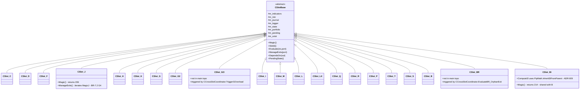
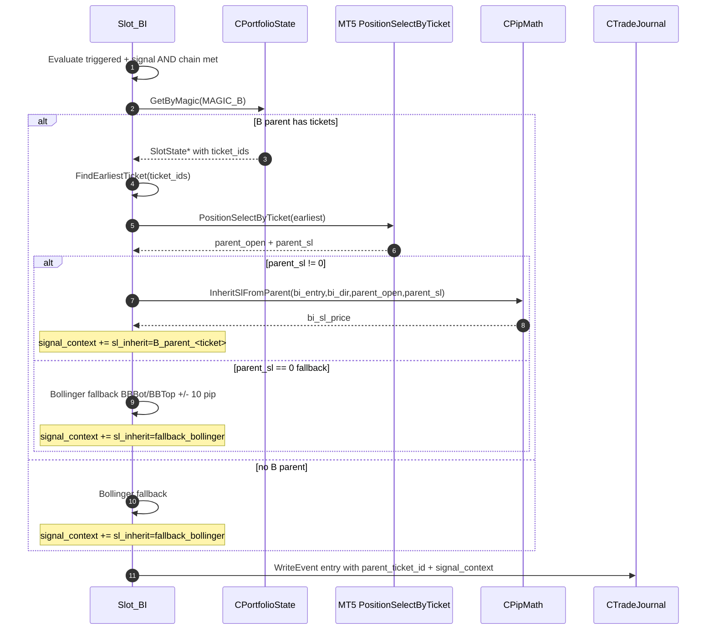
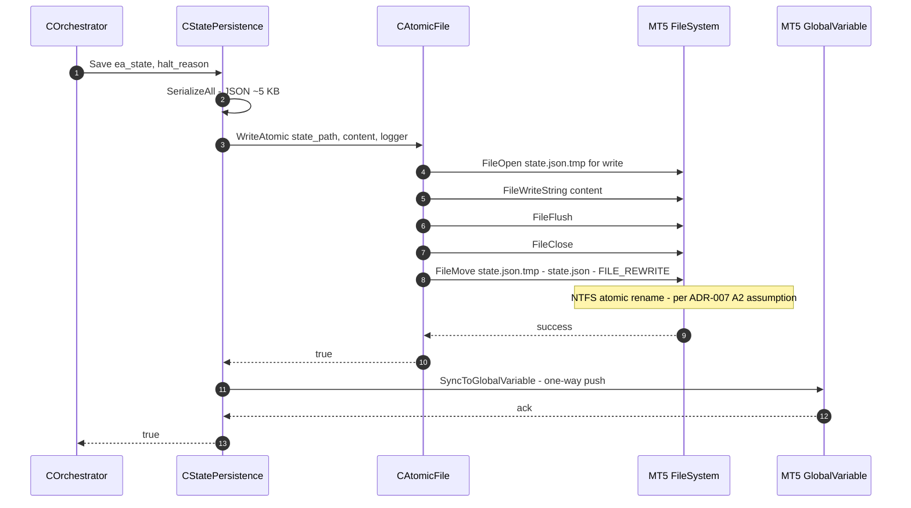
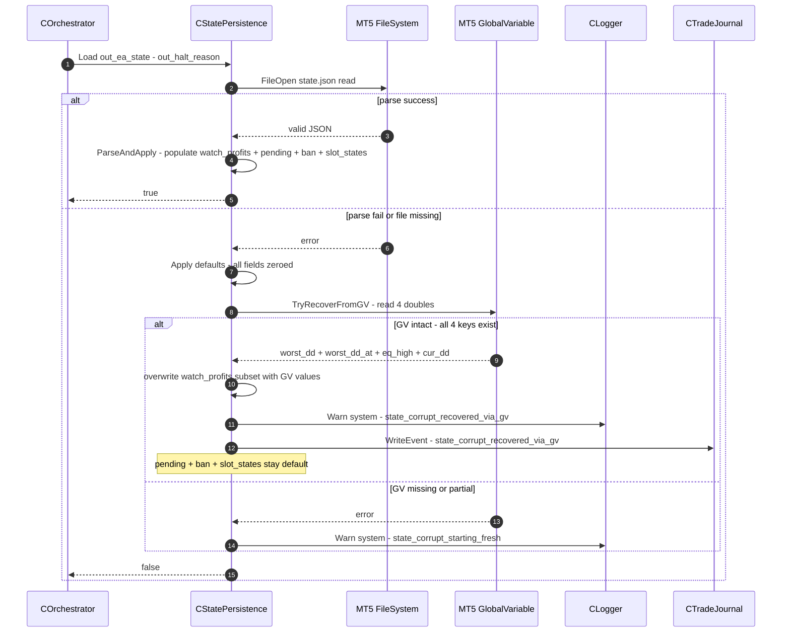
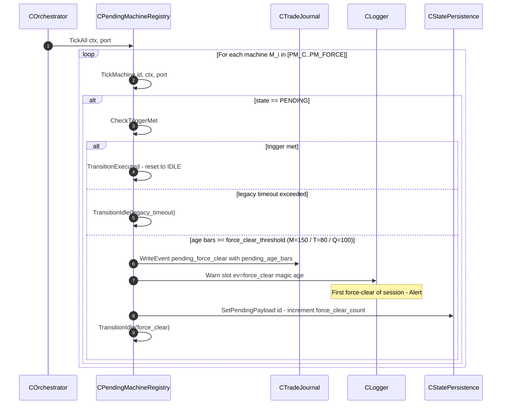

# 02 — Backend Design: PhoenicisNex

> **Phase:** Phase 1D (Technical Design) — Doc 1/3 (SD-as-Master consolidation; numbering 01/05/06/07/08 dropped intentionally)
> **Author:** Tech Lead agent (`/td` workflow)
> **Last updated:** 2026-05-02
> **Reads:** `docs/design-docs/02-08`, `docs/adr/001-012`, `docs/api-specs/*.yaml`, `docs/ba/02-05`
> **Audience:** Implementation Engineer (Phase 3I), Code Reviewer, QA (Phase 3T)

## TL;DR

เอกสารนี้ตกผลึก SD architecture ของ PhoenicisNex (modular monolith intra-MT5, ADR-001) ลงเป็น **class/module skeleton ที่ implementation engineer หยิบไป code ได้ทันที** — โครงสร้าง 5 layered modules (`core/` orchestration, `slots/` 21 strategy classes, `services/` 13 cross-cutting services, `domain/` pure types, `helpers/` pure utilities) ตาม ADR-012 file layout discipline. **Key pattern choices** (decisions ใน ADRs, skeletons ใน doc นี้): Composition Root + Constructor Injection (Orchestrator wires everything; ADR-002), CSlotBase abstract + 2-layer override enforcement (boot-time sentinel + runtime ExpertRemove; ADR-002), centralized IndicatorService owner-pattern (ADR-003), immutable per-tick MarketContext snapshot (ADR-004), CHashMap-based PortfolioState repository (ADR-005), Atomic-temp-rename file write (ADR-007), tagged structured Logger (ADR-011). **Cross-domain consistency** ✅ — slot interface signature ตรงกับ `slot-abstraction-contract.yaml`; `MarketContext` field set ตรงกับ `marketcontext-snapshot-schema.yaml`; trade journal record schema = authoritative ที่ `trade-journal-schema.yaml`. **Developer workflow** (§ 13) ระบุ compile → headless backtest → log review pipeline ตาม 3 SKILLs (`mt5-headless-backtest`, `mql-developer`, `mt5-log-reader`) เพื่อให้ engineer มี Definition-of-Done ที่วัดได้.

---

## 1. How to Read This Document

โครงเอกสารแบ่งเป็น 13 sections:

| Section | What |
|---------|------|
| § 2 | Project file layout — confirm ADR-012 tree + per-file LOC budget |
| § 3 | Domain types — `MarketContext`, `SlotState`, `EnumTypes`, `CSlotBase` skeletons |
| § 4 | Helpers — `CommentParser`, `PipMath`, `JsonWriter`, `AtomicFile` skeletons |
| § 5 | Services × 13 — interface + key methods + DI dependencies |
| § 6 | Slots × 21 — base contract + per-slot summary table |
| § 7 | Orchestrator + Composition root + DI map |
| § 8 | Mermaid class diagrams — services + slots layer |
| § 9 | Pattern code skeletons — Repository, post-exit hook, atomic write, JSON serializer |
| § 10 | Cross-domain trace matrix — TD ↔ API specs ↔ DB ↔ ADR |
| § 11 | (Reserved) Frontend N/A — see TD-03 |
| § 12 | Flow Appendix — non-obvious method-level sequences |
| § 13 | **Developer Workflow** — compile / test / headless backtest / log review (3 SKILLs) |

ทุก class skeleton ใช้ MQL5 syntax (PascalCase class, `m_` prefix members, camelCase methods); naming ตาม `mql-developer` skill convention. ทุก decision rationale อ้างอิง ADR (e.g. *"per ADR-007"*); pattern decision text **อยู่ใน ADR**, code skeleton **อยู่ที่นี่**.

---

## 2. Project File Layout

โครง folder confirm จาก ADR-012 — tree ลง 1 ระดับเพื่อให้ reviewer + AI agent navigate ได้:

```
MQL5/Experts/PhoenicisNex/
├── PhoenicisNex.mq5                # entry point (~ 200 LOC) — OnInit/OnTick/OnDeinit/OnTester thin wrapper
├── inputs/                         # 5 files; ≥ 80 input declarations (NFR-4.3)
│   ├── Inputs_General.mqh
│   ├── Inputs_TimeGates.mqh
│   ├── Inputs_Slot_<X>.mqh         # × 21 (1 per slot; group="Slot X" annotation per NFR-6.3)
│   ├── Inputs_Logging.mqh
│   └── Inputs_Pending.mqh
├── core/
│   ├── Orchestrator.mqh
│   ├── BootstrapValidator.mqh
│   ├── SlotRegistry.mqh
│   └── EAState.mqh
├── slots/
│   └── Slot_<X>.mqh                # × 21 (NFR-4.2 1:1 slot:file)
├── services/
│   ├── IndicatorService.mqh
│   ├── MarketContextBuilder.mqh
│   ├── PortfolioState.mqh
│   ├── RiskManager.mqh
│   ├── TradeJournal.mqh
│   ├── StatePersistence.mqh
│   ├── Logger.mqh
│   ├── CircuitBreaker.mqh
│   ├── TimeGate.mqh
│   ├── PendingMachineRegistry.mqh
│   ├── CrossSlotCoordinator.mqh
│   └── PortfolioMonitor.mqh
├── domain/
│   ├── MarketContext.mqh
│   ├── SlotState.mqh
│   ├── EnumTypes.mqh
│   └── CSlotBase.mqh
├── helpers/
│   ├── CommentParser.mqh
│   ├── PipMath.mqh
│   ├── JsonWriter.mqh
│   ├── AtomicFile.mqh
│   └── Timestamp.mqh                 # FormatTimestampWithMs() — ADR-006/011 ms precision
└── libs/                           # legacy lib re-use (TD assess per file)
```

**LOC budget ต่อไฟล์ (NFR-4.1 ≤ 5,000 LOC):**
- `Slot_<X>.mqh`: target 800-2,000; max 5,000 (split → `Slot_X_Entry.mqh` + `Slot_X_Exit.mqh` ถ้าเกิน)
- `services/`: target 200-800
- `core/`, `domain/`, `helpers/`: ≤ 500
- `inputs/*.mqh`: ≤ 200 (declaration-only)
- `PhoenicisNex.mq5`: ≤ 500

**`#include` discipline (per ADR-012, reviewer enforced):**
- `slots/*` ห้าม `#include "slots/<other>"` — slot-to-slot data ผ่าน `PortfolioState.GetByMagic()` เท่านั้น
- `services/*` ห้าม `#include "slots/*"` — wrong direction
- `domain/*` ห้าม `#include "services/*"` — pure types only
- `helpers/*` ห้าม `#include "services/*"` — pure utility only

---

## 3. Domain Types

`domain/` layer = pure types ที่ทุก layer ใช้ร่วมกัน — ไม่มี side effect, ไม่มี dependency ลง services.

### 3.1 `domain/EnumTypes.mqh` — shared enums

ระบุ enum ที่ใช้ข้าม layer — ต้อง stable เพราะ persist ใน state.json + journal record.

```mql5
//+------------------------------------------------------------------+
//| EnumTypes.mqh — shared enum types (no #include dependencies)     |
//+------------------------------------------------------------------+
#ifndef PHOENICISNEX_DOMAIN_ENUMTYPES_MQH
#define PHOENICISNEX_DOMAIN_ENUMTYPES_MQH

enum EEAState {
   EA_STATE_RUNNING       = 0,
   EA_STATE_HALTED        = 1,
   EA_STATE_HALTED_STABLE = 2
};

enum EPendingState {
   PENDING_STATE_IDLE     = 0,
   PENDING_STATE_PENDING  = 1,
   PENDING_STATE_EXECUTED = 2
};

enum ESeverity {
   LOG_DEBUG = 0,
   LOG_INFO  = 1,
   LOG_WARN  = 2,
   LOG_ERROR = 3
};

enum EPendingMachineId {
   PM_C, PM_C_ADX, PM_R, PM_P,
   PM_M, PM_T, PM_Q, PM_FORCE
};

enum EPSubMode {           // P-Pending sub-mode per `04-data-flow.md § 4.4` + ADR schema
   PSUB_NONE = 0,           // null / IDLE
   PSUB_N    = 1,           // transient — mode-decision branch unresolved
   PSUB_PX   = 2,           // Force fast-path
   PSUB_PH   = 3,           // Hull/Bollinger default
   PSUB_E    = 4            // P_Extra extension entry
};

#endif // PHOENICISNEX_DOMAIN_ENUMTYPES_MQH
```

**Magic number constants** เก็บใน `domain/EnumTypes.mqh` ที่ static const block ตาม BR-1.1 (200..220, ลบ 220 หลัง Slot U deletion):

```mql5
static const int MAGIC_CD = 200;  // C, D shared
static const int MAGIC_F  = 201;
static const int MAGIC_H  = 205;
static const int MAGIC_J  = 206;  // ⚠️ BR-7.2 fix — ExtraTakeProfit_J iterates this
static const int MAGIC_K  = 207;
static const int MAGIC_G  = 208;  // G, G2 shared
static const int MAGIC_L  = 211;  // L, LX shared
static const int MAGIC_GO = 209;
static const int MAGIC_M  = 210;
static const int MAGIC_Q  = 212;
static const int MAGIC_R  = 213;
static const int MAGIC_B  = 214;  // B, BI shared
static const int MAGIC_BR = 215;
static const int MAGIC_I  = 216;
static const int MAGIC_S  = 217;
static const int MAGIC_P  = 218;
static const int MAGIC_T  = 219;
// MAGIC_U = 220 — DELETED per OQ-8 (2026-05-01)
```

### 3.2 `domain/MarketContext.mqh` — immutable per-tick snapshot

**Responsibility:** struct ที่บรรจุ indicator value + derived signal สำหรับ 1 tick — pass `const &` ลง slot per ADR-004; field set lock ตรงกับ `marketcontext-snapshot-schema.yaml`.

```mql5
//+------------------------------------------------------------------+
//| MarketContext.mqh — immutable per-tick snapshot (ADR-004)        |
//| Schema: docs/api-specs/marketcontext-snapshot-schema.yaml         |
//+------------------------------------------------------------------+
#include "EnumTypes.mqh"

struct IchimokuFields {
   double tenkan[3];          // [bar 0, bar 1, bar 2]
   double kijun[3];
   double senkou_a[3];
   double senkou_b[3];
   double chikou[3];
   double cloud_high;          // derived: max(senkou_a[0], senkou_b[0])
   double cloud_low;           // derived: min(senkou_a[0], senkou_b[0])
};

struct ForceFields {
   double f0, f1, f2, f3;
   int    peak_pattern;        // -1 descending / 0 neutral / +1 ascending
};

struct AdxFields {
   double adx;
   double di_plus;
   double di_minus;
   double adx_wave;            // ADXW per CodeWiki §1.4
};

struct WprFields    { double wpr; double wpr_wave; };
struct BBFields     { double bb_top, bb_mid, bb_bot, bb_width, bb_ratio; };
struct DemFields    { double dem; };
struct StochFields  { double k_main; double d_signal; };
struct MacdFields   { double macd; double signal; double hist; int same_sign_loss_bars; };
struct RsiFields    { double rsi; };
struct HullFields   { double hull; double hull_slope; };
struct FractalFields{ double upper_fractal; double lower_fractal; bool has_upper; bool has_lower; };
struct ZigZagFields { double last_high; double last_low; };
struct SubDemFields { double support_zone; double demand_zone; bool has_support; bool has_demand; };

struct DerivedSignals {
   bool wpr_wave_signal;       // RunCheckWPRWaveWithIchimoku2 result
   bool adx_force_peak_valid;  // CheckADXWithForcePeakValid2 result
   bool ichi_double_bounce_active;
};

struct MarketContext {
   datetime tick_time;          // broker server time (EET, DST per C-10)
   double   bid;
   double   ask;
   double   spread_pip;          // (ask-bid) / (_Point * digit_multiplier)
   int      bar_index_h4;        // current H4 bar index (FR-8.1 cache key)

   IchimokuFields  ichi_h4;
   IchimokuFields  ichi_d1;
   ForceFields     force_h4;
   AdxFields       adx_h4;
   AdxFields       adx_d1;
   WprFields       wpr_h4;
   WprFields       wpr_d1;
   WprFields       wpr_m15;
   BBFields        bb_h4;
   DemFields       dem_h4;
   DemFields       dem_m15;
   StochFields     stoch_m10;
   StochFields     stoch_h4;
   MacdFields      macd_m10;
   MacdFields      macd_d1;
   RsiFields       rsi_h4;
   HullFields      hull_h4;
   FractalFields   fractal_h4;
   ZigZagFields    zigzag_m5;
   SubDemFields    subdem_h4;
   SubDemFields    subdem_d1;
   DerivedSignals  derived;
};
```

**ขนาด struct ประมาณ ~720 bytes** (ADR-004 estimate); pass-by-`const&` ที่ orchestrator → slot. ห้าม mutate ภายใน slot — `const` ในลายเซ็น `Evaluate(const MarketContext &ctx, ...)` enforce.

### 3.3 `domain/SlotState.mqh` — per-magic state record

**Responsibility:** struct ที่ `PortfolioState` (CHashMap) ใช้เก็บ state per magic; persist ผ่าน `StatePersistence` (ADR-005 + ADR-007).

```mql5
struct SlotState {
   int    magic;                // 200..220 per BR-1.1
   string slot_ids[];           // ["C","D"] for shared magic 200; single entry otherwise
   int    buy_count;
   int    sell_count;
   double total_lots;
   double total_profit;         // floating P/L
   datetime last_open_date;
   ulong  ticket_ids[];         // active position tickets
   double ticket_max_profit_pip[]; // parallel array, BR-5.2 trailing per ticket
   EPendingState pending_state;
   string pending_payload;      // serialized per pending machine (CPendingComment, MPendingAtPrice JSON)
};
```

### 3.4 `domain/CSlotBase.mqh` — abstract slot contract

**Responsibility:** abstract base class ของ 21 derived slot — define behavior contract 6 methods + 2-layer override enforcement (per ADR-002 + `slot-abstraction-contract.yaml`).

```mql5
//+------------------------------------------------------------------+
//| CSlotBase.mqh — abstract slot interface (ADR-002)                |
//| Schema: docs/api-specs/slot-abstraction-contract.yaml             |
//+------------------------------------------------------------------+
#include "EnumTypes.mqh"
#include "MarketContext.mqh"
#include "SlotState.mqh"

class CIndicatorService;
class CRiskManager;
class CTradeJournal;
class CLogger;
class CStatePersistence;
class CPortfolioState;
class CPendingMachineRegistry;
class CCrossSlotCoordinator;

class CSlotBase {
protected:
   // Constructor-injected services (per ADR-002 — ห้าม global singleton)
   CIndicatorService        *m_indicators;
   CRiskManager             *m_risk;
   CTradeJournal            *m_journal;
   CLogger                  *m_logger;
   CStatePersistence        *m_state;
   CPortfolioState          *m_portfolio;
   CPendingMachineRegistry  *m_pending;
   CCrossSlotCoordinator    *m_xslot;

public:
   void Init(CIndicatorService *ind, CRiskManager *rm, CTradeJournal *tj,
             CLogger *lg, CStatePersistence *sp, CPortfolioState *ps,
             CPendingMachineRegistry *pmr, CCrossSlotCoordinator *xs) {
      m_indicators = ind; m_risk = rm; m_journal = tj; m_logger = lg;
      m_state = sp; m_portfolio = ps; m_pending = pmr; m_xslot = xs;
   }

   // 6-method behavior contract — derived MUST override (sentinel default catches misses)
   virtual int           Magic()  const { return -1; }       // sentinel
   virtual string        SlotId() const { return "";   }     // sentinel

   virtual void Evaluate(const MarketContext &ctx, CPortfolioState &port) {
      m_logger.Error("CSlotBase","missing_override", Magic(), "Evaluate");
      ExpertRemove();    // runtime guarantee — never silent (ADR-002 layer 2)
   }

   virtual void ManageExits(CPortfolioState &port) {
      m_logger.Error("CSlotBase","missing_override", Magic(), "ManageExits");
      ExpertRemove();
   }

   virtual int DependsOn(int &out_magics[]) {
      m_logger.Error("CSlotBase","missing_override", Magic(), "DependsOn");
      ExpertRemove();
      return 0;
   }

   virtual EPendingState PendingState() const { return PENDING_STATE_IDLE; }  // safe default
};
```

**Why 2-layer enforcement (ADR-002):** MQL5 ไม่มี `=0` pure virtual = compile-time enforcement ทำไม่ได้. **Layer 1 (boot)** = `SlotRegistry::ValidateTopo()` call `Magic()` + `SlotId()` ทุก entry หลัง `RegisterAll()` → ถ้า returns `-1` / `""` → `INIT_FAILED`. **Layer 2 (runtime)** = base method body call `Logger.Error + ExpertRemove` → loud failure ที่ first invocation. ทำให้ "ลืม override" ห้ามเป็น silent no-op (= orphan positions).

---

## 4. Helpers

`helpers/` layer = pure utility ที่ไม่ depend services — testable isolation; ห้าม `#include` ลง services / slots.

### 4.1 `helpers/PipMath.mqh` — DigitMultipier-aware arithmetic

**Responsibility:** wrap pip ↔ price conversion ที่ respect 5-digit broker (BR-9.3); ใช้โดย `RiskManager`, BI SL fix (ADR-009), ทุก slot ที่คำนวณ SL/TP

```mql5
class CPipMath {
private:
   int m_digit_multiplier;     // 10 for 5-digit broker (FBS), 1 for 4-digit
public:
   void Init();                // auto-detect from _Digits at OnInit (BR-9.3)
   int  DigitMultiplier() const { return m_digit_multiplier; }

   // Convert price diff → pip count
   double PriceToPip(double price_diff) const {
      return MathAbs(price_diff) / (_Point * m_digit_multiplier);
   }

   // Convert pip → price diff (signed by direction)
   double PipToPrice(double pip) const {
      return pip * _Point * m_digit_multiplier;
   }

   // BI SL fix per ADR-009 — same SL distance as B parent (returns absolute SL price)
   double InheritSlFromParent(double bi_entry, ENUM_ORDER_TYPE bi_dir,
                              double parent_open, double parent_sl) const;
};
```

### 4.2 `helpers/CommentParser.mqh` — shared-magic disambiguation

**Responsibility:** parse + build order comment ที่มี slot prefix (BR-1.2 — `"C,..."`, `"G2,..."`, `"BI,..."`, `"LX,..."`, `"D,..."`) — central pattern ป้องกัน slot ลืมใส่ prefix.

```mql5
class CCommentParser {
public:
   // Build comment for outgoing order
   string Build(string slot_id, string body) const;     // "G2,reason=peak_inverse"

   // Parse incoming comment — extract slot prefix
   string ExtractSlotPrefix(string comment) const;       // "G2,..." → "G2"

   // Filter ticket array by slot prefix (used by shared-magic slot ManageExits)
   int FilterTicketsByPrefix(const ulong &ticket_ids_in[],
                             string slot_prefix,
                             ulong &ticket_ids_out[]) const;
};
```

### 4.3 `helpers/JsonWriter.mqh` — pure-MQL5 JSON serializer

**Responsibility:** serialize struct → JSON string (ไม่มี DLL per NFR-7.2); ใช้โดย `TradeJournal` + `StatePersistence`. JSON-Lines = 1 object/line (no array wrapper).

```mql5
class CJsonWriter {
private:
   string m_buffer;
   bool   m_first_field;       // for comma logic
   void   AppendComma();
public:
   void   Begin();              // reset; emit "{"
   void   End();                // emit "}"

   void   WriteString(string key, string value);         // escapes \ " \n
   void   WriteInt(string key, long value);
   void   WriteDouble(string key, double value, int digits);
   void   WriteBool(string key, bool value);
   void   WriteNull(string key);
   void   WriteRaw(string key, string raw_json);          // for nested object/array

   string ToString() const { return m_buffer; }
};
```

### 4.4 `helpers/AtomicFile.mqh` — atomic write with Option A primary + Option B fallback

**Responsibility:** central atomic write — Option A (temp+rename per ADR-007 § Decision) เป็น default; Option B (3-file double-buffered swap per ADR-007 § Option B) เป็น fallback ที่ activate **เฉพาะเมื่อ A2 spike (IMPL-046) fail**. **Interface NOT preserved across strategies** — Option A ใช้ single path, Option B ใช้ base directory + 3 files; แยก method per strategy + dispatcher pattern.

> ⚠️ **Honesty correction (per Claim 01.6):** SD round-01 + TD round-00 draft อ้าง "interface preserved" — incorrect, เพราะ Option B path semantic = base dir (ไม่ใช่ single file path) + ต้อง pass-through "active" pointer state. Engineer ที่ activate fallback ต้อง update StatePersistence call site จาก `WriteAtomic_TempRename(state.json, ...)` เป็น `WriteAtomic_DoubleBuffered(state/, ...)`. Refactor scope: AtomicFile + StatePersistence + state-persistence-schema.yaml v2 (3-file layout). Documented to set engineer expectation honestly.

```mql5
class CAtomicFile {
public:
   //--- Option A path (DEFAULT primary; ADR-007 § Decision) -------------
   // Write content to <path>.tmp → flush → close → FileMove(.tmp → <path>) atomic rename
   //   Returns true on success; logs error + returns false on any step fail
   bool WriteAtomic_TempRename(string path, string content, CLogger *logger);

   // Cleanup orphan <path>.tmp at OnInit (per ADR-007 § Recovery)
   void CleanupOrphanTmp(string path, CLogger *logger);

   //--- Option B path (ACTIVATED only if IMPL-046 A2 spike fails; ADR-007 § Option B) -------
   // Layout: <base_dir>/state-A.json + state-B.json + state-meta.bin (1-byte active pointer)
   //   Save: read meta → write inactive → flush → flip meta (1-byte single-sector atomic)
   bool WriteAtomic_DoubleBuffered(string base_dir, string content, CLogger *logger);

   //   Load: read meta → parse state-<active>.json; on parse fail → fall back to state-<other>.json
   //   Returns true if active or fallback parsed successfully; out_content = parsed payload
   bool ReadActiveBuffered(string base_dir, string &out_content, CLogger *logger);

   //--- Strategy selector (compile-time switch via #define ATOMIC_STRATEGY_OPTION_B) ---
   //   Default: ATOMIC_STRATEGY_OPTION_A (Option A primary)
   //   Activated: #define ATOMIC_STRATEGY_OPTION_B → all WriteAtomic dispatch ผ่าน Option B
   //   Caller (StatePersistence) ใช้ dispatcher; ไม่ต้องรู้ว่า strategy active = อะไร
   bool WriteAtomic(string path_or_base_dir, string content, CLogger *logger);
};
```

**Activation contract** (per ADR-007 § Revisit-when):
1. IMPL-046 spike: kill MT5 mid-write × 100 → measure corruption rate
2. ถ้า ≤ 0% (NFR-3.1 target) → keep Option A; remove Option B code paths in cleanup PR
3. ถ้า > 0% → flip `#define ATOMIC_STRATEGY_OPTION_B`; update `state-persistence-schema-v2.yaml` to 3-file layout; refactor StatePersistence call site (1-2 day rework expected per ADR-007 § Revisit-when)

---

## 5. Services Layer (13 services)

ทุก service มี single responsibility + constructor-injected dependencies + interface-style public method set; orchestrator (composition root) wire ทุกตัวใน OnInit.

### 5.1 `services/IndicatorService.mqh` — handle owner

**Responsibility:** owns ~25 indicator handles (TD spike Phase 1D locks exact count per ADR-003); fail-fast validation + 300-bar scan cache (FR-2.6, FR-7.6, FR-8.1, NFR-3.2).

```mql5
class CIndicatorService {
private:
   int m_handles[40];           // ~25 used; oversize for safety
   int m_handle_count;
   int m_last_bar_index_h4;     // for cache invalidation
   // CachedScan storage (key→value map, ~10 entries)
   string m_scan_keys[10];
   double m_scan_values[10];
   int    m_scan_count;
   CLogger *m_logger;
public:
   void Init(CLogger *logger);

   // OnInit: create + validate all handles (FR-7.6 / NFR-3.2)
   bool CreateHandles();        // returns false if ANY INVALID_HANDLE → orchestrator INIT_FAILED

   // OnTick step 1: refresh internal buffers via CopyBuffer × ~25 handles (~200 µs target)
   void Refresh();

   // Runtime fail-fast check (rare; OnInit should catch)
   bool AnyHandleInvalid() const;

   // 300-bar scan cache (FR-8.1) — invalidate on new H4 bar
   double CachedScan(string key, double (*scan_fn)(int handle, int depth));

   // OnDeinit: release handles
   void ReleaseHandles();

   // Accessors used by MarketContextBuilder
   int GetHandle(int idx) const { return m_handles[idx]; }

   // Handle count accessor — used by Orchestrator init_ok log (Claim 02.5)
   int HandleCount() const { return m_handle_count; }
};
```

**Note:** เก็บ handle indices เป็น symbolic constants ใน private impl (e.g., `IDX_ICHI_H4 = 0, IDX_ICHI_D1 = 1, ...`); MarketContextBuilder อ่านผ่าน accessor ที่ฉลากชัด แทน raw index.

### 5.2 `services/MarketContextBuilder.mqh` — snapshot builder

**Responsibility:** สร้าง immutable `MarketContext` struct 1 ครั้งต่อ tick จาก `IndicatorService` buffers (ADR-004); precompute derived signals (`wpr_wave_signal`, `adx_force_peak_valid`).

```mql5
class CMarketContextBuilder {
private:
   CIndicatorService *m_indicators;
public:
   void Init(CIndicatorService *ind) { m_indicators = ind; }

   // Build per-tick snapshot (~50 µs target per `03 § 2.3`)
   MarketContext Build() const;

private:
   // Precompute helpers (replaces EA เดิม global RunCheckWPRWaveWithIchimoku2 + CheckADXWithForcePeakValid2)
   bool ComputeWprWaveSignal() const;
   bool ComputeAdxForcePeakValid() const;
   bool ComputeIchiDoubleBounce() const;
   int  ClassifyForcePeak(double f0, double f1, double f2, double f3) const;
};
```

### 5.3 `services/PortfolioState.mqh` — CHashMap-based repository (ADR-005)

**Responsibility:** O(1) per-magic SlotState lookup; refresh 1 ครั้งต่อ tick จาก `PositionsTotal()`; replaces EA เดิม global swarm; **17 entries** (BR-1.1: 21 slots − 4 shared groups (C/D, G/G2, B/BI, L/LX) แต่ละ group share 1 magic → 17 distinct magics: 200, 201, 205-219).

```mql5
#include <Generic\HashMap.mqh>

class CPortfolioState {
private:
   CHashMap<int, SlotState*> m_map;       // key = magic, value = heap-allocated SlotState
   int  m_magic_list[17];                  // iteration order for Refresh (17 distinct magics per BR-1.1)
   int  m_magic_count;
   CLogger *m_logger;

public:
   void Init(CLogger *logger);

   // OnInit: pre-populate 17 entries (1 per distinct magic per BR-1.1)
   void RegisterAll();

   // Boot-time invariant — BootstrapValidator asserts MagicCount() == 17 (per ADR-005 + BR-1.1)
   int  MagicCount() const { return m_magic_count; }

   // OnTick step H: refresh from broker (~100 µs target per `03 § 2.3`)
   void Refresh();

   // Slot accessor — O(1) average (AC-2.7.2)
   SlotState* GetByMagic(int magic);

   // Filter shared-magic positions by comment prefix (uses CommentParser helper)
   int GetTicketsForSlot(int magic, string slot_prefix, ulong &out_tickets[]) const;

   // Aggregate accessor for cross-slot helpers (Safe-port etc.)
   int    TotalActivePositions() const;
   double TotalFloatingPL() const;
   void   GetSlotCounts(string &slot_ids[], int &counts[]) const;

   // OnDeinit: release heap-allocated SlotState entries
   void ReleaseAll();
};
```

### 5.4 `services/RiskManager.mqh` — lot calculation

**Responsibility:** per-slot lot multiplier dispatch (BR-4.1 — 21-row formula table) + LimitMaxLotSizeRatio cap (BR-4.2) + min volume floor (BR-4.3); preserve baseline 1:1 = G3 driver. ทุก slot_id ที่ ComputeLot รองรับ ต้อง explicit branch (ห้าม silent fallback) — engineer reading § 5.4.1 ได้ formula ตรงกับ BA BR-4.1 row-by-row.

```mql5
class CRiskManager {
private:
   double m_main_risk_ratio;                 // input (FIDValue / MainRiskRatio)
   double m_limit_max_lot_size_ratio;         // input (default 2.9)
   CPortfolioState *m_portfolio;              // for J/BI/I formulas ที่ require parent slot read
   CLogger *m_logger;
public:
   void Init(double main_risk_ratio, double limit_max_lot_size_ratio,
             CPortfolioState *port, CLogger *logger);

   // Per-slot lot calc — dispatch ตาม slot_id (full table § 5.4.1)
   //   sl_pips = SL distance (BR-4.1 ที่ใช้ ratio formula); balance = AccountInfoDouble(ACCOUNT_BALANCE)
   //   extra_multiplier = peak/wave multiplier (per BR-4.1 — peak 1..2.5 สำหรับ C/H, wave สำหรับ K, ฯลฯ)
   double ComputeLot(string slot_id, double sl_pips, double balance, double extra_multiplier = 1.0);

   // Cap + floor (BR-4.2 + BR-4.3); logs warn when clamped
   double ClampLot(double raw_lot, string slot_id);

private:
   // Per-slot helpers สำหรับ formula ที่ต้อง read external state
   double ComputeLotForJ (double extra);   // LastBuyLots2 × 0.23 × OpenOrderJ — read CD parent
   double ComputeLotForBI(double parent_b_lot);   // 23.6% ของ B parent (per ADR-009 sibling — lot only, ไม่ใช่ SL)
   double ComputeLotForI (double parent_g_lot);   // Fibonacci of G parent
   double ComputeLotForS (double percent_tp);     // BR-4.1 percentTP ∈ {5, 10, 15}
   double ComputeLotForK (double balance, double extra);  // K = wave variant
};
```

#### 5.4.1 Per-slot formula dispatch (mirror BR-4.1 row-by-row)

> ตาราง Implementation นี้ mirror ตรงกับ `docs/ba/04-business-rules.md § 5 BR-4.1` — bridge "TBD" ที่ method signature เก็บซ่อนอยู่ (Claim 01.10 fix). Engineer reading TD-02 § 5.4.1 ได้ formula ตรง โดยไม่ต้องเปิด BA. Cross-reference: BR-4.1 row N → branch ใน `ComputeLot` body.

```mql5
double CRiskManager::ComputeLot(string slot_id, double sl_pips, double balance, double extra_multiplier) {
   double base = balance * m_main_risk_ratio;        // FIDValue / MainRiskRatio per BR-4.1 base rule
   // ทุก branch return raw lot (pre-cap); ClampLot() apply BR-4.2 cap + BR-4.3 min floor
   if (slot_id == "C")  return base * 0.15 * extra_multiplier;             // 15% × peak 1..2.5
   if (slot_id == "D")  return base * 0.15 * extra_multiplier;             // shared CD chain
   if (slot_id == "F")  return base * 0.10 * extra_multiplier;             // 10% chained from CD
   if (slot_id == "J")  return ComputeLotForJ(extra_multiplier);           // LastBuyLots2 × 0.23 × OpenOrderJ
   if (slot_id == "H")  return base * 0.15 * extra_multiplier;             // 15% × 0.1..2.55
   if (slot_id == "K")  return ComputeLotForK(balance, extra_multiplier);  // wave variant
   if (slot_id == "G")  return base * 0.30 * 0.6 * extra_multiplier;       // 30% × OpenOrderG 0.6
   if (slot_id == "G2") return base * 0.15 * 0.7 * extra_multiplier;       // 15% × wave 0.7
   if (slot_id == "GO") return base * 0.30 * extra_multiplier;             // post-exit hook from G close
   if (slot_id == "I")  return ComputeLotForI(/* parent_g_lot from PortfolioState */ 0.0);
   if (slot_id == "M")  return base * 0.20 * extra_multiplier;             // 20% × peak 0.6..2.0
   if (slot_id == "L")  return base * 0.15 * extra_multiplier;             // 15% (L)
   if (slot_id == "LX") return base * 0.10 * extra_multiplier;             // pyramid of L
   if (slot_id == "Q")  return base * 0.15 * extra_multiplier;             // 15% × 0.5..2.5
   if (slot_id == "R")  return base * 0.20 * extra_multiplier;             // 20% × 0.5..1.5
   if (slot_id == "P")  return base * 0.15 * extra_multiplier;             // 15% (8% สำหรับ P_Extra branch)
   if (slot_id == "T")  return base * 0.20 * extra_multiplier;             // 20% × 0.4..2.0
   if (slot_id == "S")  return ComputeLotForS(extra_multiplier);           // percentTP ∈ {5,10,15}
   if (slot_id == "B")  return base * 0.20 * extra_multiplier;             // 20% × peak
   if (slot_id == "BR") return base * 0.10 * extra_multiplier;             // orphan exit-only (low risk)
   if (slot_id == "BI") return ComputeLotForBI(/* parent_b_lot from PortfolioState */ 0.0);
   // Unknown slot_id = ADR-002 violation → log + return 0 to surface bug fast
   m_logger.Error("RiskManager", "unknown_slot_id", 0, slot_id);
   return 0.0;
}
```

> **Reviewer checklist:** ทุก slot ใน BR-1.1 magic table (21 entries) ต้องมี explicit branch ใน ComputeLot; ทุก formula ต้องมี comment อ้างอิง BR-4.1 row หรือ helper method หากต้อง read external state (J, BI, I, S).

> **Note on extra_multiplier semantic:** บาง slot pass ผ่าน peak detector value (C/H/M/Q/R/B), บาง slot pass wave value (K/G2), บาง slot pass percentTP literal (S = 5/10/15). Caller responsibility ที่ slot Evaluate populate appropriate value; reviewer cross-check ใน per-slot Evaluate skeleton.

### 5.5 `services/TradeJournal.mqh` — JSON-Lines journal (ADR-006)

**Responsibility:** per-event journal write with degrade-warn-but-continue (NFR-2.2); monthly rotation live, per-run tester namespace; record schema = `trade-journal-schema.yaml` (TD ห้ามเพิ่ม field โดยไม่ update YAML).

```mql5
// JournalEvent = caller-populated struct ที่ TradeJournal เก็บค่า ก่อน serialize ผ่าน BuildRecord.
// Schema authority = trade-journal-schema.yaml (TD ห้าม remove/rename field; เพิ่มได้ + bump schema_version).
// Required-by-schema fields ที่ TradeJournal-internal generate (ไม่ require caller populate):
//   - schema_version → JOURNAL_SCHEMA_VERSION compile-time const = 1
//   - mode → m_is_tester ? "tester" : "live" (set ที่ Open())
struct JournalEvent {
   // Timestamp (per yaml line 36: ISO-8601 with millisecond + Z)
   //   Caller populate ที่ event time (TimeCurrent() + GetMicrosecondCount snapshot);
   //   TradeJournal::BuildRecord จะ format เป็น "YYYY-MM-DDTHH:MM:SS.mmmZ"
   datetime timestamp_seconds;     // broker server time at event
   ulong    timestamp_microseconds; // GetMicrosecondCount() snapshot — used to derive ms field
   // (schema_version + mode = TradeJournal-internal, ไม่อยู่ใน caller struct)

   string event_type;          // "entry"|"exit"|"modify"|"reject"|"halt"|"halt_stable"|"pending_force_clear"|"exit_inferred"|"discovered"
   string slot_id;
   int    magic;
   ulong  ticket_id;            // 0 if not applicable
   string symbol;               // "EURUSD"
   string order_type;           // "buy"|"sell"|""
   double lot;
   double price;
   double sl;
   double tp;
   string comment;
   string signal_context;       // "key=value;key=value;..."
   string triggering_function;
   ulong  parent_ticket_id;
   string halt_reason;          // populated on event_type==halt
   int    pending_age_bars;     // populated on event_type==pending_force_clear
};

// Compile-time constant — bump on schema break (per ADR-006 versioning)
#define JOURNAL_SCHEMA_VERSION 1

class CTradeJournal {
private:
   int    m_handle;
   bool   m_is_tester;
   datetime m_current_month;     // for rotation detect
   string m_active_path;
   // Overshoot window (NFR-2.2)
   ulong  m_overshoot_window[10];
   int    m_overshoot_idx;
   // RPO escalation (ADR-006)
   int    m_consecutive_failures;
   CMarketContextBuilder *m_ctx_builder;     // for indicator_snapshot subset
   CPortfolioState       *m_portfolio;
   CLogger               *m_logger;
   CStatePersistence     *m_state;            // for journal_metrics counter

public:
   void Init(CMarketContextBuilder *cb, CPortfolioState *port,
             CLogger *logger, CStatePersistence *state);

   // OnInit: open journal file (live or tester namespace per ADR-006)
   bool Open();

   // Sync write per event (~1-3 ms/event Windows local SSD)
   void WriteEvent(const JournalEvent &ev);

   // OnTick start (rotation check; cheap when no rotation needed)
   void RotateIfNeeded();

   // OnDeinit: flush + close
   void Close();

   // ADR-006 RPO contract — Orchestrator polls each tick; trigger Halt() if returns true
   //   out_consecutive surfaces current consecutive-fail count for log message
   bool ShouldHaltSustained(int &out_consecutive) const {
      out_consecutive = m_consecutive_failures;
      return m_consecutive_failures >= JOURNAL_HALT_THRESHOLD;   // const = 10 per ADR-006
   }

private:
   void   BuildRecord(const JournalEvent &ev, string &out_json);
   string BuildIndicatorSnapshotSubset(string slot_id) const;     // per-slot relevant subset
   string BuildPortfolioSummary() const;

   // Called by WriteEvent() at FileWriteString fail branch:
   //   1. m_consecutive_failures++; m_state.IncrementJournalFailures();
   //   2. m_logger.Error("system", "journal_write_fail", 0, reason) (throttled per ADR-011)
   //   3. ShouldHaltSustained() polled by Orchestrator step 13b → Halt("journal_write_fail_sustained")
   void HandleWriteFailure(string reason);

   // Called on successful WriteEvent — reset consecutive counter (cumulative write_failures preserved)
   void ResetConsecutiveOnSuccess() { m_consecutive_failures = 0; m_state.ResetJournalConsecutive(); }
};

// ADR-006 RPO contract constant — bump-resistant via header location
#define JOURNAL_HALT_THRESHOLD 10
```

### 5.6 `services/StatePersistence.mqh` — atomic state file (ADR-007)

**Responsibility:** end-of-tick `Save()` + OnInit `Load()` ของ `state.json` ผ่าน `AtomicFile.WriteAtomic`; canonical source-of-truth (mirrors subset to MT5 GlobalVariable per `02 § 6.1.1`).

```mql5
class CStatePersistence {
private:
   string m_state_dir;          // MQL5/Files/PhoenicisNex/state/
   string m_state_path;         // state.json
   CAtomicFile *m_atomic;
   CLogger    *m_logger;
   CPortfolioState *m_portfolio; // serialize source — set ผ่าน SetPortfolioState() (2-phase per § 7.3)
   // Cached metrics (mirrored from journal/logger services)
   int m_journal_write_failures;
   int m_journal_consecutive_failures;
   int m_logger_throttled_alert_count;
   string m_logger_last_throttle_event;
   bool m_dirty;                 // dirty-bit throttle (perf optimization, default off — preserve baseline)

public:
   // Phase 1 init — no PortfolioState dep yet (PortfolioState ยังไม่ instantiated ที่ DI step 6)
   void Init(CAtomicFile *atomic, CLogger *logger);

   // Phase 2 setter — Orchestrator เรียกหลัง PortfolioState.Init() (DI step 5a per § 7.3)
   void SetPortfolioState(CPortfolioState *port);

   // OnInit: parse state.json (or defaults if missing/corrupt); orphan tmp cleanup;
   // ถ้า state.json corrupt + GV intact → recover watch_profits subset จาก GV per `02 § 6.1.1`
   bool Load(EEAState &out_ea_state, string &out_halt_reason);

   // End-of-tick: serialize + atomic write (~800 µs target per `03 § 2.3`)
   // Defensive guard: if (m_portfolio == NULL) → log Error + return false
   bool Save(EEAState ea_state, string halt_reason);

   // Push subset to MT5 GlobalVariable (one-way, post-Save per `02 § 6.1.1`)
   void SyncToGlobalVariable();

   // GV last-resort recovery (per `02 § 6.1.1` + `04 § 5.2`); called จาก Load() when state.json parse fail
   bool TryRecoverFromGV(double &out_worst_dd, double &out_worst_dd_at,
                         double &out_eq_high_water, double &out_current_dd);

   // Accessor for HALTED_STABLE Alert message (per § 7.2 line 1211)
   int GetLoggerThrottledCount() const { return m_logger_throttled_alert_count; }

   // Path accessors — used by Orchestrator Phase C orphan tmp cleanup (ADR-007 § Recovery — Claim 02.4)
   //   ทำให้ StatePersistence ยัง own canonical path; AtomicFile.CleanupOrphanTmp consumes ผ่าน accessor
   string StatePath() const { return m_state_path; }   // MQL5/Files/PhoenicisNex/state/state.json
   string StateDir()  const { return m_state_dir; }    // MQL5/Files/PhoenicisNex/state/

   // Pending machine accessor — caller mutates payload (PendingMachineRegistry only)
   string GetPendingPayload(EPendingMachineId id) const;
   void   SetPendingPayload(EPendingMachineId id, string payload, int started_bar);

   // Ban date accessor (TimeGate + slot)
   datetime GetBanDate(string ban_field) const;       // "ban_c" | "ban_l" | "ban_m" | "k_last_order" | "g_pause"
   void     SetBanDate(string ban_field, datetime ts);

   // Metric counters (TradeJournal + Logger service write to these)
   void IncrementJournalFailures();
   void ResetJournalConsecutive();
   void IncrementLoggerThrottle(string slot_event_tuple);

private:
   string SerializeAll(EEAState ea_state, string halt_reason) const;
   bool   ParseAndApply(string content, EEAState &out_ea_state, string &out_halt_reason);
};
```

### 5.7 `services/Logger.mqh` — tagged structured logger (ADR-011)

**Responsibility:** central log emission ที่ format `[YYYY-MM-DD HH:MM:SS.ms][LEVEL][slot=<X>][ev=<E>][magic=<N>] <msg>`; severity routing (DEBUG/INFO/WARN/ERROR); ERROR + Alert with throttle + halt-trigger bypass.

```mql5
class CLogger {
private:
   ESeverity m_min_level;
   bool      m_alert_on_error;
   int       m_escalation_n;        // ADR-011 escalation threshold (default InpErrorEscalationN=10)
   // Throttle window: per-(slot,event) tuple within 100 ticks
   // Capacity rationale (per ADR-011): worst-case = 21 slots × 3 high-cardinality events
   //   (entry/exit/reject) = 63 distinct tuples; 64 = +1 headroom.
   // Eviction policy: ที่ buffer full + new tuple → evict entry ที่ tick_count oldest (LRU)
   //   + emit Logger.Warn `"throttle_buffer_evicted"` for visibility (tunable via Init param).
   string m_recent_keys[64];
   int    m_recent_tick_count[64];
   int    m_consecutive_count[64];  // ADR-011 escalation tracking — counts consecutive *ticks* (not calls)
   int    m_last_tick_seen[64];     // tick_counter ของ last Error() call ของ tuple (Claim 02.9 fix)
   int    m_recent_count;
   int    m_tick_counter;
   // 2-phase init: m_state ถูก wire ผ่าน SetStatePersistence() หลัง StatePersistence ready
   // (Logger.Init = DI step 1 อยู่ก่อน StatePersistence = DI step 6 — ถ้ารับ state ใน Init จะ null-deref).
   // จนกว่าจะถูก set: throttle counter recording = no-op; throttle/escalate logic ทำงานได้ ปกติ.
   CStatePersistence *m_state;     // for throttled_alert_count metric (nullable)

public:
   // Phase 1 init — no StatePersistence dep yet (DI step 1 = before SP construct)
   void Init(ESeverity min_level, bool alert_on_error, int escalation_n);

   // Phase 2 setter — Orchestrator เรียกหลัง StatePersistence.Init() (DI step 4a per § 7.3)
   // จากจุดนี้ throttle counter เริ่ม persist ผ่าน SP ลง state.json
   void SetStatePersistence(CStatePersistence *state);

   // Severity methods (FR-4.2)
   void Debug(string slot, string event_name, int magic, string msg);
   void Info (string slot, string event_name, int magic, string msg);
   void Warn (string slot, string event_name, int magic, string msg);
   void Error(string slot, string event_name, int magic, string msg);    // also Alert (throttled + escalate)

   // Halt-trigger bypass (CircuitBreaker, IndicatorService runtime invalid, journal sustained-failure)
   // — never throttle Alert. Caller responsibility: invoke Bypass variant for halt-causing errors;
   //   regular Error() ใช้ throttle path. Documented in ADR-011 § Halt-trigger bypass.
   void ErrorBypassThrottle(string slot, string event_name, int magic, string msg);

   // Per-tick callback (orchestrator) — bumps counter for throttle window
   void OnTickBoundary();

private:
   string FormatLine(ESeverity level, string slot, string event_name, int magic, string msg) const;
   bool   ShouldThrottleAlert(string slot, string event_name);
   void   EscalateIfThresholdMet(string slot, string event_name);  // ADR-011 N-consecutive escalation
   // LRU when buffer full. **Eviction-reuse contract (Claim 03.6):** เมื่อ idx ถูก reuse
   //   สำหรับ tuple ใหม่ (existing slot ถูก evict), callee MUST reset parallel arrays ที่ idx
   //   นั้น ก่อน return: `m_consecutive_count[idx] = 0` + `m_last_tick_seen[idx] = 0`
   //   (= ป้องกัน ghost continuation จาก stale state ของ tuple เก่าทำให้ false-escalate
   //   เมื่อ recycled idx coincidence กับ tick adjacency ของ tuple ใหม่).
   int    FindOrEvictKey(string key);
};
```

### 5.8 `services/CircuitBreaker.mqh` — ping-pong detector (BR-3.6)

**Responsibility:** detect same position re-open within 3000ms → trigger HALT (FR-6.6).

```mql5
class CCircuitBreaker {
private:
   // Ring buffer of recent (magic, direction, close_time) tuples
   struct CloseEvent { int magic; int direction; datetime close_time_ms; };
   CloseEvent m_buffer[16];
   int        m_idx;
   CLogger   *m_logger;

public:
   void Init(CLogger *logger);

   // Called per tick; triggers halt if ping-pong detected
   bool CheckPingPong(CPortfolioState &port, datetime now_ms);

   // Called by slot post-OrderSend ack to record open events
   void RecordOpen(int magic, int direction, datetime now_ms);
   void RecordClose(int magic, int direction, datetime now_ms);
};
```

### 5.9 `services/TimeGate.mqh` — time-based filters

**Responsibility:** time + spread + ban gates (BR-3.x). All `datetime` ใช้ `TimeCurrent()` (broker server time, EET DST handled natively per FR-6.5).

```mql5
class CTimeGate {
private:
   int m_morning_window_minutes;   // input default 5 (00:00-00:05)
   int m_monday_spread_threshold;  // input default 10
   int m_holiday_start_month;      // input default 12
   int m_holiday_start_day;        // input default 21
   int m_holiday_end_month;        // input default 1
   int m_holiday_end_day;          // input default 3
   CPipMath          *m_pip;
   CStatePersistence *m_state;
   CLogger           *m_logger;

   // Per-slot ban cooldown bars (BR-3.4) — added to make Init explicit per Claim 01.15
   int m_ban_c_cooldown_bars;          // input default 5 (H4 bars after C close-loss)
   int m_ban_l_cooldown_bars;          // input default 5
   int m_ban_m_cooldown_bars;          // input default 5
   int m_k_last_order_cooldown_bars;   // input default 4
   int m_g_pause_cooldown_bars;        // input default 3

public:
   void Init(int morning_window_minutes,        // BR-3.1 default 5 (00:00-00:05 broker time)
             int monday_spread_threshold,        // BR-3.2 / BR-3.7 default 10 points
             int holiday_start_month,            // BR-3.3 default 12
             int holiday_start_day,              // BR-3.3 default 21
             int holiday_end_month,              // BR-3.3 default 1
             int holiday_end_day,                // BR-3.3 default 3
             int ban_c_cooldown_bars,            // BR-3.4 — see fields above
             int ban_l_cooldown_bars,
             int ban_m_cooldown_bars,
             int k_last_order_cooldown_bars,
             int g_pause_cooldown_bars,
             CPipMath *pip,
             CStatePersistence *state,
             CLogger *logger);

   // BR-3.1
   bool IsMorningWakeup(datetime server_now) const;
   // BR-3.2 / BR-3.7
   bool IsMondaySpreadHigh(datetime server_now, int spread_points) const;
   // BR-3.3
   bool IsNewYearSeason2(datetime server_now) const;
   bool HolidayBlock(datetime server_now, CPortfolioState &port) const;  // includes CD count gate

   // BR-3.4 ban cooldown — slot_id allowlist enforced (Claim 01.18 fix)
   //   Allowlist = {C, L, M, K, G} per BR-3.4; calls with slot_id outside list →
   //   m_logger.Error("TimeGate","ban_unknown_slot",..) + early return (no silent failure per NFR-3.4)
   bool IsBanned(string slot_id, datetime server_now) const;
   void SetBan (string slot_id, datetime server_now);

private:
   // Whitelist guard — central per Claim 01.18
   bool IsBanAllowedSlot(string slot_id) const {
      return slot_id == "C" || slot_id == "L" || slot_id == "M" ||
             slot_id == "K" || slot_id == "G";
   }
};
```

### 5.10 `services/PendingMachineRegistry.mqh` — pending state machines (BR-6.x + ADR-008)

**Responsibility:** orchestrate 7 pending machines (C, C-ADX, R, P, M, T, Q + Force-Pending cross-slot) + force-clear policy (M=150, T=80, Q=100 H4 bars per ADR-008); persist via `StatePersistence`.

```mql5
class CPendingMachineRegistry {
private:
   // Per-machine state (cached from StatePersistence on Init; mutable in RAM; persist end-of-tick)
   struct MachineState {
      EPendingState state;
      int           pending_started_bar;
      string        pending_payload;     // serialized per machine
      int           force_clear_count;
   };
   MachineState m_machines[8];           // PM_C..PM_FORCE
   // Per-machine force-clear thresholds (input)
   int m_threshold_m_bars;                // default 150 per ADR-008
   int m_threshold_t_bars;                // default 80
   int m_threshold_q_bars;                // default 100
   CStatePersistence *m_state;
   CTradeJournal     *m_journal;
   CLogger           *m_logger;
   CPortfolioState   *m_portfolio;

   // Per-machine legacy timeouts (BR-6.x) — added to make Init explicit per Claim 01.15
   int m_legacy_c_bars;          // BR-6.1 default 8
   int m_legacy_c_adx_bars;      // BR-6.2 default 30
   int m_legacy_r_bars;          // BR-6.3 default 40
   int m_legacy_p_bars;          // BR-6.4 default 70
   int m_legacy_force_bars;      // BR-6.8 default 9

public:
   void Init(int threshold_m_bars,            // InpForceClearM_Bars (ADR-008 default 150)
             int threshold_t_bars,            // InpForceClearT_Bars (ADR-008 default 80)
             int threshold_q_bars,            // InpForceClearQ_Bars (ADR-008 default 100)
             int legacy_c_bars,               // BR-6.1 default 8
             int legacy_c_adx_bars,           // BR-6.2 default 30
             int legacy_r_bars,               // BR-6.3 default 40
             int legacy_p_bars,               // BR-6.4 default 70
             int legacy_force_bars,           // BR-6.8 default 9
             CStatePersistence *state,
             CTradeJournal *journal,
             CLogger *logger,
             CPortfolioState *port);

   // Called per tick AFTER PortfolioState.Refresh() (F1 step 6)
   void TickAll(const MarketContext &ctx, CPortfolioState &port);

   // Per-machine accessor (slot reads to check own pending state)
   EPendingState GetState(EPendingMachineId id) const;
   string        GetPayload(EPendingMachineId id) const;

   // Per-machine transitions (slot calls when needed)
   void EnterPending(EPendingMachineId id, string payload, int current_bar);
   void TransitionExecuted(EPendingMachineId id);
   void TransitionIdle(EPendingMachineId id, string reason);

private:
   void TickMachine(EPendingMachineId id, const MarketContext &ctx, CPortfolioState &port);
   bool ShouldForceClear(EPendingMachineId id, int current_bar) const;
   void EmitForceClear(EPendingMachineId id, int age_bars);
};
```

**Per-machine TickMachine logic** (skeleton; concrete branch per BR-6.x lives ใน per-machine private method):

```mql5
void TickMachine(EPendingMachineId id, const MarketContext &ctx, CPortfolioState &port) {
   MachineState &m = m_machines[id];
   if (m.state != PENDING_STATE_PENDING) return;
   int age = ctx.bar_index_h4 - m.pending_started_bar;

   // Check trigger condition first (per-machine logic)
   if (CheckTriggerMet(id, ctx, port)) {
      TransitionExecuted(id);
      return;
   }
   // Check legacy timeout (C=8, C-ADX=30, R=40, P=70, Force=9 bars per BR-6.x)
   if (ExceededLegacyTimeout(id, age)) {
      TransitionIdle(id, "legacy_timeout");
      return;
   }
   // Check force-clear (M=150, T=80, Q=100 per ADR-008) — only for M/T/Q
   if (ShouldForceClear(id, ctx.bar_index_h4)) {
      EmitForceClear(id, age);
      TransitionIdle(id, "force_clear");
   }
}
```

### 5.11 `services/CrossSlotCoordinator.mqh` — cross-slot bulk cleanup (BR-8.x)

**Responsibility:** Safe-port (BR-8.1), OrderGroup#2 (BR-8.2), ForceCutloss (BR-8.3), ExtraCheckFunction2 (BR-8.5), Overload helpers (BR-8.4); HALTED-aware enable matrix per `04 § 9.1`.

```mql5
class CCrossSlotCoordinator {
private:
   CPortfolioState *m_portfolio;
   CTradeJournal   *m_journal;
   CLogger         *m_logger;
   CRiskManager    *m_risk;
   bool m_halted;                  // updated each tick from EAState

public:
   void Init(CPortfolioState *port, CTradeJournal *tj, CLogger *lg, CRiskManager *rm);

   // Called by orchestrator each tick — sets internal flag
   void SetHalted(bool halted) { m_halted = halted; }

   // Exit-side helpers — RUN in both RUNNING and HALTED (per ADR-010)
   void RunSafePort(const MarketContext &ctx);                  // BR-8.1
   void RunOrderGroup2(const MarketContext &ctx);                // BR-8.2
   void RunForceCutloss(const MarketContext &ctx);               // BR-8.3
   void ExtraCheckFunction2();                                    // BR-8.5
   void RunCOverload(const MarketContext &ctx);                   // BR-8.4 (exit-side)

   // Entry-side helpers — RUN only in RUNNING (per ADR-010)
   void RunEOverload(const MarketContext &ctx);                   // BR-8.4 (entry-side, disabled in HALTED)

   // Post-exit hooks — called by slot ManageExits via injection
   void TriggerGOverload(double closing_lot, int direction);     // BR-8.4 (entry-side, disabled in HALTED)
   void EvaluateBR_OrphanExit();                                  // BR-2.1 (B → BR)

private:
   // Composite trigger evaluation (BR-8.1)
   bool SafePortTriggered(const MarketContext &ctx) const;
};
```

**HALTED enable matrix** (mirror `04 § 9.1` exactly):

| Method | RUNNING | HALTED |
|--------|---------|--------|
| `RunSafePort` | ✅ | ✅ |
| `RunOrderGroup2` | ✅ | ✅ |
| `RunForceCutloss` | ✅ | ✅ |
| `ExtraCheckFunction2` | ✅ | ✅ |
| `RunCOverload` | ✅ | ✅ |
| `RunEOverload` | ✅ | ❌ |
| `TriggerGOverload` | ✅ post-exit hook | ❌ |

Implementation: ทุก entry-side method ขึ้นต้นด้วย `if (m_halted) return;` — single point of HALTED guard.

### 5.12 `services/PortfolioMonitor.mqh` — WatchProfits replacement (FR-4.4)

**Responsibility:** worst DD bookkeeping (replace EA เดิม `WatchProfits`); incremental DD (FR-8.2); monitor-only Phase 1 (NFR-5.2 OQ-6 = no enforcement).

```mql5
class CPortfolioMonitor {
private:
   double m_equity_high_water_mark;
   double m_worst_dd_pct;
   datetime m_worst_dd_at;
   double m_current_dd_pct;
   CStatePersistence *m_state;
   CLogger           *m_logger;

public:
   void Init(CStatePersistence *state, CLogger *logger);

   // Called end-of-tick (F1 step V) — incremental update (~30 µs)
   void Update(double current_equity, datetime now);

   // Accessor for HALTED_STABLE Alert message
   double WorstDdPct() const { return m_worst_dd_pct; }
   double CurrentDdPct() const { return m_current_dd_pct; }
};
```

---

## 6. Slots Layer (21 derived classes)

ทุก slot inherit `CSlotBase` + override 6 methods; 1 file/slot ตาม NFR-4.2; magic + slot_id constants ตาม BR-1.1. Per-slot signal logic = translation จาก CodeWiki §3 (impl detail; doc นี้ระบุ skeleton).

### 6.1 Slot summary table

ตาราง map slot_id → magic → file → dependency → pending machine ใช้ + size estimate (per `08-product-breakdown.md`):

| Slot | Magic | File | DependsOn | Pending Machine | LOC est. | Notes |
|------|-------|------|-----------|------------------|----------|-------|
| C    | 200   | Slot_C.mqh | — | C, C-ADX | 1500 | foundation chain |
| D    | 200   | Slot_D.mqh | C | — | 200 | wrapper of C force-pending |
| F    | 201   | Slot_F.mqh | C, D | — | 600 | chained from CD pool |
| J    | 206   | Slot_J.mqh | C, D | — | 1200 | ⚠️ BR-7.2 G4 fix — ManageExits iterates MagicJ |
| H    | 205   | Slot_H.mqh | — | — | 1500 | Ichimoku-based |
| K    | 207   | Slot_K.mqh | — | — | 1500 | profit + cloud-mid |
| G    | 208   | Slot_G.mqh | — | — | 1800 | shared magic with G2; trigger GOverload post-exit |
| G2   | 208   | Slot_G2.mqh | G (comment-disambig) | — | 1500 | wave variant of G |
| GO   | 209   | Slot_GO.mqh | G (post-exit hook) | — | 800 | not in main topo (BR-2.2) |
| I    | 216   | Slot_I.mqh | G | — | 600 | parasite Fibonacci of G |
| M    | 210   | Slot_M.mqh | — | M | 1800 | force-clear 150 bars |
| L    | 211   | Slot_L.mqh | — | — | 1800 | shared magic with LX |
| LX   | 211   | Slot_LX.mqh | L (comment-disambig) | — | 800 | pyramid of L |
| Q    | 212   | Slot_Q.mqh | — | Q | 1500 | force-clear 100 bars |
| R    | 213   | Slot_R.mqh | — | R | 1500 | Bollinger-based |
| P    | 218   | Slot_P.mqh | — | P (PX/PH/E/N) | 3500 | most complex; ⚠️ A7 risk on E/N semantics |
| T    | 219   | Slot_T.mqh | — | T | 1500 | force-clear 80 bars |
| S    | 217   | Slot_S.mqh | L, K (post-close) | — | 1500 | wave-peak reversal |
| B    | 214   | Slot_B.mqh | — | — | 3500 | parent of BR/BI |
| BR   | 215   | Slot_BR.mqh | B (post-exit hook) | — | 800 | orphan exit-only (BR-2.2) |
| BI   | 214   | Slot_BI.mqh | B (pyramid) | — | 1500 | ⚠️ ADR-009 G4 SL fix; uses PipMath.InheritSlFromParent |

**Total ≈ 31,000 LOC slot logic** (within total project estimate ~25-30k per ADR-012; some slots may split per NFR-4.1 if exceed 5,000).

### 6.2 Per-slot skeleton (template — applies to all 21)

```mql5
//+------------------------------------------------------------------+
//| Slot_<X>.mqh — translation of CodeWiki §3 Slot <X> + §4.2 exits  |
//+------------------------------------------------------------------+
#include <PhoenicisNex/domain/CSlotBase.mqh>
#include <PhoenicisNex/services/IndicatorService.mqh>
// ... other service forward declarations

class CSlot_<X> : public CSlotBase {
public:
   virtual int    Magic()  const override { return MAGIC_<X>; }
   virtual string SlotId() const override { return "<X>"; }

   virtual EPendingState PendingState() const override {
      // For slots with pending machine (M/T/Q/R/P/C):
      return m_pending.GetState(PM_<X>);
      // For slots without: return PENDING_STATE_IDLE; (default)
   }

   virtual int DependsOn(int &out_magics[]) override {
      // Per BR-2.1 dependency table — returns count
      ArrayResize(out_magics, <N>);
      out_magics[0] = MAGIC_<DEP>;
      // ...
      return <N>;
   }

   virtual void Evaluate(const MarketContext &ctx, CPortfolioState &port) override {
      // Per F2 sequence (04-data-flow.md § 2.1):
      // 1. Pending check
      if (PendingState() == PENDING_STATE_PENDING) return;  // PendingMachineRegistry handles
      // 2. Time gate / ban check
      if (m_time.IsBanned("<X>", ctx.tick_time)) return;
      // 3. Signal AND chain (per CodeWiki §3 — slot-specific)
      if (!SignalConditionMet(ctx)) return;
      // 4. Dependency check (e.g., J needs CD active)
      if (!DependencySatisfied(port)) return;
      // 5. Lot calc
      double sl_pips = ComputeSlPips(ctx);
      double raw_lot = m_risk.ComputeLot("<X>", sl_pips, AccountInfoDouble(ACCOUNT_BALANCE));
      double final_lot = m_risk.ClampLot(raw_lot, "<X>");
      // 6. SL/TP (per BR-5.1; BI uses ADR-009 inheritance)
      double sl_price = ComputeSl(ctx, final_lot);
      double tp_price = ComputeTp(ctx, final_lot);
      // 7. OrderSend
      string comment = m_comment.Build("<X>", BuildCommentBody(ctx));
      ulong ticket = SendOrder(MAGIC_<X>, ORDER_TYPE_BUY/* or sell */, final_lot, sl_price, tp_price, comment);
      if (ticket > 0) {
         // 8. Journal entry + Logger
         JournalEvent ev;
         ev.event_type = "entry"; ev.slot_id = "<X>"; ev.magic = MAGIC_<X>;
         ev.ticket_id = ticket; ev.lot = final_lot; ev.sl = sl_price; ev.tp = tp_price;
         ev.signal_context = BuildSignalContext(ctx);
         ev.triggering_function = "Slot_<X>::Evaluate";
         m_journal.WriteEvent(ev);
         m_logger.Info("<X>", "entry", MAGIC_<X>, "...summary...");
         // PortfolioState in-memory hint (full reconcile next tick)
         // ⚠️ SetBan ONLY for slots ใน BR-3.4 allowlist {C, L, M, K, G} — other slots OMIT this call
         //    (TimeGate.SetBan ภายในมี allowlist guard per Claim 01.18 — emit Error ถ้า unknown slot)
         //    Per-slot Slot_<X>.mqh (X ∈ {C,L,M,K,G}) เท่านั้นที่เรียก SetBan; F/J/H/etc. ลบ line นี้ออก
         m_time.SetBan("<X>", ctx.tick_time);  // BR-3.4 — keep ONLY if X ∈ {C, L, M, K, G}
      } else {
         m_journal.WriteEvent(/* event_type=reject */);
         m_logger.Error("<X>", "broker_reject", MAGIC_<X>, "...");
      }
   }

   virtual void ManageExits(CPortfolioState &port) override {
      // Per F3 sequence (04-data-flow.md § 3.1):
      SlotState *me = port.GetByMagic(MAGIC_<X>);
      if (me == NULL || ArraySize(me.ticket_ids) == 0) return;
      // For shared-magic slots (G/G2, B/BI, C/D, L/LX): filter by comment prefix
      ulong my_tickets[];
      m_comment.FilterTicketsByPrefix(me.ticket_ids, "<X>", my_tickets);
      // ⚠️ Slot_J: iterate MagicJ NOT MagicF (BR-7.2 G4 fix) — handled by Magic() override above
      for (int i = 0; i < ArraySize(my_tickets); ++i) {
         ulong t = my_tickets[i];
         // Check exit condition per BR-5.1 / CodeWiki §4.2 (slot-specific)
         if (ShouldExit(t, port)) {
            if (PositionClose(t)) {
               // Journal exit event + Logger.Info
               // Post-exit hook (BR-2.1):
               //   - G slot → m_xslot.TriggerGOverload(...)
               //   - B slot → m_xslot.EvaluateBR_OrphanExit()
            } else {
               // Journal reject + Logger.Error
            }
         }
      }
   }

private:
   bool   SignalConditionMet(const MarketContext &ctx) const;
   bool   DependencySatisfied(CPortfolioState &port) const;
   double ComputeSlPips(const MarketContext &ctx) const;
   double ComputeSl(const MarketContext &ctx, double lot) const;
   double ComputeTp(const MarketContext &ctx, double lot) const;
   string BuildCommentBody(const MarketContext &ctx) const;
   string BuildSignalContext(const MarketContext &ctx) const;
   bool   ShouldExit(ulong ticket, CPortfolioState &port) const;
   ulong  SendOrder(int magic, ENUM_ORDER_TYPE type, double lot, double sl, double tp, string comment);
};
```

### 6.3 Slot_BI.mqh — special case (G4 BI SL fix per ADR-009)

> ⚠️ **G4 critical** — BI inherits SL from B parent's earliest ticket; fallback to Slot R Bollinger formula. Concrete pip arithmetic อยู่ใน `helpers/PipMath.mqh::InheritSlFromParent` (single point of `_Point * digit_multiplier` math)

```mql5
double CSlot_BI::ComputeSl(const MarketContext &ctx, double lot) const {
   double bi_entry = (m_intended_dir == ORDER_TYPE_BUY) ? ctx.ask : ctx.bid;
   SlotState *b_parent = m_portfolio.GetByMagic(MAGIC_B);
   if (b_parent != NULL && ArraySize(b_parent.ticket_ids) > 0) {
      // Earliest ticket = oldest open = base risk anchor (per ADR-009 § Decision)
      ulong earliest = FindEarliestTicket(b_parent.ticket_ids);
      if (PositionSelectByTicket(earliest)) {
         double parent_open = PositionGetDouble(POSITION_PRICE_OPEN);
         double parent_sl   = PositionGetDouble(POSITION_SL);
         if (parent_sl != 0.0) {
            return m_pip.InheritSlFromParent(bi_entry, m_intended_dir, parent_open, parent_sl);
         }
      }
   }
   // Fallback: Slot R Bollinger formula (BBBot - 10 pip buy / BBTop + 10 pip sell) per ADR-009
   double offset = m_pip.PipToPrice(10.0);
   return (m_intended_dir == ORDER_TYPE_BUY) ? (ctx.bb_h4.bb_bot - offset)
                                              : (ctx.bb_h4.bb_top + offset);
}
```

`signal_context` field ของ BI entry event ใส่ `"sl_inherit=B_parent_<ticket>;sl_distance_pip=<N>"` หรือ `"sl_inherit=fallback_bollinger"` — ผ่าน trade journal สำหรับ G4 audit (per ADR-009 § Trade journal observability).

---

## 7. Orchestrator + Composition Root

`core/Orchestrator.mqh` คือ **composition root** — wire ทุก service + slot ใน OnInit; รัน F1 OnTick pipeline; เป็นจุดเดียวที่ touch native MT5 lifecycle event (อื่นๆ delegate ลง services). ก่อน Orchestrator เอง มี **3 core classes** ที่อยู่ใน `core/` ที่ Orchestrator ใช้: BootstrapValidator (boot-time gate), SlotRegistry (slot lifecycle owner), EAState machine (HALTED transitions per ADR-010).

### 7.0.1 `core/BootstrapValidator.mqh` — boot-time gate (FR-1.2 / FR-1.4 / BR-9.1 / BR-9.3)

**Responsibility:** Validate inputs + symbol + DigitMultiplier ก่อน Orchestrator จะ create indicator handles. Fail-fast — ทุก guard return false → Orchestrator returns `INIT_FAILED`. Implementation นี้ central ทุก boot guard ที่กระจายใน EA เดิม.

```mql5
//+------------------------------------------------------------------+
//| core/BootstrapValidator.mqh — boot-time precondition gate        |
//+------------------------------------------------------------------+
class CBootstrapValidator {
private:
   CLogger           *m_logger;
   CIndicatorService *m_indicators;
   CPortfolioState   *m_portfolio;
public:
   void Init(CLogger *lg, CIndicatorService *ind, CPortfolioState *port) {
      m_logger = lg; m_indicators = ind; m_portfolio = port;
   }

   // FR-1.4 — validate every Inp* range per BR-4.1/4.2/4.3 (lot ratios) + BR-3.x (time gates)
   //   Returns false on first invalid input + Logger.Error with field name + observed value
   bool ValidateInputs() const;

   // FR-1.2 + BR-9.1 — symbol whitelist (EURUSD only Phase 1, per C-3)
   bool ValidateSymbol() const;

   // BR-9.3 — auto-detect 5-digit broker (FBS) vs 4-digit; called by PipMath internal
   //   but exposed here for explicit boot-time gate
   bool DetectDigitMultiplier() const;

   // BR-1.1 invariant — slot registry must contain exactly N distinct magics (= 17 per ADR-005)
   //   Called after PortfolioState.RegisterAll(); fails INIT if drifted (catch future Phase 2 mistake)
   bool ValidateSlotRegistry(int observed_count, int expected_count) const;
};
```

### 7.0.2 `core/SlotRegistry.mqh` — slot lifecycle owner + ADR-002 sentinel enforcement

**Responsibility:** own 21 derived `CSlotBase*` instances; call `RegisterAll()` ตอน OnInit (instantiate + Init dependencies); `ValidateTopo()` enforce ADR-002 Layer 1 sentinel check + BR-2.2 dependency order. Slot ลำดับ ต้อง topologically sorted ตาม BR-2.2 (literal order: C, D, F, J, H, K, G, G2, GO, M, L, LX, Q, R, I, P, T, S, B, BR, BI).

```mql5
//+------------------------------------------------------------------+
//| core/SlotRegistry.mqh — owns 21 slots + ADR-002 sentinel checks  |
//+------------------------------------------------------------------+
class CSlotRegistry {
private:
   CSlotBase *m_slots[21];           // ordered ตาม BR-2.2 topo
   int        m_count;
   CLogger   *m_logger;
public:
   void Init(CLogger *lg) { m_logger = lg; m_count = 0; }

   // OnInit — instantiate 21 derived + inject services per ADR-002 constructor injection.
   //   Caller (Orchestrator) ส่ง pre-Init'd service pointers. Return false ถ้า any allocation fail.
   bool RegisterAll(/* 8 service pointers per CSlotBase contract */);

   // ADR-002 Layer 1 — sentinel check + topo order validation.
   //   Loop ทุก slot: ถ้า Magic() == -1 OR SlotId() == "" → log Error + return false
   //   ตรวจ topo ตาม BR-2.2 (e.g., D depends on C — C ต้องมาก่อน)
   bool ValidateTopo() const {
      for (int i = 0; i < m_count; ++i) {
         if (m_slots[i] == NULL) {
            m_logger.Error("SlotRegistry", "slot_null", i, ""); return false;
         }
         if (m_slots[i].Magic() == -1) {
            m_logger.Error("SlotRegistry", "missing_magic_override", i, m_slots[i].SlotId());
            return false;   // ADR-002 Layer 1 sentinel — pure-virtual replacement
         }
         if (m_slots[i].SlotId() == "") {
            m_logger.Error("SlotRegistry", "missing_slot_id_override", m_slots[i].Magic(), "");
            return false;
         }
      }
      // BR-2.2 dependency check (per-slot DependsOn() returns must satisfy precedes-relation)
      return ValidateDependencyOrder();
   }

   // Iteration accessors (Orchestrator entry / exit pass)
   int        Count() const { return m_count; }
   CSlotBase* Get(int idx) const { return m_slots[idx]; }

   // OnDeinit — release heap allocations
   void ReleaseAll();

private:
   bool ValidateDependencyOrder() const;   // BR-2.2 literal-order check
};
```

### 7.0.3 `core/EAState.mqh` — HALTED state machine (ADR-010)

**Responsibility:** Encapsulate `EEAState` transitions (RUNNING → HALTED → HALTED_STABLE) + `Halt()` side-effects (journal halt event + Logger.ErrorBypassThrottle + Alert). EA เดิมกระจาย halt logic; ADR-010 + ADR-002 บังคับ central state machine ที่ Orchestrator delegate.

```mql5
//+------------------------------------------------------------------+
//| core/EAState.mqh — central HALTED state machine (ADR-010)        |
//+------------------------------------------------------------------+
class CEAState {
private:
   EEAState        m_state;
   string          m_halt_reason;
   CTradeJournal  *m_journal;
   CLogger        *m_logger;
public:
   void Init(CTradeJournal *tj, CLogger *lg) {
      m_state = EA_STATE_RUNNING; m_halt_reason = ""; m_journal = tj; m_logger = lg;
   }

   EEAState GetState() const { return m_state; }
   string   GetHaltReason() const { return m_halt_reason; }

   // Entry point ของ all halt triggers: CircuitBreaker, IndicatorService runtime invalid,
   //   journal sustained-failure (ADR-006), force-clear escalation (ADR-008 — future)
   //   Side effects (per ADR-010 + ADR-011 § Halt-trigger bypass):
   //     1. m_state = EA_STATE_HALTED + m_halt_reason = reason
   //     2. m_journal.WriteEvent(halt event with halt_reason field)
   //     3. m_logger.ErrorBypassThrottle("system", "halt", 0, reason) → guaranteed Alert popup
   //   Idempotent: ถ้า already HALTED → return; ถ้า HALTED_STABLE → also return (ADR-010 exit-only)
   void Halt(string reason);

   // OnTick end-of-tick — promote HALTED → HALTED_STABLE ที่ portfolio.count == 0 (AC-7.7.4)
   //   Returns true if promotion occurred (caller emits halt_stable journal + Alert summary)
   bool TryTransitionToStable(int active_position_count);

   // OnInit only — restore from state.json per ADR-010 § Reset trigger
   //   Reset to RUNNING ตอน EA reattach + portfolio empty (per ADR-010 idle-reset semantic)
   void RestoreFromState(EEAState loaded, string loaded_reason, int active_position_count);
};
```

> **Centralization rationale:** ADR-002 single-responsibility forbids scattering halt branches ใน Orchestrator; CEAState ครอง transition guard + side-effect tuple — ทุก call site ผ่าน `m_ea_state.Halt(...)` แทน manual `m_state_enum = HALTED; ...; Alert(...)`.

### 7.1 Orchestrator skeleton

```mql5
class COrchestrator {
private:
   // Owned services (heap-allocated in Init; deleted in Deinit)
   CLogger                  *m_logger;
   CPipMath                 *m_pip;
   CCommentParser           *m_comment;
   CJsonWriter              *m_json;
   CAtomicFile              *m_atomic;
   CIndicatorService        *m_indicators;
   CMarketContextBuilder    *m_ctx_builder;
   CPortfolioState          *m_portfolio;
   CRiskManager             *m_risk;
   CTradeJournal            *m_journal;
   CStatePersistence        *m_state;
   CCircuitBreaker          *m_breaker;
   CTimeGate                *m_time;
   CPendingMachineRegistry  *m_pending;
   CCrossSlotCoordinator    *m_xslot;
   CPortfolioMonitor        *m_monitor;
   // Core
   CBootstrapValidator      *m_validator;
   CSlotRegistry            *m_registry;
   CEAState                 *m_ea_state;       // central HALTED state machine (ADR-010 / § 7.0.3)
   // Cached mirrors of m_ea_state — updated inside Halt() for fast OnTick branch checks.
   //   Single-writer (Orchestrator); read-only elsewhere.
   EEAState                  m_state_enum;
   string                    m_halt_reason;

public:
   int  OnInit();           // returns INIT_SUCCEEDED / INIT_FAILED
   void OnTick();
   void OnDeinit(const int reason);
   double OnTester();       // optional tester custom score

private:
   void  WireServices();    // construct + Init in dependency order
   void  WireSlots();       // construct 21 derived + register
   // Halt() delegates ลง m_ea_state.Halt(reason) ซึ่ง emits journal halt event +
   //   ErrorBypassThrottle Alert (per ADR-010 + ADR-011 § Halt-trigger bypass);
   //   then updates Orchestrator cached mirrors (m_state_enum + m_halt_reason).
   void  Halt(string reason) {
      m_ea_state.Halt(reason);
      m_state_enum = m_ea_state.GetState();
      m_halt_reason = m_ea_state.GetHaltReason();
   }
   bool  ShouldSkipEntryPass(const MarketContext &ctx) const;
   void  RunExitPass(const MarketContext &ctx);
   void  RunEntryPass(const MarketContext &ctx);
};
```

### 7.2 OnTick pipeline (mirror F1 in `04 § 1.1`)

```mql5
void COrchestrator::OnTick() {
   // 1. Refresh indicator buffers (~200 µs)
   m_indicators.Refresh();

   // 2. Build per-tick MarketContext snapshot (~50 µs)
   MarketContext ctx = m_ctx_builder.Build();

   // 3. Logger tick boundary (throttle window)
   m_logger.OnTickBoundary();

   // 4. CircuitBreaker check (~5 µs)
   if (m_breaker.CheckPingPong(*m_portfolio, ctx.tick_time)) {
      Halt("circuit_breaker_pingpong");
      // fall through to exit pass
   }

   // 5. Indicator runtime fail-fast
   if (m_indicators.AnyHandleInvalid()) {
      Halt("handle_invalid_runtime");
   }

   // 5b. ⚠️ SYNC HALTED STATE FIRST — before any code path that can call TriggerGOverload / RunEOverload
   //     (slot.ManageExits → post-exit hook reads m_xslot.m_halted; ADR-010 enable matrix violated
   //      ถ้า SetHalted ตามหลัง RunExitPass — Claim 01.3 fix)
   m_xslot.SetHalted(m_state_enum != EA_STATE_RUNNING);

   // 6. Time gates (cheap if not in window)
   bool morning_block = m_time.IsMorningWakeup(ctx.tick_time);
   if (morning_block) goto housekeeping;
   bool monday_block  = m_time.IsMondaySpreadHigh(ctx.tick_time, (int)SymbolInfoInteger(_Symbol, SYMBOL_SPREAD));

   // 7. PortfolioState refresh (~100 µs)
   m_portfolio.Refresh();

   // 8. PendingMachineRegistry tick (~variable; force-clear emits journal+log if triggered)
   m_pending.TickAll(ctx, *m_portfolio);

   // 9. EXIT PASS (always runs even in HALTED — per ADR-010; m_xslot.m_halted already correct from step 5b)
   RunExitPass(ctx);                       // calls slot.ManageExits in topo order
   m_xslot.RunForceCutloss(ctx);
   m_xslot.ExtraCheckFunction2();
   m_xslot.RunSafePort(ctx);
   m_xslot.RunOrderGroup2(ctx);
   m_xslot.RunCOverload(ctx);              // exit-side overload (BR-8.4 COverload)

   // 10. Holiday block (after exit pass; before entry pass)
   bool holiday_block = m_time.HolidayBlock(ctx.tick_time, *m_portfolio);

   // 11. ENTRY PASS (skip in HALTED or any time-block)
   if (m_state_enum == EA_STATE_RUNNING && !monday_block && !holiday_block) {
      RunEntryPass(ctx);
      m_xslot.RunEOverload(ctx);           // entry-side overload (disabled in HALTED)
   }

housekeeping:
   // 12. PortfolioMonitor (~30 µs)
   m_monitor.Update(AccountInfoDouble(ACCOUNT_EQUITY), ctx.tick_time);

   // 13. StatePersistence atomic save (~800 µs)
   m_state.Save(m_state_enum, m_halt_reason);

   // 13b. Journal sustained-failure halt check (ADR-006 RPO contract — Claim 01.8 fix)
   //      ถ้า ≥ JOURNAL_HALT_THRESHOLD (= 10 per ADR-006) consecutive fails → halt
   int consecutive_journal_fails;
   if (m_state_enum == EA_STATE_RUNNING && m_journal.ShouldHaltSustained(consecutive_journal_fails)) {
      Halt("journal_write_fail_sustained");   // CEAState.Halt → journal halt event + ErrorBypassThrottle Alert
      // CEAState.Halt() ภายในจัดการ journal event + Alert ผ่าน ErrorBypassThrottle (no throttle)
   }

   // 14. HALTED → HALTED_STABLE transition (ADR-010 + AC-7.7.4)
   if (m_ea_state.TryTransitionToStable(m_portfolio.TotalActivePositions())) {
      Alert(StringFormat("PhoenicisNex halted_stable + %d throttled alerts cumulative — check Experts log",
            m_state.GetLoggerThrottledCount()));
      JournalEvent ev;
      ev.event_type = "halt_stable"; ev.slot_id = "system"; ev.magic = 0;
      ev.timestamp_seconds = TimeCurrent();
      ev.timestamp_microseconds = GetMicrosecondCount();
      m_journal.WriteEvent(ev);
   }
}
```

### 7.3 DI wire-up map

ตาราง dependency ที่ `WireServices()` ต้อง init ตามลำดับ. มี **2 circular dep** ที่ resolve ผ่าน 2-phase init pattern:
- **Cycle 1: Logger ↔ StatePersistence** — Logger ต้อง persist throttle counter ลง state.json; SP ต้อง log save errors. Resolution: Logger.Init() ที่ step 1 รับเฉพาะ severity + escalation_n; `Logger.SetStatePersistence(SP)` หลัง SP.Init() (step 4a)
- **Cycle 2: StatePersistence ↔ PortfolioState** — SP serialize slot_states จาก PortfolioState; PortfolioState read defaults จาก SP. Resolution: `SP.Init(atomic, logger)` ก่อน, แล้ว `SP.SetPortfolioState(port)` หลัง PortfolioState.Init() (step 5a)

> **Numbering convention (Claims 03.4 + 04.3):** rows ใช้ step 1-17 ต่อเนื่อง = **16 services + 1 helpers row (consolidating 3 helper classes: CCommentParser, CJsonWriter, CAtomicFile per § 4)** (16 × `Init()` call ที่ Phase B; helpers ไม่มี Init); cycle-setter rows ใช้ letter suffix `4a` + `5a` (= 2 setter calls, ไม่นับเป็น service). Total table rows = 19 (16 services + 1 helpers row + 2 setters); class-level count = **16 services + 3 helper classes + 2 setter operations**; total Phase B `Init()` calls = 16. § 7.4 wording "× 16 services + 3 helpers" counts **classes** (mathematically consistent with this row): 1 helpers row × 3 helper classes = 3.

| # | Service / Setter | Init dependencies | Notes |
|---|------------------|--------------------|-------|
| 1 | `CLogger` | (none — phase 1; only severity + escalation_n) | Cycle 1 phase A |
| 2 | `CPipMath` | (none) | Init() = BR-9.3 auto-detect digit multiplier |
| 3 | helpers (CCommentParser, CJsonWriter, CAtomicFile) | — | **stateless utility — no Init() declared per § 4** (Claim 02.2); construct on heap ที่ Phase A; method takes logger/state as parameter (pass-through pattern) |
| 4 | `CStatePersistence` | (AtomicFile, Logger) phase 1 | Cycle 2 phase A; AtomicFile constructed but no Init |
| **4a** | `Logger.SetStatePersistence(m_state)` *(setter, no Init)* | Cycle 1 completion — throttle counter จะ persist ลง state.json | |
| 5 | `CPortfolioState` | (Logger) | |
| **5a** | `StatePersistence.SetPortfolioState(m_portfolio)` *(setter, no Init)* | Cycle 2 completion — SP สามารถ serialize slot_states ได้ | |
| 6 | `CIndicatorService` | (Logger) | |
| 7 | `CMarketContextBuilder` | (IndicatorService) | |
| 8 | `CRiskManager` | (PortfolioState, Logger) | port required for J/BI/I per-slot formulas (BR-4.1) — see § 5.4 line 586 + § 5.4.1 dispatch table |
| 9 | `CTradeJournal` | (MarketContextBuilder, PortfolioState, Logger, StatePersistence) | |
| 10 | `CCircuitBreaker` | (Logger) | |
| 11 | `CTimeGate` | (TimeGate inputs, PipMath, StatePersistence, Logger) — full input list ใน § 5.9 | |
| 12 | `CPendingMachineRegistry` | (force-clear thresholds + 5 legacy timeouts inputs, StatePersistence, TradeJournal, Logger, PortfolioState) — full input list ใน § 5.10 | |
| 13 | `CCrossSlotCoordinator` | (PortfolioState, TradeJournal, Logger, RiskManager) | |
| 14 | `CPortfolioMonitor` | (StatePersistence, Logger) | |
| 15 | `CBootstrapValidator` | (Logger, IndicatorService, PortfolioState) | |
| 16 | `CSlotRegistry` | (Logger) — registers 21 slots ผ่าน slot.Init(...) | |
| 17 | `CEAState` | (TradeJournal, Logger) — central HALTED state machine per § 7.0.3 / ADR-010 | depends on TJ + LG only; init last because Halt() emits journal+log immediately |

**2-phase init pattern recap:**
1. Phase A (construct + minimal Init): every service ได้ `new` + base `Init(...)` ที่ไม่ depend cycle counterpart
2. Phase B (setter completion): step 4a + step 5a ปิด cycle ก่อน OnTick เริ่ม; ใน Save/Load `m_portfolio == NULL` guard fail-loud (defensive against engineer ลืมเรียก setter)

### 7.4 OnInit flow (mirror F5 in `04 § 5.1`)

OnInit แบ่งเป็น 3 phases ที่ engineer ต้อง follow ลำดับ strictly — Phase A (construct on heap) → Phase B (Init in dependency order with 2-phase setters) → Phase C (validation + recovery). Pseudo-code นี้ลบ comma-operator/`goto` hack เก่า + surface ครบ **16 service Init calls + 3 helpers (no Init) + 2 setter calls** (DI step 4a + 5a) ที่ § 7.3 สัญญาไว้:

```mql5
int COrchestrator::OnInit() {
   // === Phase A: construct all services on heap (no Init yet) ===
   WireServices();
   WireSlots();

   // === Phase B: Init in dependency order (per § 7.3) ===
   m_logger.Init(InpLogLevel, InpAlertOnError, InpErrorEscalationN);  // Cycle 1 phase A
   m_pip.Init();                                                       // BR-9.3 auto-detect digit multiplier
   // Helpers (CCommentParser, CJsonWriter, CAtomicFile) = stateless utilities — no Init() needed
   //   per § 4 § Helpers; ทุก method takes logger/state ผ่าน parameter (pass-through pattern). Claim 02.2.
   m_state.Init(m_atomic, m_logger);                                   // Cycle 2 phase A
   m_logger.SetStatePersistence(m_state);                              // step 4a — Cycle 1 close
   m_portfolio.Init(m_logger);
   m_state.SetPortfolioState(m_portfolio);                             // step 5a — Cycle 2 close
   m_indicators.Init(m_logger);
   m_ctx_builder.Init(m_indicators);
   m_risk.Init(InpFIDValue / InpMainRiskRatio, InpLimitMaxLotSizeRatio,
               m_portfolio, m_logger);                                 // Claim 02.1 — port arg required for J/BI/I formulas
   m_journal.Init(m_ctx_builder, m_portfolio, m_logger, m_state);
   m_breaker.Init(m_logger);
   m_time.Init(InpMorningWindowMinutes, InpMondaySpreadThreshold,
               InpHolidayStartMonth, InpHolidayStartDay,
               InpHolidayEndMonth, InpHolidayEndDay,
               InpBanCCooldownBars, InpBanLCooldownBars, InpBanMCooldownBars,
               InpKLastOrderCooldownBars, InpGPauseCooldownBars,
               m_pip, m_state, m_logger);
   m_pending.Init(InpForceClearM_Bars, InpForceClearT_Bars, InpForceClearQ_Bars,
                  InpLegacyC_Bars, InpLegacyCAdx_Bars, InpLegacyR_Bars,
                  InpLegacyP_Bars, InpLegacyForce_Bars,
                  m_state, m_journal, m_logger, m_portfolio);
   m_xslot.Init(m_portfolio, m_journal, m_logger, m_risk);
   m_monitor.Init(m_state, m_logger);
   m_validator.Init(m_logger, m_indicators, m_portfolio);
   m_registry.Init(m_logger);
   m_ea_state.Init(m_journal, m_logger);   // § 7.0.3 — central HALTED machine (ADR-010)

   // === Phase C: validation + recovery ===
   if (!m_validator.ValidateInputs())              return INIT_FAILED;   // FR-1.4
   if (!m_validator.ValidateSymbol())              return INIT_FAILED;   // FR-1.2 / BR-9.1
   if (!m_validator.DetectDigitMultiplier())       return INIT_FAILED;   // BR-9.3 sanity
   m_atomic.CleanupOrphanTmp(m_state.StatePath(), m_logger);              // ADR-007 § Recovery
   if (!m_indicators.CreateHandles())              return INIT_FAILED;   // FR-7.6 / NFR-3.2
   if (!m_state.Load(m_state_enum, m_halt_reason)) {
      m_logger.Warn("system", "state_corrupt_starting_fresh", 0,
                    "GV-recovery attempted for watch_profits subset (per 02 § 6.1.1)");
      m_state_enum = EA_STATE_RUNNING;
      m_halt_reason = "";
   }
   m_portfolio.RegisterAll();
   m_portfolio.Refresh();                                                  // initial reconcile vs broker (per `04 § 5.3`)
   // Restore CEAState from loaded state.json + apply ADR-010 § Reset trigger
   //   (ถ้า EA reattach + portfolio empty → reset to RUNNING per ADR-010)
   m_ea_state.RestoreFromState(m_state_enum, m_halt_reason, m_portfolio.TotalActivePositions());
   m_state_enum = m_ea_state.GetState();
   m_halt_reason = m_ea_state.GetHaltReason();
   if (!m_validator.ValidateSlotRegistry(m_portfolio.MagicCount(), 17))   return INIT_FAILED;  // BR-1.1 invariant
   if (!m_registry.RegisterAll())                  return INIT_FAILED;
   if (!m_registry.ValidateTopo())                 return INIT_FAILED;   // ADR-002 layer 1 sentinel check
   if (!m_journal.Open())                          return INIT_FAILED;
   m_logger.Info("system", "init_ok", 0,
                 StringFormat("handles=%d slots=21 magics=17 state=%s",
                              m_indicators.HandleCount(), EnumToString(m_state_enum)));
   return INIT_SUCCEEDED;
}
```

> **Reviewer checklist:** ทุก service ใน § 7.3 (× 16 services + 3 helpers (no Init)) ต้องมี exactly 1 `Init(...)` call ใน Phase B (= 16 Init calls); cycle setters (step 4a + 5a) ต้องอยู่ตรงตำแหน่ง — ห้ามย้าย ห้ามลบ. Helpers (CCommentParser, CJsonWriter, CAtomicFile) = stateless utilities — construct on heap ใน Phase A แล้ว skip Init.

### 7.4.1 Cleanup-on-INIT_FAILED (per Claim 02.10)

MT5 lifecycle: ถ้า `OnInit()` returns `INIT_FAILED` → MT5 **ไม่** เรียก `OnDeinit()` — heap-allocated services + open handles (indicator handles, file handles, GV writes) จะ leak จนกว่า process exit. Phase B ที่ Init() ล้มเหลว half-way ทำให้ leak มาก. ADR-002 composition root pattern ระบุ explicit cleanup path; เพิ่ม helper:

```mql5
// Helper called ก่อน return INIT_FAILED จาก Phase C — fail-loud + fail-clean
void COrchestrator::CleanupPartialInit(string failure_reason) {
   // Step 0: emit failure reason BEFORE releasing m_logger (last in cleanup body)
   if (m_logger != NULL) {
      m_logger.ErrorBypassThrottle("system", "init_failed_cleanup", 0, failure_reason);
   }
   // Release in REVERSE Init order (per § 7.3 step 17 → 1) — ป้องกัน null-deref จาก dependent
   //   ที่ pointing back into a service ที่ already Released. Monotonic descent: 17 → 16 → ... → 1.
   if (m_ea_state != NULL)       { delete m_ea_state;       m_ea_state       = NULL; }  // step 17
   if (m_registry != NULL)       { m_registry.ReleaseAll();      delete m_registry;       m_registry       = NULL; }  // step 16
   if (m_validator != NULL)      { delete m_validator;      m_validator      = NULL; }  // step 15
   if (m_monitor != NULL)        { delete m_monitor;        m_monitor        = NULL; }  // step 14
   if (m_xslot != NULL)          { delete m_xslot;          m_xslot          = NULL; }  // step 13
   if (m_pending != NULL)        { delete m_pending;        m_pending        = NULL; }  // step 12
   if (m_time != NULL)           { delete m_time;           m_time           = NULL; }  // step 11
   if (m_breaker != NULL)        { delete m_breaker;        m_breaker        = NULL; }  // step 10
   if (m_journal != NULL)        { m_journal.Close();            delete m_journal;        m_journal        = NULL; }  // step 9
   if (m_risk != NULL)           { delete m_risk;           m_risk           = NULL; }  // step 8
   if (m_ctx_builder != NULL)    { delete m_ctx_builder;    m_ctx_builder    = NULL; }  // step 7
   if (m_indicators != NULL)     { m_indicators.ReleaseHandles(); delete m_indicators;     m_indicators     = NULL; }  // step 6
   if (m_portfolio != NULL)      { m_portfolio.ReleaseAll();     delete m_portfolio;      m_portfolio      = NULL; }  // step 5
   if (m_state != NULL)          { delete m_state;          m_state          = NULL; }  // step 4
   // Helpers (step 3) = stateless — only delete (no Release/Close needed). Owned by Orchestrator.
   if (m_atomic != NULL)         { delete m_atomic;         m_atomic         = NULL; }  // step 3 (CAtomicFile)
   if (m_json_writer != NULL)    { delete m_json_writer;    m_json_writer    = NULL; }  // step 3 (CJsonWriter)
   if (m_comment_parser != NULL) { delete m_comment_parser; m_comment_parser = NULL; }  // step 3 (CCommentParser)
   if (m_pip != NULL)            { delete m_pip;            m_pip            = NULL; }  // step 2
   // m_logger released LAST — required above for ErrorBypassThrottle visibility
   if (m_logger != NULL)         { delete m_logger;         m_logger         = NULL; }  // step 1
}
```

**Phase C call sites** ที่ต้องใส่ cleanup ก่อน `return INIT_FAILED` (8 sites — matches the 8 `return INIT_FAILED` statements in § 7.4 Phase C: **4 guards before `m_state.Load`** (`ValidateInputs`, `ValidateSymbol`, `DetectDigitMultiplier`, `CreateHandles`) + **4 guards after `m_ea_state.RestoreFromState`** (`ValidateSlotRegistry`, `RegisterAll`, `ValidateTopo`, `m_journal.Open`)):

```mql5
if (!m_validator.ValidateInputs())              { CleanupPartialInit("validate_inputs");        return INIT_FAILED; }
if (!m_validator.ValidateSymbol())              { CleanupPartialInit("validate_symbol");        return INIT_FAILED; }
if (!m_validator.DetectDigitMultiplier())       { CleanupPartialInit("detect_digit_multiplier"); return INIT_FAILED; }
if (!m_indicators.CreateHandles())              { CleanupPartialInit("indicator_handles");      return INIT_FAILED; }
if (!m_validator.ValidateSlotRegistry(...))     { CleanupPartialInit("slot_registry_invariant"); return INIT_FAILED; }
if (!m_registry.RegisterAll())                  { CleanupPartialInit("slot_register_all");      return INIT_FAILED; }
if (!m_registry.ValidateTopo())                 { CleanupPartialInit("slot_validate_topo");     return INIT_FAILED; }
if (!m_journal.Open())                          { CleanupPartialInit("journal_open");           return INIT_FAILED; }
```

> **NFR-3.4 transparency:** Cleanup helper emits `Logger.ErrorBypassThrottle("system","init_failed_cleanup",reason)` → guaranteed Alert popup ก่อน MT5 displays "EA failed to initialize" — user เห็น root cause + cleanup attempt completed.

---

## 8. Mermaid Class Diagrams

### 8.1 Services + domain layer

ภาพรวม class ของ `services/` + `domain/` พร้อม dependency direction (lower = dependency target). สาเหตุที่ Orchestrator อยู่บนสุด: เป็น composition root ที่อ้าง concrete ลงทุก service.

> **Diagram intent (Claim 05.1):** § 8.1 + § 8.2 class blocks เป็น **summary view** ที่แสดงเฉพาะ "primary" public methods ของแต่ละ class — สำหรับ **complete public surface** (Init, accessors, cycle setters, cleanup helpers ฯลฯ) อ่าน skeletons ใน § 5 + § 7. Diagram primary purpose = **visual dependency arrows + ownership relationships**, ไม่ใช่ method enumeration. (Exception: `COrchestrator` + `CIndicatorService` blocks shown ครบเพราะมี methods ที่ engineer ต้องใช้ตอน init/cleanup verification per Claims 03.7 + 04.2.) Authoritative source for implementation = § 5 skeletons + § 7.3 DI table + § 7.4 OnInit pseudo-code; § 8.1/8.2 = navigation aid.

```mermaid
%% Summary view — see § 5/§ 7 for complete surface
classDiagram
    direction TB
    class COrchestrator {
        -CLogger* m_logger
        -CPipMath* m_pip
        -CCommentParser* m_comment_parser
        -CJsonWriter* m_json_writer
        -CAtomicFile* m_atomic
        -CStatePersistence* m_state
        -CPortfolioState* m_portfolio
        -CIndicatorService* m_indicators
        -CMarketContextBuilder* m_ctx_builder
        -CRiskManager* m_risk
        -CTradeJournal* m_journal
        -CCircuitBreaker* m_breaker
        -CTimeGate* m_time
        -CPendingMachineRegistry* m_pending
        -CCrossSlotCoordinator* m_xslot
        -CPortfolioMonitor* m_monitor
        -CBootstrapValidator* m_validator
        -CSlotRegistry* m_registry
        -CEAState* m_ea_state
        +OnInit() int
        +OnTick() void
        +OnDeinit(int) void
        +CleanupPartialInit(string) void
    }

    class CIndicatorService {
        -int m_handles[40]
        -int m_handle_count
        +Init(CLogger*) void
        +CreateHandles() bool
        +Refresh() void
        +AnyHandleInvalid() bool
        +CachedScan(string,fn) double
        +ReleaseHandles() void
        +GetHandle(int) int
        +HandleCount() int
    }

    class CMarketContextBuilder {
        -CIndicatorService* m_indicators
        +Build() MarketContext
    }

    class CPortfolioState {
        -CHashMap~int,SlotState*~ m_map
        +RegisterAll() void
        +Refresh() void
        +GetByMagic(int) SlotState*
        +TotalActivePositions() int
    }

    class CTradeJournal {
        -int m_handle
        -bool m_is_tester
        +Open() bool
        +WriteEvent(JournalEvent&) void
        +RotateIfNeeded() void
        +Close() void
    }

    class CStatePersistence {
        -CAtomicFile* m_atomic
        -CPortfolioState* m_portfolio
        +Load(EEAState&,string&) bool
        +Save(EEAState,string) bool
        +SyncToGlobalVariable() void
    }

    class CLogger {
        -ESeverity m_min_level
        +Debug(slot,ev,magic,msg) void
        +Info(slot,ev,magic,msg) void
        +Warn(slot,ev,magic,msg) void
        +Error(slot,ev,magic,msg) void
    }

    class CCircuitBreaker {
        +CheckPingPong(port,now) bool
    }

    class CTimeGate {
        +IsMorningWakeup(now) bool
        +IsMondaySpreadHigh(now,spread) bool
        +HolidayBlock(now,port) bool
        +IsBanned(slot,now) bool
    }

    class CPendingMachineRegistry {
        +TickAll(ctx,port) void
        +GetState(id) EPendingState
        +EnterPending(id,payload,bar) void
    }

    class CCrossSlotCoordinator {
        -bool m_halted
        +RunSafePort(ctx) void
        +RunForceCutloss(ctx) void
        +RunEOverload(ctx) void
        +TriggerGOverload(lot,dir) void
    }

    class CRiskManager {
        +ComputeLot(slot,sl,bal,mul) double
        +ClampLot(raw,slot) double
    }

    class CPortfolioMonitor {
        +Update(equity,now) void
    }

    class CSlotRegistry {
        -CSlotBase* m_slots[21]
        +RegisterAll() bool
        +ValidateTopo() bool
    }

    class CBootstrapValidator {
        +ValidateInputs() bool
        +ValidateSymbol() bool
        +DetectDigitMultiplier() bool
        +ValidateSlotRegistry(observed,expected) bool
    }

    class CEAState {
        -EEAState m_state
        -string m_halt_reason
        +Halt(reason) void
        +TryTransitionToStable(activeCount) bool
        +RestoreFromState(loaded,reason,active) void
    }

    class CSlotBase {
        +Magic() int
        +SlotId() string
        +Evaluate(ctx,port) void
        +ManageExits(port) void
        +DependsOn(out_magics) int
        +PendingState() EPendingState
    }

    COrchestrator --> CIndicatorService
    COrchestrator --> CMarketContextBuilder
    COrchestrator --> CPortfolioState
    COrchestrator --> CTradeJournal
    COrchestrator --> CStatePersistence
    COrchestrator --> CLogger
    COrchestrator --> CCircuitBreaker
    COrchestrator --> CTimeGate
    COrchestrator --> CPendingMachineRegistry
    COrchestrator --> CCrossSlotCoordinator
    COrchestrator --> CRiskManager
    COrchestrator --> CPortfolioMonitor
    COrchestrator --> CSlotRegistry
    COrchestrator --> CBootstrapValidator
    COrchestrator --> CEAState
    CBootstrapValidator --> CIndicatorService
    CBootstrapValidator --> CPortfolioState
    CEAState --> CTradeJournal
    CEAState --> CLogger
    CMarketContextBuilder --> CIndicatorService
    CTradeJournal --> CMarketContextBuilder
    CTradeJournal --> CPortfolioState
    CStatePersistence --> CPortfolioState
    CSlotRegistry --> CSlotBase : owns 21
```



**คำอธิบาย:** Orchestrator คือ composition root — รู้จัก concrete service class ทุกตัว; service-to-service dependency = limited graph (TradeJournal ↔ MarketContextBuilder/PortfolioState; StatePersistence ↔ PortfolioState; SlotRegistry → CSlotBase polymorphic). ไม่มี circular dep หลัง 2-phase init pattern (§ 7.3).

### 8.2 Slots layer (21 derived classes)

แสดง CSlotBase + 21 derived; cluster ตาม magic group (shared magic = สีเดียวกัน).



**คำอธิบาย:** 21 derived classes share same 6-method contract; Slot_J + Slot_BI = G4 fix sites (annotated ใน diagram); Slot_GO + Slot_BR = orphan triggered by `CCrossSlotCoordinator` post-exit hook (ไม่ register ใน main topo per BR-2.2).

---

## 9. Pattern Code Skeletons (ลงในที่ใช้)

> Pattern *decisions* อยู่ใน ADRs (ADR-001 ถึง ADR-012); section นี้ระบุ implementation skeleton ของ pattern ที่ใช้ (per technical-design-master-prompt § 3.8 — *"the pattern's decision lives in ADR, the implementation lives here"*).

### 9.1 Composition Root + Constructor Injection (ADR-002)

ดู § 7.1 + § 7.3 — `COrchestrator::WireServices()` คือ composition root pattern. Slot รับ service pointer ผ่าน `Init(...)` setter (MQL5 ไม่มี constructor parameter ใน abstract base + heap-allocated class — workaround คือ setter-style init เรียก post-`new`).

### 9.2 Repository Pattern (ADR-005)

`CPortfolioState` คือ repository ของ `SlotState` records — abstracts data access (broker `PositionsTotal()` loop) จาก domain logic (slot Evaluate). Slot ห้าม call `PositionsTotal()` ตรง — ผ่าน `port.GetByMagic(magic)` เท่านั้น.

```mql5
// ใน slot Evaluate / ManageExits — repository style
SlotState *me = port.GetByMagic(MAGIC_C);
if (me == NULL) return;
if (me.buy_count >= max_buy) return;
// ... use me.ticket_ids[], me.total_lots, ...
```

### 9.3 Atomic Write Pattern (ADR-007)

`helpers/AtomicFile.mqh::WriteAtomic` คือ **dispatcher** — เลือก Option A vs B ผ่าน compile-time `#define ATOMIC_STRATEGY_OPTION_B`. StatePersistence pass either single state.json path (Option A) หรือ state/ base directory (Option B); dispatcher ภายใน parse strategy + delegate. **Interface ไม่ preserved 100% across strategies** — caller ต้องส่ง path semantic ที่ตรง strategy (Claim 01.6 honest correction).

```mql5
// services/StatePersistence::Save (Option A path semantic; default strategy)
bool CStatePersistence::Save(EEAState ea_state, string halt_reason) {
   if (m_portfolio == NULL) {
      m_logger.Error("system", "state_save_fail", 0, "PortfolioState pointer not set — Orchestrator missed step 5a");
      return false;   // defensive guard for Cycle 2 setter omission
   }
   string content = SerializeAll(ea_state, halt_reason);
#ifdef ATOMIC_STRATEGY_OPTION_B
   // Option B activated post-IMPL-046 fail → pass base directory
   if (!m_atomic.WriteAtomic_DoubleBuffered(m_state_dir, content, m_logger)) {
#else
   // Option A primary → pass single state.json path
   if (!m_atomic.WriteAtomic_TempRename(m_state_path, content, m_logger)) {
#endif
      m_logger.Error("system", "state_save_fail", 0, "AtomicFile write returned false");
      return false;
   }
   SyncToGlobalVariable();   // post-Save mirror per `02 § 6.1.1`
   return true;
}
```

### 9.4 Tagged Logger Pattern (ADR-011)

ADR-011 § Decision § Format ระบุ contract `[YYYY-MM-DD HH:MM:SS.ms][LEVEL][slot=...][ev=...][magic=...] <msg>`. FormatLine ใช้ `helpers/Timestamp.mqh::FormatTimestampWithMs` (เดียวกับ TradeJournal — single point ของ ms format) เพื่อ guarantee correlation analysis ระหว่าง Experts log + journal record. `m_state == NULL` guard handle Cycle 1 phase A window (ก่อน SetStatePersistence ถูกเรียก) — throttle counter เริ่ม persist หลัง DI step 4a.

```mql5
// services/Logger::FormatLine — central format ตาม ADR-011 § Format contract
//   Output: [2026-03-15 14:23:45.123][ERROR][slot=BI][ev=lot_clamped][magic=214] msg here
string CLogger::FormatLine(ESeverity level, string slot, string ev, int magic, string msg) const {
   string ts = FormatTimestampWithMs(TimeCurrent(), GetMicrosecondCount());
   StringReplace(ts, "T", " ");      // ADR-011 sep = space (not ISO 'T'); journal keeps T
   StringReplace(ts, "Z", "");        // strip suffix (Experts log local view)
   return StringFormat("[%s][%s][slot=%s][ev=%s][magic=%d] %s",
                       ts, SeverityToString(level), slot, ev, magic, msg);
}

void CLogger::Error(string slot, string ev, int magic, string msg) {
   string line = FormatLine(LOG_ERROR, slot, ev, magic, msg);
   Print(line);                                                    // always emits (no throttle)
   if (m_alert_on_error && !ShouldThrottleAlert(slot, ev)) {
      Alert(line);
   } else if (m_alert_on_error && m_state != NULL) {
      // 2-phase init guard: throttle counter ถูก persist หลัง SetStatePersistence ถูกเรียก
      m_state.IncrementLoggerThrottle(slot + ":" + ev);             // ADR-011 § Throttled counter
   }
   EscalateIfThresholdMet(slot, ev);   // ADR-011 § Escalation policy (Claim 01.12)
}

// ADR-011 § Escalation policy: ≥ N **consecutive ticks** of same (slot,event) → secondary Alert.
// Implementation note (Claims 02.9 + 03.8 fix): "consecutive" semantic =
//   `m_tick_counter - m_last_tick_seen[idx] <= 1` — ครอบคลุม **2 cases**:
//     (a) **adjacent-tick** continuation: tuple emit Error() ที่ tick N-1 และ tick N (delta = 1)
//     (b) **same-tick burst**: tuple emit Error() หลายครั้งภายใน OnTick เดียว (delta = 0)
//         — same-tick burst นับเป็น continuation ตาม design intent (multiple errors within
//         a single tick is itself an abnormal pattern worth escalating per ADR-011 spirit).
//   ถ้า tick gap > 1 (silent ≥ 1 tick ระหว่าง emissions) → reset counter to 1.
//   Sporadic 10 errors ห่างกัน 100 ticks ≠ escalate (ตามที่ ADR-011 line 60 intended).
void CLogger::EscalateIfThresholdMet(string slot, string ev) {
   int idx = FindOrEvictKey(slot + ":" + ev);
   if (m_last_tick_seen[idx] == m_tick_counter - 1 ||                // adjacent tick → continuation
       m_last_tick_seen[idx] == m_tick_counter) {                     // same tick (multiple Error() in 1 tick) → still consecutive
      m_consecutive_count[idx]++;
   } else {
      m_consecutive_count[idx] = 1;                                   // gap > 1 tick → reset counter to 1
   }
   m_last_tick_seen[idx] = m_tick_counter;
   if (m_consecutive_count[idx] >= m_escalation_n) {
      string sec = StringFormat("Sustained error: %s/%s × %d consecutive ticks — investigate",
                                slot, ev, m_consecutive_count[idx]);
      Alert(sec);                                                    // bypass throttle (escalation = always Alert)
      Print("[ESCALATE] " + sec);
      if (m_state != NULL) {
         // Persist ใน logger_metrics.last_throttle_event per ADR-011 (state.json + GV mirror)
         m_state.IncrementLoggerThrottle(slot + ":" + ev);
      }
      m_consecutive_count[idx] = 0;                                  // reset post-escalate
   }
}

// ErrorBypassThrottle — never throttle Alert + never escalate (halt-trigger errors)
void CLogger::ErrorBypassThrottle(string slot, string ev, int magic, string msg) {
   string line = FormatLine(LOG_ERROR, slot, ev, magic, msg);
   Print(line);
   if (m_alert_on_error) Alert(line);
   // Note: เฉพาะ halt-trigger errors (CircuitBreaker / handle_invalid / journal_sustained / force-clear)
   //   — caller ที่อยู่ใน CEAState.Halt() เท่านั้น (ADR-011 § Halt-trigger bypass)
}
```

### 9.5 JSON-Lines Serializer (ADR-006)

`schema_version` + `mode` = TradeJournal-internal authority (ไม่ใช่ caller-provided) ป้องกัน schema bump = touching every call site. Timestamp ms precision คำนวณจาก `GetMicrosecondCount()` snapshot ที่ caller capture พร้อม `TimeCurrent()`.

```mql5
// helpers/Timestamp.mqh — pure utility (no service dependencies)
//   Format: YYYY-MM-DDTHH:MM:SS.mmmZ (per trade-journal-schema.yaml line 36 + ADR-006 sample)
//   ms = (microseconds_within_sec / 1000) % 1000; floor — coarsening intentional (1 µs jitter ignored)
string FormatTimestampWithMs(datetime sec, ulong micro) {
   MqlDateTime dt; TimeToStruct(sec, dt);
   ulong ms_within_sec = (micro / 1000) % 1000;
   return StringFormat("%04d-%02d-%02dT%02d:%02d:%02d.%03lluZ",
                       dt.year, dt.mon, dt.day, dt.hour, dt.min, dt.sec, ms_within_sec);
}

// services/TradeJournal::BuildRecord
void CTradeJournal::BuildRecord(const JournalEvent &ev, string &out_json) {
   CJsonWriter w;
   w.Begin();
   // Required-by-schema (yaml line 19-31) — order matches trade-journal-schema.yaml
   w.WriteString("timestamp", FormatTimestampWithMs(ev.timestamp_seconds, ev.timestamp_microseconds));
   w.WriteInt   ("schema_version", JOURNAL_SCHEMA_VERSION);              // const = 1 per ADR-006
   w.WriteString("mode", m_is_tester ? "tester" : "live");                // detected ที่ Open()
   w.WriteString("event_type", ev.event_type);
   w.WriteString("slot_id", ev.slot_id);
   w.WriteInt   ("magic", ev.magic);
   w.WriteString("symbol", ev.symbol);
   w.WriteString("signal_context", ev.signal_context);
   w.WriteRaw   ("indicator_snapshot", BuildIndicatorSnapshotSubset(ev.slot_id));
   w.WriteRaw   ("portfolio_summary", BuildPortfolioSummary());
   w.WriteString("triggering_function", ev.triggering_function);
   // Optional / nullable per yaml § properties
   if (ev.ticket_id != 0)         w.WriteInt   ("ticket_id", (long)ev.ticket_id);
   else                            w.WriteNull  ("ticket_id");
   if (StringLen(ev.order_type)>0) w.WriteString("order_type", ev.order_type);
   else                            w.WriteNull  ("order_type");
   w.WriteDouble("lot", ev.lot, 2);
   w.WriteDouble("price", ev.price, _Digits);
   w.WriteDouble("sl", ev.sl, _Digits);
   w.WriteDouble("tp", ev.tp, _Digits);
   if (StringLen(ev.comment)>0)   w.WriteString("comment", ev.comment);
   else                            w.WriteNull  ("comment");
   if (ev.parent_ticket_id != 0)  w.WriteInt   ("parent_ticket_id", (long)ev.parent_ticket_id);
   if (ev.event_type == "halt")   w.WriteString("halt_reason", ev.halt_reason);
   if (ev.event_type == "pending_force_clear") w.WriteInt("pending_age_bars", ev.pending_age_bars);
   w.End();
   out_json = w.ToString() + "\n";   // JSON-Lines = newline-terminated
}
```

> **Reviewer checklist:** ทุก field ใน `trade-journal-schema.yaml § required` (11 fields) ต้องมี writer call ใน BuildRecord; ทุก optional field ต้องมี nullable branch หรือ comment "always populated for event_type=X".

### 9.6 Post-Exit Hook Pattern (BR-2.1)

Slot G ตอน close position → trigger `GOverload` (open inverse GO order); Slot B ตอน close → evaluate BR (orphan exit). Pattern: slot inject `CCrossSlotCoordinator*` ผ่าน base class; call hook method หลัง successful PositionClose.

```mql5
// In Slot_G::ManageExits (post-exit hook example)
if (PositionClose(t)) {
   double closing_lot = /* ... */;
   int direction = /* opposite of closed position */;
   m_xslot.TriggerGOverload(closing_lot, direction);   // BR-8.4 GOverload
}
```

`CCrossSlotCoordinator::TriggerGOverload` ภายในตรวจ `m_halted` → ถ้า HALTED → return (ขัด halted semantic per ADR-010); ไม่งั้น → open new GO order via `OrderSend`.

---

## 10. Cross-Domain Trace Matrix

ตรวจว่า TD ↔ API specs ↔ DB ↔ ADR consistent — ใช้สำหรับ Phase 3 Quality Gate.

### 10.1 Class ↔ ADR ↔ API spec

| Class | ADR | API Spec | DB (TD-04) |
|-------|-----|----------|------------|
| `COrchestrator` | ADR-001 (modular monolith), ADR-012 (composition root) | — | — |
| `CSlotBase` + 21 derived | ADR-002 | `slot-abstraction-contract.yaml` (full method contract) | `state-persistence-schema.yaml#/definitions/SlotState` |
| `CIndicatorService` | ADR-003 | — | (in-memory; no persistence) |
| `MarketContext` struct | ADR-004 | `marketcontext-snapshot-schema.yaml` (field set authoritative) | (in-memory only; subset persists ผ่าน `indicator_snapshot` field of journal record) |
| `CPortfolioState` | ADR-005 | — | `state-persistence-schema.yaml#/properties/slot_states` (**17 entries** by magic per BR-1.1) |
| `CTradeJournal` | ADR-006 | `trade-journal-schema.yaml` (record schema authoritative) | TD-04 § 4 (file-based journal) |
| `CStatePersistence` | ADR-007 | `state-persistence-schema.yaml` (full state schema authoritative) | TD-04 § 3 (state.json) |
| `CPendingMachineRegistry` | ADR-008 | `state-persistence-schema.yaml#/properties/pending_machines` (sub-schemas) | TD-04 § 3 § pending_machines |
| `CSlot_BI::ComputeSl` (G4) | ADR-009 | `trade-journal-schema.yaml#/properties/signal_context` (audit pattern) | (no DB; runtime SL via PipMath) |
| `CEAState` enum + `Halt()` | ADR-010 | `state-persistence-schema.yaml#/properties/ea_state` | TD-04 § 3 § ea_state |
| `CLogger` | ADR-011 | — (MT5 native log sink) | `state-persistence-schema.yaml#/properties/logger_metrics` (throttle counter) |
| File layout | ADR-012 | — | — |

### 10.2 API field ↔ DB column

ทุก field ใน `trade-journal-schema.yaml` + `state-persistence-schema.yaml` map ไปได้ที่ table/column ใน TD-04 (ดู TD-04 § Cross-domain mapping).

| API field (yaml) | DB equivalent (TD-04) |
|------------------|------------------------|
| `state.pending_machines.m_pending.state` | TD-04 § 3 § pending_machines.m_pending.state field |
| `state.slot_states[*].ticket_ids` | TD-04 § 3 § slot_states.<magic>.ticket_ids array |
| `journal.signal_context` | TD-04 § 4 § journal-YYYYMM.jsonl record (text field) |
| `journal.parent_ticket_id` | TD-04 § 4 (BI/I/LX/J fill via post-OrderSend hook) |

✅ **No mismatch found** — TD-02 class field names ↔ API spec ↔ TD-04 schema ทั้งหมด consistent.

---

## 11. Frontend Section

> **N/A — EA project; no frontend.** ดู `03-frontend-design.md` สำหรับ full N/A justification (UX phase officially skipped per state/overview.md 2026-05-02; MT5 native dialog + Experts log + Alert popup เป็น operator surface ทั้งหมด).

---

## 12. Flow Appendix (non-obvious method-level sequences)

> Optional per `td.md § Phase 2 Step 3.9` — เพิ่มเฉพาะ flow ที่ SD `04-data-flow.md` insufficient at method level. Skip CRUD-style flows.

### 12.1 BI SL inheritance (ADR-009 — runtime path)



### 12.2 StatePersistence Save with atomic write + GV mirror



### 12.4 StatePersistence.Load with GV-fallback recovery (per `02 § 6.1.1`)

state.json corrupt + GV intact scenario — Load() defaults + read GV ของ subset fields เป็น last-resort hint สำหรับ `worst_drawdown_*` + `equity_high_water_mark` (per `02 § 6.1.1` invariant). Pending machines + ban dates **ไม่** recover from GV (GV เก็บได้แค่ double; pending payload string ไม่ representable) → start fresh.



### 12.3 PendingMachineRegistry force-clear path (ADR-008)



---

## 13. Developer Workflow (compile / test / headless backtest / log review)

> **Why this section อยู่ใน TD-02:** TD owns implementation skeleton + composition root; "developer workflow" = process-level contract ที่ engineer ต้องทำ Definition-of-Done ก่อน mark task complete (ทั้ง compile success + tester smoke + log review). ไม่ใช่ test scenario (= QA-01), ไม่ใช่ pattern decision (= ADR), ไม่ใช่ API field validation (= YAML); jurisdiction = TD process detail. รวมไว้ที่ TD-02 เพราะ class skeletons อยู่ที่นี่ — engineer reads doc นี้แล้วเห็นทั้ง code structure + workflow รอบเดียว.
>
> Workflow refer 3 SKILLs ที่อยู่ใน `.agents/skills/`:
> - `mt5-headless-backtest/SKILL.md` — รัน Strategy Tester programmatically + parse Tester log
> - `mql-developer/SKILL.md` — MQL5 syntax / OOP / project structure / order management
> - `mt5-log-reader/SKILL.md` — อ่าน MT5 runtime + compile logs
>
> ⚠️ **Shell environment disclaimer (Claim 01.19):** All shell snippets ใน § 13 assume **Git Bash** (bundled with Git for Windows — `https://git-scm.com`) สำหรับ POSIX tools (`iconv`, `head`, `sort`, `uniq`, `grep`). Required deps: `jq` ผ่าน `winget install jqlang.jq` หรือ `jq-win64.exe` standalone binary. PowerShell-native alternative ระบุที่ § 13.4 สำหรับ key commands. WSL ทำงานได้แต่ MetaEditor ต้องเรียกผ่าน Windows path — Git Bash = simplest path.

### 13.1 Definition of Done per IMPL-NNN task

ทุก implementation task ใน `08-product-breakdown.md` ต้องผ่าน 4 gates ก่อน mark complete:

| Gate | Action | Tool / SKILL | Pass criteria |
|------|--------|---------------|----------------|
| **G1 — Compile** | `MetaEditor64.exe /compile:<file.mq5> /log` | `mql-developer` (syntax) + `mt5-log-reader` (parse compile log) | Compile log มี `Result: 0 errors, 0 warnings` (compile exit code unreliable per `mt5-log-reader § Wine/CrossOver`); .ex5 produced |
| **G2 — Smoke check** | (For services / helpers) attach EA ที่ใช้ service ลง chart → check Experts log มี `[system][ev=init_ok]` line | `mt5-log-reader` | OnInit returns INIT_SUCCEEDED + no `[ERROR]` line ใน first 5 ticks |
| **G3 — Headless backtest** | (For slot / orchestrator / cross-slot tasks) รัน `mt5-headless-backtest` flow ด้วย `simulation/headless-tests/<task>.ini` | `mt5-headless-backtest` | Tester log ระบุ EA ทำงานครบ window; milestone count ≥ 1 ของ key event (entry / exit / journal write) |
| **G4 — Log review** | Parse Tester log + `MQL5/Files/PhoenicisNex/journal/tester/run-<ISO>.jsonl` | `mt5-log-reader` (Experts log) + jq (journal) | No `[ERROR]` outside expected fail-fast tests; journal records validate ตรงกับ `trade-journal-schema.yaml` (sample 5 records) |

> ⚠️ **MetaEditor compile exit code = unreliable** (returns 1 even on success per `mt5-headless-backtest § Constraint 6` + `mt5-log-reader § Wine`); engineer ต้อง check `.compile.log` content, ห้ามพึ่ง exit code

### 13.2 Compile workflow (G1 — every task)

```bash
# Reference: mql-developer SKILL + mt5-log-reader SKILL
ORIGIN=$(cat origin.txt | tr -d '\r')                           # MT5 install path
METAEDITOR=$(echo "$ORIGIN" | sed 's|^\([A-Z]\):|/\L\1|; s|\\|/|g')/MetaEditor64.exe

# Compile single file
"$METAEDITOR" /compile:"MQL5/Experts/PhoenicisNex/PhoenicisNex.mq5" /log
sleep 1

# Verify success via .compile.log (not exit code)
iconv -f UTF-16LE -t UTF-8 "MQL5/Experts/PhoenicisNex/PhoenicisNex.compile.log" 2>/dev/null \
  | grep -E "Result:|error" | tail -5
# Pass: "Result: 0 errors, 0 warnings, NNNN ms elapsed"
```

**Per-include compile order** (when adding new files): compile dependents bottom-up — `domain/*.mqh` → `helpers/*.mqh` → `services/*.mqh` → `slots/*.mqh` → `core/*.mqh` → `PhoenicisNex.mq5`. Parent file compile pulls children via `#include` chain — only need to compile entry `PhoenicisNex.mq5` for full project; per-include compile = optional debug aid.

### 13.3 Headless backtest workflow (G3 — slot/orchestrator/cross-slot tasks)

ใช้ `mt5-headless-backtest` skill — full flow ใน skill SKILL.md; key gotchas สรุปสั้น:

1. **Data-dir lock** — ปิด foreground MT5 ก่อน launch headless (สอง terminal ชี้ data dir เดียวกัน = lock conflict; ขอ user confirm ก่อนปิด)
2. **`/portable` trap** — broker MT5 install ปกติไม่มี `MQL5/` colocated → `/portable` หา EA ไม่เจอ; ใช้ regular data dir แทน
3. **Tester log path ≠ runtime log path** — Tester: `Tester/<terminal-id>/Agent-127.0.0.1-3000/logs/YYYYMMDD.log`; Runtime: `Terminal/<id>/MQL5/Logs/YYYYMMDD.log`
4. **UTF-16LE encoding** — log ทุกตัวเป็น UTF-16LE; ใช้ `iconv -f UTF-16LE -t UTF-8` ก่อน grep
5. **Append-only log per day** — capture byte-baseline ก่อน launch; `dd skip=$BASELINE` หลัง run เพื่อแยก output ของ run นั้น
6. **`/config:` path style** — Windows-style absolute path with double-backslash escapes; ห้าม bash path

**Standard tester.ini สำหรับ PhoenicisNex** (commit ที่ `simulation/headless-tests/<task>.ini`):

```ini
[Tester]
Expert=PhoenicisNex\PhoenicisNex
Symbol=EURUSD
Period=H4
Optimization=0
Model=4                            ; every tick based on real ticks (highest fidelity per NFR-2.3)
FromDate=2026.04.01
ToDate=2026.04.30                  ; 1-month smoke window for per-task verification
ForwardMode=0
Deposit=1000                       ; per C-6 capital tier
Currency=USD
ProfitInPips=0
Leverage=500                       ; per C-7
ExecutionMode=0
ShutdownTerminal=1                 ; CRITICAL — auto-exit after backtest
Visual=0                           ; CRITICAL — headless
```

**Full 5-yr regression** (acceptance test ของ NFR-1.x): ใช้ `FromDate=2021.01.03 ToDate=2025.12.30` — รัน QA Phase 3T ตาม `08 § IMPL-062/063` (ทำหลัง P4 done; ไม่อยู่ใน per-task workflow).

### 13.4 Log review workflow (G4 — every task)

ใช้ `mt5-log-reader` skill — 2 surfaces:

**Runtime / Tester Experts log** (filter ด้วย Grep):
```
Pattern: "\[Phoenicis\]|\[ERROR\]|\[WARN\]|init_ok|halt|missing_override"
Path:    Tester/<id>/Agent-127.0.0.1-3000/logs/YYYYMMDD.log (after iconv to UTF-8)
Output:  content with -n line numbers
```

**Trade journal** (jq filter on JSON-Lines — Git Bash):
```bash
# Sample 5 records — schema sanity check
head -5 MQL5/Files/PhoenicisNex/journal/tester/run-<ISO>.jsonl | jq .

# Per-event-type count
jq -r .event_type MQL5/Files/PhoenicisNex/journal/tester/run-<ISO>.jsonl | sort | uniq -c

# Per-slot trade count (NFR-1.6 baseline check)
jq -r 'select(.event_type=="entry") | .slot_id' run-*.jsonl | sort | uniq -c

# G4 BI SL audit (ADR-009 verification)
jq 'select(.slot_id=="BI" and .event_type=="entry") | {ticket_id, sl, signal_context, parent_ticket_id}' run-*.jsonl
```

**PowerShell-native alternative** (Claim 01.19 — for Windows users without Git Bash + jq):
```powershell
# Per-event-type count
Get-Content MQL5/Files/PhoenicisNex/journal/tester/run-*.jsonl |
    ForEach-Object { $_ | ConvertFrom-Json } |
    Group-Object event_type | Select-Object Count, Name

# Per-slot entry count (NFR-1.6 baseline check)
Get-Content MQL5/Files/PhoenicisNex/journal/tester/run-*.jsonl |
    ForEach-Object { $_ | ConvertFrom-Json } |
    Where-Object { $_.event_type -eq 'entry' } |
    Group-Object slot_id | Select-Object Count, Name

# G4 BI SL audit
Get-Content MQL5/Files/PhoenicisNex/journal/tester/run-*.jsonl |
    ForEach-Object { $_ | ConvertFrom-Json } |
    Where-Object { $_.slot_id -eq 'BI' -and $_.event_type -eq 'entry' } |
    Select-Object ticket_id, sl, signal_context, parent_ticket_id
```

> **Note:** PowerShell ConvertFrom-Json อ่าน JSON-Lines ได้แต่ slow > 10k records; Git Bash + jq เร็วกว่า ~10× สำหรับ regression run (1 MB+). Recommend Git Bash for QA Bucket A workflow.

**Pass criteria per task type:**

| Task | Expected log pattern | Failure pattern (gate fail) |
|------|----------------------|------------------------------|
| Foundation (IMPL-001..011) | OnInit logs `init_ok` ใน ≤ 1 tick | `missing_override` ของ slot (ADR-002 layer 2) |
| Slot impl (IMPL-019..039) | `[slot=<X>][ev=entry]` + journal record ตรง schema | `[ERROR]` outside expected fail-fast |
| State persistence (IMPL-046..049) | `state_save_fail` count = 0; force-clear count = 0 ใน baseline | `state_corrupt_starting_fresh` |
| Cross-slot (IMPL-053..057) | Bulk close events trigger `triggering_function="OrderGroupStartWorkflow"` | Bulk close ใน HALTED ที่เปิด new order |
| QA validation (IMPL-061..068) | Bucket A drift ≤ 25% (NFR-1.1); Bucket B drift documented | Drift > 25%; force_clear_count > 0 (revisit ADR-008) |

### 13.5 Failure escalation

ถ้า G1/G2/G3/G4 ไม่ผ่าน:
1. **ห้าม mark task complete** ใน `08 § Per-Task Metadata`
2. Engineer log issue ใน task's notes — what failed + log snippet (≤ 30 lines)
3. ถ้าเป็น compile error → fix locally + rerun G1
4. ถ้าเป็น test/runtime error → check vs ADR (อาจเป็น decision drift)
5. ถ้าเป็น behavioral drift > expected → escalate ผ่าน `/backtrack sd` (ADR change needed) หรือ `/amend td` (skeleton change)
6. **ห้าม** silent skip gate (แก้ test/log message เพื่อ "ผ่าน") = ขัด G2 audit contract

### 13.6 Headless backtest .ini library (committed for reproducibility)

ทุก `simulation/headless-tests/<task>.ini` commit ลง git พร้อม PR ที่ contain task implementation — future re-runs ของ regression / debug ใช้ same settings ได้ทันที (per `mt5-headless-backtest § Step 4` + § Step 10 reproducibility).

ตัวอย่าง pattern (รายการขั้นต่ำ ไม่ exhaustive):

| .ini name | Purpose | Period | Date window |
|-----------|---------|--------|--------------|
| `bootstrap_smoke.ini` | OnInit / OnDeinit + indicator handle validation | H4 | 1 day |
| `slot_<X>_smoke.ini` | Per-slot evaluate + manageExits sanity | H4 | 1 month |
| `cross_slot_safe_port.ini` | Safe-port trigger scenario (BR-8.1) | H4 | 3 months |
| `pending_force_clear.ini` | M/T/Q-Pending force-clear trigger (ADR-008) | H4 | 6 months |
| `g4_bi_sl_audit.ini` | BI SL inheritance verification (ADR-009) | H4 | 1 month with B+BI activity |
| `regression_5yr.ini` | Full Bucket A regression (NFR-1.1) | H4 | 2021.01.03 - 2025.12.30 |

---

> **End of 02 — Backend Design** — 5 layers (core/slots/services/domain/helpers), 13 services + 21 slots + 4 helpers + 4 domain types, full DI map, Mermaid classDiagram × 2, 6 pattern code skeletons (composition root / repository / atomic write / tagged logger / JSON-Lines / post-exit hook), Flow Appendix (BI SL / Save+GV / pending force-clear), Developer Workflow with 4-gate Definition of Done (compile → smoke → headless backtest → log review per 3 SKILLs)
