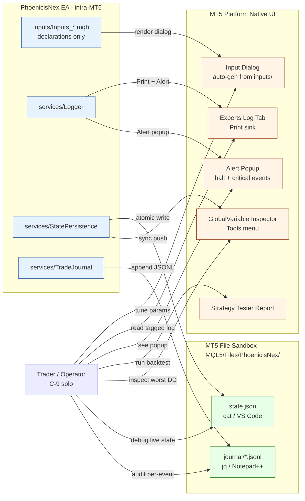

# 03 — Frontend Design: PhoenicisNex (N/A — EA Project)

> **Phase:** Phase 1D (Technical Design) — Doc 2/3
> **Status:** ⏭️ **N/A** — EA project; no custom frontend surface
> **Author:** Tech Lead agent (`/td` workflow)
> **Last updated:** 2026-05-02
> **Reads:** `docs/state/overview.md` (UX phase officially skipped 2026-05-02), `docs/design-docs/02-high-level-architecture.md § 7.3 Monitoring`, `docs/design-docs/05-security.md § 7.1 Observability layers`, `docs/foundation-input-sources/project-overview.md § Stakeholders`
> **Audience:** Implementation Engineer, QA, Reviewer

## TL;DR

PhoenicisNex เป็น **MetaTrader 5 Expert Advisor (EA)** — รัน intra-MT5 process (ADR-001 modular monolith) โดยมี **operator surface เป็น MT5 native UI ทั้งหมด**: input dialog (auto-generate จาก `input` declarations), Experts log tab, Alert popup, Strategy Tester report, GlobalVariable inspector, plus state.json + journal/*.jsonl ที่ user เปิดใน VS Code/Notepad++. **ไม่มี custom React/Vue/HTML/canvas/HUD/panel ที่ต้อง design**. UX phase officially skipped (state/overview.md 2026-05-02 ระบุ *"Headless MT5 EA — ไม่มี custom UI surface ให้ออกแบบ"*); SD `02 § 7.3` lock observability surface ที่ MT5 native; ADR-011 lock log sink = MT5 native `Print()` + `Alert()` only (no file sink Phase 1, no dashboard, no Telegram per Won't permanent in `docs/ba/01 § 6.2`). เอกสารนี้ระบุ **operator surface inventory + N/A justification + Phase 2 trigger** ที่จะ promote frontend ขึ้นมาถ้า Won't constraint relax.

---

## 1. N/A Justification

PhoenicisNex ตกอยู่ใน case ที่ `td.md § Conditional Logic` ระบุชัด: *"Project has no frontend (API-only) | Mark `03-frontend-design.md` as 'N/A — API-only project' with justification"*. ที่นี่เป็นกรณี API-only equivalent — EA-only — เพราะ:

| Reason | Evidence |
|--------|----------|
| **Trading platform = MT5 client** ที่ provide operator UI ภายใน (chart attach dialog, input editor, Experts log tab, Alert popup, Strategy Tester report, GlobalVariable inspector) | C-1, C-2 ใน `project-overview.md`; SD `02 § 7.3` Monitoring + observability table |
| **NFR-7.2 = 0 external DLLs** + **NFR-8.2 = 0 external config files for tuning** | `docs/ba/03 § 7-8`; ปิดทาง embedded web UI / external config tool ใน Phase 1 |
| **Won't permanent (Phase 1)** = no real-time dashboard / Telegram / email / cloud aggregation | `docs/ba/01 § 6.2`; SD `02 § 7.3 No-go signals` |
| **C-9 solo operator** + **MVP signal "วาง .ex5 แล้วรัน" 2026-05-01** = ไม่มี multi-user / multi-monitor workflow ที่ต้อง custom UI | `project-overview.md § Stakeholders`; `docs/ba/01 § 6` MVP signal |
| **UX phase officially skipped** | `docs/state/overview.md` 2026-05-02: *"⏭️ N/A — Skipped. Headless MT5 EA — ไม่มี custom UI surface ให้ออกแบบ. ทุก UI surface เป็น MT5 native"* |
| **Logger sink lock** = `Print()` + `Alert()` only (no file sink Phase 1, no canvas) | ADR-011 § Decision § Sink (Phase 1) |
| **ห้าม CCanvas dashboard / OBJ_* HUD / custom panel** | SD `02 § 7.3` quote: *"Logger → Print + Alert only place that emits MT5 native UI/log"* |

ทุก reason ผูกกับ constraint ที่ user lock ไปแล้วใน BA/SD; **TD ไม่มี authority ที่จะ override** (ต้อง escalate ผ่าน `/backtrack ba` หรือ `/backtrack sd`). เพราะฉะนั้น TD-03 = ทำ stub + document operator surface inventory + Phase 2 trigger เท่านั้น.

---

## 2. Operator Surface Inventory (MT5 native — ไม่ใช่ frontend ที่ออกแบบ)

User ทำงานกับ EA ผ่าน 6 surface ของ MT5 — ทุก surface = native UI ของ platform; rewrite ไม่ touch:

| Surface | Purpose | Write authority | Source ที่ surface populate |
|---------|---------|------------------|------------------------------|
| **MT5 input dialog** (Inputs tab ของ EA properties) | Tune ≥ 80 parameter, group="Slot X" annotation per NFR-6.3 | TD locks input declaration ใน `inputs/Inputs_*.mqh` (5 files per ADR-012) | All `input`/`sinput` declarations |
| **MT5 Experts log tab** | DEBUG/INFO/WARN/ERROR tagged messages — searchable ผ่าน `[slot=<X>][ev=<E>]` (FR-4.2) | `services/Logger.mqh` ผ่าน `Print()` only (ADR-011 sink) | Every Logger.* call from services + slots + halt logic |
| **MT5 Alert popup + sound** | Critical events surface — halt, init failure, force-clear (anti-spam ≤ 1 per slot per session per ADR-008) | `services/Logger::Error` + halt-trigger bypass + `Alert()` MT5 native (ADR-011 escalation) | CircuitBreaker triggered, IndicatorService runtime invalid, journal sustained-failure, force-clear, HALTED_STABLE transition |
| **MT5 Strategy Tester report** | Aggregate regression result (Net Profit, PF, DD, Sharpe, per-trade list) — primary surface ของ NFR-1.x acceptance | (read-only — MT5 native) | Auto-populated หลัง backtest run (per `mt5-headless-backtest` skill workflow) |
| **MT5 GlobalVariable inspector** (Tools → GlobalVariables) | View worst DD + equity high-water-mark (mirror ของ state.json subset per `02 § 6.1.1` sync rule) | `services/StatePersistence::SyncToGlobalVariable` push หลัง successful Save | Subset ของ `watch_profits` field ใน state schema |
| **`MQL5/Files/PhoenicisNex/` file tree** (open ใน VS Code/Notepad++/jq) | Inspect state.json (debug live state) + journal/*.jsonl (audit per FR-4.1) | TradeJournal + StatePersistence write only — user read-only | Files at `state/state.json`, `journal/{live\|tester}/*.jsonl` |

**No custom UI elements ที่ TD ต้อง design:**
- ❌ ไม่มี HTML / CSS / React / Vue / Svelte / SwiftUI / Flutter / etc.
- ❌ ไม่มี CCanvas dashboard / OBJ_* chart object HUD / custom panel
- ❌ ไม่มี webhook / Telegram bot / email template (Won't permanent)
- ❌ ไม่มี VPS / cloud control plane (Won't permanent)
- ❌ ไม่มี multi-user view / role / authz (C-9 solo operator)

**TD ออกแบบ "input dialog" ใน TD-02 § 2 + ADR-012 (file `inputs/*.mqh`) — แต่ไม่ใช่ "frontend";** input dialog = MT5 platform feature ที่ render `input` declarations เป็น dialog form อัตโนมัติ. TD ลงรายละเอียด:
- Naming convention: `Inp<SlotId><Param>` (per `mql-developer` skill style)
- Grouping: `group="Slot <X>"` annotation (NFR-6.3)
- Label width ≤ 40 chars + tooltip ≤ 80 chars (NFR-8.1)
- Type compatibility กับ Strategy Tester optimizer (NFR-6.2 numeric inputs)

ทั้งหมดนี้อยู่ใน TD-02 § 2 (file layout) + concrete declarations ทำใน Phase 3I IMPL-012..014 — ไม่ใช่ frontend design phase.

---

## 3. Operator Workflow (mirror — for handoff completeness)

> Sourced from SD `02 § 7.2 Deployment model` + `05 § 7 Observability strategy`. Restate ที่นี่เพื่อให้ TD-03 reader เห็น context รอบเดียว — ไม่ใช่ design ใหม่.

### 3.1 Initial setup (1 ครั้ง per machine)

1. Compile `PhoenicisNex.mq5` ใน MetaEditor → output `PhoenicisNex.ex5` (Definition of Done G1 ใน TD-02 § 13.2)
2. Copy `.mq5` source + `.ex5` binary + libs (TD assesses which legacy lib still needed) → `MQL5/Experts/PhoenicisNex/`
3. Restart MT5 (or refresh Navigator panel)
4. Drag EA onto EURUSD H4 chart → MT5 fires input dialog
5. Set parameter values → click OK → EA runs `OnInit` → first tick begins F1 pipeline

### 3.2 Daily operation (live trading)

| Action | Surface | Frequency |
|--------|---------|-----------|
| Tune input parameter | Input dialog (right-click EA on chart → Properties → Inputs tab) → reattach (~30s per NFR-6.1) | Per signal change request |
| Inspect recent trades | Trade journal `MQL5/Files/PhoenicisNex/journal/live/journal-YYYYMM.jsonl` ใน VS Code/jq (per `mt5-log-reader` skill workflow + jq filters ใน TD-02 § 13.4) | Daily / weekly retrospective |
| Check halt status | MT5 Alert popup (auto-shows per NFR-5.1) + Experts log filter `[ERROR]` | On Alert trigger |
| Inspect worst DD | MT5 Tools → GlobalVariables → `PhoenicisNex_worst_drawdown_pct` | Weekly review |
| Monitor force-clear pattern | Experts log filter `[ev=force_clear]` + journal filter `event_type=pending_force_clear` | After Alert |

### 3.3 Backtest operation (Strategy Tester regression)

1. Open Strategy Tester (Ctrl+R)
2. Configure: Symbol=EURUSD, Period=H4, Model=4 (every tick), Date range, $1k init, 1:500 leverage
3. Run → Tester auto-populates report tab + creates `journal/tester/run-<ISO>.jsonl`
4. Compare report headline vs `trading-baseline.md` per NFR-1.1..1.7
5. Per-slot count extraction → run IMPL-061 parser (NFR-1.6 verification)

**Headless variant** (preferred for AI agent / CI workflow) ผ่าน `mt5-headless-backtest` skill — full flow ใน TD-02 § 13.3 + skill SKILL.md. Standard `.ini` library committed ที่ `simulation/headless-tests/` (per TD-02 § 13.6).

---

## 4. State Field → Operator Surface Trace

ตรวจ traceability ของ state ที่ user observe ผ่าน surface ใดบ้าง — ใช้ตอน TD-03 cross-domain check (Phase 3 quality gate). ทุก field ใน `state-persistence-schema.yaml` + `trade-journal-schema.yaml` ที่ user-facing → mapped ที่นี่.

| State field | Surface | How user accesses |
|-------------|---------|--------------------|
| `state.ea_state` (RUNNING/HALTED/HALTED_STABLE) | Logger Info ตอน boot + Alert ตอน halt | Experts log + popup |
| `state.watch_profits.worst_drawdown_pct` | GV inspector + state.json | Tools → GlobalVariables; cat state.json |
| `state.pending_machines.*.force_clear_count` | Logger Warn ตอน force-clear + journal | Experts log filter `[ev=force_clear]`; jq journal |
| `state.journal_metrics.write_failures` | Logger Error (throttled) + state.json + GV | Experts log; cat state.json; GV inspector |
| `state.logger_metrics.throttled_alert_count` | HALTED_STABLE Alert message + state.json | Popup + cat state.json |
| Per-slot pending payload | journal `signal_context` field; state.json | jq journal; cat state.json |
| BI SL inheritance audit (ADR-009) | journal `parent_ticket_id` + `signal_context` ของ entry events | jq filter `slot_id=="BI"` |
| Per-slot trade count (NFR-1.6) | Strategy Tester report + journal | report headline; jq count |

**No orphan field** — ทุก persisted/journaled field มี surface ให้ user observe; ไม่มีอะไร "hidden" ที่ต้อง custom UI.

---

## 5. Phase 2 Triggers (when frontend ขึ้นมา)

> Sourced from SD `02 § 7.3 No-go signals (out of scope per Won't permanent)` + `07 § 1.4 Capacity scaling triggers` + `05-security.md § 4 Phase 2 trigger`. Restate เป็น TD-03 own section เพื่อให้ future Phase 2 TD ใช้.

ถ้า Phase 2 BA/SD relax constraint ใดต่อไปนี้ → TD-03 จะเปลี่ยนจาก N/A เป็น full design:

| Trigger | What changes | TD-03 future scope |
|---------|--------------|---------------------|
| User add cloud journal sync (Q3.4 promoted) | Phase 2 sidecar agent (Python) uploads journal/*.jsonl → S3/gist (per `07 § 2.4`) | Cloud dashboard frontend (React/Next.js) ที่ aggregate journal data + per-slot stats |
| User add Telegram/email notification | NFR-7.2 may relax (DLL allowed for HTTP) per `07 § 1.2` | Telegram bot integration design + chat UI conventions |
| Multi-account portfolio | Phase 3 PhoenicisCoord EA (per `07 § 2.3`) reads each instance's state.json + journal | Aggregate multi-account dashboard panel |
| Real-time HUD ที่ chart | New requirement (currently Won't permanent per `01 § 6.2`) | OBJ_* chart object design + CCanvas custom panel + per-slot status indicator |
| External config file (NFR-8.2 relax) | New requirement | Config editor UI (web or desktop) |

**ทุก Phase 2 trigger** ต้อง start ด้วย `/ba` ใหม่ → `/sd` → `/td` Phase 2 — เปลี่ยนจาก Won't permanent เป็น Must, ค่อย design frontend.

---

## 6. Cross-Domain Trace (TD-03 ↔ TD-02 ↔ ADR ↔ State Schema)

> Quality gate § 3.5 cross-domain check — ตรวจว่าไม่มีฝั่งใด assume frontend exist.

| Domain | TD-03 obligation | Status |
|--------|-------------------|--------|
| TD-02 Backend ↔ TD-03 Frontend | TD-02 § 11 ระบุ "N/A — see TD-03"; TD-03 ระบุ N/A justification | ✅ consistent |
| ADR-011 Logger ↔ TD-03 | ADR-011 § Decision § Sink (Phase 1) = "MT5 `Print()` only" — TD-03 mirror ที่ § 2 surface inventory | ✅ consistent |
| state-persistence-schema.yaml ↔ TD-03 | ทุก persisted field map → user-facing surface ที่ § 4; ไม่มี field ที่ assume custom UI | ✅ consistent |
| trade-journal-schema.yaml ↔ TD-03 | journal field map → jq/Notepad++ workflow ที่ § 3.2 + TD-02 § 13.4 | ✅ consistent |
| UX deliverables (01-05) | UX phase officially skipped (state/overview.md) — TD-03 N/A reflects this | ✅ consistent |
| BA `01 § 6.2` Won't Permanent | TD-03 N/A respects all Won't (no dashboard / Telegram / multi-user) | ✅ consistent |
| `05-security.md § 7.3 No-go signals` | TD-03 N/A respects "no real-time dashboard / Telegram / cloud aggregation / APM" | ✅ consistent |

✅ **No frontend assumption leaks** ใน backend / state / journal / BA / SD design.

---

## 7. Mermaid — Operator Surface Map (sole diagram per § 3.6 ≥ 1 Mermaid requirement)

> ≥ 1 diagram per doc per § GUARDRAILS. แสดงว่า operator (Trader = self per C-9) interact กับ EA ผ่าน 6 MT5 native surface — ไม่มี custom frontend.

**Diagram คำอธิบาย:** Trader (1 actor — solo per C-9) interact กับ EA ผ่าน 7 surface (5 MT5 native + 2 file system); EA emit ผ่าน 4 service ภายใน. ไม่มี HTTP / WebSocket / browser / mobile / Telegram / email / cloud — ตาม Won't permanent. Future Phase 2 ถ้า relax → จะเพิ่ม subgraph ใหม่ใน diagram (ดู § 5 triggers).

---

> **End of 03 — Frontend Design** — N/A justified (EA project; UX phase officially skipped per state/overview.md 2026-05-02; ADR-011 lock log sink = MT5 native only); operator surface inventory documented (5 MT5 native + 2 file-system surfaces); cross-domain trace ✅ no frontend leak; Phase 2 triggers documented for future TD when Won't permanent relax
