# 04 — Database Design: PhoenicisNex (File-Based Persistence)

> **Phase:** Phase 1D (Technical Design) — Doc 3/3
> **Status:** ⚠️ **No RDBMS** — file-based persistence per ADR-001 (NFR-7.2 + C-12 forbid DLL = no SQLite/Postgres in Phase 1)
> **Author:** Tech Lead agent (`/td` workflow)
> **Last updated:** 2026-05-18 (BT-002 cascade — § 4.3 `halt_reason` enum synced to authoritative `trade-journal-schema.yaml`: `circuit_breaker_pingpong` value removed legacy-parity per cap-3 iter chain ADR-013 → ADR-014 falsified; § 9 Access Pattern Matrix `CircuitBreaker` row struck — halt event writes now routed via `Orchestrator → CEAState.Halt()` direct path per ADR-010 amendment. Prior: 2026-05-02 Round 06 handoff certification)
> **Reads:** `docs/api-specs/state-persistence-schema.yaml` (authoritative state.json schema), `docs/api-specs/trade-journal-schema.yaml` (authoritative journal record schema), `docs/adr/006/007/008`, `docs/design-docs/02 § 6 Data Layer Design`, `docs/design-docs/04 § 6 Consistency Boundaries`
> **Audience:** Implementation Engineer (Phase 3I IMPL-046..049 + IMPL-007 + IMPL-043), QA (Phase 3T IMPL-064 atomic write test), Reviewer

## TL;DR

PhoenicisNex ไม่มี SQL/NoSQL database — persistence layer ทั้งหมด = **MT5 sandbox file system** (`MQL5/Files/PhoenicisNex/`) + **MT5 GlobalVariable** (mirror subset per `02 § 6.1.1` sync rule) + **MT5 Experts log + Alert popup** (operational surface, not persistence). เอกสารนี้ lock **field-level + column-equivalent schema** ของทุก persisted artifact: (1) `state.json` — single canonical state via atomic temp+rename per ADR-007 + 16-entry slot_states map per ADR-005, (2) `journal/*.jsonl` — JSON-Lines append-only with monthly rotation (live) or per-run namespace (tester) per ADR-006, (3) MT5 GlobalVariable mirror — one-way push subset of `watch_profits`. **Schema discipline** = lock ที่ YAML files (api-specs); TD-04 = describe column-level + index-equivalent (rotation + access pattern) + migration plan + seed data. **Cross-domain trace** ✅ — ทุก field ใน trade journal map ไปได้ที่ MarketContext source หรือ broker query result; ทุก field ใน state.json map ไปได้ที่ TD-02 service ที่ write/read.

---

## 1. How to Read This Document

```
§ 1  How to read
§ 2  Persistence inventory + storage strategy
§ 3  state.json schema (column-level)
§ 4  journal/*.jsonl schema (record-level)
§ 5  MT5 GlobalVariable mirror schema
§ 6  Index-equivalent strategy (rotation + access pattern)
§ 7  Migration plan + schema versioning
§ 8  Seed data (dev / test / fresh boot)
§ 9  Access pattern matrix (which service reads/writes which artifact)
§ 10 Mermaid ER-equivalent diagram
§ 11 Cross-domain trace (TD-04 ↔ TD-02 ↔ API spec ↔ ADR ↔ BA entity)
```

> **Note on terminology:** ใช้ "schema" / "column" / "index" ในเชิง **DB-equivalent metaphor** เพราะ data layer = file-based ไม่ใช่ RDBMS:
> - "Schema" = JSON Schema spec ที่ YAML file lock (api-specs)
> - "Column" = JSON object field
> - "Index" = file rotation policy + key-based file naming (e.g., `journal-YYYYMM.jsonl`)
> - "Table" = top-level JSON object (state.json) หรือ file (journal/*.jsonl)
> - "Migration" = schema_version bump + Phase 2 SQLite migration path per ADR-006/007 § Revisit-when

---

## 2. Persistence Inventory

ระบบมี **3 persistence categories** (per SD `02 § 6.1`):

| # | Artifact | Format | Path | Rotation | Size estimate | Owner service | ADR |
|---|----------|--------|------|----------|---------------|----------------|-----|
| 1 | **`state.json`** (canonical EA state) | JSON object (single root) | `MQL5/Files/PhoenicisNex/state/state.json` | none — overwrite each tick (atomic) | ~5 KB | `services/StatePersistence` | ADR-007 |
| 2 | **`state.json.tmp`** (atomic write staging) | JSON object | `MQL5/Files/PhoenicisNex/state/state.json.tmp` | created + renamed each Save (per ADR-007) — orphan = OnInit cleanup | ~5 KB transient | `services/StatePersistence` ผ่าน `helpers/AtomicFile` | ADR-007 |
| 3 | **`journal-YYYYMM.jsonl`** (live trade journal) | JSON-Lines (append-only) | `MQL5/Files/PhoenicisNex/journal/live/journal-YYYYMM.jsonl` | Monthly (broker server time MN1 boundary) | ~25 KB/month live | `services/TradeJournal` | ADR-006 |
| 4 | **`run-<ISO>.jsonl`** (tester journal) | JSON-Lines (append-only) | `MQL5/Files/PhoenicisNex/journal/tester/run-<ISO>.jsonl` | Per Strategy Tester run (no within-run rotation) | ~1 MB/5-yr regression | `services/TradeJournal` | ADR-006 |
| 5 | **MT5 GlobalVariable** (mirror subset) | MT5 native (key=double; double-typed only) | MT5-managed (system-wide; visible Tools → GlobalVariables) | none — survives MT5 restart natively | ~5 entries × 8 bytes ≈ 40 bytes | `services/StatePersistence::SyncToGlobalVariable` | ADR-007 § Consequences (sync rule per `02 § 6.1.1`) |
| 6 | **MT5 Experts log** (Print sink) | text (UTF-16LE) | MT5-managed (`Terminal/<id>/MQL5/Logs/YYYYMMDD.log` runtime; `Tester/<id>/Agent-127.0.0.1-3000/logs/YYYYMMDD.log` tester) | MT5 native ~1 MB rollover | ~2-3 MB/year live | `services/Logger` ผ่าน `Print()` + `Alert()` (sink only — not "persistence" per se) | ADR-011 |
| 7 | **Indicator handle in-memory cache** (300-bar scan results) | runtime arrays | (in-memory only — not persisted) | invalidate on bar close per FR-8.1 | ~80 KB peak | `services/IndicatorService::CachedScan` | ADR-003 |

> **Important boundary** (per `td.md § Conditional Logic`): SD `02 § 6.1` ระบุ "PhoenicisNex ไม่มี database" — TD-04 จึง mark RDBMS = **N/A justified** + expand the **file-based + GV-mirrored persistence layer** ที่ field-level (per `td.md § Phase 2 Step 5.1` "expand SD data model → column-level"). #7 (in-memory cache) ระบุไว้ inventory เพื่อ traceability เท่านั้น — ไม่อยู่ใน TD-04 schema scope (in-memory ไม่ persist).

---

## 3. `state.json` Schema — Column-Level

### 3.1 Schema authority

> **Authoritative source:** `docs/api-specs/state-persistence-schema.yaml` (lock SD Phase 1B; bump `schema_version` for breaking change). TD-04 = mirror at column-level + add index strategy + migration plan.

### 3.2 Top-level fields (root object)

| Field | Type | Nullable | Default | Description | Source service |
|-------|------|----------|---------|-------------|----------------|
| `schema_version` | integer | no | `1` | Lock at v1; bump for breaking change per ADR-007 § Schema versioning | TD compile-time const |
| `last_save_timestamp` | string (ISO-8601 date-time) | no | OnInit time | Broker server time of last successful Save() | `StatePersistence::Save` writes from `TimeCurrent()` |
| `ea_state` | enum (string) | no | `"RUNNING"` | one of `[RUNNING, HALTED, HALTED_STABLE]` per ADR-010 | `Orchestrator` set; `StatePersistence` persists |
| `ea_halt_reason` | string \| null | yes | `null` | populated when `ea_state != RUNNING`; mirrors trade journal halt event | `Orchestrator::Halt(reason)` set |
| `pending_machines` | object (8 keys) | no | (see § 3.3) | nested PendingMachineState entries | `PendingMachineRegistry` writes |
| `ban_dates` | object (5 keys) | no | (all 0) | per-slot post-loss cooldown timestamps per BR-3.4 | `TimeGate::SetBan` + slot post-fail |
| `watch_profits` | object | no | (see § 3.4) | PortfolioMonitor / WatchProfits replacement (FR-4.4) | `PortfolioMonitor::Update` writes |
| `cross_slot_signals` | object | no | (see § 3.5) | CodeWiki §1.3 state variables block | `Orchestrator` + cross-slot helpers update |
| `slot_states` | object (17 keys by magic) | no | (see § 3.6) | per-magic SlotState entries — **17 distinct magic** per BR-1.1 (21 slots − 4 shared groups C/D + G/G2 + B/BI + L/LX) | `PortfolioState::Refresh` writes |
| `journal_metrics` | object (4 fields) | no | (see § 3.7) | RPO observability counters per ADR-006 § Failure handling | `TradeJournal::HandleWriteFailure` writes |
| `logger_metrics` | object (2 fields) | no | (see § 3.8) | Logger throttle observability per ADR-011 § Throttle policy | `Logger` ผ่าน `StatePersistence::IncrementLoggerThrottle` |

### 3.3 `pending_machines` sub-schema (8 entries)

| Key | Type sub-schema | Force-clear threshold | BR | Notes |
|-----|------------------|------------------------|-----|-------|
| `c_pending` | `PendingMachineState_Bounded` | none (legacy 8 H4 bars timeout) | BR-6.1 | `pending_payload` = `CPendingComment` string |
| `c_pending_adx` | `PendingMachineState_Bounded` | none (legacy 30 H4 bars) | BR-6.2 | comment ลงท้าย `,A` |
| `r_pending` | `PendingMachineState_Bounded` | none (legacy 40 H4 bars + cloud invalidation) | BR-6.3 | mirror BUY + SELL ใน same machine |
| `p_pending` | `PendingMachineState_PVariant` | none (legacy 70 H4 bars + sub-modes PX/PH/E/N) | BR-6.4 | + extra columns: `sub_mode`, `diff_sl`, `band_ratio` (per `04-data-flow.md § 4.4`); ⚠️ A7 risk on E/N semantics |
| `m_pending` | `PendingMachineState_ForceClear` | **150 H4 bars** per ADR-008 | BR-6.5 | `force_clear_threshold_bars` configurable via `InpForceClearM_Bars` |
| `t_pending` | `PendingMachineState_ForceClear` | **80 H4 bars** per ADR-008 | BR-6.6 | `InpForceClearT_Bars` |
| `q_pending` | `PendingMachineState_QVariant` | **100 H4 bars** per ADR-008 | BR-6.7 | + extra column: `q_pending_code` (0/1/2/3); `InpForceClearQ_Bars` |
| `force_pending` | `PendingMachineState_ForcePending` | none (legacy 9 H4 bars cleared OnTick `:249`) | BR-6.8 | cross-slot Force-Pending; `buy_pending` + `sell_pending` flags |

**Per-entry common columns (ทุก variant):**

| Column | Type | Nullable | Default | Constraint | Description |
|--------|------|----------|---------|-------------|-------------|
| `state` | enum (string) | no | `"IDLE"` | one of `[IDLE, PENDING, EXECUTED]` | per BR-6.x state machine |
| `pending_started_bar` | integer | no | `0` | ≥ 0 | H4 bar index when entered PENDING; 0 if IDLE |
| `pending_payload` | string \| null | yes | `null` | max 256 chars | per-machine serialized payload |
| `force_clear_count` | integer | no | `0` | ≥ 0 | cumulative; survives restart per ADR-007; reset only via manual delete state.json (per `state-persistence-schema.yaml § PendingMachineState_Bounded`); used by IMPL-068 / A6 |

### 3.4 `watch_profits` sub-schema

| Column | Type | Nullable | Default | Constraint | Mirror to GV? | Description |
|--------|------|----------|---------|-------------|----------------|-------------|
| `worst_drawdown_pct` | number | no | `0.0` | ≤ 0 | ✅ `PhoenicisNex_worst_drawdown_pct` | Worst DD% reached this session/lifetime |
| `worst_drawdown_at` | string (ISO-8601 date-time) | no | `epoch start` | — | ✅ `PhoenicisNex_worst_drawdown_at` (as datetime epoch) | Timestamp ตอน worst DD reached |
| `equity_high_water_mark` | number | no | `account.balance` ตอน first boot | ≥ 0 | ✅ `PhoenicisNex_equity_high_water_mark` | High-water mark สำหรับ DD% calc |
| `current_dd_pct` | number | no | `0.0` | ≤ 0 | ✅ `PhoenicisNex_current_dd_pct` | Current DD% from high-water |

### 3.5 `cross_slot_signals` sub-schema

| Column | Type | Nullable | Default | Description |
|--------|------|----------|---------|-------------|
| `is_force_pending_action_buy_order` | boolean | no | `false` | BR-6.8 cross-slot Force-Pending buy flag |
| `is_force_pending_action_sell_order` | boolean | no | `false` | BR-6.8 cross-slot Force-Pending sell flag |
| `has_c_pending_order` | boolean | no | `false` | derived flag — `c_pending.state == PENDING` (cached for fast read) |
| `extra_force_mode_reason` | integer | no | `0` | BR-8.5 ExtraCheckFunction2 demote target |
| `ichi_double_bounce_buffer` | array of number | no | `[]` | OrderGroup#2 detection buffer per BR-8.2 |

### 3.6 `slot_states` sub-schema (17 entries by magic)

> Top-level key = magic number (string-cast int 200..219 per BR-1.1; magic 220 = unused after Slot U deletion per OQ-8). **17 distinct magics** = 21 slots − 4 shared groups (C/D + G/G2 + B/BI + L/LX) ที่แต่ละ group share 1 magic per ADR-005. Pool: 200, 201, 205, 206, 207, 208, 209, 210, 211, 212, 213, 214, 215, 216, 217, 218, 219.

| Magic | Slot IDs | Fields populated |
|-------|----------|--------------------|
| 200 | C, D | shared per BR-1.1 — disambig ผ่าน `comment` prefix in ticket |
| 201 | F | — |
| 205 | H | — |
| 206 | J | — |
| 207 | K | — |
| 208 | G, G2 | shared per BR-1.1 |
| 209 | GO | — |
| 210 | M | — |
| 211 | L, LX | shared per BR-1.1 |
| 212 | Q | — |
| 213 | R | — |
| 214 | B, BI | shared per BR-1.1 |
| 215 | BR | — |
| 216 | I | — |
| 217 | S | — |
| 218 | P | — |
| 219 | T | — |
| ~~220~~ | ~~U~~ | DELETED per OQ-8 (2026-05-01); magic 220 unused (available for Phase 2) |

**Per-entry SlotState columns:**

| Column | Type | Nullable | Default | Constraint | Description |
|--------|------|----------|---------|-------------|-------------|
| `slot_ids` | array of string | no | (per magic) | enum from `[C..BI]` | List ของ slot_ids ที่ share magic นี้ (e.g., `["C","D"]` for magic 200); single entry สำหรับ non-shared |
| `buy_count` | integer | no | `0` | ≥ 0 | Active buy positions count |
| `sell_count` | integer | no | `0` | ≥ 0 | Active sell positions count |
| `total_lots` | number | no | `0.0` | ≥ 0 | Sum lot of active positions |
| `total_profit` | number | no | `0.0` | (signed) | Floating P/L |
| `last_open_date` | integer | no | `0` | ≥ 0 | Server-time epoch seconds of most recent OpenOrder |
| `ticket_ids` | array of integer | no | `[]` | each ≥ 0 | Active position tickets |
| `ticket_max_profit_pip` | array of number | no | `[]` | parallel array to `ticket_ids`; each ≥ 0 | BR-5.2 trailing per ticket — for G/GO/M/S |

### 3.7 `journal_metrics` sub-schema (per ADR-006 § Failure handling RPO contract)

| Column | Type | Nullable | Default | Constraint | Description |
|--------|------|----------|---------|-------------|-------------|
| `write_failures` | integer | no | `0` | ≥ 0 | Cumulative count ของ TradeJournal.WriteEvent fail; survives restart |
| `consecutive_write_failures` | integer | no | `0` | ≥ 0; reset to 0 on next successful write | Trigger halt escalation ที่ ≥ 10 (ADR-006 RPO contract) |
| `last_failure_timestamp` | string (ISO-8601 date-time) \| null | yes | `null` | — | Broker server time ของ last write failure |
| `last_failure_reason` | string \| null | yes | `null` | max 64 chars | MT5 error code / reason (e.g., `"disk_full"`, `"permission_denied"`, `"handle_invalid"`) |

### 3.8 `logger_metrics` sub-schema (per ADR-011 § Throttle policy)

| Column | Type | Nullable | Default | Constraint | Mirror to GV? | Description |
|--------|------|----------|---------|-------------|----------------|-------------|
| `throttled_alert_count` | integer | no | `0` | ≥ 0 | ✅ `PhoenicisNex_logger_throttled_alert_count` (per § 5.1) | Cumulative count ของ Alert ที่ถูก throttle (ERROR + same `(slot, event)` tuple within 100-tick window); survives restart |
| `last_throttle_event` | string \| null | yes | `null` | format `"<slot>:<event>"` | — (string ไม่สามารถเก็บใน GV ที่รองรับ double เท่านั้น) | Last `(slot,event)` tuple ที่ throttled — surface ใน HALTED_STABLE Alert message per `02 § 7.2` |

### 3.9 Constraints summary

> Equivalent ของ DB constraints (PK/FK/unique/check) ใน file-based context — enforce ที่ application level (StatePersistence Load() validation):

| Constraint type | Enforcement | Implementation |
|-----------------|-------------|------------------|
| **Primary key (slot_states map)** | Magic number = unique key (**17 distinct values** in pool {200, 201, 205-219}) | `CHashMap<int,SlotState*>` ใน PortfolioState (ADR-005) — duplicate magic = boot-time fail (BR-9.4); `BootstrapValidator::ValidateSlotRegistry()` asserts `m_portfolio.MagicCount() == 17` |
| **Foreign key (slot_ids → magic)** | `slot_ids` array map ไปที่ magic ของ entry | `BootstrapValidator::ValidateInputs` + reviewer checklist (BR-1.1 magic pool table) |
| **Check (state enum)** | `pending_machines.*.state ∈ {IDLE, PENDING, EXECUTED}` | YAML JSON Schema enum + `StatePersistence::Load` parse rejects unknown |
| **Check (ea_state enum)** | `ea_state ∈ {RUNNING, HALTED, HALTED_STABLE}` | YAML JSON Schema enum + Load() rejects unknown |
| **Check (force_clear_count ≥ 0)** | non-negative integer | YAML schema `minimum: 0` + Load() validates |
| **Atomicity** | state.json อยู่ใน 2 state เท่านั้น (pre-write หรือ post-write complete) | NTFS atomic rename per ADR-007 (assumption A2 — verified ใน IMPL-046 spike) |
| **Schema versioning** | `schema_version == 1` lock; bump on breaking change | Load() rejects unknown version + log error |

---

## 4. `journal/*.jsonl` Schema — Record-Level

### 4.1 Schema authority

> **Authoritative source:** `docs/api-specs/trade-journal-schema.yaml`. TD-04 = mirror at column-level + add rotation strategy + access pattern.

### 4.2 Required fields (per record)

| Field | Type | Nullable | Constraint | Description | Source |
|-------|------|----------|-------------|-------------|--------|
| `timestamp` | string (ISO-8601 date-time) | no | format incl. millisecond + Z suffix | Broker server time (EET, DST-aware per C-10) | `TimeCurrent()` + microsecond high-res via `GetMicrosecondCount` |
| `schema_version` | integer | no | `1` | bump on breaking change per ADR-006 versioning | TD compile-time const |
| `mode` | enum (string) | no | `["live", "tester"]` | runtime mode | `MQLInfoInteger(MQL_TESTER)` detect |
| `event_type` | enum (string) | no | see § 4.3 | event taxonomy per ADR-006 + recovery scenarios per `04 § 5.3` | Caller (slot / cross-slot / halt logic) |
| `slot_id` | enum (string) | no | `[C, D, F, J, H, K, G, G2, GO, M, L, LX, Q, R, I, P, T, S, B, BR, BI, system]` | per BR-1.1 (21 slots; "system" for halt/halt_stable) | Caller-provided |
| `magic` | integer | no | `[0, 220]` (200..219 active; 0 for system) | per BR-1.1 magic pool | Caller-provided |
| `symbol` | enum (string) | no | `["EURUSD"]` | per C-3 (EURUSD only Phase 1) | `_Symbol` |
| `signal_context` | string | no | semicolon-separated key=value | per ADR-006 sample formats | Caller-built per slot |
| `indicator_snapshot` | object | no | per slot subset of MarketContext | per `marketcontext-snapshot-schema.yaml` field set; reader tolerates missing keys | `TradeJournal::BuildIndicatorSnapshotSubset(slot_id)` |
| `portfolio_summary` | object | no | (5 sub-fields) | sum aggregates + slot_counts map | `TradeJournal::BuildPortfolioSummary` ผ่าน `PortfolioState` |
| `triggering_function` | string | no | (free text) | function name ที่ initiate event — per audit trail | Caller-provided (e.g., `"Slot_C::Evaluate"`, `"OrderGroupStartWorkflow"`) |

### 4.3 Optional / event-specific fields

| Field | Type | Required when | Description |
|-------|------|---------------|-------------|
| `ticket_id` | integer \| null | non-system events | MT5 position/order ticket; null for system events or pre-broker reject |
| `order_type` | enum (string) \| null | entry/exit | `["buy", "sell", null]` |
| `lot` | number \| null | non-system | ≥ 0; final lot after RiskManager.ClampLot per BR-4.1/4.2/4.3 |
| `price` | number \| null | non-system | Fill price (entry) or close price (exit) |
| `sl` | number \| null | entry mainly | non-zero for entry except legacy/recovery; **G4 BI inherits per ADR-009** |
| `tp` | number \| null | non-system | may be 0 (slot uses implicit exit per BR-5.1) |
| `comment` | string \| null | non-system | max 32 chars; with slot prefix per BR-1.2 |
| `parent_ticket_id` | integer \| null | pyramid slots (BI, I, LX, J) | parent ticket ID; ADR-009 BI populates B parent |
| `halt_reason` | enum (string) \| null | `event_type=halt` | `[handle_invalid_runtime, equity_floor_phase2, journal_write_fail_sustained, null]` *(see `trade-journal-schema.yaml § halt_reason` authoritative; `circuit_breaker_pingpong` removed per BT-002 2026-05-17 — legacy-parity; cap-3 iter chain ADR-013 → ADR-014 falsified)* |
| `pending_age_bars` | integer \| null | `event_type=pending_force_clear` | H4 bars elapsed since `pending_started_bar` per ADR-008 |

### 4.4 `event_type` taxonomy (per `trade-journal-schema.yaml § event_type enum`)

| Value | When emitted | Source |
|-------|--------------|--------|
| `entry` | Slot OrderSend ack | `Slot_<X>::Evaluate` |
| `exit` | Slot PositionClose ack | `Slot_<X>::ManageExits` + `CrossSlotCoordinator` bulk close |
| `modify` | SL/TP adjust on existing position | `Slot_<X>::ManageExits` (trailing per BR-5.2) |
| `reject` | broker reject `OrderSend`/`PositionClose` | `Slot_<X>` error path |
| `halt` | EAState transition → HALTED per ADR-010 | `Orchestrator::Halt` |
| `halt_stable` | HALTED + portfolio.count == 0 per AC-7.7.4 | `Orchestrator::OnTick` end-of-tick check |
| `pending_force_clear` | M/T/Q-Pending hard timeout per ADR-008 | `PendingMachineRegistry::EmitForceClear` |
| `exit_inferred` | PortfolioState reconcile detected ticket gone (recovery from MT5 crash mid-close per `04 § 3.3`) | `PortfolioState::Refresh` diff vs prior state |
| `discovered` | PortfolioState detected new ticket EA didn't open (foreign EA or recovery per `04 § 5.3`) | `PortfolioState::Refresh` diff |

### 4.5 Naming convention + path

| Mode | Path pattern | Rotation trigger | Example |
|------|--------------|------------------|---------|
| live | `MQL5/Files/PhoenicisNex/journal/live/journal-<YYYYMM>.jsonl` | broker server time month boundary (MN1 detect via `TimeCurrent()` month change) | `journal-202605.jsonl` |
| tester | `MQL5/Files/PhoenicisNex/journal/tester/run-<ISO-8601>.jsonl` | Strategy Tester run start (one file per run; no within-run rotation) | `run-20260502T143012Z.jsonl` |

---

## 5. MT5 GlobalVariable Mirror Schema

> **Role:** Mirror ของ subset ของ `state.watch_profits` (per `02 § 6.1.1` sync rule) — enable user inspection ผ่าน MT5 native UI (Tools → GlobalVariables) โดยไม่ต้อง parse state.json. Sync direction = **state.json → GV (one-way push)** หลังทุก successful Save; conflict resolution = **state.json wins**.

### 5.1 GV variables (5 entries)

> Naming convention: prefix `PhoenicisNex_<field>` (per ADR-007 § Consequences — namespace prefix to avoid GV collision with foreign EAs).

| GV name | MT5 type | Mirror of (state.json field) | Update source |
|---------|----------|-------------------------------|----------------|
| `PhoenicisNex_worst_drawdown_pct` | double | `state.watch_profits.worst_drawdown_pct` | `StatePersistence::SyncToGlobalVariable` |
| `PhoenicisNex_worst_drawdown_at` | double (epoch ts) | `state.watch_profits.worst_drawdown_at` (converted from ISO-8601 → epoch) | `StatePersistence::SyncToGlobalVariable` |
| `PhoenicisNex_equity_high_water_mark` | double | `state.watch_profits.equity_high_water_mark` | `StatePersistence::SyncToGlobalVariable` |
| `PhoenicisNex_current_dd_pct` | double | `state.watch_profits.current_dd_pct` | `StatePersistence::SyncToGlobalVariable` |
| `PhoenicisNex_logger_throttled_alert_count` | double (cast int) | `state.logger_metrics.throttled_alert_count` (per ADR-011 transparency surface) | `StatePersistence::SyncToGlobalVariable` |

### 5.2 Recovery semantics (per `02 § 6.1.1`)

| Scenario | Action |
|----------|--------|
| state.json valid + GV intact + match | proceed normal Save → push GV mirror |
| state.json valid + GV diverge | **state.json wins**; overwrite GV at next Save |
| state.json corrupt + GV intact | StatePersistence.Load() → defaults + Logger.Warn `state_corrupt_recovered_via_gv`; **read GV ของ subset fields เป็น last-resort hint** สำหรับ `worst_drawdown_*` + `equity_high_water_mark`; pending machines + ban dates **ไม่** recover from GV (GV เก็บไม่ได้ — start fresh) |
| Crash window: state.json saved → MT5 crash → GV not yet pushed | Next Load reads state.json (canonical) + overwrites GV at next Save → consistency restored |

---

## 6. Index-Equivalent Strategy

> File-based persistence ไม่มี traditional B-tree index, แต่มี **rotation policy** + **key-based file naming** ที่ทำหน้าที่เทียบเท่า "index by date/run" สำหรับ access pattern หลัก.

### 6.1 Journal access patterns + "index" strategy

| Access pattern | "Index" mechanism | Why this works |
|-----------------|---------------------|----------------|
| User filter trades ของ specific month | Filename pattern `journal-YYYYMM.jsonl` — directly load file ของ month นั้น | Monthly rotation per ADR-006 = filename = index |
| User compare regression run | Filename pattern `run-<ISO>.jsonl` — directly load specific run | Per-run namespace per ADR-006 |
| User filter per-slot events ภายใน 1 month | jq `select(.slot_id=="C")` over single file (~25 KB) | Linear scan acceptable at ~25 KB/month |
| QA per-slot trade count (NFR-1.6) ของ regression | jq `select(.event_type=="entry") \| .slot_id` + sort + uniq | Linear scan over 1 file per run (~1 MB) |
| BI G4 SL audit (ADR-009) | jq filter `slot_id=="BI" and event_type=="entry"` | Linear scan; BI events sparse (~ ปีละ 5-10 entries) |
| Force-clear pattern audit (ADR-008) | jq filter `event_type=="pending_force_clear"` | Sparse events — fast linear scan |

> **Why no random-access index:** monthly file ~25 KB; per-run tester file ~1 MB; both well within `jq`/Python streaming budget (~ms range). Index overhead (B-tree, hash) = unnecessary at this scale + adds operational complexity (separate index file = atomic write challenge). Phase 2 SQLite migration (per ADR-006 § Revisit-when) จะเพิ่ม proper index ตอนข้อมูลโต > 100 MB.

### 6.2 state.json access patterns

| Access pattern | Mechanism | Notes |
|----------------|-----------|-------|
| OnInit Load — full read | Single `FileOpen` + `FileReadString` + parse | ~5 KB; ~1-2 ms |
| End-of-tick Save — full write | Atomic temp+rename per ADR-007 | ~800 µs target; full overwrite (no diff write) |
| Per-tick read of pending state | `PendingMachineRegistry` cache in RAM (loaded ตอน Init) | No file read per tick |
| Per-tick write — dirty bit (perf opt, off by default per ADR-007 § Throttle) | Skip Save if no field changed | Default = always write (preserve baseline) |

### 6.3 Rotation policy detail (per ADR-006)

> **Rotation semantic alignment (Claim 01.14 — chose Option A: per-month dedicated filename, no rename):**
> ADR-006 round-00 + SD `04 § 8` round-00 ระบุ "FileMove(old, archive)" — incorrect, เพราะ each month มี dedicated filename `journal-YYYYMM.jsonl` แล้ว ไม่ต้อง rename. Picked Option A (close + open new path) — simpler + ลด disk I/O at month boundary. ADR-006 + SD `04 § 8` updated synchronously to remove FileMove phrasing.
>
> **MQL5 syntax fix (Claim 01.17):** Original code used C++ uniform-init `MqlDateTime{...}` — MQL5 compiler rejects. Replaced with field-by-field assignment.

```mql5
// services/TradeJournal::RotateIfNeeded
void CTradeJournal::RotateIfNeeded() {
   if (m_is_tester) return;       // tester: no within-run rotation (per ADR-006 namespace)
   datetime now = TimeCurrent();
   MqlDateTime now_dt; TimeToStruct(now, now_dt);
   // Build month_start ผ่าน field-by-field (MQL5 ไม่มี C++ uniform-init — Claim 01.17)
   MqlDateTime month_dt;
   month_dt.year = now_dt.year;
   month_dt.mon  = now_dt.mon;
   month_dt.day  = 1;
   month_dt.hour = 0;
   month_dt.min  = 0;
   month_dt.sec  = 0;
   datetime month_start = StructToTime(month_dt);
   if (m_current_month == month_start) return;  // no rotation needed
   // Rotation = close handle ของ old + open new monthly-named file (no rename — Claim 01.14 Option A)
   //   Each month มี dedicated filename → old file พร้อม consume by user/migrator; new month เริ่ม fresh
   FileClose(m_handle);
   string new_path = StringFormat("journal/live/journal-%04d%02d.jsonl", now_dt.year, now_dt.mon);
   m_handle = FileOpen(new_path, FILE_WRITE | FILE_READ | FILE_TXT | FILE_ANSI | FILE_SHARE_READ);
   if (m_handle == INVALID_HANDLE) {
      m_logger.Error("system", "journal_rotate_open_fail", 0, new_path);
      // Fall through; next WriteEvent fails → HandleWriteFailure increments counter (ADR-006 RPO chain)
   } else {
      m_logger.Info("system", "journal_rotated", 0,
                    StringFormat("from=%s to=%s", m_active_path, new_path));
   }
   m_current_month = month_start;
   m_active_path = new_path;
}
```

**Edge case:** Month boundary mid-tick (e.g., last tick of May = 23:59:58 → first tick of June = 00:00:01) — single-thread MQL5 ensures no race per BR-9.2; rotation completes within 1 tick window. Test: synthetic clock advance per `05-security.md § 9 Red Team focus area "Journal rotation race"`.

---

## 7. Migration Plan + Schema Versioning

### 7.1 Schema versioning policy (per ADR-006 + ADR-007)

| Change type | schema_version action | Reader behavior |
|-------------|------------------------|-------------------|
| **Add field** (backward-compat) | Stay at v1 | Old reader ignores unknown field per ADR-006 forward-compat |
| **Remove field** | Bump to v2 | Old reader errors; provide migration script Phase 2 |
| **Rename field** | Bump to v2 | Same as remove |
| **Change field type** | Bump to v2 | Same as remove |
| **Add enum value** | Stay at v1 | Old reader unknown-enum may error or skip per implementation |
| **Remove enum value** | Bump to v2 | breaking |

### 7.2 Phase 1 → Phase 2 migration paths (per ADR-006 § Revisit-when + `07 § 2`)

**state.json → SQLite WAL** (P3.8 alt per `07 § 2.2`):

| Step | Action | Tool |
|------|--------|------|
| E1 | Lock state.json schema v1 (Phase 1 complete) | TD-04 + YAML lock |
| E2 | Phase 2: design SQLite WAL schema (per-table for each pending machine + ban dates + watch_profits) | Phase 2 TD-04 update |
| E3 | Phase 2: write JSON → SQLite migration script (offline Python tool) | Out of EA scope |
| E4 | Phase 2: switch StatePersistence backend (preserve API; slot ไม่เห็น change) | Phase 2 IMPL |
| Hyrum's law mitigation | Keep state.json export tool from SQLite | Phase 2 |

**journal/*.jsonl → SQLite** (P3.8 per `07 § 2.1`):

| Step | Action | Tool |
|------|--------|------|
| E1 | Phase 1 baseline = `schema_version: 1` lock per record | YAML lock (done) |
| E2 | Phase 2 step 1: write SQLite migrator (offline Python) reading JSON-Lines + populating SQLite | Out of EA scope |
| E3 | Phase 2 step 2: dual-write phase — EA writes both JSON-Lines AND SQLite for N months | Phase 2 IMPL |
| E4 | Phase 2 step 3: switch reader to SQLite; deprecate JSON-Lines (keep archive) | Phase 2 |
| E5 | Phase 2 step 4: remove JSON-Lines write (cutover) | Phase 2 |
| Hyrum's law mitigation | Keep JSON-Lines export tool alongside SQLite | Phase 2 (per `07 § 3.1`) |

### 7.3 Backward-compatibility table (Phase 2 readers)

| Phase 1 schema version | Phase 2 reader handles? | Strategy |
|------------------------|--------------------------|----------|
| v1 (current) | ✅ native | Phase 2 reader = v2-aware; v1 records read via migration adapter |
| Future v2 | (Phase 2) | Migration script populates v2 from v1 records |

---

## 8. Seed Data (dev / test / fresh boot)

### 8.1 Fresh boot (no state.json exists)

**OnInit behavior** ของ `StatePersistence::Load`: ถ้า `state.json` ไม่มี → return defaults; log info `"first_boot_no_state"`. ค่า default ของแต่ละ field:

| Field | Default value |
|-------|----------------|
| `schema_version` | `1` |
| `last_save_timestamp` | `TimeCurrent()` ตอน OnInit |
| `ea_state` | `"RUNNING"` |
| `ea_halt_reason` | `null` |
| `pending_machines.*.state` | `"IDLE"` |
| `pending_machines.*.pending_started_bar` | `0` |
| `pending_machines.*.pending_payload` | `null` |
| `pending_machines.*.force_clear_count` | `0` |
| `pending_machines.p_pending.sub_mode` | `null` |
| `pending_machines.p_pending.diff_sl` / `band_ratio` | `null` |
| `pending_machines.q_pending.q_pending_code` | `null` |
| `pending_machines.force_pending.buy_pending` / `sell_pending` | `false` |
| `ban_dates.*` | `0` (epoch zero = "not banned") |
| `watch_profits.worst_drawdown_pct` | `0.0` |
| `watch_profits.worst_drawdown_at` | OnInit time |
| `watch_profits.equity_high_water_mark` | `AccountInfoDouble(ACCOUNT_BALANCE)` ตอน OnInit |
| `watch_profits.current_dd_pct` | `0.0` |
| `cross_slot_signals.*` | `false` / `0` / `[]` |
| `slot_states` | **17 entries** pre-populated โดย `PortfolioState::RegisterAll` ตอน OnInit (count/lots/profit zeroed; ticket_ids empty) per BR-1.1 magic pool |
| `journal_metrics.*` | zeroed; `last_failure_timestamp/reason` = `null` |
| `logger_metrics.*` | zeroed; `last_throttle_event` = `null` |

### 8.2 Dev seed (manual injection สำหรับ debug)

> Engineer สามารถ hand-craft `state.json` เพื่อ test recovery/reload logic. Sample JSON พื้นฐาน (3 KB):

```json
{
  "schema_version": 1,
  "last_save_timestamp": "2026-05-02T10:30:00.000Z",
  "ea_state": "RUNNING",
  "ea_halt_reason": null,
  "pending_machines": {
    "c_pending":      {"state":"IDLE","pending_started_bar":0,"pending_payload":null,"force_clear_count":0},
    "c_pending_adx":  {"state":"IDLE","pending_started_bar":0,"pending_payload":null,"force_clear_count":0},
    "r_pending":      {"state":"IDLE","pending_started_bar":0,"pending_payload":null,"force_clear_count":0},
    "p_pending":      {"state":"IDLE","pending_started_bar":0,"pending_payload":null,"force_clear_count":0,"sub_mode":null,"diff_sl":null,"band_ratio":null},
    "m_pending":      {"state":"IDLE","pending_started_bar":0,"pending_payload":null,"force_clear_count":0,"force_clear_threshold_bars":150},
    "t_pending":      {"state":"IDLE","pending_started_bar":0,"pending_payload":null,"force_clear_count":0,"force_clear_threshold_bars":80},
    "q_pending":      {"state":"IDLE","pending_started_bar":0,"pending_payload":null,"force_clear_count":0,"q_pending_code":null,"force_clear_threshold_bars":100},
    "force_pending":  {"buy_pending":false,"sell_pending":false,"pending_started_bar":0}
  },
  "ban_dates": {
    "ban_c_start_date":0,"ban_l_start_date":0,"ban_m_start_date":0,
    "k_last_order_date":0,"g_pause_date":0
  },
  "watch_profits": {
    "worst_drawdown_pct": 0.0,
    "worst_drawdown_at":  "2026-05-02T10:30:00.000Z",
    "equity_high_water_mark": 1000.0,
    "current_dd_pct": 0.0
  },
  "cross_slot_signals": {
    "is_force_pending_action_buy_order": false,
    "is_force_pending_action_sell_order": false,
    "has_c_pending_order": false,
    "extra_force_mode_reason": 0,
    "ichi_double_bounce_buffer": []
  },
  "slot_states": {
    "200": {"slot_ids":["C","D"], "buy_count":0,"sell_count":0,"total_lots":0,"total_profit":0,"last_open_date":0,"ticket_ids":[],"ticket_max_profit_pip":[]},
    "201": {"slot_ids":["F"],     "buy_count":0,"sell_count":0,"total_lots":0,"total_profit":0,"last_open_date":0,"ticket_ids":[],"ticket_max_profit_pip":[]}
  },
  "journal_metrics": {
    "write_failures":0,"consecutive_write_failures":0,"last_failure_timestamp":null,"last_failure_reason":null
  },
  "logger_metrics": {
    "throttled_alert_count":0,"last_throttle_event":null
  }
}
```

### 8.3 QA test scenario seeds (per `05-security.md § 9 Red Team`)

| Scenario | Seed approach |
|----------|----------------|
| **Atomic write kill test** (NFR-3.1 / IMPL-064) | Pre-populate state.json with sample data → run EA → kill MT5 mid-Save × 100 → verify Load succeeds + state matches |
| **Pending force-clear** (ADR-008 / IMPL-068) | Pre-populate `m_pending.state="PENDING"` + `pending_started_bar = current_bar - 151` → first tick should trigger force-clear |
| **State corrupt recovery** | Truncate state.json mid-file → verify `state_corrupt_starting_fresh` log + GV last-resort recovery for watch_profits subset |
| **Foreign ticket discovery** | Hand-place position with magic in EA range via separate script → next Refresh should emit `discovered` journal event |
| **Schema version mismatch** | Hand-craft state.json with `schema_version=99` → Load() should reject + log error |

---

## 9. Access Pattern Matrix

> Equivalent ของ "which service queries which table" — ตรวจ data flow consistency.

| Service | state.json read | state.json write | journal/*.jsonl write | GV read | GV write | MT5 native log write |
|---------|------------------|------------------|------------------------|---------|----------|-----------------------|
| `Orchestrator` | (delegate to SP) | (delegate to SP) | (delegate to TJ) | — | — | — |
| `StatePersistence` | ✅ OnInit Load() | ✅ end-of-tick Save() (atomic) | — | ✅ recovery hint when state.json corrupt | ✅ post-Save sync (one-way) | — |
| `TradeJournal` | — | (writes `journal_metrics.*` ผ่าน SP IncrementJournalFailures) | ✅ per event | — | — | — |
| `Logger` | — | (writes `logger_metrics.*` ผ่าน SP IncrementLoggerThrottle) | — | — | — | ✅ Print + Alert |
| `PortfolioState` | (read on Init via SP) | (writes slot_states ผ่าน SP serialization) | — | — | — | — |
| `PendingMachineRegistry` | (read on Init via SP) | (writes pending_machines ผ่าน SP) | (writes pending_force_clear events via TJ) | — | — | — |
| `TimeGate` | (read ban_dates via SP) | (writes ban_dates via SP::SetBanDate) | — | — | — | — |
| `PortfolioMonitor` | (read watch_profits via SP) | (writes watch_profits via SP) | — | — | — | — |
| ~~`CircuitBreaker`~~ | *(removed per BT-002 2026-05-17 — service deleted legacy-parity; halt event writes now routed via `Orchestrator → CEAState.Halt()` direct path on `IndicatorService::AnyHandleInvalid()` per ADR-010 amendment + SD `02 § 5.1` Communication Matrix)* | | | | | |
| `IndicatorService` | — | — | — | — | — | — (handle creation logged via Logger) |
| `RiskManager` | — | — | — | — | — | — |
| `CrossSlotCoordinator` | — | — | (writes bulk close events via TJ) | — | — | — |

✅ **Single-writer property:** ทุก field มี **single owner service**; ไม่มี cross-service write conflict. All writes ผ่าน `StatePersistence` API (no direct file access จาก service อื่น).

---

## 10. Mermaid ER-Equivalent Diagram

> ≥ 1 Mermaid diagram requirement per § 3.6 quality gate. Use `erDiagram` for file-based "tables" (state.json sub-objects + journal records); cross-reference relationships ที่ TD-02 service layer.

```mermaid
erDiagram
    STATE_ROOT ||--|| WATCH_PROFITS : has
    STATE_ROOT ||--|| CROSS_SLOT_SIGNALS : has
    STATE_ROOT ||--|| BAN_DATES : has
    STATE_ROOT ||--|| JOURNAL_METRICS : has
    STATE_ROOT ||--|| LOGGER_METRICS : has
    STATE_ROOT ||--o{ PENDING_MACHINE : "8 entries"
    STATE_ROOT ||--o{ SLOT_STATE : "17 entries by magic"
    SLOT_STATE ||--o{ TICKET : "ticket_ids array"
    JOURNAL_RECORD }o--|| SLOT_STATE : "magic FK (logical)"
    JOURNAL_RECORD ||--|| INDICATOR_SNAPSHOT : embeds
    JOURNAL_RECORD ||--|| PORTFOLIO_SUMMARY : embeds
    PENDING_MACHINE ||--o| P_VARIANT : "p_pending only"
    PENDING_MACHINE ||--o| Q_VARIANT : "q_pending only"
    WATCH_PROFITS ||--|| GV_MIRROR : "1-way sync"

    STATE_ROOT {
        int schema_version PK
        string last_save_timestamp
        enum ea_state "RUNNING/HALTED/HALTED_STABLE"
        string ea_halt_reason "nullable"
    }

    PENDING_MACHINE {
        string machine_id PK "c/c_adx/r/p/m/t/q/force"
        enum state "IDLE/PENDING/EXECUTED"
        int pending_started_bar
        string pending_payload "nullable"
        int force_clear_count
        int force_clear_threshold_bars "M=150 T=80 Q=100"
    }

    P_VARIANT {
        enum sub_mode "PX/PH/E/N/null"
        number diff_sl "nullable"
        number band_ratio "nullable"
    }

    Q_VARIANT {
        int q_pending_code "0/1/2/3/null"
    }

    SLOT_STATE {
        int magic PK "200..219"
        array_string slot_ids "shared magic e.g. C,D"
        int buy_count
        int sell_count
        number total_lots
        number total_profit
        int last_open_date
    }

    TICKET {
        int ticket_id PK
        number max_profit_pip "BR-5.2 trailing"
    }

    BAN_DATES {
        int ban_c_start_date
        int ban_l_start_date
        int ban_m_start_date
        int k_last_order_date
        int g_pause_date
    }

    WATCH_PROFITS {
        number worst_drawdown_pct
        string worst_drawdown_at
        number equity_high_water_mark
        number current_dd_pct
    }

    GV_MIRROR {
        double PhoenicisNex_worst_drawdown_pct
        double PhoenicisNex_worst_drawdown_at
        double PhoenicisNex_equity_high_water_mark
        double PhoenicisNex_current_dd_pct
        double PhoenicisNex_logger_throttled_alert_count
    }

    CROSS_SLOT_SIGNALS {
        bool is_force_pending_action_buy_order
        bool is_force_pending_action_sell_order
        bool has_c_pending_order
        int extra_force_mode_reason
        array_number ichi_double_bounce_buffer
    }

    JOURNAL_METRICS {
        int write_failures
        int consecutive_write_failures
        string last_failure_timestamp "nullable"
        string last_failure_reason "nullable"
    }

    LOGGER_METRICS {
        int throttled_alert_count
        string last_throttle_event "nullable"
    }

    JOURNAL_RECORD {
        string timestamp PK "ISO-8601 ms"
        int schema_version
        enum mode "live/tester"
        enum event_type "9 values"
        string slot_id
        int magic FK "200..220 or 0 for system"
        int ticket_id "nullable"
        string symbol "EURUSD"
        enum order_type "buy/sell/null"
        number lot
        number sl "G4 BI inherits per ADR-009"
        number tp
        string comment "max 32 chars BR-1.2 prefix"
        string signal_context
        string triggering_function
        int parent_ticket_id "nullable BI/I/LX/J"
        string halt_reason "nullable halt event only"
        int pending_age_bars "nullable force_clear only"
    }

    INDICATOR_SNAPSHOT {
        number ichi_h4_cloud_high
        number force_h4_0
        number adx_h4
        string per_slot_subset_only
    }

    PORTFOLIO_SUMMARY {
        number total_lots
        number total_floating_pl
        number equity
        number balance
        object slot_counts
    }
```



**คำอธิบาย diagram:** STATE_ROOT (= state.json) มี 6 sub-object 1:1 + 2 collections (PENDING_MACHINE × 8, **SLOT_STATE × 17** per BR-1.1 magic pool). PENDING_MACHINE มี 2 variant extensions (P-variant adds sub_mode/diff_sl/band_ratio per `04 § 4.4`; Q-variant adds q_pending_code per BR-6.7). SLOT_STATE → TICKET 1:N (tickets array per slot — parallel ticket_max_profit_pip array for trailing per BR-5.2). JOURNAL_RECORD = separate collection (jsonl file) ที่มี logical FK ลง SLOT_STATE (magic) + embeds INDICATOR_SNAPSHOT + PORTFOLIO_SUMMARY per record. WATCH_PROFITS → GV_MIRROR = 1-way sync per `02 § 6.1.1`.

---

## 11. Cross-Domain Trace Matrix

### 11.1 TD-04 ↔ TD-02 service ownership

| TD-04 artifact | TD-02 service that writes | TD-02 service that reads |
|----------------|----------------------------|---------------------------|
| `state.json` | `StatePersistence::Save` | `StatePersistence::Load` (OnInit) + delegated readers (`PendingMachineRegistry`, `TimeGate`, `PortfolioMonitor`) |
| `state.json.tmp` | `helpers/AtomicFile::WriteAtomic` | `StatePersistence::Load` cleanup orphan |
| `journal/live/journal-YYYYMM.jsonl` | `TradeJournal::WriteEvent` | (user / Phase 2 SQLite migrator) |
| `journal/tester/run-<ISO>.jsonl` | `TradeJournal::WriteEvent` (tester namespace) | (user / QA per-slot parser IMPL-061) |
| MT5 GlobalVariable mirror | `StatePersistence::SyncToGlobalVariable` | (user via Tools→GlobalVariables; recovery fallback via `Load`) |
| MT5 Experts log | `services/Logger::Print` (sink only) | (user via Experts tab; `mt5-log-reader` skill) |

### 11.2 TD-04 ↔ API spec authority

✅ **state.json schema** = `state-persistence-schema.yaml` authoritative; TD-04 § 3 = column-level mirror (no contradiction)
✅ **journal record schema** = `trade-journal-schema.yaml` authoritative; TD-04 § 4 = column-level mirror
✅ **slot interface schema** = `slot-abstraction-contract.yaml` authoritative; TD-04 § 3.6 references same magic pool
✅ **MarketContext schema** = `marketcontext-snapshot-schema.yaml` authoritative; TD-04 § 4 INDICATOR_SNAPSHOT = subset-of relationship documented

### 11.3 TD-04 ↔ ADR

| TD-04 section | ADR |
|---------------|-----|
| § 2 #1 state.json + #2 .tmp | ADR-007 (atomic temp+rename); ADR-007 § Option B (3-file fallback if A2 spike fail) |
| § 2 #3-#4 journal | ADR-006 (JSON-Lines + monthly rotation + tester namespace) |
| § 2 #5 GV mirror | ADR-007 § Consequences + `02 § 6.1.1` sync rule |
| § 3 pending_machines (M/T/Q force-clear) | ADR-008 |
| § 3 ea_state field | ADR-010 |
| § 3 journal_metrics RPO | ADR-006 § Failure handling |
| § 3 logger_metrics throttle | ADR-011 § Throttle policy |
| § 6 rotation policy | ADR-006 |
| § 7 schema versioning | ADR-006 + ADR-007 |

### 11.4 TD-04 ↔ BA entity

> ทุก "table" (state sub-object + journal record) trace ไปที่ BA entity ที่ derive จาก `docs/ba/02-functional-requirements.md` + `docs/ba/04-business-rules.md` per `td.md § Phase 3.3 Content Guardrails`:

| TD-04 table | BA entity origin |
|-------------|-------------------|
| `slot_states` map | BR-1.1 magic pool table + FR-2.7 per-slot state lookup |
| `pending_machines` × 8 | BR-6.1 ถึง BR-6.8 + ADR-008 force-clear policy |
| `ban_dates` × 5 | BR-3.4 per-slot ban cooldown table |
| `watch_profits` | FR-4.4 worst DD bookkeeping (replaces EA เดิม WatchProfits) |
| `cross_slot_signals` | BR-6.8 cross-slot Force-Pending + BR-8.5 ExtraCheckFunction2 + BR-8.2 OrderGroup#2 |
| `journal_metrics` + `logger_metrics` | NFR-3.4 (no silent failures) + ADR-006/011 observability |
| `journal/*.jsonl` records | FR-4.1 per-event journal entry; FR-4.3 local-only storage |
| MT5 GV mirror | preserve EA เดิม WatchProfits surface (BA pain point #2 — observability) |

### 11.5 TD-04 ↔ TD-03 (frontend N/A)

✅ ทุก field ใน TD-04 มี **read access path ผ่าน operator surface** (ดู TD-03 § 4 "State Field → Operator Surface Trace"); ไม่มี orphan field ที่ assume custom UI exists.

---

> **End of 04 — Database Design** — file-based persistence (RDBMS = N/A justified per ADR-001/NFR-7.2): state.json column-level (35 fields across 11 sub-objects), journal record (15 required + 8 optional), GV mirror (5 entries), index-equivalent strategy (rotation by month/run), migration plan to Phase 2 SQLite (ADR-006/007 § Revisit-when), seed data for fresh boot + dev/QA scenarios, Mermaid erDiagram (12 entities), cross-domain trace ✅ TD-02 service ownership + API spec authority + ADR + BA entity all aligned
